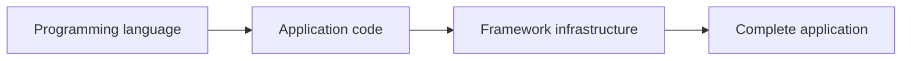
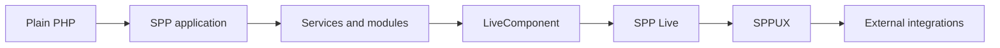

# SPP Framework Handbook

## Chapter 0 — How to Read This Handbook

**Audience:** someone who knows a programming language, especially PHP, but has never learned what a framework is.

**Evidence policy:** this handbook describes SPP from the repository implementation, its tests, configuration, and existing project documentation. When the implementation is intentionally open-ended or supports multiple patterns, the handbook says so rather than inventing one universal rule.

---

## 0.1 You already know a programming language. What is a framework?

Suppose you know PHP.

PHP gives you a language and a runtime. You can write variables, functions, classes, loops, exceptions, file handling, HTTP handling, database calls, and output.

But a real web application needs much more than the language itself.

For example, a production application may need to answer questions such as:

- Where is application configuration stored?
- How does an HTTP request enter the program?
- Which application should handle a URL?
- How are classes loaded?
- How are services created and shared?
- How are modules discovered?
- How are authentication and CSRF checks applied before application code runs?
- How are events delivered to independent features?
- How are templates located and rendered?
- How can a server-side component become interactive in the browser?
- How can a client-side runtime update the DOM efficiently?
- How can a PHP application call another language or external application?

A framework is a collection of reusable software infrastructure that answers these recurring engineering questions in a consistent way.

A useful mental model is:

The framework does not replace the programming language. It gives application code a set of conventions, runtime services, lifecycle rules, and reusable subsystems.

---

## 0.2 What SPP adds to PHP

SPP is a PHP framework/runtime with multiple cooperating subsystems.

At a beginner level, you can think of SPP as providing these major capabilities:

| SPP subsystem | Beginner question it answers |
|---|---|
| Bootstrap | How does the framework start? |
| Scheduler | Which application is active? |
| App | What is the runtime object for that application? |
| Registry | Where do runtime values and shared framework services live? |
| Container | How are application services constructed? |
| Modules | How are reusable framework features packaged and activated? |
| Events | How can one part of the system react to another without hard-coding direct calls? |
| Middleware | How can request-processing rules run around application code? |
| SPPView | How does application code become rendered output? |
| LiveComponent | How can a PHP component maintain interactive server-side UI state? |
| SPP Live | How does the browser communicate with live components? |
| SPPUX | How can the browser run its own reactive UI runtime? |
| Polyglot layer | How can SPP work with other runtimes and external applications? |

Do not try to memorize all of these immediately. The handbook introduces them in dependency order.

---

## 0.3 Why the order of this handbook matters

A beginner often encounters framework documentation in the wrong order.

For example, reading about LiveComponent before understanding the PHP request lifecycle creates unnecessary confusion because the reader has not yet learned:

1. how PHP code starts;
2. how SPP boots;
3. how an application is selected;
4. how services are resolved;
5. how normal rendering works; and only then
6. why a live component is a different execution path.

This handbook therefore uses four learning levels.

### Level 1 — Beginner

You learn the vocabulary and the mental model.

### Level 2 — Application developer

You create applications, services, modules, middleware, views, and interactive features.

### Level 3 — Framework developer

You trace the implementation and understand subsystem boundaries.

### Level 4 — Kernel Hacker

You inspect exact execution paths, caches, reflection, event dispatch, state serialization, reconciliation, transport engines, and extension points.

---

## 0.4 How to read diagrams

The handbook uses three different representations intentionally.

### Mermaid diagrams

Use these for architecture, process flow, lifecycle, sequence, and dependency relationships.

### Code blocks

Use these for actual:

- PHP code
- YAML/XML configuration
- JavaScript
- shell commands
- directory layouts
- sample payloads
- program output

### Tables and prose

Use these for simple comparisons and relationships that do not need a graphic.

This distinction is deliberate. A directory tree is not an architecture diagram. A PHP example is not a flowchart. Keeping the representations separate makes the handbook easier to learn from.

---

## 0.5 What "source verified" means

This handbook sometimes says that a behavior is **implemented** or **source-backed**.

That means the behavior was traced to one or more of:

- the SPP PHP source tree;
- JavaScript runtime source;
- configuration files;
- tests;
- framework documentation already maintained in the repository; or
- executable command definitions.

A conceptual recommendation is not automatically an SPP feature.

For example, saying:

> "An enterprise system should use distributed transactions."

is architecture advice.

Saying:

> "SPP performs this operation using class X and method Y."

is an implementation claim and therefore must be supported by the repository.

---

## 0.6 How this handbook handles comparisons

The handbook compares SPP with frameworks such as Laravel, Symfony, Django, Spring Boot, ASP.NET Core, React, Vue, and Livewire when the comparison helps a developer transfer knowledge.

A comparison does **not** mean that SPP implements the other framework's APIs.

For example, a Laravel developer may understand SPP's service container faster if the handbook explains that both systems support dependency injection. That does not mean SPP's container is Laravel's container.

The handbook therefore separates:

- **conceptual similarity**;
- **API similarity**; and
- **actual implementation compatibility**.

---

## 0.7 How the total-nerd sections work

Each advanced chapter can end with a **Kernel Hacker** section.

A normal section answers:

> "How do I use this?"

A Kernel Hacker section answers:

> "How does this actually work?"

For example, the beginner description of dependency injection may say:

> The container can construct a class and resolve typed constructor dependencies.

The Kernel Hacker section can then explain the actual reflection and dependency-resolution path implemented by `SPP\\Core\\Container`.

---

## 0.8 The one application used for learning

The hands-on tutorial uses one application and evolves it in stages.

This matters because changing applications for every chapter hides the architectural progression.

The same business problem is therefore implemented repeatedly so you can see exactly what each layer buys you.

---

## 0.9 The most important rule for learning SPP

Do not memorize framework names first.

Understand the problem first.

For example:

**Problem:** I need to protect every request with common checks.

**Framework answer:** Middleware.

**Problem:** I need reusable functionality that can be activated as a unit.

**Framework answer:** Module.

**Problem:** I need a PHP object that represents the current application.

**Framework answer:** `SPP\\App`.

**Problem:** I need to know which application owns the current request.

**Framework answer:** Scheduler/context.

Once the problem is clear, the framework API becomes much easier to learn.

---

## 0.10 Recommended reading order

Start here, then read:

1. **Your First SPP Application**
2. **What Happens to a Request?**
3. **Scheduler and Application Contexts**
4. **Registry and IoC Container**
5. **Configuration**
6. **Middleware and Pipeline**
7. **Routing and Request Dispatch**
8. **Events and EventHandler**
9. **Modules and Manifests**
10. **SPPView and Extended BladeOne**
11. **LiveComponent**
12. **SPP Live Transport Engines**
13. **SPPUX**
14. **Polyglot and External Application Integration**
15. Enterprise architecture and total-nerd tutorials

The exact file names are listed in the handbook README.

---

## Kernel Hacker note

The conceptual hierarchy used throughout this handbook is intentionally narrower than the complete source tree. SPP contains many additional subsystems and modules. The handbook introduces them when they become relevant instead of presenting the entire repository as one undifferentiated architecture diagram.

### Source map

- `spp/sppinit.php`
- `spp/core/class.app.php`
- `spp/core/class.scheduler.php`
- `spp/core/class.registry.php`
- `spp/core/class.container.php`
- `spp/core/class.module.php`
- `spp/core/class.sppevent.php`
- `spp/core/class.middlewarekernel.php`
- `spp/modules/spp/sppview/`
- `spp/modules/spp/spplive/`
- `spp/modules/spp/drishyam/js/`
