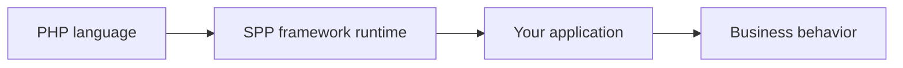
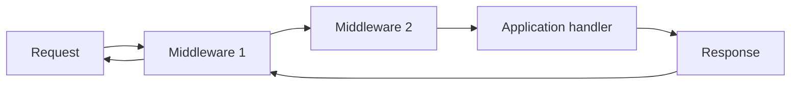
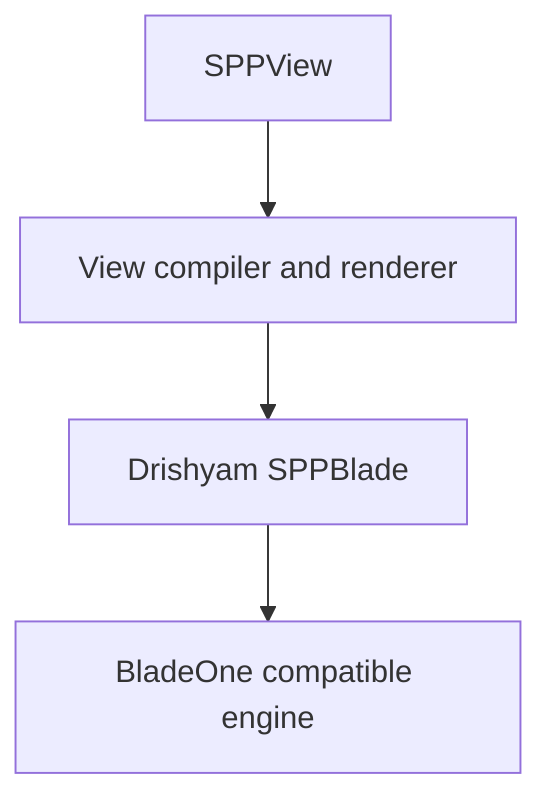
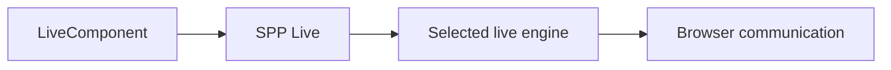
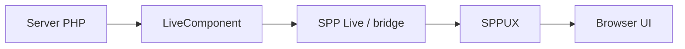
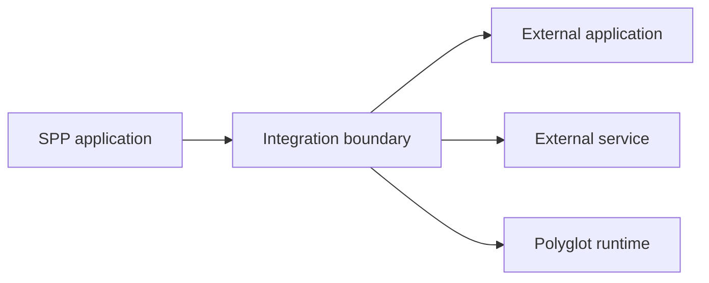
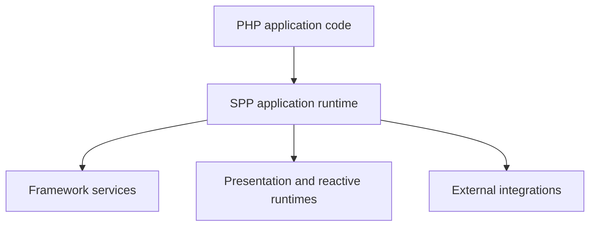

# Volume I — Foundations

## Chapter 1 — SPP for Someone Who Has Never Used a Framework

**Audience:** You know a programming language, especially PHP, but you have never worked with a framework and may not yet know what a framework is supposed to do.

**Evidence:** `spp/sppinit.php`, `spp/core/class.app.php`, `spp/core/class.scheduler.php`, `spp/core/class.registry.php`, `spp/core/class.container.php`, `spp/core/class.module.php`, `spp/core/class.sppevent.php`, `spp/core/class.middlewarekernel.php`, `spp/core/class.pipeline.php`, `spp/modules/spp/sppview/`, `spp/modules/spp/spplive/`, `spp/modules/spp/drishyam/`, and the repository's framework/application guides.

---

## 1.1 First: what is a framework?

A programming language gives you the language itself.

For example, PHP gives you classes, functions, variables, arrays, exceptions, file access, networking primitives, and a runtime that can execute PHP code.

But a production web application needs a large amount of repeated infrastructure that is not really the application's business idea.

Consider a school application. The business requirement might be:

> "Allow an administrator to search students and update their details."

Before you can implement that feature, you still need answers to many infrastructure questions:

- How does the PHP process start?
- How does an HTTP request enter the application?
- Which application should own `/school/students` if several applications share the same installation?
- Where is configuration kept?
- How are classes loaded?
- How are database and other services constructed?
- How are authentication and CSRF checks applied consistently?
- How do reusable features become modules?
- How do independent features react to events?
- How are templates located and rendered?
- How does an interactive server-side component communicate with a browser?
- How can a browser-side reactive runtime coexist with server-side PHP state?
- How does PHP work with another process or language runtime?

A **framework** is software that provides reusable infrastructure for those recurring problems.

It does not replace PHP. Your PHP application runs on top of it.



The practical difference is that instead of solving every infrastructure problem separately, your application plugs into the framework's existing runtime.

---

## 1.2 Why this matters more as an application grows

Suppose you have one login check.

A handwritten PHP application might put a login test at the beginning of a page.

Then another page needs the same check.

Then an API needs it.

Then an administrator page needs it.

Soon there are dozens of almost-identical checks.

Now imagine changing the security policy. You must find every copy.

Framework architecture exists partly to move concerns like this out of individual business methods and into reusable infrastructure.

SPP provides infrastructure for concerns such as:

| Problem | SPP concept |
|---|---|
| Start the framework | `sppinit.php` |
| Choose the current application | Scheduler/application context |
| Represent an application at runtime | `SPP\\App` |
| Store hierarchical runtime values | `SPP\\Registry` |
| Construct and resolve services | `SPP\\Core\\Container` and app APIs |
| Package reusable features | Modules |
| Handle request-wide checks | Middleware/Pipeline |
| React to framework/application events | `SPP\\SPPEvent` / `EventHandler` |
| Render application UI | SPPView/Drishyam |
| Create server-side reactive components | LiveComponent |
| Carry live component interactions | SPP Live |
| Run client-side reactive UI code | SPPUX |
| Cross language/runtime boundaries | Polyglot/integration subsystems |

The framework is therefore not one magical object. It is a collection of collaborating subsystems.

---

## 1.3 The most important SPP concept: an application is a runtime object

An SPP application is not merely a directory.

The framework creates an `SPP\\App` object representing the application at runtime.

That object knows about things such as:

- its name;
- configuration;
- source and runtime paths;
- status;
- service resolution;
- module initialization; and
- application-specific runtime behavior.

You can obtain the active application with:

```php
$app = \SPP\App::getApp();
```

The object you receive is therefore more than a settings array. It is the runtime representation of the selected application.

---

## 1.4 SPP can host more than one application

This is one of the first SPP ideas that may feel unusual if you come from a single-application framework.

The SPP Scheduler maintains a registry of `SPP\\App` objects and an active application context.

So one runtime can conceptually contain:

```text
school
reports
admin
```

as registered applications.

The Scheduler answers:

> Which registered application is active for this piece of work?

Use:

```php
$context = \SPP\Scheduler::getContext();
```

for the active context name, and:

```php
$app = \SPP\Scheduler::getActiveProc();
```

or the corresponding `App::getApp()` APIs when you need the application object.

The exact Scheduler APIs are documented in detail in Chapter 2.

---

## 1.5 Application context is not the same thing as a route

This distinction is essential.

Suppose a browser requests:

```text
/school/admin/students
```

There are at least two separate questions.

**Question 1:** Which application owns `/school`?

That is an **application-context** question.

**Question 2:** Inside that application, what handles `/admin/students`?

That is a **routing/dispatch** question.

SPP keeps these concerns separate.


This separation becomes important when several applications share one installation.

---

## 1.6 What does the Scheduler actually do?

At a beginner level, the Scheduler answers:

> "Which SPP application is active?"

At source level, `SPP\\Scheduler` maintains a static map of registered `SPP\\App` objects and an active context name.

It provides operations including:

- registering an application process with `regProc()`;
- selecting the current context with `setContext()`;
- retrieving the context with `getContext()`;
- retrieving a registered process with `getProcObj()`;
- retrieving the active application with `getActiveProc()`; and
- temporarily executing work through `withContext()`.

When one registered context becomes active and another was active previously, the implementation updates the application status values as part of the context switch.

The word **process** here should not be confused with an operating-system process. In this subsystem it refers to a registered SPP application object and its execution status.

---

## 1.7 What is the Registry?

Imagine your PHP code needs a framework-wide value:

```text
app.database.driver = mysql
```

You could pass that value manually into every class.

A runtime registry provides another model: the framework maintains a hierarchical place from which registered values can be retrieved.

SPP's `Registry` provides that mechanism.

For example:

```php
\SPP\Registry::register('app.database.driver', 'mysql');
```

and later:

```php
$value = \SPP\Registry::get('app.database.driver');
```

The registry also stores framework metadata and supports a selective shared namespace.

---

## 1.8 The Registry and the dependency-injection container are different

This is one of the most important distinctions in SPP.

A registry value is something code wants to **look up**.

A container binding is something the runtime should **construct or resolve**.

For example:

```php
\SPP\Registry::register('app.name', 'School');
```

is a value registration.

By contrast:

```php
$app->singleton(StudentRepository::class);
```

is a service-binding operation.

The SPP container is implemented as `SPP\\Core\\Container`. It supports bindings, singleton bindings, automatic class resolution, constructor dependency resolution, and PSR-11 `ContainerInterface` behavior.

You will later learn exactly how reflection is used to resolve typed constructor dependencies.

---

## 1.9 What is dependency injection?

Suppose a controller needs a `StudentRepository`.

Without dependency injection, the controller might do this itself:

```php
$repo = new StudentRepository();
```

Now the controller knows how the repository is constructed.

With dependency injection, the class states what it needs and the runtime supplies it:

```php
public function index(StudentRepository $repo)
{
    // use $repo
}
```

SPP's container can inspect typed constructor parameters and resolve class dependencies.

The benefit is not shorter syntax. The benefit is **separation of responsibilities**:

- the application class says what it needs;
- the container decides how to construct it.

---

## 1.10 What is a module?

A module is a framework-recognized feature unit.

A module can contribute:

- a manifest;
- dependencies;
- configuration;
- PHP files;
- services;
- event listeners;
- resources; and
- module-specific runtime metadata.

SPP's module system does not simply scan a directory and include every PHP file it finds.

The implementation distinguishes between:

1. a **module manifest**, which describes the module;
2. an **activation/registry configuration**, which tells an application which modules are active; and
3. a **compiled module registry**, which normalizes discovered module information for runtime use.

This distinction is crucial when debugging why a module exists in the filesystem but is not active in an application.

---

## 1.11 Why modules have dependencies

Suppose module A needs module B.

If A starts before B, A may fail because its dependency is not available.

The module compiler therefore resolves dependencies and computes a load order.

Conceptually:


The implementation uses depth-first traversal and detects circular dependencies as well as missing dependencies.

This is why modules are a real framework architecture instead of just directories containing reusable files.

---

## 1.12 What is middleware?

Middleware is code that wraps request processing.

Suppose a request arrives for an administrator page.

You might want to execute these checks before the page handler:

1. is the request authenticated?
2. is the CSRF token valid?
3. is the request rate allowed?

Middleware lets those rules be implemented separately from the actual business method.

SPP contains:

- `MiddlewareInterface`;
- `Pipeline`;
- `MiddlewareKernel`; and
- concrete middleware implementations.

The pipeline can resolve middleware class names through the Registry/container infrastructure, run middleware objects, and execute plain callables.

---

## 1.13 Why a pipeline?

A request can be wrapped by multiple middleware layers.

Conceptually:



The key property is that a middleware can run code **before** the next layer and code **after** the next layer returns.

It can also stop the request before the application handler executes.

This pattern is often called the **onion model** because the application logic sits in the middle of layers that wrap it.

---

## 1.14 What is an event?

An event is a message or execution point that allows another part of the system to react.

Suppose the student module creates a student.

It may fire an event such as `StudentCreated`.

A logging feature, analytics feature, or notification feature can listen without the student code directly calling each one.

SPP's event system is more sophisticated than a simple publish/subscribe emitter. It supports:

- event definitions;
- listener priorities;
- `#[On]` attribute discovery;
- default handlers;
- override handlers for overridable events;
- `EventParams` payload mutation;
- propagation stopping; and
- explicit before/main/after event stages.

The advanced event chapter documents the exact execution order.

---

## 1.15 What is rendering?

Your application contains data and business rules.

The browser needs a representation such as HTML.

SPPView is SPP's framework-facing presentation layer.

It includes classes for:

- locating views;
- compiling views;
- rendering views;
- ViewTags;
- PHP components;
- forms and validation;
- asset management; and
- LiveComponent rendering.

Drishyam provides SPP's extended Blade-compatible integration. The code uses a BladeOne-compatible engine, but SPP's architecture is larger than Blade syntax alone.

---

## 1.16 What is BladeOne in SPP?

BladeOne is an implementation dependency used by SPP's extended Blade integration.

The public architectural concept is not simply:

> "SPP = BladeOne"

Instead, the relationship is closer to:



SPP can therefore add framework-specific directives and behavior around the template engine.

The exact directive set must be taken from the current `SPPBlade` implementation.

---

## 1.17 What is a LiveComponent?

A normal PHP page request can render HTML and finish.

An interactive UI component needs more.

For example, consider a search table where the user types a query and expects the table to update while remaining on the same page.

A LiveComponent gives PHP a stateful component model for this kind of interaction.

SPP's `LiveComponent` provides source-backed features including:

- public-state hydration;
- public-state dehydration;
- lifecycle hooks;
- computed properties;
- validation support;
- event dispatch;
- lazy rendering;
- isolated rendering;
- streaming; and
- downloads.

The component model is server-side PHP.

---

## 1.18 What is SPP Live?

A LiveComponent needs some way for the browser to communicate with the PHP runtime.

SPP separates that communication concern into the **SPP Live** subsystem.

The source contains multiple live engine implementations, including:

- `AjaxFallbackEngine`;
- `SqliteLiveEngine`;
- `RedisLiveEngine`; and
- `WebsocketLiveEngine`.

It also contains dedicated SSE and upload handlers.

This gives SPP a transport/runtime layer separate from the component class itself.



This separation means component business logic does not have to be rewritten simply because deployment transport changes.

---

## 1.19 What is SPPUX?

SPPUX is the client-side JavaScript runtime in the SPP ecosystem.

It is not the same thing as LiveComponent.

LiveComponent runs PHP on the server.

SPPUX runs JavaScript in the browser.

The source contains modules for:

- reactive signals and computed state;
- scheduling and batching;
- tagged-template rendering;
- event delegation;
- DOM reconciliation;
- error boundaries; and
- integration with SPP live/server behavior.

The primary SPPUX facade composes these modules into a browser runtime.

A useful mental model is:



The two sides can work together, but they remain separate runtimes with different state ownership.

---

## 1.20 Why SPP has both server and client reactivity

Some interactions are best kept server-side.

Examples include:

- permission-sensitive operations;
- business workflows;
- validation that depends on server data;
- database-backed decisions.

Other interactions are best handled locally in the browser.

Examples include:

- local UI state;
- immediate visual changes;
- DOM-only interaction;
- client-side batching and reconciliation.

SPP therefore provides both LiveComponent and SPPUX rather than pretending that one model is ideal for every UI operation.

---

## 1.21 Polyglot architecture

Modern enterprise systems are rarely written in one language.

You may have:

- PHP for the main application;
- Python for machine learning;
- Go for a high-throughput service;
- Java/.NET for another enterprise system;
- Node.js for a specialized runtime.

SPP contains a polyglot bridge subsystem with a common bridge abstraction/factory and language-specific implementations including Go, Java, and .NET bridges.

The repository also contains runtime services and language-support assets for several other languages.

The important concept is that crossing a process or language boundary is a separate architectural concern from being an SPP module.

---

## 1.22 External applications are not automatically SPP modules

An existing external application can remain its own runtime.

SPP's integration layer contains examples of application adapters and routing/integration mechanisms that can allow an external application to coexist with SPP.

That means an enterprise deployment can contain:



The exact protocol depends on the adapter or bridge. The handbook never treats "different process" as automatically meaning one specific IPC protocol.

---

## 1.23 The complete beginner picture

At this point, you should no longer think of SPP as a single library.

Think of it as a runtime environment with layers:



Each layer exists because it solves a class of recurring problems.

---

## 1.24 What you do not need to learn yet

At this stage, you do **not** need to memorize:

- every module;
- every event name;
- every Blade directive;
- every SPPUX primitive;
- every Live transport;
- every CLI command;
- every polyglot bridge.

You need the mental map.

The later chapters add detail to each part of that map.

---

## 1.25 What you should remember after Chapter 1

If you remember only these statements, the chapter has succeeded:

1. A framework is reusable application infrastructure around your programming language.
2. SPP is a PHP framework/runtime with multiple cooperating subsystems.
3. An SPP application is represented at runtime by an `SPP\\App` object.
4. The Scheduler selects the active application context.
5. The Registry stores runtime values; the container resolves services.
6. Modules package and activate reusable features.
7. Middleware wraps request processing.
8. Events provide structured hook/dispatch behavior.
9. SPPView handles presentation infrastructure.
10. LiveComponent is server-side reactive PHP.
11. SPP Live supplies live transport/runtime engines.
12. SPPUX is a client-side reactive JavaScript runtime.
13. Polyglot/integration facilities cross application or language boundaries.

Everything else in this handbook expands one of those ideas.

---

## Kernel Hacker note

At source level, SPP is best understood as several runtime centers cooperating through explicit boundaries. The Scheduler does not implement the module compiler. The Registry does not become a separate per-application container automatically. LiveComponent is not the same subsystem as SPP Live transport. SPPUX is not the PHP reactive runtime. External integrations are not automatically module loading.

Keeping these boundaries distinct is the key to reading the repository without turning the entire framework into one giant abstraction.

### Source map

- `spp/sppinit.php`
- `spp/core/class.app.php`
- `spp/core/class.scheduler.php`
- `spp/core/class.registry.php`
- `spp/core/class.container.php`
- `spp/core/class.module.php`
- `spp/core/class.modulecompiler.php`
- `spp/core/class.sppevent.php`
- `spp/core/class.middlewarekernel.php`
- `spp/core/class.pipeline.php`
- `spp/modules/spp/sppview/`
- `spp/modules/spp/spplive/`
- `spp/modules/spp/drishyam/`
- `spp/core/Polyglot/`
