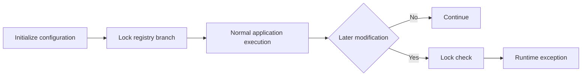
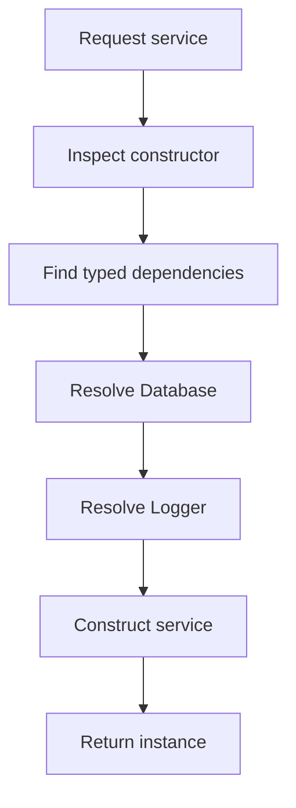
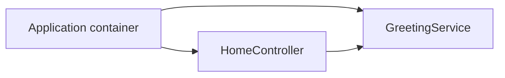

# Volume II — Kernel

## Chapter 3 — Registry and IoC Container

**Evidence:** `spp/core/class.registry.php`, `spp/core/class.container.php`, `spp/tests/core/RegistryTest.php`.

A framework has to answer two very ordinary programming questions again and again:

1. **Where should runtime information be stored so other parts of the application can find it?**
2. **How should one piece of code obtain the objects it depends on?**

SPP answers those questions with two related facilities exposed through `SPP\Registry`:

- a hierarchical **runtime registry**; and
- an **IoC container** (dependency-injection container).

They are related because both are available through framework runtime APIs, but they solve different problems. Understanding that distinction is one of the first important steps in learning SPP.

---

## 3.1 Before SPP: what problem is a framework solving?

Imagine ordinary PHP code that needs a configuration value:

```php
$databaseDriver = 'mysql';
```

That is fine until ten different classes need the same setting. Developers then start passing configuration arrays everywhere, creating globals, or reading files repeatedly.

Now imagine a class that needs another class:

```php
$reportService = new ReportService(
    new DatabaseConnection(...)
);
```

As an application grows, object creation becomes a second problem: which class creates which dependency, and how do we change those dependencies later?

A framework typically centralizes these concerns.

SPP separates them conceptually:

| Problem | SPP facility | Beginner translation |
|---|---|---|
| Store/retrieve runtime values | `Registry` key/value APIs | “Put a value somewhere the framework can find it.” |
| Create and resolve services | `Container` | “Give me the object I depend on.” |

---

## 3.2 The Registry: a hierarchical runtime store

The first part of `SPP\Registry` is simply a structured runtime data store.

Instead of storing a value under a flat PHP variable name, SPP can organize it hierarchically.

For example:

```php
SPP\Registry::register('app.database.driver', 'mysql');
```

The dotted name represents nested information. Conceptually, the framework treats it like:

```text
app
  └── database
       └── driver = mysql
```

You then retrieve it with the matching lookup API:

```php
$driver = SPP\Registry::get('app.database.driver');
```

The important idea is not the dots themselves. The important idea is that the Registry is a **shared runtime namespace for framework state and metadata**.

---

## 3.3 Why a hierarchical registry is useful

Large frameworks need to store many kinds of information:

- paths;
- module metadata;
- discovered classes;
- functions;
- runtime settings;
- application status;
- shared coordination state.

A hierarchical namespace reduces naming collisions and lets related values live under one logical branch.

For example, SPP uses registry branches such as:

- `__dirs` for directory registrations;
- `__classes` for class registrations;
- `__functions` for function registrations; and
- `__mods` for module-related metadata.

These are actual framework conventions visible in the Registry implementation, not generic examples.

---

## 3.4 Reading values safely

The Registry provides typed convenience methods such as:

```php
SPP\Registry::getString(...);
SPP\Registry::getInt(...);
SPP\Registry::getBool(...);
SPP\Registry::getArray(...);
```

These methods matter because configuration values often originate from YAML/XML, environment values, or other string-based sources. A typed accessor establishes a clear boundary where the caller gets the expected PHP type.

For a beginner, the rule is simple:

> Use the most specific accessor that matches the value you expect.

---

## 3.5 Registry locks: protecting configuration after startup

A second important feature is **locking**.

Framework startup often builds critical configuration first and then wants to stop arbitrary later code from changing it.

SPP provides `lock()` and lock-checking behavior for this purpose.

Conceptually:



This is particularly useful for protecting values that must remain stable after initialization.

The exact lock semantics are defined by `class.registry.php`; the handbook should not generalize this into a claim that every Registry branch is automatically immutable.

---

## 3.6 The special `__shared` namespace

Not all Registry data is process-local.

SPP has a special `__shared` namespace for selected state that can be synchronized through a shared-storage implementation.

The important word is **selected**.

The framework does **not** make the entire Registry globally shared. Only data placed in the shared namespace takes the shared-storage path.

The current implementation supports Redis-backed and file-backed shared storage, with fallback behavior when Redis is unavailable or fails.

| Situation | Storage path |
|---|---|
| Redis enabled and usable | Redis shared storage |
| Redis unavailable/disabled | File-backed storage |
| Redis fails during use | Implementation can fall back to file storage |

The Registry marks shared data dirty and synchronizes it during shutdown rather than treating every individual write as an immediate remote transaction.

---

## 3.7 The second problem: dependency injection

Now consider a service class:

```php
class ReportService
{
    public function __construct(Database $db)
    {
        // ...
    }
}
```

Something has to create `ReportService` and provide the `Database` object.

You could do this manually everywhere:

```php
$db = new Database(...);
$reports = new ReportService($db);
```

But then object-creation logic gets duplicated across the application.

An **IoC container** centralizes that work.

“IoC” means **Inversion of Control**: instead of every class deciding how all of its dependencies are created, the runtime takes responsibility for constructing and supplying them.

---

## 3.8 SPP's container

SPP's container is `SPP\Core\Container`.

The class implements `Psr\Container\ContainerInterface` and supports:

- bindings;
- singletons/shared instances;
- automatic construction of class names;
- constructor dependency resolution through reflection.

The Registry exposes the container lazily through:

```php
SPP\Registry::container();
```

The application object also owns an application container and exposes helpers such as `make()`, `bind()`, `singleton()`, and `call()`.

That means beginners will encounter both **Registry-level service resolution** and **application-level dependency resolution** in real SPP code.

---

## 3.9 Binding a service

A binding says:

> “When code asks for this abstract name, create or provide this concrete implementation.”

Conceptually:

```php
$container->bind(
    ReportRepository::class,
    MysqlReportRepository::class
);
```

Now asking the container for `ReportRepository` can resolve the configured implementation.

SPP also supports:

```php
$container->singleton(...);
```

A singleton/shared binding is cached after the first successful resolution and the same object instance is returned for subsequent lookups in that container.

---

## 3.10 Automatic class construction

One of the most useful parts of SPP's container is that a class does not always need an explicit binding.

The implementation first checks whether an object is already cached. If there is no explicit binding but the requested identifier is itself a class name, the container attempts to construct the class directly.

That makes code such as this possible:

```php
$service = $container->get(MyService::class);
```

provided the class can be instantiated.

This is an important distinction for beginners:

> **A binding is not always required just because a class is resolved from the container.**

---

## 3.11 How constructor injection actually works

The container uses PHP reflection to inspect the requested class's constructor.

For a class such as:

```php
class ReportService
{
    public function __construct(Database $db, Logger $logger)
    {
    }
}
```

the container effectively performs this sequence:



The actual implementation is in `Container::resolve()`, `resolveDependencies()`, and `resolveTypedDependency()`.

SPP caches reflection metadata statically so repeated resolution does not have to rediscover the same constructor structure from scratch.

---

## 3.12 What happens with primitive constructor arguments?

A dependency container can easily resolve a class:

```php
Database $db
```

It cannot infer an arbitrary primitive value such as:

```php
string $dsn
```

unless a default value is available or some explicit resolution mechanism has been provided.

SPP's current container handles this explicitly:

- if a primitive parameter has a default value, the default can be used;
- if a nullable primitive has no value, `null` can be accepted;
- otherwise the container throws an `SPPException` explaining that the primitive dependency cannot be resolved.

This is why application configuration and service bindings remain important even when automatic constructor resolution exists.

---

## 3.13 Union types

The container also has specific logic for union types.

For a union containing multiple non-built-in class types, it attempts resolvable class members before failing. If the parameter has a default value, that value can be used; nullable unions can permit `null`.

This is an advanced feature of the actual implementation and should not be confused with arbitrary runtime type guessing.

---

## 3.14 Registry values are not services

This distinction is important enough to memorize.

| Registry | Container |
|---|---|
| Stores runtime data | Resolves objects |
| `register()` / `get()` | `bind()` / `singleton()` / `get()` |
| Configuration and metadata | Service dependencies |
| Hierarchical value tree | Object-construction rules |

For example:

```php
SPP\Registry::register('app.locale', 'en');
```

stores data.

Whereas:

```php
SPP\Registry::bind(Mailer::class, SmtpMailer::class);
```

configures dependency resolution.

Trying to treat every configuration value as a service makes application design harder to reason about.

---

## 3.15 The application container versus the Registry container

SPP has both concepts in the codebase.

The application owns a container created during application initialization, while `Registry::container()` exposes another container associated with the Registry facility.

A beginner should think of them as:

| Container | Main role |
|---|---|
| Application container | Application-scoped service resolution |
| Registry container | Registry-level/framework service resolution |

The exact wiring between them depends on the application code and bootstrap path. The handbook therefore avoids claiming they are always the same object.

---

## 3.16 Calling methods with injected arguments

The application-level `call()` helper adds another useful feature.

Instead of manually resolving arguments before invoking a method, application code can ask the container-aware application runtime to call the method.

For example:

```php
$app->call([
    HomeController::class,
    'index',
]);
```

If `index()` has a class-typed parameter, the application container can supply it.

This is one reason request handlers can remain focused on business behavior instead of object-construction plumbing.

---

## 3.17 A complete small example

Suppose a page needs a `GreetingService`.

```php
class GreetingService
{
    public function message(): string
    {
        return 'Hello from SPP';
    }
}

class HomeController
{
    public function index(GreetingService $greeting): string
    {
        return $greeting->message();
    }
}
```

The application can resolve the controller method through its container-aware call mechanism.

The important dependency direction is:



The controller does not need to know how the service is constructed.

---

## 3.18 When should you use the Registry?

Use the Registry when the thing you need is **runtime data or framework metadata**.

Good examples include:

- paths registered by framework components;
- application/module metadata;
- status flags;
- selected shared runtime state;
- other framework-level values explicitly stored by SPP.

Do not use it as a generic global-variable replacement for every business value.

---

## 3.19 When should you use the container?

Use the container when you need **an object with behavior**.

Good examples include:

- repositories;
- services;
- adapters;
- clients;
- loggers;
- domain/application services;
- integration implementations.

The container becomes especially valuable when one implementation may be replaced with another in different deployments.

---

## 3.20 Common beginner mistakes

### Mistake 1 — Putting everything in the Registry

That turns a structured runtime store into a global service locator for arbitrary application state.

### Mistake 2 — Manually constructing everything

Manual `new` calls everywhere defeat much of the benefit of centralized dependency management.

### Mistake 3 — Making every class a singleton

A singleton is a lifetime choice, not a performance badge. Shared instances should be used when sharing the instance is actually desirable.

### Mistake 4 — Expecting the container to invent primitive configuration

If a constructor requires a string such as a DSN, the container needs an explicit way to obtain it or a default value.

### Mistake 5 — Assuming every SPP container is globally identical

The source exposes application-level and Registry-level container access. Treating them as automatically identical can lead to confusing service-lifetime assumptions.

---

## 3.21 Coming from other ecosystems

### Laravel

Think of the SPP container as roughly comparable to Laravel's service container, but remember that SPP also has a separate hierarchical Registry data structure.

### Symfony

The container concept is familiar; the Registry is an additional SPP runtime facility rather than the same thing as the service container.

### Spring

Constructor injection maps naturally to SPP's reflection-based constructor resolution.

### Django

Django developers may be less accustomed to a general dependency-injection container. In SPP, it is a first-class runtime mechanism.

---

## 3.22 Kernel Hacker: the actual resolution path

The SPP container's `resolve()` method follows these broad steps:

1. return an already-cached shared instance if present;
2. confirm a binding or determine whether the identifier is a concrete class;
3. resolve closures directly;
4. accept an already-instantiated object;
5. inspect the class with `ReflectionClass`;
6. cache reflection metadata;
7. inspect constructor parameters;
8. resolve typed dependencies recursively;
9. instantiate the class with `newInstanceArgs()`; and
10. cache the result when the binding is shared.

The implementation deliberately throws an `SPPException` for non-instantiable classes and unresolvable dependencies rather than silently returning an invalid object.

### Source map

- `spp/core/class.registry.php`
- `spp/core/class.container.php`
- `spp/tests/core/RegistryTest.php`
- `documentation/framework/application-development.md`
