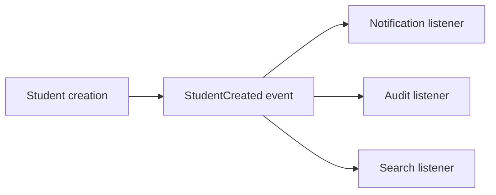
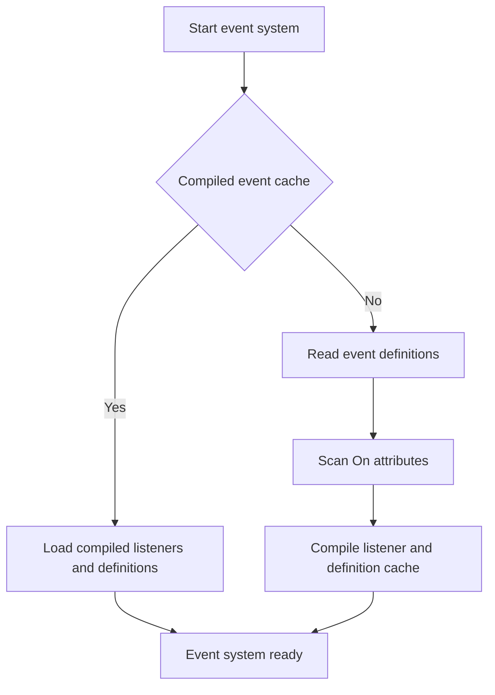
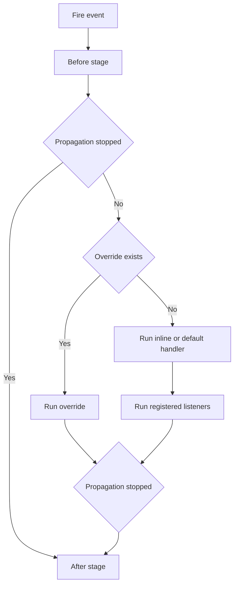
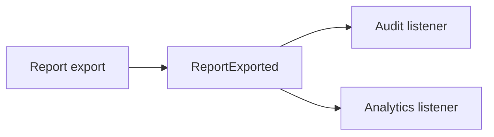
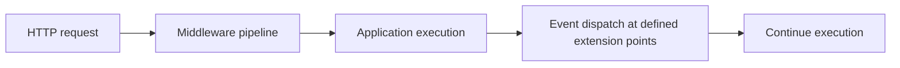

# Volume III — Runtime Infrastructure

## Chapter 4 — Events, EventHandler, and SPPEvent

**Evidence:** `spp/core/class.sppevent.php`, `spp/core/class.eventhandler.php`, `spp/core/class.eventparams.php`, `spp/core/attributes/On.php`, `spp/etc/*/events.yml`, event tests.

If you have never used a framework before, the word **event** may sound abstract. In ordinary PHP, one method calls another method directly. That works well while the application is small.

As the application grows, direct calls create dependencies:

> “Class A must know that Class B exists, and Class B must know how A calls it.”

An event system provides another option:

> “A piece of code announces that something happened, and other code can react without the publisher directly knowing every consumer.”

SPP's event system goes further than a simple publish/subscribe emitter. The implementation supports event definitions, default handlers, inline handlers, listener priorities, attribute-based discovery, overridable events, propagation control, and explicit before/main/after execution stages.

---

## 4.1 Events in plain PHP

Suppose a student is created.

Without events, the code might look like:

```php
$student = $studentService->create($data);
$notificationService->send($student);
$auditService->record($student);
$searchService->index($student);
```

The creator now knows about three other services.

With an event-oriented design, the creator can announce:

```php
SPP\SPPEvent::fireEvent('StudentCreated', $params);
```

Other parts of the system can listen to that event.

The conceptual dependency becomes:



The publisher does not have to call each listener directly.

---

## 4.2 What an SPP event actually is

SPP events are not just strings floating through the application.

The core runtime has explicit classes for the event mechanism:

- `SPPEvent` — the dispatcher/router;
- `EventHandler` — a compatibility-oriented handler abstraction;
- `EventParams` — the object passed through the event pipeline; and
- `#[On]` — an attribute used to declare listeners.

The framework also supports event definitions that can describe a default handler and whether the event may be overridden.

---

## 4.3 The three things a beginner must distinguish

A new developer should separate these concepts:

| Concept | Meaning |
|---|---|
| Event definition | Metadata describing an event |
| Listener | Code registered to respond to an event |
| Event invocation | The actual execution of an event at runtime |

For example, an application might define an event named `StudentCreated`, register three listeners, and later fire it with an `EventParams` object.

These are three different operations.

---

## 4.4 Event listeners and priority

A listener is a callback associated with an event or hook name.

SPP listeners carry a numeric priority. The implementation sorts listener arrays in descending priority order, so a higher number runs before a lower number.

For example:

| Listener | Priority |
|---|---:|
| Security validation | 900 |
| Business transformation | 700 |
| Audit logging | 400 |
| Analytics | 100 |

This lets the application express ordering explicitly rather than relying on incidental registration order.

A useful beginner rule is:

> If the order of two listeners matters, encode that requirement in priority instead of hoping discovery order remains stable.

---

## 4.5 The attribute-based way to register a listener

SPP provides a repeatable PHP attribute:

```php
#[SPP\Attributes\On('StudentCreated', priority: 700)]
public function rebuildIndex(EventParams $params): void
{
    // ...
}
```

The important idea is that the method itself carries the event metadata.

At boot time, SPP scans eligible classes and methods, reflects the `#[On]` attributes, and registers the discovered listeners.

The implementation deliberately excludes classes implementing `FrontendComponentInterface` from this particular attribute-discovery path. That detail matters because not every PHP class in the project is automatically treated as a kernel event listener.

---

## 4.6 YAML event definitions

SPP also supports event definitions loaded from `events.yml` files.

The framework boot process can read known event-definition locations, including framework, application, and module configuration paths.

At a high level, the boot process is:



The important optimization is that expensive discovery is moved toward boot/compilation time when a compiled cache is available.

---

## 4.7 Why event boot is separate from firing an event

A beginner may ask:

> “Why not search the whole application for listeners every time an event fires?”

Because that would make every request expensive.

SPP separates **discovery** from **execution**:

1. discover event definitions and listeners;
2. register/cache them;
3. execute the already-known listener set when an event fires.

This separation is useful in large applications containing many modules.

---

## 4.8 `EventHandler`: where legacy code fits

`SPP\EventHandler` is an abstract compatibility-oriented class.

It maintains handler/event state and provides APIs including:

- `getSubscribedEvents()`;
- `addHook()`;
- `addBeforeHandler()`;
- `addAfterHandler()`; and
- `addOverrideHandler()`.

Modern registration is routed through `SPPEvent::listen()`.

When maintaining older applications, this distinction matters because the older `beforeHandler()`, `overrideHandler()`, and `afterHandler()` methods are not the same thing as the modern router's actual execution mechanism.

The modern runtime path is `SPPEvent`.

---

## 4.9 The event execution pipeline

The most important SPP-specific idea is that the event runtime is a **pipeline**, not just a single callback list.

At a conceptual level:



The exact implementation is in `SPPEvent::fireEvent()`.

A simple way to remember it is:

> **before → main/override → listeners → after**

with propagation possibly stopping the middle stages.

---

## 4.10 Propagation stopping

`EventParams` carries a propagation-stopped flag.

A listener can stop further listener execution by causing:

```php
$params->isPropagationStopped()
```

to become true.

The dispatcher checks this state while executing the event pipeline.

This is useful when the first handler has already decided the outcome and later handlers must not continue.

For example, a high-priority security listener might reject an operation before lower-priority application listeners run.

---

## 4.11 Event overrides are not just “higher priority”

An **override** has different semantics from an ordinary listener.

When an event is declared overridable, SPP can accept an override registration and replace the event's current listener collection through the override path.

This means:

```text
Normal listener
    = another participant in the event

Override
    = replacement behavior for an overridable event
```

This distinction is particularly important for framework-level extension points, where an application or module may need to replace a default framework behavior rather than merely run before or after it.

---

## 4.12 Event definitions can contain default handlers

An event definition can nominate a default handler.

That means the runtime can have three conceptually different execution sources:

1. an inline callback supplied by the caller;
2. a default handler associated with the event definition; and
3. listeners registered for the event.

The dispatcher can also resolve string class names and array callbacks using reflection and instantiate non-static handlers when necessary.

This is one of the reasons SPP's event architecture is more capable than a generic `EventEmitter` API.

---

## 4.13 `EventParams`: events can transform data

Many event systems are notification-only:

> “Something happened.”

SPP's `EventParams` allows a different pattern as well.

Handlers receive an `EventParams` object by reference. That object carries payload data and propagation state.

A handler may therefore inspect or modify the event payload before another stage runs.

That makes SPP events suitable for:

- interception;
- normalization;
- enrichment;
- transformation;
- policy checks; and
- notification.

The important consequence is:

> SPP events are not guaranteed to be immutable messages.

---

## 4.14 A practical application example

Suppose an application needs to add an audit record whenever a report is exported.

A listener can be declared with `#[On]`:

```php
final class ReportAuditListener
{
    #[SPP\Attributes\On('ReportExported', priority: 400)]
    public function audit(EventParams $params): void
    {
        // Record the export details.
    }
}
```

The report-exporting code does not need to call this class directly. It only has to fire the event with the relevant parameters.

The resulting relationship is:



This is especially useful when the application gains new subscribers later.

---

## 4.15 Events versus direct method calls

Use a direct method call when the caller **needs a specific collaborator** and needs a result from it.

Use an event when the publisher should **announce an occurrence or extension point** and should not need to know every participant.

| Situation | Better abstraction |
|---|---|
| Controller needs a repository result | Direct service call |
| Student creation should trigger optional subscribers | Event |
| One service must calculate a value for another | Direct service call |
| Framework should expose an extension point | Event/hook |
| A replacement implementation is explicitly supported | Overridable event |

Events should not be used merely to make simple code look “enterprise”. They are most useful when the decoupling is real.

---

## 4.16 Events and middleware are different

Beginners often confuse these two mechanisms.

### Middleware

Middleware wraps request processing and can stop or transform a request/response path.

### Events

Events announce or intercept specific runtime occurrences and invoke registered handlers.

A useful distinction is:



The two systems can cooperate, but they are not interchangeable.

---

## 4.17 Events and LiveComponent are also different

SPP contains kernel events and also has LiveComponent-specific dispatch APIs.

A LiveComponent can call its own `dispatch()` mechanism for UI/reactive communication, while `SPPEvent` is the kernel-wide event infrastructure.

Do not infer that every LiveComponent event automatically becomes a kernel `SPPEvent`.

This separation is important when documenting component behavior and transport behavior.

---

## 4.18 Debugging an event that does not fire

When an event appears not to work, investigate in this order:

1. **Was the event system booted?**
2. **Was the listener discovered or explicitly registered?**
3. **Is the event name exactly correct?**
4. **Is the listener registered under the expected hook/event name?**
5. **Is the listener priority/order what you expect?**
6. **Did an earlier handler stop propagation?**
7. **Is an override replacing the normal listener collection?**
8. **Is the class excluded from attribute discovery because of the framework's scanning rules?**

For debug builds, SPPEvent also has trace/debug facilities. The implementation should be checked for the exact operational behavior of those methods rather than assuming every trace helper is enabled in every deployment.

---

## 4.19 Coming from another framework

### Laravel

Think of SPP events as closer to Laravel's event/listener mechanism, but with stronger hook semantics and explicit before/main/after execution paths.

### Symfony

Symfony developers will recognize event subscribers and priorities. SPP's `SPPEvent` adds its own definition, override, and compatibility machinery.

### Node.js EventEmitter

SPP is more structured. It has definitions, boot-time discovery, priorities, propagation state, and override semantics rather than only a listener map.

### Spring

Spring application events provide a similar decoupling idea, but SPP's runtime is PHP-based and integrates its event dispatcher with its own module/configuration discovery model.

---

## 4.20 Kernel Hacker: how the runtime gets its listener map

The event boot process is designed to avoid repeatedly scanning the whole project during normal execution.

The source-backed pattern is:

1. check for a compiled event cache;
2. if available, load listener and event-definition metadata;
3. otherwise read known `events.yml` definitions;
4. scan eligible PHP trees for `#[On]` methods;
5. register listener metadata and definitions;
6. write a compiled cache for later runs.

Listener arrays are prioritized before execution.

At dispatch time, `fireEvent()` handles the before stage, override/main/default/inline behavior, listener execution, propagation state, and after stage.

That separation between **discovery**, **registration**, and **execution** is the central performance and architecture idea in SPP's event subsystem.

### Source map

- `spp/core/class.sppevent.php`
- `spp/core/class.eventhandler.php`
- `spp/core/class.eventparams.php`
- `spp/core/attributes/On.php`
- `spp/etc/*/events.yml`
- event tests
