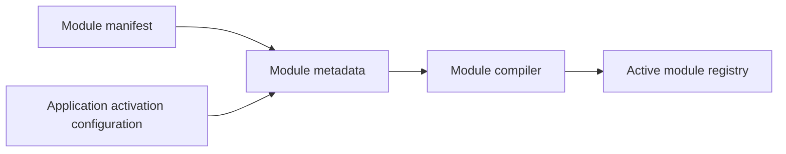
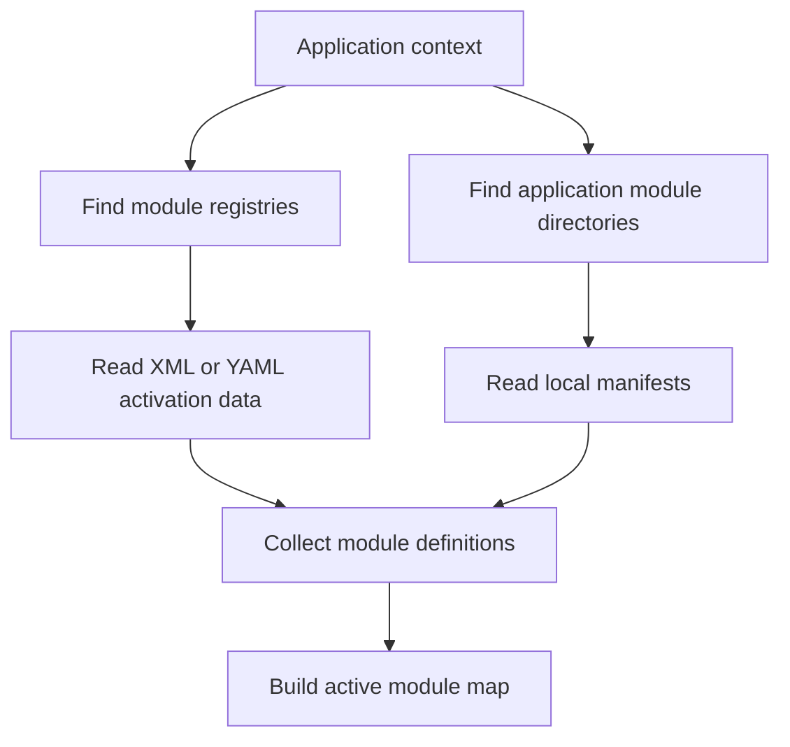
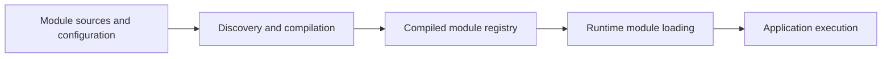
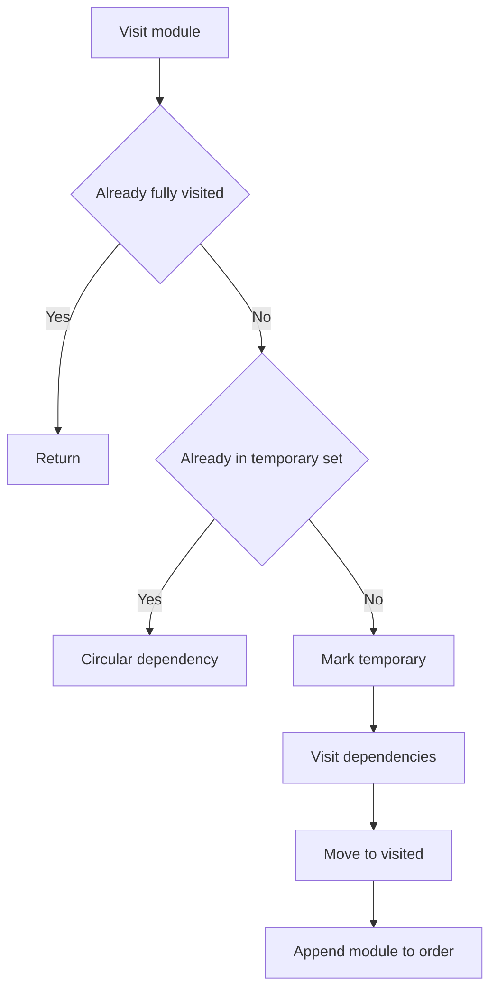

# Volume IV — Module Architecture

## Chapter 5 — Modules, Manifests, Discovery, and the Compiled Registry

**Evidence:** `spp/core/class.module.php`, `spp/core/class.modulecompiler.php`, `spp/core/class.moduleinstaller.php`, `spp/etc/modules.yml`, `spp/etc/modules.xml`, application `modsconf` files, first-party `module.yml` files.

If you have never used a framework, the word **module** can be confusing. In ordinary PHP you might create a folder called `reports/` and put some classes in it. That does not automatically make the folder a framework feature.

In SPP, a module is a **framework-recognized feature unit**.

A module can have a name, version, dependencies, configuration, included files, services, events, assets, and other contributions depending on the module implementation. SPP can discover it, decide whether it is active, order it relative to other modules, compile its metadata, and manage it through framework tooling.

That is much more than a directory of PHP files.

---

## 5.1 Why frameworks need modules

Imagine an application that starts with one feature:

```text
Student management
```

Over time it gains:

```text
Student management
Authentication
Reporting
Email
Payments
Library
API
Live dashboard
```

If everything is kept in one giant application folder, ownership becomes unclear and dependencies become difficult to reason about.

A module gives a feature a boundary.

Think of it as:

> **A feature that the framework knows how to install, discover, configure, activate, and connect to other features.**

---

## 5.2 Module versus ordinary PHP folder

An ordinary folder gives you a filesystem boundary.

An SPP module gives you a **runtime boundary** as well.

| Ordinary folder | SPP module |
|---|---|
| Files exist | Files + runtime metadata |
| Developer decides how to include code | Framework discovers/loads it |
| No standard dependency graph | Manifest dependencies |
| No activation state by default | Active/inactive module state |
| No compiled module registry | Compiled registry supported |
| No standard module management | Installation/management tooling |

This distinction becomes increasingly important as the application grows.

---

## 5.3 The two files beginners often confuse

SPP has two different concepts:

### Module manifest

The manifest belongs to the module itself.

For example, a first-party module may have:

```text
spp/modules/spp/sppview/module.yml
```

The manifest describes the module.

### Activation registry

The activation registry belongs to the application/runtime configuration.

It tells SPP which discovered modules are active for a particular application.

This can involve global registries such as:

```text
spp/etc/modules.yml
spp/etc/modules.xml
```

and application-specific configuration under `etc/apps/*/modsconf/`.

The mental model is simple:



The manifest says **what the module is**.

The activation configuration says **whether and how the application uses it**.

---

## 5.4 What a module manifest contains

A real SPP module manifest can contain information such as:

- module name;
- module version;
- public name;
- group/category;
- description;
- files included by the module;
- dependency declarations; and
- configuration variables with settings metadata.

For the SPP View family, the manifest participates directly in runtime loading and configuration.

That means a manifest is not merely documentation for humans. The framework reads it.

---

## 5.5 Why dependencies belong in the manifest

Suppose module `reports` requires module `database`.

Without a declared dependency, the runtime might try to load them in the wrong order.

With a dependency declaration:

```text
reports → database
```

SPP can construct a dependency graph before activating the modules.

The critical idea is:

> A dependency says **what another module must be available before this module can operate correctly**.

---

## 5.6 Discovering active modules

The module compiler obtains registry files through `Module::getRegistryFiles($appContext)`.

It can read XML or YAML activation registries and identify modules whose status is active or which are compulsory according to the module subsystem.

SPP also discovers application-specific modules under directories returned by `Module::getAppModuleDirs($appContext)`.

That means a module can be discovered from its application-local module directory and its own manifest without necessarily being copied into a single giant global list.

The high-level process is:



This is one of the places where application context matters directly to module discovery.

---

## 5.7 Application-local versus framework modules

SPP supports reusable framework modules and application-local modules.

A framework module may live under the framework module tree, for example:

```text
spp/modules/spp/<module>
```

An application-local feature module may live under something like:

```text
src/myapp/modules/<module>
```

This gives an application two levels of reuse:

- reusable framework capabilities; and
- features that belong only to one application.

A useful ownership rule is:

> If the feature is genuinely reusable across applications, consider a reusable module. If it is specific to one application, an application-local module may be the better boundary.

---

## 5.8 What “active” means

A module being present on disk does not necessarily mean it is active.

SPP uses activation metadata and module configuration to determine which discovered modules participate in the current application's module registry.

This is important when debugging:

```text
Module exists on disk
        ≠
Module is active
```

If a class from a module cannot be found or a feature does not appear, always ask two separate questions:

1. Was the module discovered?
2. Was the module activated?

---

## 5.9 Dependency ordering

Once active modules are known, SPP must determine a safe load order.

The module compiler uses `ModuleCompiler::topologicalSort()` and performs a depth-first dependency traversal.

Suppose:

```text
reports depends on users
users depends on core
core depends on bootstrap
```

The dependency order must be:

```text
bootstrap → core → users → reports
```

The dependent module is loaded after the modules it requires.

---

## 5.10 Why topological sorting matters

A dependency graph is not necessarily a simple list.

For example:

```text
Reporting ──→ Users
       │
       └────→ Database

Users ─────→ Database
```

The compiler must produce an order in which all prerequisites are available.

This is exactly the problem a topological sort is designed to solve.

The implementation performs depth-first traversal and tracks temporary visitation state so it can detect cycles.

---

## 5.11 Circular dependencies

A circular dependency is a graph like:

```text
A → B
B → C
C → A
```

There is no valid load order because every module requires another module that ultimately requires the first one.

SPP's dependency compiler detects this through its temporary traversal set and raises a circular-dependency exception.

This is much better than allowing startup to continue with an unpredictable partially loaded module set.

---

## 5.12 Missing dependencies

A second failure is simpler:

```text
Reports → Search
```

but `Search` is not present in the discovered module map.

The compiler raises `MissingDependencyException` for a referenced dependency that cannot be resolved.

Again, the important distinction is:

```text
Missing module
≠
Inactive module
≠
Circular dependency
```

They are different failure modes and should be diagnosed differently.

---

## 5.13 Configuration is part of the module system

Module manifests can declare configuration variables.

SPP's module compiler uses module configuration through `Module::getConfig()` while building the normalized module metadata.

That means configuration is not simply something read by the module's PHP code later. It can affect the data materialized into the compiled registry itself.

This is why module configuration should be treated as part of the module contract.

---

## 5.14 The compiled module registry

Repeatedly scanning every manifest on every request would be expensive.

SPP therefore compiles discovered module metadata into an application-specific PHP cache.

The cache is named in a form such as:

```text
var/cache/modules_<appContext>.php
```

The exact cache path is determined by the application's runtime directories, but the important principle is:

> **Expensive module discovery and normalization can happen before steady-state execution.**

---

## 5.15 What the compiled registry contains

The compiler normalizes metadata including values such as:

- module name;
- module path;
- type;
- version;
- dependencies;
- included files;
- extracted services; and
- resolved configuration values.

The compiler also records information about the manifests used to produce the cache.

That gives SPP a normalized representation that other runtime tools can consume without reparsing every source manifest.

---

## 5.16 Why compilation changes the mental model

A beginner might imagine this:

```text
Every request
    ↓
Search every module directory
    ↓
Read every module.yml
    ↓
Build dependency graph
    ↓
Start application
```

The implemented architecture is closer to:



The framework can reuse the normalized result rather than repeating all discovery work during ordinary execution.

---

## 5.17 Module installation and management

SPP includes a `ModuleInstaller` and dedicated management commands for module operations.

The repository contains command paths for capabilities such as:

- module listing;
- enabling/disabling modules;
- installation/uninstallation;
- updating modules;
- module settings; and
- module testing.

This is another reason an SPP module is more than a folder: the framework knows how to manage it as a unit.

---

## 5.18 YAML and XML

The repository contains both YAML and XML module registries.

For modern application development, YAML is generally the clearer convention in the current source, but the XML path is still implemented as a compatibility mechanism.

Therefore the handbook uses this rule:

> Learn the YAML form first when following current project conventions; understand the XML path when maintaining older applications or compatibility configurations.

Do not assume that XML and YAML are different module systems. They represent supported registry formats consumed by the module subsystem.

---

## 5.19 Building an application-local module

A beginner can think of the steps as:

1. create the module directory;
2. create its manifest;
3. declare dependencies;
4. add module code/resources;
5. expose module configuration where required;
6. make the application discover the module;
7. activate/configure it; and
8. rebuild/refresh the compiled module registry as required by the current tooling.

The exact generated files depend on the module type and SPP tooling, so a production tutorial will use a real module scaffold rather than inventing a universal module skeleton.

---

## 5.20 When should something become a module?

Do not create a module merely because the application has three PHP files.

A module becomes attractive when a feature has one or more of these properties:

- it has a clear ownership boundary;
- it has reusable functionality;
- it has configuration;
- it has dependencies on other framework features;
- it contributes events/services/views/assets;
- it may be enabled or disabled;
- it may eventually be installed or distributed independently.

For a tiny private helper, a service class may be the simpler boundary.

---

## 5.21 Modules and multi-application SPP

Because SPP can host multiple application contexts, module selection is application-aware.

The same runtime can therefore conceptually contain:

```text
Application A
    ├── Module X
    └── Module Y

Application B
    ├── Module X
    └── Module Z
```

The important point is that the module maps are resolved in an application context rather than assuming every application uses exactly the same active feature set.

---

## 5.22 Coming from other ecosystems

### Laravel

Think of an SPP module as broader than a Composer package: it is a framework-recognized runtime feature with activation, metadata, configuration, and dependency behavior.

### Symfony

There are similarities to bundles/packages, but SPP's manifest and compiled module registry are its own implementation model.

### Django

A Django app is a useful conceptual comparison, but SPP modules have explicit manifest/activation/dependency machinery that should be learned separately.

### .NET / Java

Think of modules as feature components that participate in the host application's runtime composition, not merely source folders.

---

## 5.23 Common beginner mistakes

### Mistake 1 — Confusing manifest and activation configuration

The manifest describes the module. Activation configuration tells the application how that module participates in the runtime.

### Mistake 2 — Assuming “folder exists” means “module active”

Discovery and activation are separate steps.

### Mistake 3 — Ignoring dependencies

If a module uses another module, declare that dependency rather than hoping filesystem order or registration order will make it work.

### Mistake 4 — Creating circular dependencies

Prefer dependency direction that moves from foundational modules toward higher-level features.

### Mistake 5 — Treating the compiled registry as source

The compiled cache is a generated runtime artifact. The manifest/configuration source remains authoritative.

---

## 5.24 Kernel Hacker: dependency algorithm

`ModuleCompiler::topologicalSort()` uses a depth-first traversal with visited and temporary sets.

Conceptually:



Assuming normal map lookups, the traversal is linear in the number of modules and dependency edges.

The more important optimization in steady-state deployment is the compiled registry cache, which moves discovery and normalization away from the hot request path.

### Source map

- `spp/core/class.module.php`
- `spp/core/class.modulecompiler.php`
- `spp/core/class.moduleinstaller.php`
- `spp/etc/modules.yml`
- `spp/etc/modules.xml`
- application `modsconf` files
- first-party `module.yml` files
