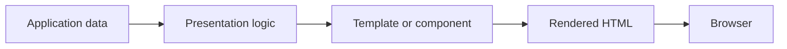
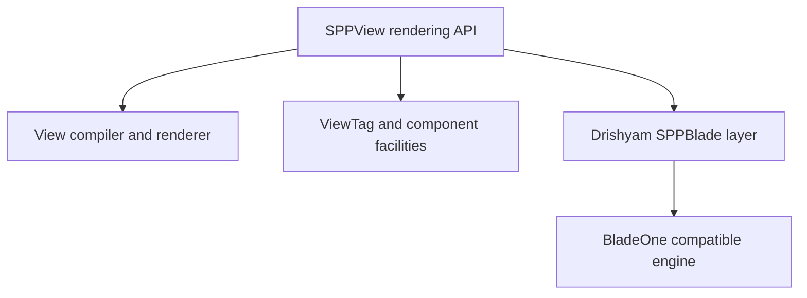
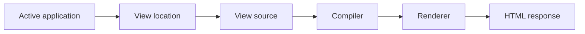
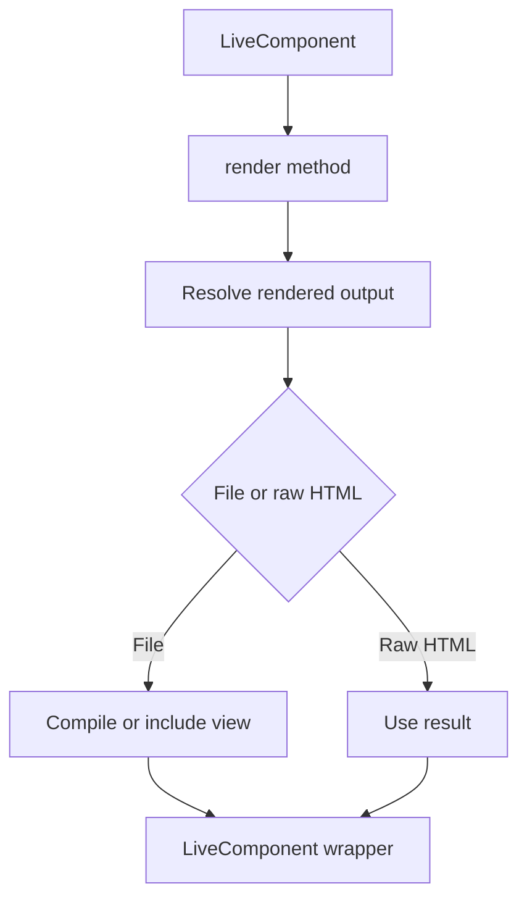
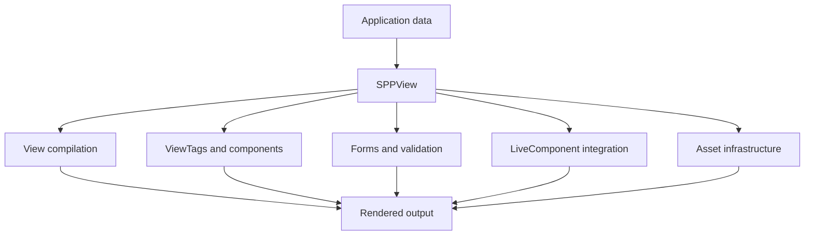

# Volume V — Presentation Architecture

## Chapter 6 — SPPView, Extended BladeOne, ViewTags, and Drishyam

**Evidence:** `spp/modules/spp/sppview/`, `spp/modules/spp/drishyam/`, especially `class.viewcompiler.php`, `class.viewrenderer.php`, `class.viewtag.php`, `class.sppblade.php`, `class.templatemacros.php`, `class.phpcomponent.php`, form/validator classes, and module manifests.

If you have never worked with a framework, you may think the following is the whole job of a web page:

```php
echo '<h1>Hello</h1>';
```

For a real application, presentation is much larger.

The framework has to answer questions such as:

- Where is the template file?
- Which application owns it?
- How is the template compiled?
- How are framework-specific directives interpreted?
- How are reusable components represented?
- How are forms built and validated?
- How are assets located and managed?
- How does a server-side reactive component produce its HTML?
- How does client-side JavaScript connect to the generated markup?

SPP groups much of this work under **SPPView**, while Drishyam provides important Blade-compatible and client/runtime integration.

The key beginner lesson is:

> **Blade syntax is only one part of SPP's presentation architecture.**

---

## 6.1 What is rendering?

A browser needs HTML, CSS, and JavaScript. Your PHP application usually works with objects, configuration, database results, and business services.

Rendering is the process of turning application state into a browser-facing representation.

A simplified relationship is:



A framework's rendering subsystem exists so developers do not have to manually concatenate HTML for every page.

---

## 6.2 What SPPView means

SPPView should be understood as the **framework-facing presentation layer**, not merely a template syntax.

The `sppview` module contains classes for areas including:

- view compilation;
- view rendering;
- view location;
- view routing/pages;
- ViewTags;
- PHP components;
- assets;
- forms;
- validation;
- AJAX request/response support; and
- LiveComponent rendering.

This is why the handbook uses the term **SPPView** for the layer as a whole.

---

## 6.3 The basic page pipeline

A beginner can think about a normal server-rendered page as four questions:

1. **What data does the page need?**
2. **Which view/template should display it?**
3. **How is that template compiled and executed?**
4. **What HTML is returned to the browser?**

SPPView contains infrastructure for those steps.

The application code may be a controller, service, page definition, or another request-facing component. SPPView is responsible for the presentation side once the rendering path is chosen.

---

## 6.4 Blade syntax is not the same thing as SPPView

If you come from Laravel, you may already know Blade.

If you only know PHP, think of Blade as a **template language that lets you write HTML with embedded server-side expressions and directives**.

For example:

```blade
<h1>{{ $title }}</h1>
```

The important SPP-specific point is that the framework does not stop at the generic Blade syntax. SPP adds its own rendering infrastructure around a BladeOne-compatible engine.

---

## 6.5 BladeOne and SPP

The repository contains an extended BladeOne-compatible implementation under Drishyam, notably `class.sppblade.php`.

The architectural relationship is:



This means:

> **SPP uses BladeOne-compatible technology, but SPP's public presentation architecture is broader than BladeOne itself.**

Calling the entire framework “just BladeOne” would omit view routing, ViewTags, forms, assets, components, LiveComponent integration, and the surrounding runtime.

---

## 6.6 Extended directives

The SPP Blade layer registers framework-specific directives and helpers. The source contains directives including examples such as:

- `@checked`;
- `@selected`;
- `@disabled`;
- `@readonly`;
- `@required`;
- `@js`;
- `@props`;
- `@sppbind`;
- `@react`;
- `@vue`;
- `@sppux`;
- `@spppartial`;
- `@url`;
- `@sppoffline` / `@endsppoffline`; and
- framework/domain helpers such as `@load_node` and `@load_page`.

The exact directive set is implementation-defined. Do not copy a generic Blade reference and assume every directive is valid in SPP.

When a directive is important to an application, check the current `SPPBlade` initializer and associated tests/examples.

---

## 6.7 View compilation versus rendering

These words are often confused.

### Compilation

Compilation transforms a template or view source into an executable/renderable form.

### Rendering

Rendering executes the prepared view with data and produces output.

SPP has distinct classes such as:

- `class.viewcompiler.php`;
- `class.viewrenderer.php`.

That separation matters when debugging.

If a template cannot be compiled, the problem is different from a template that compiles but renders incorrect data.

---

## 6.8 Where a view comes from

A rendering system needs a **view locator** or resolver.

SPP's presentation module contains view location and routing/page infrastructure. The active application context matters because a view may belong to an application or a module.

This is why application paths such as the app source directory and resource directories matter to presentation.

A useful mental model is:



---

## 6.9 ViewTags: a framework parser layer

SPP has a dedicated `class.viewtag.php` subsystem.

This deserves its own name because it is not simply another Blade directive.

A ViewTag is a framework-level presentation construct parsed and processed by the SPP ViewTag machinery.

The important beginner rule is:

> Do not assume that everything that looks like a custom tag in an SPP template is implemented by Blade itself.

Some behavior belongs to the ViewTag subsystem.

The handbook will document specific ViewTag syntax only from the actual implementation/examples, not from assumptions based on generic component frameworks.

---

## 6.10 PHP components

SPPView also contains PHP-component infrastructure such as `class.phpcomponent.php`.

This provides another presentation mechanism alongside templates.

The general distinction is:

| Mechanism | Main idea |
|---|---|
| Template | Describe output declaratively |
| PHP component | Encapsulate reusable presentation behavior in PHP |
| ViewTag | Framework-specific presentation construct |
| LiveComponent | Stateful server-side reactive component |
| SPPUX component | Client-side reactive component |

These layers can work together. They are not interchangeable names for the same object.

---

## 6.11 Forms are part of the presentation subsystem

The `sppview` module contains a substantial form stack, including classes such as:

- `class.form.php`;
- `class.forms.php`;
- `class.viewform.php`;
- `class.viewformbuilder.php`;
- `class.viewformdispatcher.php`;
- `class.viewformtheme.php`; and
- form element classes.

Validation support lives alongside this in the validator subsystem.

For a beginner, this means SPP can treat a form as more than a raw `<form>` tag. There is framework infrastructure for creating, dispatching, theming, and validating forms.

A dedicated form tutorial should therefore come after the reader understands SPPView itself.

---

## 6.12 Validation is not the same as rendering

A common architectural mistake is to make the template responsible for validating business input.

SPP separates these concerns.

| Concern | Responsible area |
|---|---|
| Display field | Form/view layer |
| Collect input | Form/HTTP layer |
| Validate value | Validator/form logic |
| Execute business rule | Service/domain logic |
| Render error | View/form layer |

This separation becomes particularly important for LiveComponent forms, where validation can occur repeatedly during a component interaction.

---

## 6.13 Asset management

The source contains `class.viewassetmanager.php` and `class.assetorchestrator.php`.

This tells us asset handling is part of the presentation infrastructure, rather than an entirely external concern.

However, the handbook deliberately does not claim a specific bundling/minification algorithm until the relevant implementation is fully audited.

This is an example of the documentation rule used throughout the handbook:

> **Presence of a class proves a subsystem exists; it does not automatically prove every behavior one might expect from its name.**

---

## 6.14 Rendering a simple application page

At the beginner level, you can think of the application page like this:

```text
Application/service data
        ↓
View selection
        ↓
Blade/SPPView processing
        ↓
HTML
        ↓
Browser
```

The exact classes involved depend on the route/page mechanism used by the application.

That flexibility is deliberate: SPP's presentation stack supports more than one request/rendering style.

---

## 6.15 LiveComponent enters the rendering system

A LiveComponent is a stateful PHP component, but its output still has to become browser-facing HTML.

The LiveComponent implementation can return rendered content directly or resolve a file-backed render result.

The integration path is approximately:



For `.html`, the source path goes through `ViewCompiler::compile()`. PHP/Blade-backed results can be included after the appropriate state/computed-data preparation.

This is one of the strongest examples of SPP's subsystems composing rather than replacing one another.

---

## 6.16 Initial page rendering versus reactive rendering

These two situations should be kept separate.

### Initial page

A normal application route may render a complete page through SPPView.

### Reactive interaction

A LiveComponent action may render only the component's output through the LiveComponent/SPP Live path.

The rendering technology can therefore be shared while the request/transport path differs.

---

## 6.17 Where Drishyam fits

Drishyam contains the extended Blade integration and additional rendering/runtime integration that connects SPP's server presentation layer with client-oriented features.

The current source tree includes `class.sppblade.php`, template macros, component classes, and JavaScript runtime integration.

For a beginner, the safest mental model is:

> **SPPView is the presentation subsystem; Drishyam is an important extension/integration layer inside that presentation architecture.**

Do not treat “Drishyam” as a replacement name for every view class in SPP.

---

## 6.18 SPPUX integration

SPP's Blade integration includes the `@sppux` directive, and the Drishyam tree contains the SPPUX bridge/runtime.

That creates a path from server-rendered markup toward client-side reactive behavior.

However, SPPUX is a separate JavaScript runtime with its own state, scheduler, event, template, and reconciliation modules.

This is important enough to state explicitly:

> **SPPView and SPPUX are cooperating runtimes, not one runtime written in two languages.**

---

## 6.19 Why the architecture is layered

A beginner may wonder why SPP does not simply have one “view” class.

Because the problems are different.



Each subsystem owns a different responsibility while cooperating to produce the final presentation.

---

## 6.20 Choosing the right presentation mechanism

Do not start by asking:

> “Which SPP feature can I use?”

Start by asking:

> “What kind of problem am I solving?”

| Problem | Good starting point |
|---|---|
| Static/simple page | SPPView + template |
| Reusable server-side presentation logic | PHP component |
| Framework-specific tag abstraction | ViewTag |
| Complex validated form | Form + validator subsystem |
| Stateful reactive server UI | LiveComponent |
| Browser-local reactive UI | SPPUX |
| Shared client/server behavior | LiveComponent + SPPUX bridge as appropriate |

Using the smallest subsystem that solves the problem keeps applications easier to maintain.

---

## 6.21 Coming from other frameworks

### Laravel Blade

SPP will feel familiar because it uses BladeOne-compatible technology, but the surrounding SPPView architecture is broader.

### Symfony Twig

Think of SPPView as the broader presentation layer rather than only a template language. ViewTags/components/forms are separate concerns.

### React/Vue

Do not treat SPPUX as “React written differently”. It has its own runtime and reconciliation implementation.

### Django templates

The basic server-rendering idea is similar, but SPP adds framework-level components, forms, ViewTags, LiveComponent, and the Drishyam/SPPUX integration.

---

## 6.22 Common beginner mistakes

### Mistake 1 — Thinking Blade is the entire SPP view system

Blade is only one part of the presentation architecture.

### Mistake 2 — Putting business logic in templates

Templates should present data. Complex domain behavior belongs in application services/components.

### Mistake 3 — Assuming every custom directive is generic Blade

SPP adds its own directives and framework-specific processing.

### Mistake 4 — Assuming rendering and routing are the same

Routing decides what handles a request; rendering decides how data becomes output.

### Mistake 5 — Treating LiveComponent as only a template

A LiveComponent is a stateful server-side runtime object that happens to render HTML.

---

## 6.23 Kernel Hacker: the real SPPView boundary

The source shows a deliberately layered presentation architecture:

- `ViewCompiler` handles compilation work;
- `ViewRenderer` handles rendering;
- view router/location classes determine where views are obtained;
- `ViewTag` provides a separate parser/processor facility;
- form classes provide structured input/UI behavior;
- LiveComponent delegates rendered file handling back into SPPView;
- Drishyam extends the Blade-compatible engine and adds framework directives/integration;
- SPPUX is a separate client runtime connected through the bridge layer.

The important architectural insight is that no single class should be treated as “the entire SPP view system”.

### Source map

- `spp/modules/spp/sppview/class.viewcompiler.php`
- `spp/modules/spp/sppview/class.viewrenderer.php`
- `spp/modules/spp/sppview/class.viewrouter.php`
- `spp/modules/spp/sppview/class.viewtag.php`
- `spp/modules/spp/sppview/class.phpcomponent.php`
- `spp/modules/spp/sppview/class.livecomponent.php`
- `spp/modules/spp/sppview/` form/validator classes
- `spp/modules/spp/drishyam/class.sppblade.php`
- `spp/modules/spp/drishyam/`
