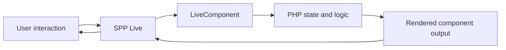
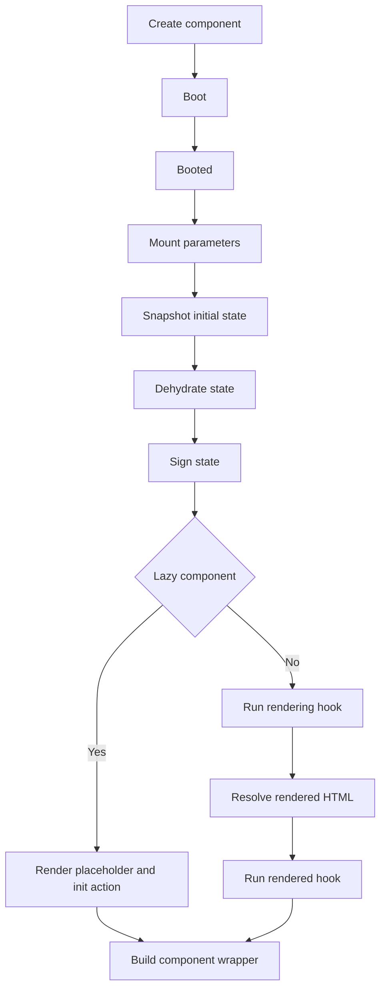
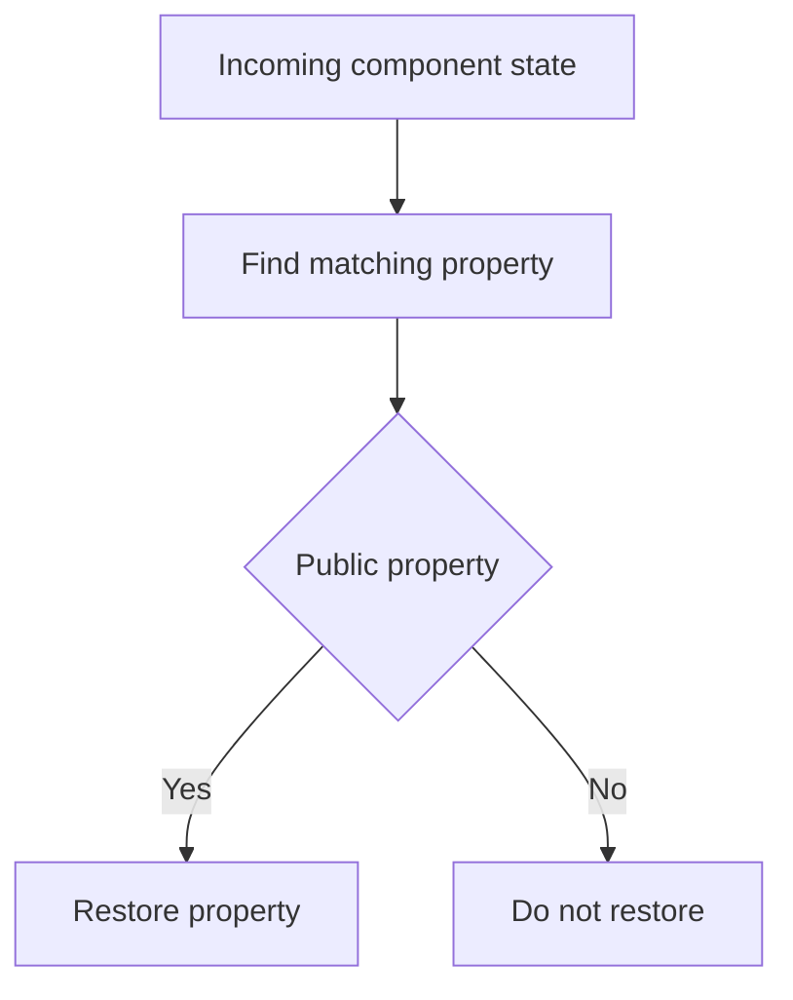
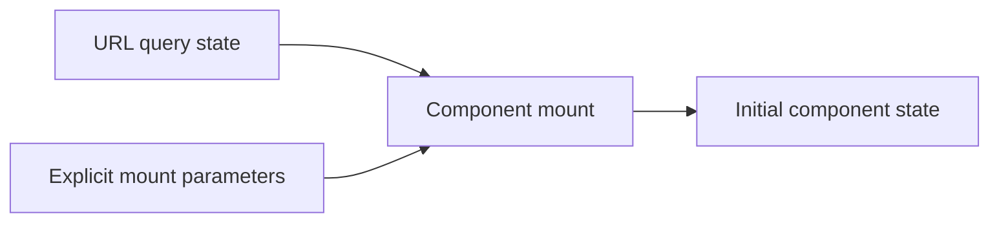
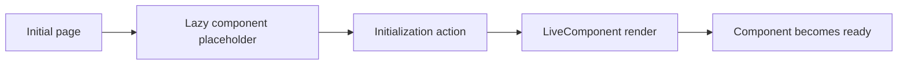
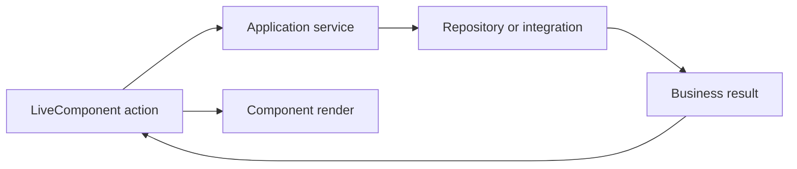
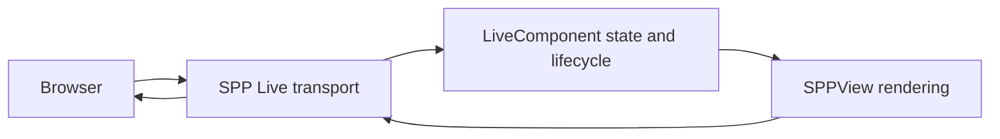

# Volume VI — Reactive Server UI

## Chapter 7 — LiveComponent: Server-Side Reactive Components

**Evidence:** `spp/modules/spp/sppview/class.livecomponent.php`, `spp/modules/spp/sppview/Attributes/`, `spp/core/attributes/Computed.php`, `spp/core/attributes/On.php`, `spp/modules/spp/spplive/`, LiveComponent tests.

If you have only ever written ordinary PHP pages, the word **reactive** may sound like a frontend-only concept.

In a traditional server-rendered application:

```text
Browser request
    ↓
PHP runs
    ↓
HTML is generated
    ↓
Response ends
```

If the user changes something, another request starts the process again.

A **LiveComponent** changes the programming model. A PHP object represents a stateful UI component, and SPP provides infrastructure for sending an action to that component, reconstructing its state, executing its PHP logic, and sending the component's updated representation back through the live runtime.

The important idea is:

> **LiveComponent is a server-side component model. SPP Live is the transport/runtime layer that carries live interactions.**

They are deliberately separate.

---

## 7.1 Why do we need LiveComponent?

Imagine a filterable student table.

A traditional approach might do this:

1. user changes the filter;
2. browser submits a request;
3. PHP reads the filter;
4. PHP queries the database;
5. PHP renders the entire page again.

That works, but the entire page becomes part of every interaction.

A LiveComponent lets the application treat the interactive table as a server-side component with its own state.

Conceptually:



The browser is still involved, but the authoritative component behavior remains in PHP.

---

## 7.2 What makes a LiveComponent different from an ordinary PHP class?

A normal PHP class lives for the duration of the request unless the application deliberately stores it somewhere longer-lived.

A LiveComponent is designed around repeated interaction cycles.

The implementation provides framework concepts for:

- component identity;
- public state;
- hydration and dehydration;
- lifecycle methods;
- computed values;
- validation;
- event dispatch;
- lazy/isolated rendering;
- streaming;
- downloads; and
- client-facing metadata.

The component therefore behaves like a **server-side UI object whose state can be reconstructed between requests**.

---

## 7.3 Component identity

Every LiveComponent has an `id`.

The constructor can receive an ID, and the implementation can generate one using the `live_` prefix when necessary.

Identity matters because the live runtime needs to know **which component instance an interaction belongs to**.

A page might contain several components:

```text
Dashboard
├── StudentTable   → component A
├── Attendance      → component B
└── Notifications   → component C
```

An interaction directed at component A should not accidentally update component B.

---

## 7.4 The first render

The initial component render is different from a later hydrated interaction.

The implementation of `LiveComponent::renderComponent()` performs a concrete initial lifecycle.

At a high level:



This is the actual initial-render path represented by the inspected implementation. Do not substitute a generic Livewire lifecycle from another framework.

---

## 7.5 Lifecycle methods

The base class defines overridable methods including:

- `boot()`;
- `booted()`;
- `mount(array $params = [])`;
- `updating(string $name, mixed $value)`;
- `updated(string $name, mixed $value)`;
- `rendering()`;
- `rendered(string $html)`;
- `exception(Throwable $e, Closure $stopPropagation)`; and
- `render()`.

The class also provides `hydrate(array $state)` and `dehydrate(): array`, with `snapshotInitialState()` used as an internal state snapshot facility.

For a beginner, think of them as **places where SPP allows the component developer to participate in the component lifecycle**.

---

## 7.6 First request versus later interaction

The word **hydrate** is easier to understand if you think about what HTTP normally does to PHP objects.

Request 1 creates the component.

Then the request ends.

The PHP object itself is gone.

Request 2 therefore has to reconstruct the component.

The client supplies state information that the framework can use to restore public component state before executing the next action.

That is the purpose of hydration.

Dehydration is the opposite direction: taking the eligible component state and turning it into a serializable representation for the next interaction.

---

## 7.7 What state crosses the boundary?

The current base implementation deliberately hydrates **public properties**.

It does not simply serialize every property in the PHP object.

Conceptually:



This is an important security and architecture boundary.

A protected/private implementation detail is not automatically exposed merely because the component object has that property.

---

## 7.8 Dehydration

`dehydrate()` uses reflection to inspect public properties and excludes derived/runtime values, including computed properties discovered through metadata and the `errors` property.

Properties marked with `#[Session]` can also be persisted into PHP session storage using class/property-derived session keys.

The resulting state is suitable for JSON serialization.

For a beginner, the rule is:

> **Only state that the component framework considers transportable participates in hydration/dehydration.**

The exact exclusions and metadata behavior come from the implementation.

---

## 7.9 URL-bound state

The component's `mount()` logic supports URL-bound properties through the `#[Url]` attribute in the SPP View attributes namespace.

This is useful for state such as:

```text
search query
page number
sort field
filter
```

that you want represented in the URL rather than hidden entirely inside the component.

A simplified conceptual model is:



The inspected implementation gives explicitly passed mount parameters higher priority than URL/session-loaded state.

---

## 7.10 Session-backed state

The `#[Session]` attribute marks public properties whose state should be persisted through PHP session storage.

This is useful for state that should survive multiple navigations or component interactions without becoming URL data.

Remember the distinction:

| State mechanism | Example use |
|---|---|
| Public component state | Current component UI state |
| `#[Url]` | Shareable/query state |
| `#[Session]` | Session-scoped state |

These mechanisms do not imply that all component state is persisted indefinitely.

---

## 7.11 Computed properties

Sometimes you should not store a value directly.

Suppose:

```text
quantity
price
```

determine:

```text
subtotal
```

It is often safer to calculate `subtotal` instead of storing another mutable copy.

SPP supports computed values through metadata and a compatibility path for Livewire-style `get{Name}Property()` methods.

The implementation checks its computed cache before calculating a registered computed property.

That gives you **memoized computed properties** during the component's runtime cycle.

---

## 7.12 Computed values are not automatically a general dependency graph

This distinction matters.

The source clearly supports:

- computed property registration;
- computation;
- caching; and
- explicit cache invalidation through `forgetComputed()`.

It does **not**, based on the inspected base implementation alone, justify documenting a general automatic dependency graph that tracks every property read and propagates invalidation across arbitrary computed nodes.

The handbook therefore describes exactly what is implemented rather than importing a more advanced reactive dependency model from client-side frameworks.

---

## 7.13 Lifecycle hooks for property changes

The component exposes:

```php
updating(string $name, mixed $value)
updated(string $name, mixed $value)
```

These hooks give component code a place to observe property updates.

Use them for concerns such as:

- validating changes;
- normalizing input;
- triggering component-side reactions.

Do not put large business workflows into every property hook. Complex business operations belong in services or explicit component actions.

---

## 7.14 Attributes available to LiveComponent

The inspected attribute set includes:

| Attribute | Purpose |
|---|---|
| `Computed` | Marks computed state metadata |
| `Session` | Persists public property in session |
| `On` | Event listener metadata |
| `Validate` | Property validation metadata |
| `Url` | URL/query-string binding |
| `Lazy` | Defers initial rendering |
| `Isolate` | Marks isolated rendering behavior |
| `Middleware` | Component/method middleware metadata |
| `Renderless` | Suppresses normal rendering for a method when supported |
| `AllowGuest` | Guest-access metadata |
| `Route` | Route metadata |
| `Title` | Component title metadata |

Not every attribute lives in the same namespace, and not every attribute belongs exclusively to LiveComponent. The namespace and implementation should be checked when using them in application code.

---

## 7.15 Event dispatch inside a LiveComponent

LiveComponent provides its own `dispatch()` API.

The method creates an `EventDispatch` object containing information such as:

- source component ID;
- event name; and
- event parameters.

The dispatch API supports target-oriented chaining such as `.to(...)` and `.self()`.

Older methods including `emit()`, `emitUp()`, and `emitTo()` remain as deprecated compatibility APIs.

This is different from the kernel-level `SPPEvent` system.

The important architectural rule is:

> **Do not assume that a LiveComponent UI event is automatically a kernel `SPPEvent`.**

---

## 7.16 Renderless operations

Some actions need to change state or perform work but do not need a normal component render afterward.

The `#[Renderless]` attribute exists for this purpose.

For example, a component action that merely records an acknowledgement may not need to regenerate the component output.

The exact suppression behavior should be checked against the current transport/runtime implementation.

---

## 7.17 Lazy components

A `#[Lazy]` component does not have to perform its full initial rendering immediately.

The implementation recognizes `#[Lazy]` during initial rendering.

A lazy component may supply its own `placeholder()` output. Otherwise SPP can use the framework's `livecomponent_placeholder.php` template.

The generated wrapper is initialized with a `wire:init` action.

The conceptual flow is:



Lazy rendering is useful for widgets that are expensive or not immediately visible.

---

## 7.18 Isolated components

The `#[Isolate]` attribute is surfaced through the component's `isIsolated()` behavior and the render wrapper includes an isolation marker.

Isolation matters when multiple component instances exist and their live work should be treated separately by the transport/runtime.

Do not assume that `Isolate` means a separate operating-system process or PHP worker. It is a component/runtime behavior.

---

## 7.19 Streaming

LiveComponent supports `stream()`.

The queued streaming information includes:

- target;
- content; and
- append/replace behavior.

The source specifically identifies progressive output scenarios such as live feeds and LLM-generated text.

The important architectural distinction is that streaming is **component output behavior carried through the SPP Live runtime**. It is not evidence that the PHP component itself owns the network connection.

---

## 7.20 Downloads

`download()` stores a URL and filename for reactive frontend download handling.

This allows a component action to prepare a download-related response without turning the component into a generic HTTP transport class.

---

## 7.21 Reset utilities

The base component captures initial public-property values and exposes utilities including:

- `reset()`;
- `resetExcept()`;
- `pull()`; and
- `only()`.

These are especially useful for forms and workflow interfaces.

For example:

```text
Initial form state
      ↓
User edits fields
      ↓
Validation or submit
      ↓
reset / resetExcept / pull / only
```

Use the narrowest utility that matches the desired state operation.

---

## 7.22 Rendering a component

The `render()` method can return raw HTML or a file path.

`resolveRenderedHtml()` recognizes:

- `.html`;
- `.php`; and
- `.blade.php` results.

For `.html`, the source invokes `ViewCompiler::compile()`.

For PHP/Blade-backed results, the implementation includes the corresponding file after preparing dehydrated public state and computed properties.

This is the concrete bridge between LiveComponent and SPPView.

---

## 7.23 Why LiveComponent does not replace SPPView

It can be tempting to think:

> “Now that we have LiveComponent, we do not need the normal view system.”

That is incorrect.

A LiveComponent still needs to render something.

Its `render()` result can flow back through SPPView compilation/resolution. Normal pages, layouts, forms, assets, ViewTags, and static content still belong to the presentation architecture.

LiveComponent adds **stateful server interaction**; it does not erase the rest of the view stack.

---

## 7.24 Security: client state is not authority

This rule is fundamental:

> **A value supplied by the browser is input, not proof of authorization.**

If a component contains:

```php
public int $userId;
```

and the browser provides a different value during a later interaction, application code must still perform the appropriate authorization checks before allowing a sensitive operation.

The source includes initial state signing and HMAC-based checksum handling. Those mechanisms protect the integrity of the transport/state representation, but they do not replace business authorization.

---

## 7.25 A simple first LiveComponent

The exact component creation mechanism depends on the SPP View/Live tooling used in the application. Once a component class is created, the conceptual structure is straightforward:

```php
class Counter extends \SPPMod\SPPView\LiveComponent
{
    public int $count = 0;

    public function increment(): void
    {
        $this->count++;
    }

    public function render(): string
    {
        return '<button wire:click="increment">'
            . $this->count
            . '</button>';
    }
}
```

The important educational point is the separation:

- `count` is component state;
- `increment()` changes server-side state;
- `render()` describes the component output.

The exact wire syntax and transport behavior should be learned from the current SPP Live implementation rather than assumed from another framework.

---

## 7.26 A larger component should delegate business logic

A component should not become the new “god object” of the application.

For example:



This keeps the UI state machine separate from domain/application services.

---

## 7.27 Coming from other frameworks

### Laravel Livewire

The conceptual mapping is close: PHP components with state and server-side interaction. SPP differs in its application Scheduler, Registry/container model, SPPView integration, and separate SPP Live transport subsystem.

### Phoenix LiveView

The server-driven UI idea is also similar, but SPP keeps PHP as the component language and provides multiple transport engines through SPP Live.

### React/Vue

Do not assume that LiveComponent is a browser-side virtual DOM runtime. It is a server-side PHP component model.

### ASP.NET Blazor Server

The server-driven interaction idea is comparable, but SPP's state/lifecycle/transport implementation is its own system.

---

## 7.28 Debugging LiveComponent problems

Use the following order:

1. **Does the component instantiate?** Check constructor/ID problems.
2. **Does initial `renderComponent()` complete?** Check lifecycle hooks and render resolution.
3. **Is the rendered file valid?** Inspect SPPView/Blade compilation.
4. **Is state available?** Check public properties and hydration/dehydration.
5. **Is the action being dispatched?** Inspect the SPP Live transport path.
6. **Is the component event targeted correctly?** Check `dispatch()` target/self behavior.
7. **Is the browser receiving the response?** Inspect transport/runtime output.

This separates component bugs from view bugs and transport bugs.

---

## 7.29 Kernel Hacker: state-machine boundary

The most important architectural boundary is:



The base `LiveComponent` class is therefore not the entire reactive system. It is the **server-side component/state/lifecycle layer**. Transport and browser behavior are implemented in separate runtime layers.

This separation makes it possible to change the transport strategy without redesigning component business logic.

### Source map

- `spp/modules/spp/sppview/class.livecomponent.php`
- `spp/modules/spp/sppview/Attributes/`
- `spp/core/attributes/Computed.php`
- `spp/core/attributes/On.php`
- `spp/modules/spp/spplive/`
- LiveComponent tests
