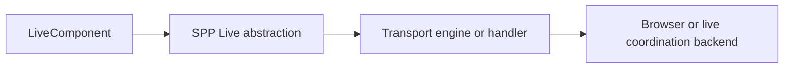
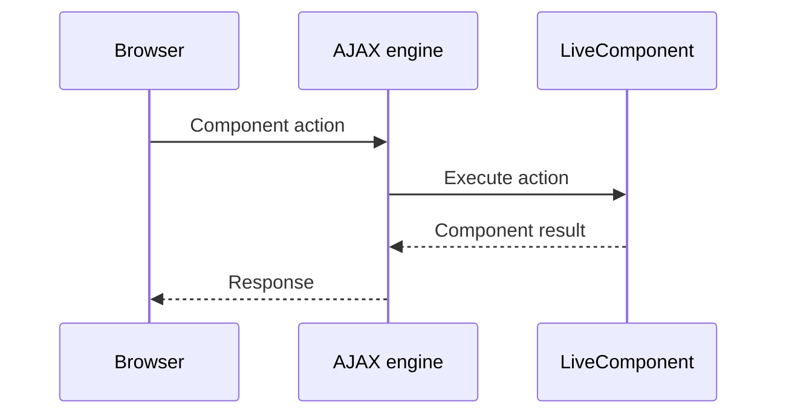
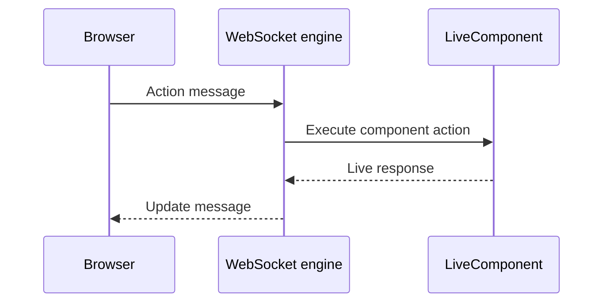
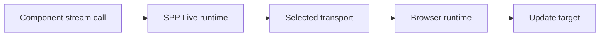
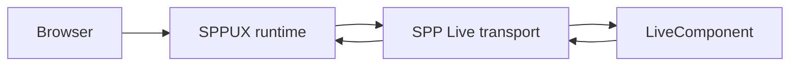
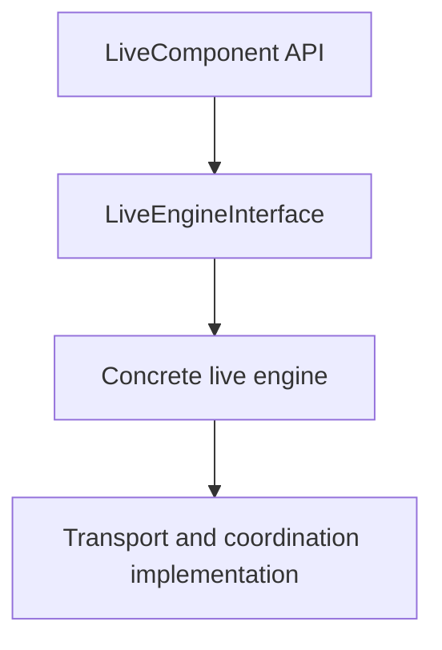

# Volume VI — Live Runtime

## Chapter 8 — SPP Live: Transport and Runtime Engines

**Evidence:** `spp/modules/spp/spplive/`, especially `LiveEngineInterface.php`, `AjaxFallbackEngine.php`, `SqliteLiveEngine.php`, `RedisLiveEngine.php`, `SSEHandler.php`, `WebsocketLiveEngine.php`, `class.spplive.php`, `class.liveemitter.php`.

If LiveComponent is the PHP object that represents interactive server-side UI, you can think of **SPP Live** as the machinery that carries those interactions between the browser and the server.

This distinction is important.

A component should not need to rewrite its business logic depending on whether the deployment uses AJAX, Server-Sent Events, WebSockets, or another coordination mechanism.

That is the reason SPP has a separate `spplive` subsystem.

---

## 8.1 What is a transport?

A transport is simply a mechanism for moving information from one side of a system to another.

For a LiveComponent interaction, information needs to move between:

```text
Browser
   ↕
SPP Live runtime
   ↕
LiveComponent
```

The browser might send an action, the PHP component might execute it, and the runtime might send back updated component information.

The transport determines **how that communication happens**.

---

## 8.2 Why not put transport code inside LiveComponent?

Suppose a component directly opened a WebSocket connection.

Then every component would need to understand:

- WebSocket connection handling;
- reconnect behavior;
- message framing;
- server-side coordination;
- fallback behavior.

That would make application components dependent on infrastructure details.

SPP instead separates the concerns:



This is a classic separation-of-concerns boundary, and it is implemented in the source through `LiveEngineInterface` and the concrete engine classes.

---

## 8.3 The transport abstraction

`LiveEngineInterface` defines the contract used by live engines.

The repository contains concrete implementations including:

- `AjaxFallbackEngine`;
- `SqliteLiveEngine`;
- `RedisLiveEngine`; and
- `WebsocketLiveEngine`.

The module also contains `SSEHandler` and `UploadHandler` components.

The important beginner interpretation is:

> **These are implementation choices behind the Live runtime, not different LiveComponent programming models.**

---

## 8.4 AJAX fallback

`AjaxFallbackEngine` provides a non-persistent request/response path.

This is important because a live component system should not require every deployment to operate a WebSocket server.

A simplified interaction is:



This is the simplest transport model: one request, one server execution, one response.

---

## 8.5 What the AJAX engine does not mean

“Fallback” does not mean “fake”.

It is a real execution path and can be useful when:

- infrastructure does not support persistent connections;
- deployment simplicity matters more than continuous connections;
- a component only needs ordinary request/response interactions.

It may have different performance characteristics from a persistent transport, but the component programming model can remain the same.

---

## 8.6 Server-Sent Events

`SSEHandler` provides a server-sent-event path.

SSE is designed for **one-way server-to-browser streaming**.

That makes it useful for output that the server progressively produces, such as:

- progress information;
- incremental generated text;
- live feed updates.

The client can receive events as they arrive without requiring each piece of output to be a completely independent browser navigation.

The exact SPP SSE message lifecycle must be learned from `SSEHandler` and the related frontend runtime rather than from a generic SSE example alone.

---

## 8.7 WebSocket engine

`WebsocketLiveEngine` provides the WebSocket-oriented path.

WebSockets differ from ordinary HTTP because the connection can remain open and support bidirectional communication.

That makes them useful for interfaces where both sides need frequent interaction.

Conceptually:



The important architectural boundary remains the same: the component does not need to know the details of the socket transport.

---

## 8.8 Redis and SQLite engines

The source contains both `RedisLiveEngine` and `SqliteLiveEngine`.

These should not be described simply as “two versions of WebSocket”. Their implementations represent different ways of coordinating/storing live runtime information.

The key lesson is:

> **SPP Live is not hard-coded around one in-memory state mechanism.**

This matters in deployments with multiple workers or different infrastructure constraints.

The exact coordination semantics, keys, serialization format, expiration behavior, and failure handling belong to the individual engine implementations.

The handbook deliberately does not invent equivalence between Redis and SQLite just because both are present.

---

## 8.9 Upload handling

The `spplive` module also contains an `UploadHandler`.

This tells us file uploads are considered part of the live runtime boundary rather than something the component layer must reinvent for every application.

File uploads deserve their own operational/security treatment because they introduce additional concerns:

- file size;
- content validation;
- storage location;
- authorization;
- cleanup;
- failed uploads.

Those details should be documented from the actual `UploadHandler` implementation and configuration rather than inferred from the class name.

---

## 8.10 LiveEmitter and compatibility

The module includes `LiveEmitter`, which is used by the older `LiveComponent::emit()` family.

The current LiveComponent API prefers `dispatch()`.

Therefore:

| API | Status |
|---|---|
| `dispatch()` | Current LiveComponent event-dispatch API |
| `emit()` | Deprecated compatibility API |
| `emitUp()` | Deprecated compatibility API |
| `emitTo()` | Deprecated compatibility API |
| `LiveEmitter` | Compatibility implementation |

A new application should prefer the current API documented by the current source rather than building new code around deprecated compatibility methods.

---

## 8.11 Transport choice is a deployment decision

A beginner may ask:

> “Which engine should I always use?”

There is no source-supported answer of “always use X”.

The correct choice depends on:

- connection model;
- deployment topology;
- number of workers;
- shared-state requirements;
- proxy/load-balancer behavior;
- operational tooling;
- failure/reconnect expectations.

The architecture therefore separates **component code** from **transport configuration**.

---

## 8.12 What happens when multiple workers are involved?

This is an enterprise question.

Imagine two PHP workers:

```text
Worker A
Worker B
```

A subsequent request from the same browser might reach either one.

If live state exists only inside Worker A's local memory, Worker B cannot automatically see it.

This is exactly why shared coordination engines become important in distributed deployments.

The presence of Redis/SQLite engine implementations is evidence that SPP has thought about this problem, but the exact guarantees must be read from the chosen engine implementation.

Do not turn the existence of Redis support into an unsupported claim that every LiveComponent is automatically horizontally scalable under every configuration.

---

## 8.13 Transport versus application state

It is useful to separate:

| Thing | Responsibility |
|---|---|
| LiveComponent state | PHP component state and lifecycle |
| SPP Live transport | Moving live interactions/results |
| Shared backend | Coordination/state support used by a specific engine |
| SPPUX | Client-side runtime behavior |

This distinction prevents many architectural misunderstandings.

---

## 8.14 How streaming fits into the stack

LiveComponent can call `stream()`.

That creates a payload describing a target, content, and whether the content should be appended or replaced.

The Live transport then becomes responsible for carrying that output to the browser.

Conceptually:



The component creates the content; the transport carries it; the client runtime applies it.

---

## 8.15 LiveComponent and SPPUX are not the same layer

A beginner may see both systems changing the UI and conclude they are duplicates.

They are not.

### LiveComponent

Runs in PHP and owns server-side component state/behavior.

### SPP Live

Carries live interaction and output between the PHP runtime and the browser.

### SPPUX

Runs in JavaScript and provides client-side state, scheduling, template handling, events, and DOM reconciliation.

The combined architecture is:



Not every interaction must use every layer equally. The exact path depends on the component and transport implementation.

---

## 8.16 Operational checklist

Before deploying a LiveComponent-heavy application, answer these questions:

### Connection

Does the chosen environment support the required transport?

### State

Where does the selected engine keep or coordinate live state?

### Scaling

What happens when the browser's next interaction reaches a different worker?

### Proxy

Do reverse proxies/load balancers preserve the connection behavior required by the engine?

### Uploads

Where do temporary files live, and how are they cleaned up?

### Failure

What does the engine do when Redis, SQLite, WebSocket, or the client connection fails?

These should be answered from the actual deployment configuration and engine source.

---

## 8.17 Coming from other frameworks

### Livewire

The key conceptual similarity is server-driven UI. SPP's major distinction here is that its LiveComponent model sits above a separate SPP Live transport subsystem.

### Phoenix LiveView

The separation between server component and transport/runtime will feel familiar, but the underlying implementation and PHP APIs are different.

### SignalR / Blazor Server

Think of SPP Live as the runtime transport layer that lets a server-side component interact continuously with a browser.

### React/Vue

Those frameworks are primarily client-side runtimes. SPP Live is concerned with transporting server-side component interaction/output.

---

## 8.18 Common beginner mistakes

### Mistake 1 — Putting WebSocket logic into the component

Transport infrastructure belongs in the Live runtime.

### Mistake 2 — Assuming AJAX means “not reactive”

A non-persistent transport can still carry reactive component interactions.

### Mistake 3 — Assuming Redis means automatic distributed scaling

The engine implementation and deployment topology determine the real guarantees.

### Mistake 4 — Treating SSE and WebSocket as identical

They have different connection and communication characteristics.

### Mistake 5 — Confusing SPP Live with SPPUX

One is primarily the server/live transport layer; the other is the browser-side runtime.

---

## 8.19 Kernel Hacker: the transport boundary

The most important internal boundary is:



That interface-level boundary is what allows SPP to provide multiple live engines without requiring the component base class to be rewritten for every deployment transport.

The deep-dive reference chapters should inspect each concrete implementation before making claims about:

- message serialization;
- connection ownership;
- worker coordination;
- persistence;
- retry/reconnect behavior;
- timeout behavior; and
- failure recovery.

### Source map

- `spp/modules/spp/spplive/LiveEngineInterface.php`
- `spp/modules/spp/spplive/AjaxFallbackEngine.php`
- `spp/modules/spp/spplive/SqliteLiveEngine.php`
- `spp/modules/spp/spplive/RedisLiveEngine.php`
- `spp/modules/spp/spplive/WebsocketLiveEngine.php`
- `spp/modules/spp/spplive/SSEHandler.php`
- `spp/modules/spp/spplive/UploadHandler.php`
- `spp/modules/spp/spplive/class.spplive.php`
- `spp/modules/spp/spplive/class.liveemitter.php`
