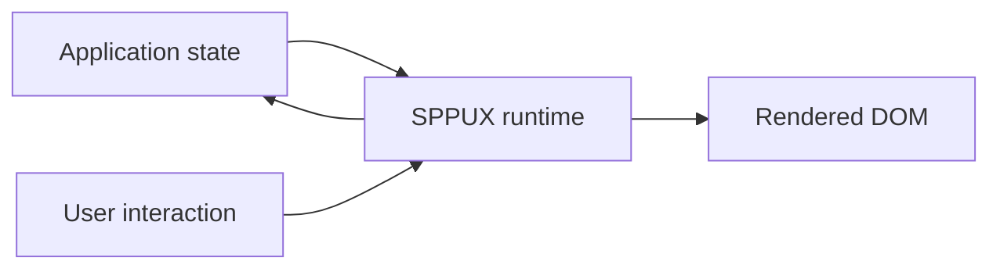
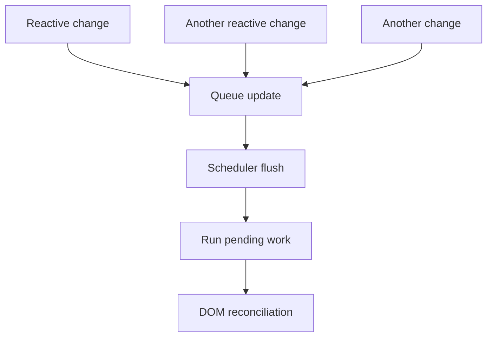
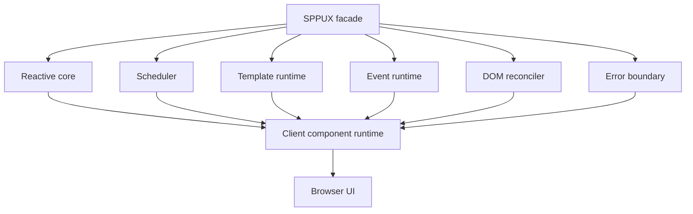

# Volume VII — Client Runtime

## Chapter 9 — SPPUX: The Browser-Side Reactive Runtime

**Evidence:** `spp/modules/spp/drishyam/js/sppux.js`, `spp/modules/spp/drishyam/js/core/`, `spp/modules/spp/drishyam/js/sppux-bridge.js`, `spp/modules/spp/drishyam/js/sppux-grid.js`, `spp/modules/spp/drishyam/js/sppux-ui.js`, `spp/res/js/sppux.js`, `spp/res/js/sppux.standalone.js`, SPPUX tests and type definitions.

If you have only written PHP, it is easy to think the browser is simply a screen that displays the HTML your server sends.

In a modern interactive application, the browser does more work. It may:

- remember temporary UI state;
- respond immediately to user input;
- update part of a page without replacing the whole page;
- listen for browser events;
- create or remove DOM nodes; and
- coordinate asynchronous updates.

That is the job of a **client-side runtime**.

SPP includes one: **SPPUX**.

SPPUX is not merely a widget library. The current source implements a modular browser runtime for reactive state, scheduling, templates, events, DOM reconciliation, error boundaries, and integration with SPP's live environment.

---

## 9.1 Why does SPP need a client runtime?

Consider a search box.

The user types:

```text
A
An
Anita
Anita K
```

If every keystroke required the browser to replace the entire page, the application would feel slow and wasteful.

A client runtime can keep a small piece of browser state and update only the relevant UI.

That does **not** mean the client now owns all application business logic.

In SPP there are two important reactive environments:

| Runtime | Language | Main responsibility |
|---|---|---|
| LiveComponent | PHP | Server-side component state and business interaction |
| SPPUX | JavaScript | Browser-side state, scheduling, rendering, and DOM updates |

They can cooperate, but they are not the same runtime.

---

## 9.2 The SPPUX mental model

If you have never used React, Vue, or another client framework, think of SPPUX as a **small browser application runtime**.

It provides the machinery between JavaScript application state and the browser DOM.

Conceptually:



The runtime decides when state changes should cause effects, how updates are scheduled, how templates are represented, and how the DOM is reconciled.

---

## 9.3 What is a reactive value?

A normal JavaScript variable is passive:

```js
let count = 0;
count = 1;
```

Changing it does not automatically tell the browser what should be updated.

A **reactive value** carries behavior that allows the runtime to know when something has changed and what work should happen afterward.

SPPUX provides primitives including:

- `Signal`;
- `Computed`;
- `effect`;
- `batch`;
- `createStore`; and
- `SPPStore`.

These form the foundation of the client-side reactive layer.

---

## 9.4 Signals

A signal represents reactive state.

The detailed implementation should be learned from `core/reactive.js`, but the beginner mental model is:

```text
Signal
   = a value + reactive update semantics
```

If component code reads the value and later changes it, the runtime can coordinate effects that depend on that reactive state.

This is different from a plain global JavaScript variable because the runtime knows the value participates in reactive execution.

---

## 9.5 Computed values

A computed value is derived from other state.

For example:

```text
quantity = 2
price = 50

subtotal = quantity × price
```

You do not necessarily need to store `subtotal` separately if the runtime can derive it.

SPPUX includes a client-side `Computed` primitive.

Do not confuse it with LiveComponent's PHP `Computed` attribute. The two concepts are analogous but live in different runtimes.

---

## 9.6 Effects

An effect represents work that should react to changes in reactive state.

The beginner model is:


The exact dependency tracking and execution behavior comes from `core/reactive.js` and `core/scheduler.js`.

The handbook will not assume a React/Vue-specific effect model where the SPPUX source does not establish one.

---

## 9.7 Batching

Suppose three related reactive values change during one operation.

Updating the DOM three separate times may be unnecessary.

SPPUX provides batching through `batch`, `startBatch`, and `endBatch`, along with scheduler controls.

The conceptual goal is:

```text
Several state changes
      ↓
One scheduled update cycle
```

This is an important browser-performance technique.

---

## 9.8 The SPPUX scheduler

`core/scheduler.js` implements the asynchronous update queue.

The public facade re-exports functions including:

- `enqueue`;
- `flush`;
- `forceFlush`;
- `startBatch`; and
- `endBatch`.

A beginner can think of the scheduler as the runtime's **traffic controller for updates**.

State changes can happen at one time, while the actual DOM/effect work is coordinated by the scheduler.

---

## 9.9 Why scheduling is a separate module

Without a scheduler, every reactive state change could immediately trigger rendering work.

Separating scheduling from state makes the runtime easier to optimize:



The exact queue implementation is in `core/scheduler.js`.

---

## 9.10 Templates in SPPUX

The runtime exports `html` and `Fragment` from `core/template.js`.

This lets client components describe UI using tagged-template syntax rather than manually constructing every DOM node.

The same module also deals with concepts such as:

- `TrustedHTML`;
- fragments; and
- pending event handlers.

The important beginner idea is:

> A template is a representation of UI; the runtime decides how that representation becomes DOM updates.

---

## 9.11 Why not just use `innerHTML` everywhere?

A simple browser program can do:

```js
element.innerHTML = '<h1>Hello</h1>';
```

But replacing an entire region every time makes it easy to lose:

- existing DOM state;
- event handlers;
- focus/selection state;
- unchanged nodes;
- efficient keyed list structure.

A reconciliation runtime can instead compare the desired representation to the current DOM and apply appropriate changes.

---

## 9.12 The DOM reconciler

SPPUX contains `core/reconciler.js`.

It exports mechanisms including:

- `reconcileDOM`;
- `patchAttributes`; and
- `longestIncreasingSubsequence`.

This establishes that SPPUX has an explicit DOM-reconciliation layer rather than relying only on full HTML replacement.

The longest-increasing-subsequence helper is particularly relevant to keyed child ordering, where preserving existing DOM nodes can be more efficient than rebuilding an entire list.

The exact reconciliation behavior should be learned from the implementation before making stronger complexity claims.

---

## 9.13 Event handling in SPPUX

Browser applications need events such as:

- clicks;
- input changes;
- keyboard actions;
- pointer events.

SPPUX provides a dedicated `core/events.js` module.

The public facade exposes operations including:

```text
registerHandler
removeHandler
removeAllHandlers
initDelegation
```

This is a client-side event system.

It is **not** the same thing as PHP's `SPPEvent` dispatcher.

---

## 9.14 Event delegation

Event delegation means the runtime can manage events centrally rather than attaching an independent browser listener object to every possible DOM node.

The architecture can be thought of as:


The actual handler registry and delegation behavior live in `core/events.js`.

---

## 9.15 BaseComponent

The SPPUX facade provides a `BaseComponent` abstraction.

That tells us the runtime has a client-side component model rather than being just a bag of helper functions.

A client component can therefore combine:

- state;
- templates;
- event handling;
- lifecycle behavior;
- DOM updates.

The repository also includes public type definitions such as `sppux.d.ts`, which are useful when writing editor-friendly TypeScript/JavaScript integrations.

---

## 9.16 Error boundaries

Client-side code can fail.

Without isolation, one JavaScript exception can destabilize a large portion of an interface.

SPPUX contains `core/error-boundary.js`, including:

- `ErrorBoundaryMixin`; and
- `findNearestErrorBoundary`.

This makes error isolation an explicit part of the client runtime architecture.

A beginner can think of an error boundary as:

> **A defined place where client-side component failure can be caught and handled instead of automatically taking down the entire UI.**

The exact propagation/selection algorithm belongs to the error-boundary implementation.

---

## 9.17 SPPUX and LiveComponent: two reactive worlds

This distinction is essential.

### LiveComponent

PHP-side state and behavior.

### SPPUX

JavaScript-side state and behavior.

Conceptually:


The bridge does not mean both runtimes suddenly become one shared object graph.

They remain separate execution environments connected by explicit integration points.

---

## 9.18 The SPPUX bridge

The Drishyam JavaScript tree contains `sppux-bridge.js`.

This bridge is an architectural seam between the client runtime and SPP's broader live/server environment.

The handbook treats the bridge as its own contract because the source does not justify the blanket statement:

> “Every SPPUX event is automatically a kernel SPPEvent.”

That would conflate client events with server event dispatch.

---

## 9.19 Standalone SPPUX

The repository contains:

```text
spp/res/js/sppux.standalone.js
```

This indicates a distribution path intended to operate independently of the full integrated framework boot path.

That is useful for applications where the client runtime is needed without loading the entire server framework into the page.

The exact standalone bootstrap/public API must be documented from the standalone implementation rather than assumed to be identical to every integrated SPP deployment.

---

## 9.20 Grid and UI layers

SPPUX also has higher-level modules such as:

- `sppux-grid.js`; and
- `sppux-ui.js`.

These should be understood **after** learning the reactive core.

A grid widget is a consumer of the runtime. The runtime itself provides the underlying state, scheduling, templates, events, reconciliation, and error-handling machinery.

---

## 9.21 A small conceptual client component

A beginner can think about a client component like this:

```text
State
  ↓
Template
  ↓
SPPUX runtime
  ↓
DOM
```

When the state changes:

```text
State change
  ↓
Scheduler
  ↓
Reconciliation
  ↓
Changed DOM
```

These are mental models, not promises about one exact internal function call. The implementation is the authority for the precise algorithm.

---

## 9.22 SPPUX compared with React/Vue

| Concern | React/Vue | SPPUX |
|---|---|---|
| Client reactive state | Yes | Yes |
| Scheduler/batching | Yes | Yes |
| Declarative templates | JSX/template systems | `html` tagged templates |
| Event runtime | Framework runtime | Dedicated `core/events.js` |
| DOM reconciliation | Yes | Dedicated reconciler |
| Error boundaries | Framework-specific | Dedicated module |
| SPP server integration | External/framework-specific | SPP Live bridge |

These are conceptual comparisons, not claims of API compatibility.

---

## 9.23 Coming from other frameworks

### React

Think of `Signal`/`Computed`/`effect` as reactive primitives, but learn the SPPUX scheduling and template semantics instead of assuming React's hooks model.

### Vue

The reactive-state idea will feel familiar, but SPPUX has its own scheduler, template representation, event registry, and reconciler.

### Alpine.js

SPPUX is more of a runtime/component system than a lightweight attribute-only enhancement layer.

### Vanilla JavaScript

The biggest change is that the runtime gives you reusable state, rendering, event, and DOM-reconciliation infrastructure instead of making every feature manage DOM manually.

---

## 9.24 Common beginner mistakes

### Mistake 1 — Treating SPPUX as a widget library

The source clearly contains a runtime core.

### Mistake 2 — Putting all application state into the browser

Server-side business state still belongs to the server-side application/LiveComponent layer when the architecture requires it.

### Mistake 3 — Assuming SPPUX state and LiveComponent state are automatically identical

They are separate runtimes connected through explicit integration.

### Mistake 4 — Manually changing the DOM everywhere

That bypasses the reactive/reconciliation model the runtime is designed to provide.

### Mistake 5 — Treating browser events as PHP kernel events

Client event handling and server event dispatch are different subsystems.

---

## 9.25 Kernel Hacker: runtime composition

The primary `sppux.js` facade imports the core runtime modules:

- `core/reactive.js`;
- `core/scheduler.js`;
- `core/template.js`;
- `core/events.js`;
- `core/reconciler.js`; and
- `core/error-boundary.js`.

This makes the architecture explicit:



The current source also exposes standalone/integrated distribution paths and higher-level UI/grid modules. The deep implementation chapters should trace signal dependencies, scheduler queues, template representation, pending handlers, reconciliation operations, and error-boundary traversal directly from those source modules.

### Source map

- `spp/modules/spp/drishyam/js/sppux.js`
- `spp/modules/spp/drishyam/js/core/reactive.js`
- `spp/modules/spp/drishyam/js/core/scheduler.js`
- `spp/modules/spp/drishyam/js/core/template.js`
- `spp/modules/spp/drishyam/js/core/events.js`
- `spp/modules/spp/drishyam/js/core/reconciler.js`
- `spp/modules/spp/drishyam/js/core/error-boundary.js`
- `spp/modules/spp/drishyam/js/sppux-bridge.js`
- `spp/modules/spp/drishyam/js/sppux-grid.js`
- `spp/modules/spp/drishyam/js/sppux-ui.js`
- `spp/res/js/sppux.js`
- `spp/res/js/sppux.standalone.js`
