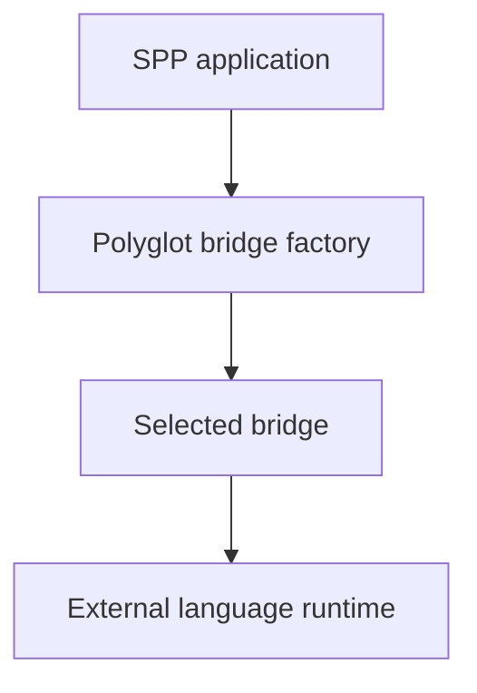
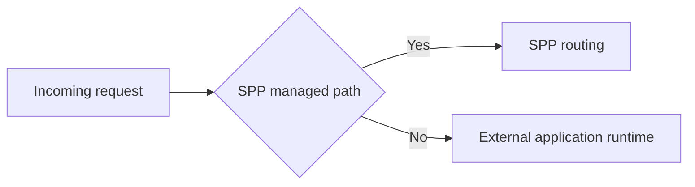
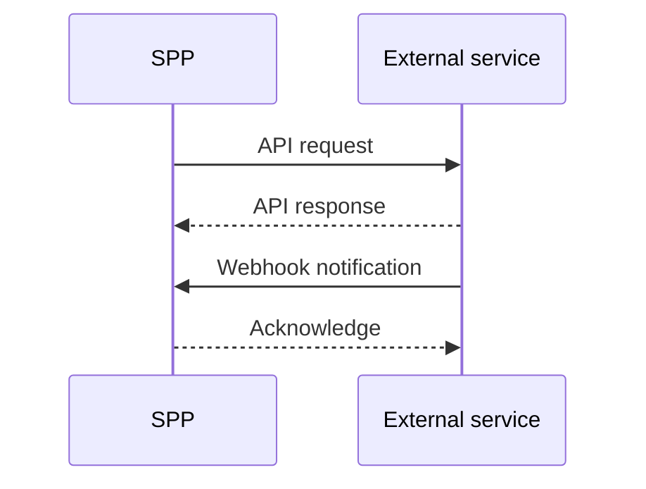
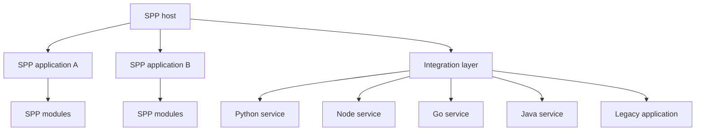

# Volume VIII — Integration Architecture

## Chapter 10 — Polyglot Bridges and External Application Integration

**Evidence:** `spp/core/Polyglot/`, `spp/services/`, `spp/lib/polyglot/`, `spp/lib/python/`, `spp/lib/node/`, `spp/lib/go/`, `spp/lib/java/`, `spp/lib/dotnet/`, `spp/modules/contrib/`, `spp/docs/tutorials/integrating_external_apps.md`, and the repository's integration/CLI commands.

A serious enterprise system rarely lives entirely inside one PHP codebase.

You may already have:

- a Python machine-learning service;
- a Node.js notification service;
- a Java enterprise application;
- a .NET service;
- a Go worker;
- a legacy Drupal installation; or
- another SPP application.

If you have never studied software architecture, the important concept to learn first is **process/runtime boundaries**.

PHP code runs inside a PHP runtime. Python code runs inside a Python runtime. A legacy application may have its own request lifecycle. These systems do not magically share PHP objects just because they run on the same server.

They need an **integration boundary**.

SPP contains explicit infrastructure for several kinds of such boundaries.

---

## 10.1 What is a polyglot application?

“Polyglot” in software architecture means **using more than one programming language/runtime because different parts of the system need different capabilities**.

For example:

```text
SPP/PHP
   ↓
Business application

Python
   ↓
Machine-learning service

Node.js
   ↓
Realtime/notification service

Go
   ↓
High-throughput worker
```

This is not the same thing as simply having multiple PHP classes.

Each external runtime is another execution environment.

---

## 10.2 Why would an SPP application call another runtime?

Possible reasons include:

- an existing service is already implemented in another language;
- a library is substantially stronger in another ecosystem;
- a workload needs a different runtime model;
- a team owns a service independently;
- a legacy application must remain operational;
- a specialized worker should be deployed separately.

The architectural goal is not “use every language”.

The goal is:

> **Give each subsystem the runtime that solves its problem while keeping integration explicit and controlled.**

---

## 10.3 Integration is not one thing

Before learning SPP's polyglot subsystem, separate these concepts:

| Integration type | What crosses the boundary |
|---|---|
| Library call | Code inside the same process/runtime |
| HTTP/API | Network request/response |
| Webhook | Event-like HTTP notification into another service |
| Process bridge | Explicit invocation of another runtime/process |
| External-app routing | Requests delegated to another application |
| Shared datastore | Data exchanged through storage rather than direct invocation |

Do not call all of these “IPC”.

**IPC (inter-process communication)** is a useful architectural term, but an HTTP API, a webhook, a Redis queue, and a local process invocation are different protocols and should be documented as such.

---

## 10.4 SPP's polyglot bridge concept

The source contains a concrete bridge family under `SPP\Core\Polyglot`.

The core concepts include:

- `PolyglotBridgeInterface`;
- `PolyglotBridgeFactory`;
- `DefaultBridge`;
- `CompilerBridge`;
- `DotNetBridge`;
- `GoBridge`; and
- `JavaBridge`.

The factory/adapter structure can be understood as:



The value of the common interface is that application code can work through a stable abstraction while the concrete bridge knows how to interact with its target runtime.

---

## 10.5 What is an adapter?

An **adapter** is a piece of software that makes one system's interface usable through another system's expected interface.

Suppose your PHP application understands:

```text
invoke service
```

but the external runtime requires a completely different invocation protocol.

The bridge/adapter translates between those worlds.

That lets application code focus on the business intention rather than encoding the wire/process protocol in every controller.

---

## 10.6 What the factory does

A factory is responsible for choosing or creating an appropriate object.

In this architecture:


The application does not need a large `if/else` statement containing every supported language/runtime.

That is the practical value of the factory abstraction.

The exact bridge-selection rules come from `PolyglotBridgeFactory` and should not be inferred from class names alone.

---

## 10.7 Runtime support in the repository

The repository contains language-specific assets and/or services for:

- C++;
- .NET;
- Go;
- Java;
- Node.js;
- Perl; and
- Python.

It also contains runtime helper libraries, daemon-service assets, and language-specific bridge artifacts.

This is important evidence, but we must interpret it carefully.

> **The presence of integration assets proves that integration support exists in the repository; it does not automatically prove that every language has identical feature parity or deployment semantics.**

Each concrete adapter needs its own source-level review before the handbook states its exact protocol.

---

## 10.8 Polyglot commands

The repository contains a CLI surface for polyglot operations including capabilities around bridge execution, workers, status, listing, asynchronous execution, and partial generation.

That makes polyglot integration part of the developer workflow rather than an undocumented experiment hidden in a library directory.

For new developers, the important progression is:

1. understand the bridge abstraction;
2. identify the concrete runtime you need;
3. inspect its invocation/serialization contract;
4. configure the runtime;
5. use the CLI/tools to validate the integration.

---

## 10.9 External applications are a different problem

A second integration problem is not “another language”; it is **another application**.

For example:

```text
SPP application
      +
Legacy Drupal application
```

The external application may have its own routing, session, templates, and database.

The repository contains an example of this model in the contributed `sppdrupal` module and the external-app integration tutorial.

The key architectural idea is:

> **An external application can remain an external application. You do not have to rewrite it as an SPP module merely to integrate it.**

---

## 10.10 External application routing

One supported pattern is routing a public URL path to an external application while allowing the SPP router to bypass that path as required.

Conceptually:



The exact path matching/bypass configuration belongs to the integration implementation and the application's web-server setup.

The important distinction is that this is **application integration**, not a polyglot bridge by itself.

---

## 10.11 External application adapters

A contributed module can also provide a PHP-side adapter around an external system.

This is useful when SPP needs to:

- call the external system;
- expose it through an SPP service;
- attach application-specific configuration;
- add authentication/authorization rules; or
- make an external system available to another SPP subsystem.

The adapter does not turn the external application into a normal SPP module. It creates an explicit integration boundary.

---

## 10.12 HTTP APIs and webhooks

The repository also contains controllers, API modules, webhook-related classes, and integration paths.

These represent protocol-based integration.

### API call

SPP actively requests something from another service.

### Webhook

Another system notifies SPP about an event.

Conceptually:



The exact message contract, authentication, signature validation, and retry behavior must be read from each actual integration.

---

## 10.13 Multi-application SPP versus external applications

These concepts are easy to confuse.

### Multiple SPP applications

The same SPP runtime can register several `App` objects and switch the active Scheduler context.

### External application

The other application has its own runtime and remains outside the SPP application object model.

Therefore:

| Scenario | Primary SPP mechanism |
|---|---|
| Several SPP apps in one runtime | Scheduler/application contexts |
| Feature reuse within an app | Modules |
| Another language/runtime | Polyglot bridge/services |
| Another independent application | Integration/router/adapter |
| Networked service | API/webhook integration |

This distinction is fundamental to enterprise architecture.

---

## 10.14 The enterprise integration picture

A realistic SPP deployment might look like:



This diagram represents **verified building blocks that can be composed**. It does not assert that one universal transport automatically connects every node.

That qualification is important.

---

## 10.15 Keeping external systems out of the module tree

A common architectural mistake is to force every external dependency into the SPP module model.

A better decision process is:

### Is it actually an SPP feature?

Use a module.

### Is it another independent application?

Use an application integration boundary.

### Is it a specialized language/runtime service?

Use the appropriate polyglot bridge/service mechanism.

### Is it a generic network service?

Use an explicit API/integration client.

This keeps boundaries honest.

---

## 10.16 Security at integration boundaries

The moment information leaves one runtime/application, you have a trust boundary.

Do not assume:

> “It is inside our infrastructure, therefore it is trusted.”

The receiving system should have appropriate controls for the actual protocol, such as:

- authentication;
- authorization;
- input validation;
- payload/schema checks;
- signature validation where applicable;
- network controls;
- timeout/failure handling;
- audit logging.

Which of these are implemented by a specific SPP adapter must be established from that adapter's source.

The handbook does not claim a single universal “SPP integration security protocol”.

---

## 10.17 Correlation and observability

Enterprise integration becomes difficult to operate when one request crosses several systems and nobody can tell which operation belongs to which original request.

Where the source/transport implements correlation metadata, the handbook should preserve it and show how to trace it.

Where the implementation does not provide such propagation, the handbook should not invent it as a framework guarantee.

This is another example of the source-evidence rule.

---

## 10.18 Failure is part of integration design

A local PHP method call may fail because of a programming error.

A remote integration can fail because:

- the remote process is down;
- the network is unavailable;
- a timeout occurs;
- serialization fails;
- the remote service rejects the request;
- a schema changed;
- authentication expired.

The enterprise architecture therefore needs explicit failure handling.

The exact behavior—retries, exceptions, fallback, queueing, or logging—must be documented from the selected bridge/service implementation.

---

## 10.19 Why polyglot does not automatically mean microservices

These terms are often confused.

**Polyglot** means multiple languages/runtimes.

**Microservices** means independently deployable service boundaries with defined communication contracts and operational ownership.

You can build a polyglot monolith-adjacent system without using microservices.

You can also build a microservice architecture where every service uses the same language.

SPP's bridge subsystem provides integration building blocks; it does not, by itself, force one organizational architecture.

---

## 10.20 Coming from other ecosystems

### Laravel / PHP

Think of SPP's bridge/services as an explicit integration layer above ordinary PHP HTTP clients or process wrappers.

### Spring Boot

The adapter/factory idea will feel familiar. The key SPP-specific concern is the integration with Scheduler, Registry, modules, and SPP services.

### .NET

Think of a polyglot bridge as a boundary adapter, not as a class library reference inside PHP.

### Node.js

The browser/event-driven mindset may feel familiar, but an SPP bridge is crossing from PHP into another runtime, not merely calling another JavaScript module in the same process.

---

## 10.21 Common beginner mistakes

### Mistake 1 — Calling every cross-process call “IPC”

Name the actual protocol: HTTP, WebSocket, queue, local process invocation, etc.

### Mistake 2 — Assuming every language adapter behaves identically

Each bridge implementation must be inspected separately.

### Mistake 3 — Turning an external application into a module without reason

Keep an external application's own runtime when that boundary is useful.

### Mistake 4 — Trusting internal network traffic automatically

Integration boundaries require explicit security decisions.

### Mistake 5 — Mixing domain logic with bridge/protocol code

Keep the transport/adapter boundary separate from application business logic.

---

## 10.22 Kernel Hacker: bridge architecture

The core polyglot family is organized around an interface/factory plus concrete bridge implementations.

The deep-dive should trace:

1. factory selection;
2. bridge initialization;
3. payload serialization;
4. process/service invocation;
5. response decoding;
6. exception/error handling;
7. worker/daemon integration; and
8. cleanup/lifecycle behavior.

Only after those paths are traced should the handbook make language-specific claims.

The same principle applies to external applications: inspect the actual integration adapter, routing bypass, controller/API, or contributed module rather than describing a generic “SPP external app protocol”.

### Source map

- `spp/core/Polyglot/`
- `spp/services/`
- `spp/lib/polyglot/`
- `spp/lib/python/`
- `spp/lib/node/`
- `spp/lib/go/`
- `spp/lib/java/`
- `spp/lib/dotnet/`
- `spp/modules/contrib/`
- `spp/docs/tutorials/integrating_external_apps.md`
- polyglot/integration CLI commands
