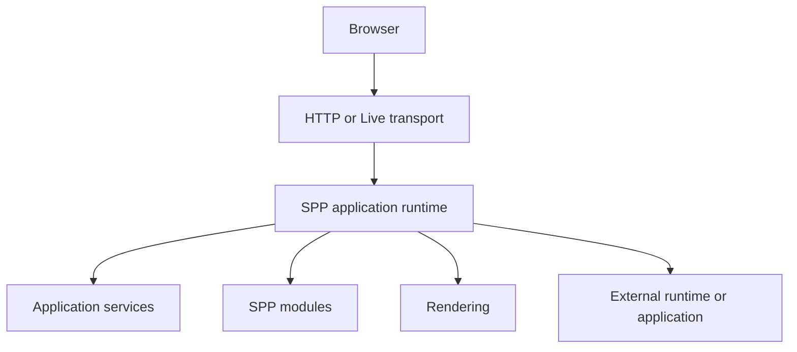
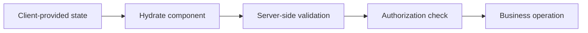

# Volume VIII — Security and Runtime Boundaries

## Chapter 10A — Security and Runtime Contracts

**Evidence:** SPP security/middleware implementations, `LiveComponent` state-signing code, SPPView rendering code, integration/polyglot implementations, and runtime contract classes.

Security becomes easier to understand when you stop thinking of it as “one security class”.

A real application has several different security questions:

- Who is the caller?
- Is the caller allowed to perform this operation?
- Can the input be trusted?
- Can the output safely be rendered?
- Can data cross into another runtime safely?
- Can browser-provided LiveComponent state be trusted?

These are different questions and therefore belong to different architectural boundaries.

---

## 10A.1 Authentication is not authorization

### Authentication

Authentication establishes identity.

> “Who are you?”

### Authorization

Authorization decides whether that identity can perform a specific action.

> “Are you allowed to do this?”

For example, a user may be authenticated but still not be allowed to edit another school's student record.

A global authentication middleware can establish identity, while application/domain logic still has to make resource-level authorization decisions.

---

## 10A.2 Validation is not authorization

Validation asks:

> “Is this input structurally acceptable?”

Authorization asks:

> “Is this caller allowed to perform this operation with this data?”

For example:

```text
email = valid email format
```

is validation.

```text
user A may edit student B
```

is authorization.

Keeping those concerns separate prevents security decisions from being hidden inside form validation.

---

## 10A.3 The trust-boundary mental model

A **trust boundary** is a point where information moves from one trust domain to another and therefore must be treated as untrusted until validated by the receiving side.

In an SPP deployment, useful boundaries include:



The diagram is an architectural model. It does not claim that every arrow is a separate network protocol.

The important rule is:

> **Every boundary must define what data it accepts and how that data is validated.**

---

## 10A.4 LiveComponent state is transport data, not authority

This is one of the most important security lessons in the handbook.

Suppose a component contains:

```php
public int $studentId;
```

The browser may send a value for that property during a later interaction.

Even if SPP protects the integrity of the component snapshot with state-signing/checksum mechanisms, your application must not interpret the value as proof that the user is authorized to access that student.

The correct model is:



Integrity protection and authorization solve different problems.

---

## 10A.5 Output rendering is also a trust boundary

SPPView ultimately renders application data into browser-facing output.

The important distinction is between:

- data that should be escaped; and
- content deliberately intended to be rendered as raw markup.

The BladeOne-compatible rendering stack means template authors need to understand the difference between escaped output and intentionally raw output.

A good application rule is:

> Treat externally supplied or user-controlled content as data until there is a specific reason to render it as markup.

The exact escaping/raw-output behavior must be taken from the current SPPBlade/renderer implementation rather than inferred from generic Blade documentation.

---

## 10A.6 Middleware is a security boundary

Middleware is appropriate for request-wide controls such as:

- authentication;
- CSRF validation;
- rate limiting;
- throttling;
- security headers;
- request logging.

The pipeline can stop a request before application code runs.

That gives security controls a predictable request-boundary position.

However, middleware should not be treated as the only place where authorization can exist. Business/resource authorization often belongs closer to the domain operation.

---

## 10A.7 Events can also affect security-sensitive execution

SPP events support priorities, before stages, overrides, propagation control, and event payload mutation.

That means an event handler can influence application behavior.

Security-sensitive event behavior therefore deserves the same care as controller/service code.

Do not assume:

> “It is only an event, so it cannot affect security.”

A high-priority event handler can influence what later code sees or whether propagation continues.

---

## 10A.8 Module boundaries and security

Modules are feature boundaries, but a module is not automatically a security boundary.

If an application has:

```text
student module
finance module
administration module
```

the fact that the files live in different modules does not by itself prevent one module's code from accessing another module's services.

Security must come from the actual authorization/runtime mechanisms implemented by the application and modules.

---

## 10A.9 Polyglot and external-application boundaries

Calling another runtime or application introduces another trust boundary.

For example:

```text
SPP PHP
   ↓
Python service
```

The Python service should not trust the request merely because it came from “another internal server”.

The integration should define the actual authentication, authorization, validation, and failure behavior for the protocol being used.

The same applies to external applications such as a legacy web application integrated under an SPP-managed URL path.

---

## 10A.10 Do not call every integration “IPC”

This vocabulary matters.

| Boundary | Example |
|---|---|
| HTTP API | Request/response over HTTP |
| Webhook | External system calls an SPP endpoint |
| WebSocket | Persistent bidirectional channel |
| Local process bridge | Explicit runtime/process invocation |
| Shared storage | Data exchanged through Redis/database/files |
| External application routing | Request delegated to another application |

They may all cross process boundaries, but their security and reliability models are different.

---

## 10A.11 Runtime contracts

SPP is made of multiple cooperating subsystems, so the interfaces between them are important.

Examples include:

| Contract boundary | Question |
|---|---|
| Scheduler → App | Which application is active? |
| App → Container | How are services resolved? |
| Module → Module compiler | What dependencies and metadata exist? |
| Event producer → listener | What event is being dispatched? |
| Handler → SPPView | How is presentation produced? |
| LiveComponent → SPP Live | How is live execution transported? |
| SPPUX → bridge | What client/server integration messages exist? |
| SPP → external runtime | What protocol crosses the boundary? |

The documentation rule is:

> **Document the actual interface and behavior implemented by the source, not the behavior suggested by a class name.**

---

## 10A.12 Source-driven security documentation

Security claims in this handbook follow a stricter evidence rule than ordinary architecture explanations.

The order of authority is:

1. executable security implementation;
2. tests/fixtures;
3. configuration used by the implementation;
4. existing framework documentation;
5. general enterprise security guidance.

A generic recommendation is not automatically an SPP feature.

For example, saying “SPP supports signed LiveComponent state” requires tracing the actual state-signing implementation. Saying “SPP should validate every external webhook” is a security recommendation unless the repository demonstrates a concrete webhook validation implementation.

---

## 10A.13 Security debugging

When investigating a suspicious request, ask these questions in order:

1. **Where did the data enter the system?**
2. **Which subsystem received it first?**
3. **Was it validated?**
4. **Was the caller authenticated?**
5. **Was authorization checked for this exact operation?**
6. **Did middleware modify/reject the request?**
7. **Did an event handler alter the execution path?**
8. **Did the data cross into another runtime/application?**
9. **Was the output escaped appropriately?**

This is much more useful than simply searching the repository for a class named `Security`.

---

## 10A.14 Coming from other frameworks

### Laravel

Think of middleware, policies/gates, validation, Blade escaping, and Livewire state as separate concerns. SPP follows the same broad separation, but its concrete subsystems are different.

### Symfony

Think of security/firewall, validators, and event subscribers as separate mechanisms; do not collapse them into the SPP event system or Registry.

### Spring Security

The request-boundary security mindset is useful, but SPP's exact authentication/authorization architecture depends on the modules and implementations actually enabled by the application.

### React/Vue

Client-side validation can improve user experience, but it is not a security boundary. Server-side PHP code remains authoritative for sensitive operations.

---

## 10A.15 Kernel Hacker: boundary-first design

The highest-value security principle for an SPP architect is **boundary-first reasoning**.

For every piece of data, identify:

```text
Source
  ↓
Transport
  ↓
Receiver
  ↓
Validation
  ↓
Authorization
  ↓
Business operation
  ↓
Output
```

When the data crosses into another runtime, application, worker, or browser context, re-establish the trust assumptions instead of carrying them forward automatically.

### Source map

- SPP middleware/security implementations
- `spp/modules/spp/sppview/class.livecomponent.php`
- LiveComponent state-signing/checksum code
- SPPView/Drishyam rendering implementations
- `spp/core/Polyglot/`
- external-application integration modules/tutorials
