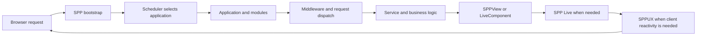

# Volume IX — Hands-On Learning Path

## Chapter 11 — The Total-Nerd Tutorial Roadmap

This chapter is the map for the handbook's hands-on tutorial.

The intended reader is unusually important:

> **You may know a programming language, but you may have no idea what a framework is, why frameworks exist, or why a large application needs concepts such as routing, dependency injection, modules, middleware, events, or reactive components.**

The tutorial therefore does not begin by saying “run this framework command”. It begins by showing the problem that the command solves.

---

## 11.1 What you will build

We will build one small enterprise-style application and evolve it through four stages.

The same business problem is used repeatedly so the reader can compare architectures instead of learning four unrelated examples.

The stages are:

1. **Plain PHP** — understand what the application has to do without a framework.
2. **SPP application** — replace repeated infrastructure with SPP runtime facilities.
3. **LiveComponent application** — make selected UI regions server-reactive.
4. **SPPUX-enhanced application** — add browser-side reactivity where it genuinely helps.

The application will remain intentionally small enough to understand while still containing real engineering concerns.

---

## 11.2 The tutorial domain

The working example will be a **Student Operations Portal**.

It will contain:

- students;
- search/filtering;
- a student details view;
- validation;
- an audit trail;
- a report/export action; and
- an external-service integration point.

The domain is deliberately ordinary. The purpose is to expose framework architecture, not to hide the framework behind a toy calculator.

---

## 11.3 Stage 0 — What happens without a framework?

Before writing SPP code, build the simplest possible PHP version.

The reader will create:

```text
public entry point
configuration
request parsing
manual service creation
manual validation
manual rendering
manual persistence boundary
```

The goal is to experience the repetition a framework is designed to reduce.

For example, plain PHP quickly leads to code that must repeatedly answer:

```text
Where is configuration?
How do I locate a service?
Which code handles this URL?
How do I validate input?
How do I render the response?
How do other features learn that something happened?
```

At the end of Stage 0, the reader should be able to say:

> “Now I understand why frameworks exist.”

---

## 11.4 Stage 1 — Turn the application into an SPP application

The same application is then moved into the SPP runtime model.

The reader learns, in order:

### Application identity

Create the application's `app.yml` and understand `base_url`, source/configuration paths, and application initialization.

### Scheduler context

Understand why SPP can host multiple `App` objects and how the Scheduler decides which application is active.

### Configuration

Move configuration into SPP's supported application configuration model.

### Container

Move manual `new` chains into application/container resolution where appropriate.

### Routing/request dispatch

Let the framework map request handling to the correct application code.

### Middleware

Move cross-cutting request checks into the middleware pipeline.

### Events

Replace selected direct coupling with SPP event listeners.

### Modules

Move a cohesive feature into an application-local module when its ownership boundary justifies the extra structure.

### Views

Move HTML generation into SPPView/Blade-compatible rendering.

At the end of Stage 1, the application should behave like the Stage 0 application but have a much clearer infrastructure boundary.

---

## 11.5 Stage 2 — Introduce LiveComponent only where needed

Do not convert the entire application into LiveComponent.

Choose one genuinely interactive region, such as:

```text
student search + filter table
```

Then perform the migration in small steps:

1. render the normal server-side version;
2. identify the state that changes during interaction;
3. move that state into a LiveComponent public property;
4. move the interaction into a component action;
5. add validation where necessary;
6. render the component through SPPView;
7. connect the appropriate SPP Live transport;
8. test initial rendering and later interactions separately.

This makes the architectural change visible.

---

## 11.6 Stage 3 — Add SPPUX where browser-local behavior helps

The next question is:

> “Does this part of the UI need server-side authority every time the user moves the mouse or changes a local visual state?”

If the answer is no, SPPUX may be appropriate.

Examples of browser-local behavior could include:

- local interaction state;
- immediate UI feedback;
- client-side display behavior;
- DOM updates that do not require a server decision.

The tutorial will keep the distinction explicit:

```text
Server authority
    → PHP / LiveComponent

Browser-local behavior
    → SPPUX

Communication between them
    → SPP Live / bridge
```

This prevents the common mistake of moving all business logic into JavaScript just because a UI is reactive.

---

## 11.7 The same use case across all four stages

The tutorial will repeatedly show the same student-search interaction.

| Stage | Where state lives | Who decides business rules | How UI updates |
|---|---|---|---|
| Plain PHP | Request variables | PHP code | Full response |
| SPP | App/service state | PHP services | SPPView response |
| LiveComponent | Component public state | PHP component/services | Live transport + component render |
| SPPUX-enhanced | Mixed server/client state | Server for authoritative rules, client for local UI | SPPUX + SPP Live where needed |

This comparison is the central teaching device of the tutorial.

---

## 11.8 Enterprise engineering constraints

The final application is not merely a demo page.

The tutorial will show how to think about:

### Boundaries

Which module owns which behavior?

### Configuration

Which values belong in application configuration rather than code?

### Security

Which values came from the browser and therefore require validation/authorization?

### Failure

What happens if a database, external service, or live transport fails?

### Observability

How do we determine which layer failed?

### Testing

Where should the application place unit, integration, component, and transport tests?

### Deployment

Which runtime processes, caches, workers, external services, and browser assets must exist in production?

The tutorial will introduce these concerns at the point where they become relevant instead of dumping an enormous enterprise checklist on the reader at the beginning.

---

## 11.9 The tutorial's “why” rule

Every major framework step will answer four questions:

1. **What problem existed before this feature?**
2. **What SPP concept solves it?**
3. **What source class/API implements that concept?**
4. **What new complexity does the feature introduce?**

The fourth question is important.

Good architecture is not “add every framework feature”.

Good architecture is:

> **Use the smallest framework mechanism that solves the real problem while preserving a clear boundary.**

---

## 11.10 Tutorial source map

The hands-on tutorial will use the repository's existing implementation and project documentation as evidence, especially:

- `documentation/framework/application-development.md`;
- `documentation/framework/booting-and-app-loading.md`;
- `documentation/framework/middleware.md`;
- `spp/commands/MakeAppCommand.php`;
- `spp/core/class.app.php`;
- `spp/core/class.scheduler.php`;
- `spp/core/class.container.php`;
- `spp/core/class.registry.php`;
- `spp/core/class.sppevent.php`;
- `spp/core/class.modulecompiler.php`;
- `spp/modules/spp/sppview/`; and
- `spp/modules/spp/spplive/` / Drishyam SPPUX runtime.

When an example uses an exact command, class, attribute, configuration key, or directory convention, it will be checked against the current repository source before being treated as normative.

---

## 11.11 Framework-background sidebars

Each hands-on chapter will contain short migration notes for developers coming from:

- Laravel / Livewire;
- Symfony / Twig;
- Django;
- Spring Boot;
- ASP.NET Core;
- React / Vue; and
- Flutter.

These sidebars will answer:

> “What is the SPP equivalent of the concept I already know?”

They will not claim API compatibility.

---

## 11.12 Final tutorial outcome

By the end of the tutorial, the reader should be able to explain the complete path of a real SPP application in plain language:



More importantly, the reader should know **when not to use** each layer.

That is the real definition of understanding a framework.
