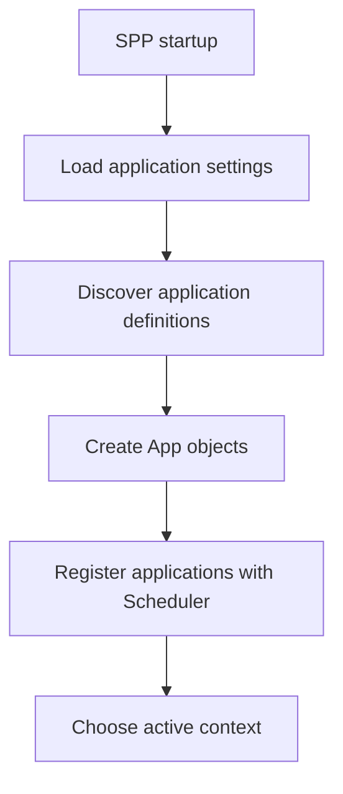
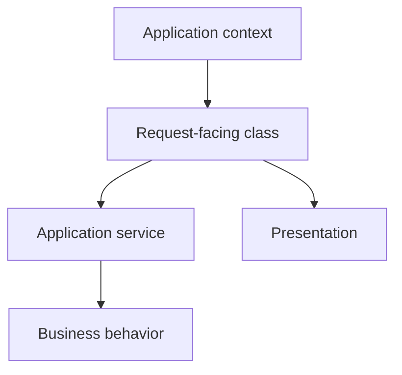
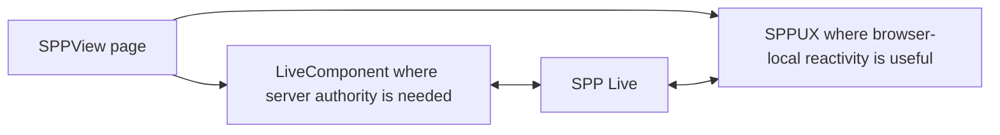

# Volume IX — Building Applications

## Chapter 12 — Your First SPP Application

**Evidence:** `documentation/framework/application-development.md`, `documentation/framework/booting-and-app-loading.md`, `spp/commands/MakeAppCommand.php`, `spp/core/class.app.php`, `spp/core/class.scheduler.php`, `spp/core/class.container.php`.

This chapter assumes something unusual:

> **You know programming, but you have never used a software framework.**

That means we will not start with an SPP command and tell you to trust it. First we will explain what the framework is doing for you, then we will build the smallest useful application, and then we will connect each file to the runtime architecture you have already learned.

---

## 12.1 What is an application?

At the programming-language level, an application can be as simple as a PHP file:

```php
<?php

echo 'Hello';
```

But a real web application needs much more than one script:

- configuration;
- URL handling;
- reusable code;
- input validation;
- security checks;
- database access;
- templates;
- logging;
- tests; and
- a way to organize growing features.

An **application framework** supplies infrastructure for those recurring problems so your application code can concentrate more on what the system actually does.

SPP adds another important idea: one runtime can contain multiple named `App` objects, with the Scheduler selecting the active application context.

---

## 12.2 What makes an SPP application different?

Think about a deployment like this:

```text
One SPP runtime
   ├── school application
   ├── reporting application
   └── administration application
```

Each application can have its own configuration, modules, services, views, and runtime directories.

The Scheduler answers:

> **Which application is active right now?**

The application object answers:

> **What configuration and services belong to that application?**

That is the first SPP concept you should understand before building anything.

---

## 12.3 The SPP building blocks you will use

| Building block | Beginner meaning |
|---|---|
| `App` | Runtime object representing one application |
| Scheduler | Chooses the active application context |
| Registry | Framework runtime data and metadata store |
| Container | Resolves services and dependencies |
| Module | Framework-recognized feature boundary |
| Middleware | Logic wrapped around request processing |
| Event | Extension point or runtime occurrence |
| SPPView | Server-side presentation layer |
| LiveComponent | Stateful PHP UI component |
| SPP Live | Live transport/runtime |
| SPPUX | Browser-side reactive runtime |

You do not have to use all of them in the first application. In fact, good architecture often means **not** using a subsystem until it solves a real problem.

---

## 12.4 Where an SPP application lives on disk

The repository's application-development guide supports a self-contained application structure such as:

```text
src/myapp/
  etc/
    app.yml
    settings.yml
    middleware.yml
    modules.yml
    entities/
    forms/
    pages/
    modsconf/

  init.php
  MyappApp.php

  events/
  modules/
  resources/
    views/
    themes/
    js/
    css/

  serv/
  services/
  commands/
  tests/
  var/
```

A split layout is also supported, where configuration is kept under something like:

```text
etc/apps/myapp
```

while source remains under:

```text
src/myapp
```

For a first project, the self-contained layout is usually easier to understand because application code and configuration are visibly grouped together.

---

## 12.5 `app.yml`: telling SPP that the application exists

The most important file for application discovery is:

```text
src/myapp/etc/app.yml
```

A minimal configuration from the repository's application-development documentation looks like:

```yaml
base_url: /myapp
table_prefix: myapp_
shared_group: core
etc_path: etc
src_path: src/myapp
modules_path: modules
var_path: var
app_init: init.php
```

Think of the file as the application's identity card.

It tells SPP things such as:

| Key | Meaning |
|---|---|
| `base_url` | URL prefix associated with the application |
| `etc_path` | Configuration location |
| `src_path` | Source-code location |
| `modules_path` | Application-local modules |
| `var_path` | Runtime data/cache area |
| `app_init` | Application initialization script |

Not every possible application-path setting has to be written for a minimal application. The `App` class supplies path-resolution logic and defaults.

---

## 12.6 How the framework discovers your application

At startup, SPP loads application settings and can discover applications by looking under the application source tree for definitions such as:

```text
src/myapp/etc/app.yml
```

The high-level discovery model is:



The important point is that `app.yml` is executable configuration. It is not just documentation for humans.

---

## 12.7 Step one: create the directory structure

Create the smallest useful application structure:

```text
src/myapp/
  etc/app.yml
  init.php
  resources/views/
  services/
  serv/
  tests/
  var/
```

You can add forms, modules, commands, entities, events, and other directories as the application grows.

Do not create twenty empty directories on day one merely because a framework can support them.

---

## 12.8 Step two: create `app.yml`

Create:

```text
src/myapp/etc/app.yml
```

Use the documented minimal configuration:

```yaml
base_url: /myapp
table_prefix: myapp_
shared_group: core
etc_path: etc
src_path: src/myapp
modules_path: modules
var_path: var
app_init: init.php
```

Now the framework has enough information to understand the application's identity and path model.

---

## 12.9 Step three: create `init.php`

Create:

```text
src/myapp/init.php
```

Start with:

```php
<?php
// Application-specific lightweight bootstrap code.
```

The application-development guide recommends keeping this initialization lightweight.

Use it for small application-specific initialization tasks, not as a giant replacement for services/modules/events.

A practical rule is:

> **If `init.php` keeps growing, the code probably belongs in a dedicated framework/application subsystem.**

---

## 12.10 Step four: understand the active application

Once SPP has discovered applications, the Scheduler selects one active context.

You can inspect it with:

```php
$context = \SPP\Scheduler::getContext();
```

And obtain the active application object with:

```php
$app = \SPP\App::getApp();
```

These are deliberately different APIs.

`Scheduler::getContext()` answers:

> What application name is active?

`App::getApp()` answers:

> Give me the runtime `App` object for that context.

---

## 12.11 Step five: add business logic as a service

Do not put all application behavior directly in controllers or the `App` subclass.

The repository's application-development guidance recommends services for reusable business logic, orchestration, integrations, and workflows.

Create:

```text
src/myapp/services/SiteService.php
```

Example:

```php
<?php

namespace App\Myapp\Services;

class SiteService
{
    public function title(): string
    {
        return 'My App';
    }
}
```

This is intentionally simple. The architectural point is more important than the method:

```text
Application runtime
        ↓
Application service
        ↓
Business behavior
```

---

## 12.12 Step six: resolve the service through the application runtime

The application-development guide demonstrates application-level service resolution through the application container:

```php
$service = \SPP\App::getApp()->make(
    \App\Myapp\Services\SiteService::class
);

echo $service->title();
```

This is where the dependency-injection concepts from Chapter 3 become practical.

Instead of every caller deciding how to construct `SiteService`, the application runtime can resolve it.

---

## 12.13 Step seven: add a request-facing class

The repository commonly uses `serv/` for request-facing classes.

For example:

```text
src/myapp/serv/HomeController.php
```

A simple handler can depend on the application service:

```php
<?php

namespace App\Myapp\Serv;

use App\Myapp\Services\SiteService;

class HomeController
{
    public function index(SiteService $site): string
    {
        return '<h1>' . htmlspecialchars(
            $site->title(),
            ENT_QUOTES,
            'UTF-8'
        ) . '</h1>';
    }
}
```

The application container can resolve class-typed parameters when the method is called through the app's `call()` helper:

```php
$app = \SPP\App::getApp();

$html = $app->call([
    \App\Myapp\Serv\HomeController::class,
    'index',
]);
```

This gives the application a clean separation between request-facing code and reusable business logic.

---

## 12.14 Step eight: add the first view

Create:

```text
src/myapp/resources/views/home.blade.php
```

For a simple first page:

```blade
<!doctype html>
<html lang="en">
<head>
    <meta charset="utf-8">
    <title>{{ $title }}</title>
</head>
<body>
    <h1>{{ $title }}</h1>
</body>
</html>
```

This is where many developers first meet Blade syntax.

Remember that Chapter 6 already explained an important distinction:

> **Blade syntax is one part of SPPView, not the entire SPP presentation subsystem.**

---

## 12.15 What you have built so far

At this point, the application has four logical layers:



This is still a tiny application. That is intentional.

The goal is to understand what each layer is responsible for before adding modules, events, middleware, reactive state, and external integrations.

---

## 12.16 The same page in plain PHP

Before moving further, compare the framework version with plain PHP:

```php
<?php

$title = 'My App';

echo '<!doctype html>';
echo '<html lang="en">';
echo '<head><title>'
    . htmlspecialchars($title, ENT_QUOTES, 'UTF-8')
    . '</title></head>';
echo '<body><h1>'
    . htmlspecialchars($title, ENT_QUOTES, 'UTF-8')
    . '</h1></body></html>';
```

Neither version is “wrong”.

The framework becomes valuable when the application contains enough infrastructure that repeatedly building and maintaining all of that plumbing becomes expensive.

---

## 12.17 What SPP gives you as the application grows

| Problem that appears later | SPP subsystem |
|---|---|
| Many application contexts | Scheduler |
| Runtime metadata | Registry |
| Object construction/dependencies | Container |
| Cross-cutting request logic | Middleware |
| Decoupled extension points | Events |
| Feature ownership and dependencies | Modules |
| Structured presentation | SPPView |
| Server-reactive state | LiveComponent |
| Live transport | SPP Live |
| Browser-local reactivity | SPPUX |
| Other runtimes/apps | Integration/polyglot subsystem |

This is the real reason to learn framework architecture: each subsystem exists because some category of problem eventually appears.

---

## 12.18 Add middleware only when you need cross-cutting request behavior

Suppose every request in an application must verify a condition.

Putting that check into every controller is repetitive and easy to forget.

That is where middleware becomes appropriate.

SPP's middleware system can combine global framework middleware, global YAML-configured middleware, application middleware, and route/component-specific middleware depending on the dispatch path.

Do not add middleware merely because “enterprise applications have middleware”. Add it when a concern genuinely wraps request processing.

See Chapter 14 for the detailed middleware path.

---

## 12.19 Add events when a feature should announce an occurrence

Suppose `StudentService` creates a student and several independent features should react:

```text
student created
   ├── audit
   ├── notification
   └── search indexing
```

Calling all three services directly couples the creator to every consumer.

An SPP event can provide a cleaner extension point.

This is why events belong after you understand services and before you start building complex module interactions.

---

## 12.20 Add a module when a feature becomes a real boundary

A module is useful when a feature has its own:

- manifest;
- dependencies;
- configuration;
- services;
- events;
- views/assets; or
- lifecycle/installation requirements.

Do not turn every class into a module.

A service is often enough for a small piece of application behavior.

A module becomes valuable when the feature needs a **framework-recognized boundary**.

---

## 12.21 When the normal page is no longer enough

Eventually the application might need an interactive region:

```text
Student search

Type: “Anita”

Results update without rebuilding the entire page.
```

That is a good place to introduce LiveComponent.

The application does not need to become “100% LiveComponent”.

Keep ordinary SPPView rendering for ordinary pages and use LiveComponent for the parts that genuinely benefit from server-driven interactivity.

---

## 12.22 When browser-side state becomes useful

Now imagine a dashboard widget where the user changes local display options many times without needing a server decision.

That can be a good place for SPPUX.

The architecture becomes:



The important point is not “use both”. The important point is **choose the boundary intentionally**.

---

## 12.23 A practical development order

For a new SPP application, a sensible learning/development sequence is:

1. Understand the application context.
2. Create the application configuration.
3. Add a small service.
4. Add request-facing code.
5. Render a simple view.
6. Add middleware when a cross-cutting request concern appears.
7. Add events when decoupled extension points appear.
8. Introduce modules when feature ownership justifies them.
9. Introduce LiveComponent for stateful interactive regions.
10. Introduce SPP Live transport according to the deployment needs.
11. Introduce SPPUX for client-side reactive behavior where it helps.
12. Add polyglot/external integration only at an explicit system boundary.

This progression keeps the architecture understandable.

---

## 12.24 Debugging your first application

When your first page does not work, do not immediately inspect the entire framework.

Use the architecture as a checklist.

### Application not discovered

Check `src/myapp/etc/app.yml` and application settings.

### Wrong application selected

Inspect `base_url` and the Scheduler context.

### Service not resolved

Inspect the application/Registry container and constructor dependencies.

### Handler not reached

Inspect routing/request dispatch and middleware.

### View not found or renders incorrectly

Inspect SPPView/compiler/locator behavior.

### Live interaction fails

Inspect LiveComponent first, then SPP Live transport.

### Browser-side UI fails

Inspect SPPUX rather than continuing to debug PHP rendering.

That is what architectural boundaries are for: they narrow the search area when something breaks.

---

## 12.25 Coming from another framework

### Laravel

Map the SPP `App`, Scheduler, container, middleware, events, modules, SPPView, and LiveComponent concepts gradually rather than trying to find a one-to-one replacement for every Laravel class.

### Symfony

The application/container/middleware/event concepts will feel familiar, but SPP's multi-application Scheduler context is a distinctive part of the runtime.

### Django

Think in terms of an application/project architecture, but pay particular attention to SPP's explicit application objects and Scheduler context.

### React/Vue

Treat LiveComponent and SPPUX as separate server/client responsibilities. Do not bring a client-first architecture into PHP by default.

---

## 12.26 Kernel Hacker: from configuration to runtime

For a self-contained application, the implementation path can involve:

1. global settings discovery;
2. dynamic `app.yml` discovery;
3. application configuration merge;
4. path normalization;
5. custom application-class selection where applicable;
6. `App` object creation;
7. container creation;
8. application registration with Scheduler;
9. module initialization at the configured initialization level; and
10. later request dispatch through the selected entry point.

The beginner model intentionally compresses these details into “SPP discovers and initializes the application”. The advanced chapters unpack them when you need to understand exact execution order.

### Source map

- `documentation/framework/application-development.md`
- `documentation/framework/booting-and-app-loading.md`
- `spp/commands/MakeAppCommand.php`
- `spp/core/class.app.php`
- `spp/core/class.scheduler.php`
- `spp/core/class.container.php`
