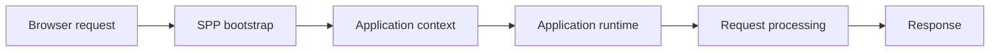
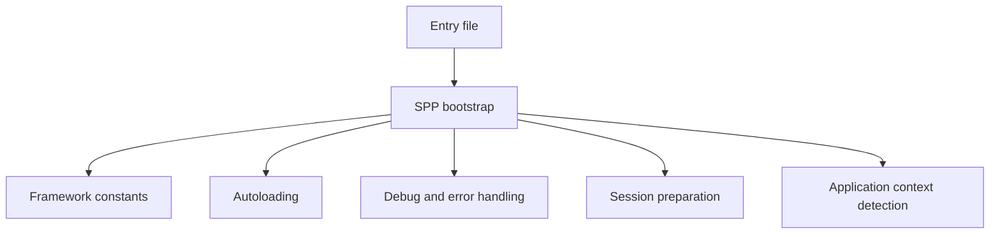
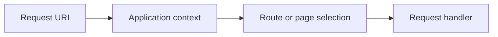
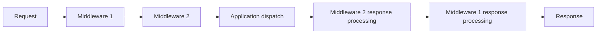
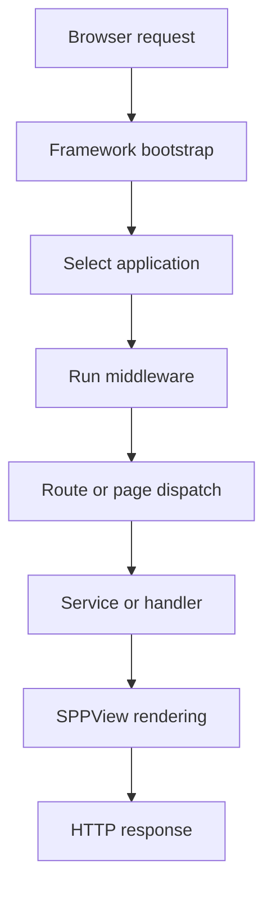
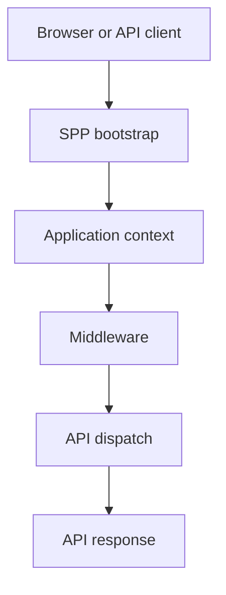
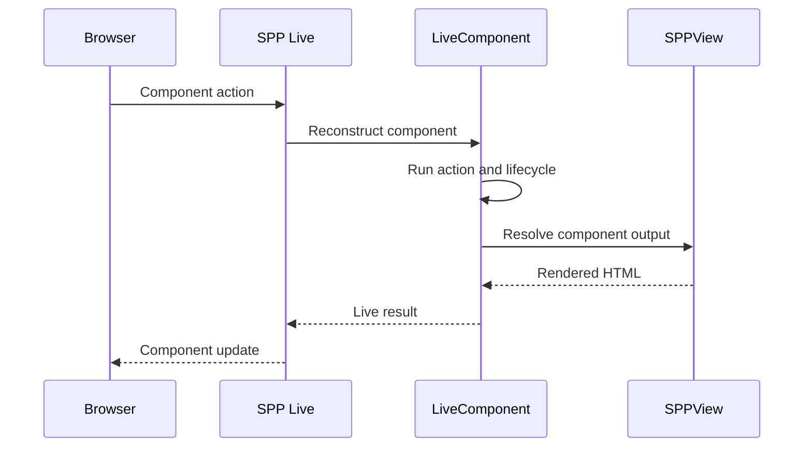

# Volume IX — Building Applications

## Chapter 13 — What Happens to a Request?

**Evidence:** `documentation/framework/booting-and-app-loading.md`, `spp/sppinit.php`, `spp/core/class.scheduler.php`, `spp/core/class.app.php`, `spp/core/class.module.php`, `spp/core/class.sppevent.php`, `spp/core/class.middlewarekernel.php`, `spp/core/class.pipeline.php`, and related application/runtime tests.

This chapter answers the question every new SPP developer eventually asks:

> **“I typed a URL into the browser. What exactly happened inside SPP?”**

If you have never used a framework, the most important thing to understand is that your PHP method is **not the beginning of the application**.

A web request starts outside your application code and moves through several framework stages before it reaches the code you wrote.

Likewise, returning from your PHP method does not necessarily mean the framework has finished working.

The SPP runtime performs several responsibilities around your application code.

---

## 13.1 Start with the simplest possible web request

Imagine a browser requests:

```text
https://example.com/myapp/users
```

The browser does not know anything about SPP, `App`, `Scheduler`, modules, or LiveComponent.

It sends an HTTP request.

The server then has to decide:

1. Which PHP entry point receives the request?
2. Has the SPP framework been initialized?
3. Which SPP application owns `/myapp`?
4. Which application/runtime features are active?
5. Which middleware should run?
6. Which route/page/handler should execute?
7. Does the handler need a service?
8. Does it return HTML, API data, or a live component result?
9. What response should be sent to the browser?

That is what the framework is doing around your application code.

---

## 13.2 The big picture

For learning purposes, keep this simplified architecture in your head:



The boxes are intentionally broad. Each one expands into several concrete classes and operations.

---

## 13.3 Stage 1 — The entry point

An SPP request normally begins at a PHP entry file such as an `index.php`, an API entry point, or an application-specific public entry file.

The entry file eventually loads the common framework bootstrap:

```text
spp/sppinit.php
```

The key idea is:

> **The entry point starts the framework. It is not the framework itself.**

This distinction becomes important when debugging because a problem may occur before your application code is ever reached.

---

## 13.4 Stage 2 — `sppinit.php` prepares the runtime

The repository's boot documentation and `spp/sppinit.php` show that the bootstrap performs early framework work such as:

- defining framework/application constants;
- loading Composer;
- registering SPP autoloaders;
- registering compatibility aliases;
- preparing debug/error handling;
- preparing sessions where appropriate;
- detecting the application context; and
- creating/initializing the active application.

Conceptually:



These operations happen because later application code relies on them.

---

## 13.5 Why autoloading happens so early

PHP classes are usually loaded only when PHP knows where their files are.

A framework such as SPP has many classes spread across directories:

```text
spp/core
spp/modules
src/myapp
vendor
```

Autoloading tells PHP how to find a class when code references it.

Without it, application developers would constantly need to write manual `require` statements.

SPP layers its own class/module/application autoloading around Composer's third-party autoloading.

This is one of the first reasons a framework feels “magical” to a beginner: classes appear available because the framework has already prepared the runtime's autoloading rules.

---

## 13.6 Stage 3 — choose the application context

After the runtime can load classes, SPP needs to answer:

> **Which application should handle this request?**

That is the Scheduler's job.

For example, imagine two configured applications:

```text
myapp       base_url = /myapp
reports     base_url = /reports
```

A request for:

```text
/myapp/admin/users
```

should select `myapp` rather than `reports`.

The public API for the current context is:

```php
$context = \SPP\Scheduler::getContext();
```

The active application object can then be obtained through:

```php
$app = \SPP\App::getApp();
```

---

## 13.7 Context selection is not normal route selection

This distinction is one of the most important ideas in SPP.

### Application context

Answers:

> Which application owns this request?

### Route selection

Answers:

> Which endpoint/page/handler inside that application should process it?

Therefore:



A URL can fail because the wrong application was selected, even when its route definition is perfectly correct.

---

## 13.8 How the Scheduler detects context

`Scheduler::detectAndEnforceContext()` performs several steps around the request URI and application configuration.

The implementation:

1. normalizes the request URI;
2. obtains application settings;
3. compares applications and their `base_url` values;
4. fires context-enforcement and route-resolution events;
5. selects the matching application or configured fallback; and
6. stores the final application context.

This is one of the most interesting SPP design choices because the Scheduler's decision can itself be influenced by the framework's event system.

That means the event system is not merely an application-level notification mechanism; it also serves as an extension mechanism around framework runtime behavior.

---

## 13.9 Stage 4 — create or obtain the application object

Once the context is known, SPP needs the runtime representation of that application.

The boot process can choose between:

- a specialized application type;
- a custom application class; or
- the standard `SPP\App` class.

For beginners, the important sentence is:

> **The `App` object is the runtime representation of the selected application.**

It knows about application configuration, paths, service resolution, status, and initialization behavior.

---

## 13.10 Application paths are resolved before application code runs

An application needs locations for things such as:

```text
configuration
source code
modules
runtime data
logs
cache
temporary files
```

The `App` object resolves these paths from the application configuration.

That is why application code can ask for methods such as:

```php
$app->getAppSrcDir();
$app->getAppConfDir();
$app->getModDir();
$app->getCacheDir();
$app->getLogDir();
```

The framework already knows the application filesystem model.

---

## 13.11 Stage 5 — application registration

The application is registered with framework runtime structures.

The `App` class maintains application instances, and the Scheduler can register the app as a runtime process using `Scheduler::regProc()`.

The application status system includes values such as:

- `APP_EXEC`;
- `APP_WAITING`;
- `APP_STOPPED`; and
- `APP_ERROR`.

These statuses describe the SPP application runtime object; they are **not operating-system process states**.

That distinction matters when reading the source.

---

## 13.12 Stage 6 — the application container becomes available

During application initialization, the `App` object creates its application container.

That means later application code can use the framework's dependency-resolution mechanisms.

For example, when a handler has:

```php
public function index(ReportService $report)
```

the application runtime can resolve the typed dependency when the handler is invoked through its container-aware call path.

This is why dependency injection appears to “just happen” in framework code: the application was initialized before your handler executed.

---

## 13.13 Stage 7 — application initialization events

Application startup participates in the SPP event architecture.

The boot documentation identifies:

```text
event_spp_app_init
```

as an application-initialization event.

This gives modules and framework extensions a way to observe or participate in initialization without editing the central bootstrap file.

This is a major architectural principle:

> **Framework lifecycle stages are extension points.**

The detailed listener/priority/override behavior is explained in Chapter 4.

---

## 13.14 Stage 8 — modules enter the runtime

Once the application exists, its active module configuration becomes important.

The module system can:

- discover module manifests;
- read activation registries;
- determine active modules;
- resolve dependencies;
- detect cycles/missing dependencies; and
- build/use the compiled module registry.

This is much more structured than “include every PHP file in `modules/`”.

The module system determines what the application actually has available as framework-recognized features.

---

## 13.15 Stage 9 — middleware wraps request processing

The middleware system sits around request execution.

An SPP middleware can:

- allow processing to continue;
- reject a request early; or
- observe/modify processing on the way back out.

At the application level, middleware is therefore ideal for cross-cutting concerns such as authentication checks, CSRF protection, throttling, logging, and security headers.

The concrete pipeline is implemented by `Pipeline` and `MiddlewareKernel`.

A simplified model is:



This “go in / come back out” shape is the onion model implemented by the pipeline.

---

## 13.16 Stage 10 — request dispatch

After the middleware destination is reached, the application can dispatch the request into the appropriate subsystem.

Depending on the application and entry point, that can involve:

- route/page infrastructure;
- a controller/request handler;
- an API handler;
- an SPPView page;
- a LiveComponent path; or
- another application subsystem.

This is why SPP documentation should not pretend there is exactly one universal controller pipeline for every application.

---

## 13.17 A normal server-rendered request

A useful simplified model is:



A real request may contain more stages, but this model is sufficiently accurate for a beginner to predict where each class of problem belongs.

---

## 13.18 What if the request is an API request?

The path can differ after middleware.

For example, the middleware documentation identifies API routing infrastructure such as `SPPAPI` and `AutoApiRouter`.

Conceptually:



The application can therefore support both normal HTML-facing requests and API-facing requests inside the same framework runtime.

---

## 13.19 What if the request involves LiveComponent?

A LiveComponent changes the later part of the interaction path.

An initial navigation may still be a normal application page request.

A later component interaction can instead travel through SPP Live.

Conceptually:



The exact network/engine behavior depends on the selected SPP Live implementation.

---

## 13.20 What happens after your PHP method returns?

Your method returning is only one event in the framework lifecycle.

After the method returns, SPP may still need to:

- run hooks;
- render a view;
- serialize component state;
- create a live response;
- stream content; or
- complete transport/output processing.

Therefore, when debugging, do not stop at:

> “My method definitely ran.”

The better question is:

> **“What subsystem ran immediately after my method?”**

That question narrows the problem dramatically.

---

## 13.21 Request debugging: start with the boundary that owns the symptom

| Symptom | First subsystem to inspect |
|---|---|
| Wrong application selected | Scheduler/context detection |
| Application configuration missing | `App` path/config resolution |
| Module feature unavailable | Module discovery/compiler/activation |
| Service cannot be constructed | Container |
| Event handler not called | `SPPEvent` discovery/registration/propagation |
| Request blocked before handler | Middleware |
| URL reaches wrong endpoint | Routing/page dispatch |
| View cannot be found/compiled | SPPView |
| Live action does not reach PHP | SPP Live transport |
| Component state is wrong | LiveComponent hydration/dehydration |
| Browser reactive behavior fails | SPPUX |

This table is more useful to a new developer than memorizing framework class names.

---

## 13.22 The most important debugging habit

When a framework feels mysterious, ask:

> **“Which boundary am I currently standing in?”**

For example:

```text
Browser
  ↓
HTTP transport
  ↓
SPP bootstrap
  ↓
Application context
  ↓
Middleware
  ↓
Route/page/handler
  ↓
Service
  ↓
Presentation
```

Once you know the failed boundary, you no longer need to understand the entire framework to find the bug.

---

## 13.23 Coming from other frameworks

### Laravel

Think of the request as passing through bootstrap → middleware → routing/controller → Blade, but add the SPP Scheduler application-context stage before ordinary route handling.

### Symfony

The routing and container ideas will feel familiar, but SPP's Scheduler explicitly manages multiple application contexts inside the runtime.

### Django

Think URL → application selection → middleware → view, but remember that SPP separates application-context selection from endpoint routing.

### React/Vue

Those frameworks focus heavily on the browser runtime. SPP's request lifecycle explains what happens on the PHP/server side before any SPPUX behavior matters.

---

## 13.24 Kernel Hacker: the real boot path

The conceptual diagrams intentionally compress many implementation details.

The source-level boot sequence includes things such as:

- debug/version resolution;
- framework constants;
- Composer autoloading;
- SPP autoloaders;
- compatibility aliases;
- exception handling;
- session preparation;
- Scheduler context detection;
- application-class selection;
- application constructor/init levels;
- directory resolution;
- application registration;
- module initialization;
- application initialization events; and
- later request dispatch/middleware execution.

The correct way to debug exact order is therefore to trace:

```text
spp/sppinit.php
→ spp/core/class.scheduler.php
→ spp/core/class.app.php
→ module initialization
→ middleware/dispatch entry point
```

The diagrams in this chapter are the **learning model**. The source files are the **execution specification**.

### Source map

- `spp/sppinit.php`
- `spp/core/class.scheduler.php`
- `spp/core/class.app.php`
- `spp/core/class.module.php`
- `spp/core/class.sppevent.php`
- `spp/core/class.middlewarekernel.php`
- `spp/core/class.pipeline.php`
- `documentation/framework/booting-and-app-loading.md`
