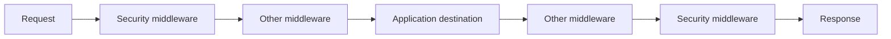
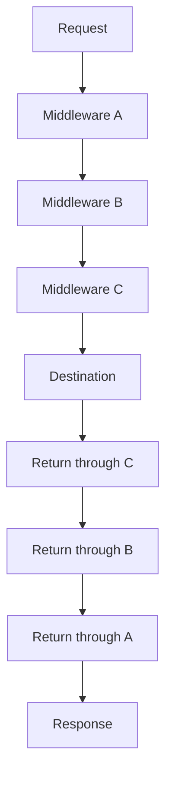
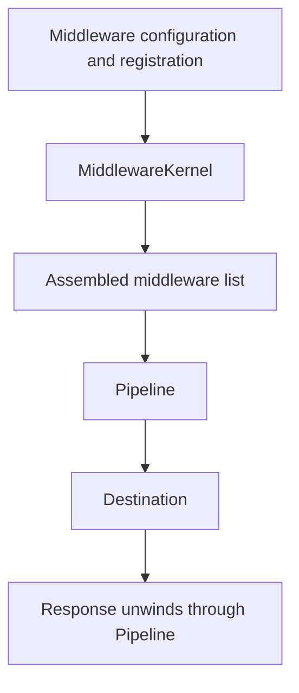

# Volume IX — Building Applications

## Chapter 14 — Middleware and the Request Pipeline

**Evidence:** `documentation/framework/middleware.md`, `docs/tut/15_middleware.md`, `spp/core/class.middlewarekernel.php`, `spp/core/class.pipeline.php`, concrete middleware implementations, route/middleware attributes.

If you have never used a web framework, middleware is one of those features that can seem completely unnecessary until you build a real application.

Imagine ten pages in an application all need to perform the same security check.

Without middleware, you might write the same check ten times.

With middleware, the framework can put one reusable layer **around the request-processing path**.

That is the basic idea.

---

## 14.1 The simplest mental model

Imagine entering an office building:

```text
You arrive
   ↓
Security check
   ↓
Reception check
   ↓
Office
```

And when leaving:

```text
Office
   ↓
Reception records departure
   ↓
Security processes exit
   ↓
You leave
```

SPP middleware follows the same broad “in and out” idea.



The same middleware layer can therefore have logic both before and after the application destination.

---

## 14.2 Why middleware exists

Middleware is useful when a concern applies to a **request boundary**, rather than to one specific business method.

Typical examples include:

- authentication checks;
- CSRF protection;
- request logging;
- rate limiting;
- throttling;
- security response headers;
- tenant/context resolution.

A controller should not have to remember every one of these responsibilities individually.

---

## 14.3 The middleware contract

The core interface is:

```php
namespace SPP\Core;

interface MiddlewareInterface
{
    public function handle($request, \Closure $next);
}
```

There are two important values:

### `$request`

The value being passed through the pipeline.

### `$next`

The next stage in the pipeline.

A middleware that wants normal processing to continue calls:

```php
return $next($request);
```

The middleware can do work before that call and after that call returns.

---

## 14.4 A very small middleware

Here is the basic shape:

```php
class RequestMarker implements \SPP\Core\MiddlewareInterface
{
    public function handle($request, \Closure $next)
    {
        // Inbound work.
        $request['checked'] = true;

        $response = $next($request);

        // Outbound work.
        return $response;
    }
}
```

Read it literally:

1. the request enters;
2. this middleware does something;
3. `$next()` passes control onward;
4. later stages execute;
5. control returns here;
6. this middleware can now do something with the result.

That is the onion model.

---

## 14.5 Short-circuiting the request

Middleware can also decide that the request must not continue.

For example:

```php
public function handle($request, \Closure $next)
{
    if (! $this->isAllowed($request)) {
        http_response_code(403);
        return 'Forbidden';
    }

    return $next($request);
}
```

When the condition fails, `$next()` is never called.

So the next middleware and the application destination do not run.

This is one of the most useful properties of middleware for security and traffic-control concerns.

---

## 14.6 Middleware is not a controller

A controller answers:

> “What should this particular endpoint do?”

Middleware answers:

> “What condition or processing should surround a request before/after the endpoint executes?”

For example:

| Concern | Better place |
|---|---|
| Load a student's profile | Service/controller |
| Check global API authentication | Middleware |
| Calculate a student's fees | Service/domain code |
| Add security headers | Middleware |
| Render a template | SPPView |
| Record a domain occurrence | Event/service as appropriate |

The distinction becomes very important in larger applications.

---

## 14.7 The Pipeline

SPP has a separate `Pipeline` class.

The pipeline's job is to take the middleware list and turn it into the nested execution structure needed for the onion model.

The framework implementation uses a reverse reduction of the middleware list to create nested closures.

You can visualize the result like this:



The Pipeline is therefore concerned primarily with **execution mechanics**.

---

## 14.8 What can appear in the pipeline?

The implementation supports three important forms:

| Pipeline entry | What SPP does |
|---|---|
| String class name | Resolve through `Registry::make()` |
| Middleware object | Call its `handle()` method |
| Callable | Invoke it directly as a pipeline stage |

This is useful because framework integration is not limited to one rigid middleware class style.

---

## 14.9 The Middleware Kernel

If `Pipeline` knows how to **execute** middleware, something else must decide **which middleware belongs in the stack**.

That is `MiddlewareKernel`.

The kernel is the request-facing assembly/orchestration layer.

The simplified relationship is:


That separation is important enough to memorize:

> **MiddlewareKernel assembles; Pipeline executes.**

---

## 14.10 Where global middleware comes from

The framework documentation identifies several sources for the global stack.

A simplified priority model is:

| Priority | Source |
|---|---|
| 1 | Hardcoded/Registry middleware |
| 2 | Framework `spp/etc/middleware.yml` |
| 3 | Active application's `middleware.yml` |

For example, framework-level YAML can contain:

```yaml
global:
  - SPP\Core\Middleware\CSRFMiddleware
  - SPPMod\SPPLogger\RequestLogger
```

An application can contribute its own:

```yaml
global:
  - App\Myapp\Middleware\TenantResolver
```

---

## 14.11 Programmatic registration

Middleware can also be added from PHP:

```php
\SPP\Core\MiddlewareKernel::addGlobalMiddleware(
    \App\Myapp\Middleware\TenantResolver::class
);
```

This is useful when the middleware stack depends on runtime decisions or application initialization.

The actual precedence/merge behavior belongs to `MiddlewareKernel` and should be verified before building ordering-sensitive security rules.

---

## 14.12 Starting the pipeline

The framework documentation demonstrates wrapping the application destination with:

```php
\SPP\Core\MiddlewareKernel::run(function ($request) {
    // Application routing and dispatch.
});
```

The kernel performs the broad sequence:

1. assemble/boot middleware;
2. fire `event_spp_kernel_boot`;
3. pass the request into the pipeline;
4. invoke the destination;
5. return the resulting response through the pipeline.

This is why routing and middleware are related but not identical.

---

## 14.13 Global versus route-level middleware

SPP supports more than one scope.

### Global middleware

Applies to the request-processing path broadly.

### Route/controller middleware

Applies only to selected request destinations.

The route subsystem uses PHP attributes for route-level middleware.

Example:

```php
use SPPMod\SPPView\Attributes\Middleware;
use SPPMod\SPPView\Attributes\Route;

#[Middleware(AuthMiddleware::class)]
class AdminController
{
    #[Route('/admin/settings')]
    #[Middleware(CsrfMiddleware::class)]
    public function settings()
    {
        // ...
    }
}
```

The framework also supports route-level middleware through the `middleware` argument of `#[Route]`.

---

## 14.14 How route middleware is combined

The framework guide describes three possible sources for route middleware:

```text
Class-level middleware
       +
Method-level middleware
       +
Route middleware parameter
```

The exact execution order depends on the route/middleware implementation.

For security-sensitive applications, do not infer ordering from the declaration order alone. Verify the implementation that assembles the stack.

---

## 14.15 SPP's built-in middleware

The repository contains several concrete middleware types.

| Middleware | Typical responsibility |
|---|---|
| `ApiAuthMiddleware` | API authentication path |
| `CSRFMiddleware` | CSRF validation |
| `RequestLogger` | Request logging |
| `RateLimiterMiddleware` | Rate limiting |
| `ThrottleMiddleware` | Throttling |
| `SecurityHeadersMiddleware` | Security response headers |

These names provide useful orientation, but each middleware's exact behavior remains implementation-specific.

---

## 14.16 Authentication versus authorization

This distinction matters especially when designing middleware.

### Authentication

Answers:

> “Who is this caller?”

### Authorization

Answers:

> “Is this caller allowed to perform this particular operation?”

A global authentication middleware can establish identity.

A business service may still need to enforce resource-level authorization.

Do not assume that because authentication middleware has run, every business operation is automatically permitted.

---

## 14.17 CSRF protection

CSRF protection is a good example of a request-boundary concern.

A CSRF middleware can inspect the request and reject a state-changing operation before it reaches business logic when required validation is missing.

This is exactly the kind of concern that should not be duplicated manually across dozens of controllers.

---

## 14.18 Rate limiting and throttling

Rate limiting and throttling also belong naturally at a request boundary.

A middleware can reject excessive requests before the expensive business operation runs.

That saves:

- application CPU;
- database work;
- external API calls; and
- downstream resources.

The repository contains both rate-limiter and throttle-style middleware, but their exact algorithms should be learned from their respective implementations.

---

## 14.19 Post-processing middleware

A middleware does not have to modify only the incoming request.

It can inspect the response after the destination completes.

For example:

```php
$response = $next($request);

// Add or adjust response-level behavior.

return $response;
```

This makes middleware useful for response headers, logging, metrics, or normalization tasks.

---

## 14.20 Events versus middleware

A beginner should keep these two concepts separate.

| Question | Middleware | Event system |
|---|---|---|
| Wraps request processing | Yes | Not inherently |
| Natural before/after request behavior | Yes | Only at defined event stages |
| Can short-circuit request pipeline | Yes | Event propagation can stop listener execution |
| Selected through middleware configuration | Yes | No |
| Best for request security boundary | Often | Sometimes, but usually not the primary mechanism |
| Best for decoupled runtime extension point | Not primarily | Yes |

If the requirement is “every request must pass this check”, middleware is often the natural boundary.

If the requirement is “announce that a student was created so optional subscribers can react”, an event is often the better abstraction.

---

## 14.21 Middleware versus services

Another common beginner mistake is to put business logic directly into middleware.

For example, avoid turning a `TenantResolver` middleware into a 1,000-line business workflow.

A cleaner shape is:


Middleware owns the request boundary. Services own reusable business behavior.

---

## 14.22 Debugging middleware

When a request unexpectedly returns an error, use this sequence:

### Step 1 — Did the MiddlewareKernel run?

If not, investigate the entry point.

### Step 2 — What middleware was assembled?

Inspect global framework/application configuration and programmatic registrations.

### Step 3 — Which middleware ran before the destination?

Add temporary logging if necessary.

### Step 4 — Did a middleware short-circuit?

Look for early returns or equivalent termination behavior.

### Step 5 — Did the destination run?

If not, the problem is probably before routing/handler execution.

### Step 6 — Did an outbound middleware modify the response?

A response can be changed after the application destination returns.

This approach is much faster than debugging the entire request at once.

---

## 14.23 Enterprise middleware architecture

For a production SPP application, middleware is an especially useful home for cross-cutting request concerns such as:

- authentication;
- CSRF protection;
- request tracing;
- security headers;
- tenant/application context resolution;
- throttling;
- rate limiting;
- API policy enforcement;
- request logging.

The guiding principle is:

> **Keep middleware focused on the request boundary.**

Business workflows should remain in services/domain/application layers unless there is a concrete reason the middleware itself must own them.

---

## 14.24 Coming from other frameworks

### Laravel

The onion/pipeline model will look familiar. SPP's distinctive details are its own `MiddlewareKernel`, Registry-based resolution, application-aware configuration, and integration with SPP's route attributes.

### Symfony

The request/response middleware idea is similar, but SPP's pipeline implementation and configuration sources are framework-specific.

### Django

Think of middleware as request/response wrappers around the view path. SPP has an explicit `Pipeline` object underneath its middleware kernel.

### Spring Boot

Filter/interceptor concepts may feel familiar. SPP middleware is its own request-pipeline contract and should be learned directly from `MiddlewareInterface` and `Pipeline`.

---

## 14.25 Common beginner mistakes

### Mistake 1 — Calling `$next()` twice

That can execute the downstream pipeline twice and produce unpredictable results.

### Mistake 2 — Never calling `$next()` accidentally

That silently turns normal middleware into a short-circuiting middleware.

### Mistake 3 — Putting business workflows into middleware

Keep reusable business logic in services.

### Mistake 4 — Assuming global middleware and route middleware are identical

They are different scopes and are assembled through different configuration/discovery paths.

### Mistake 5 — Assuming middleware is authorization for everything

Authentication and broad request checks do not eliminate resource-level business authorization.

---

## 14.26 Kernel Hacker: MiddlewareKernel versus Pipeline

The source-backed boundary is:



The `Pipeline` composes nested closures from the middleware list. Middleware class names can be resolved through `Registry::make()`, while already-created middleware objects and plain callables can also participate.

The `MiddlewareKernel` is therefore best understood as the **stack assembly/orchestration layer**, while `Pipeline` is the **execution engine**.

That separation becomes important when implementing custom middleware infrastructure or diagnosing ordering/registration problems.

### Source map

- `spp/core/class.middlewarekernel.php`
- `spp/core/class.pipeline.php`
- `documentation/framework/middleware.md`
- `docs/tut/15_middleware.md`
- concrete middleware implementations
- route/middleware attribute implementations
