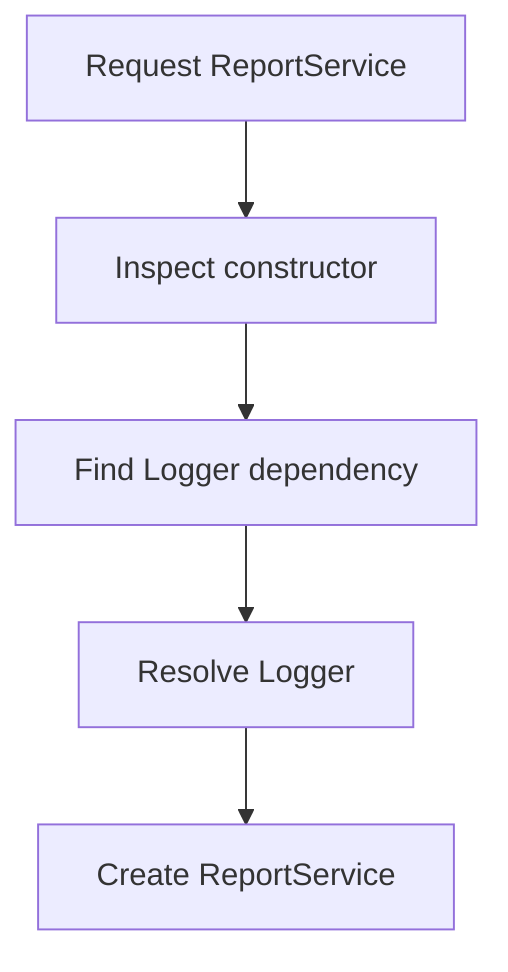

# Volume IX — Building Applications

## Chapter 15 — Dependency Injection, Containers, and Services

**Evidence:** `spp/core/class.container.php`, `spp/core/class.app.php`, application-development documentation, `docs/phpdoc/classes/SPP-Core-Container.html`.

Dependency injection sounds complicated until you reduce it to one question:

> **Who creates the object my code needs?**

In a small PHP script, you usually answer that question yourself with `new`. In a larger SPP application, the runtime can answer it for you.

This chapter explains the real SPP container from the ground up.

---

## 15.1 The problem dependency injection solves

Suppose a controller needs a reporting service.

Without a container:

```php
class ReportController
{
    public function index(): string
    {
        $service = new ReportService();
        return $service->build();
    }
}
```

That works, but the controller now decides how `ReportService` is constructed.

If `ReportService` later needs a database object, cache, logger, or configuration object, the controller becomes responsible for constructing that dependency tree too.

Dependency injection moves construction responsibility to the application runtime.

---

## 15.2 The SPP container

SPP provides `SPP\Core\Container`.

The implementation is PSR-11 compatible and supports:

- explicit bindings;
- singleton/shared bindings;
- concrete-class auto-resolution;
- closure factories;
- object bindings; and
- constructor dependency resolution through PHP reflection.

The important public methods are:

```php
$container->bind(...);
$container->singleton(...);
$container->get(...);
$container->has(...);
```

---

## 15.3 A class can be resolved without a binding

One of the most useful beginner features is automatic class resolution.

If the container receives a concrete, instantiable class name that has not been explicitly bound, it can attempt to construct it.

For example:

```php
class ReportService
{
    public function build(): string
    {
        return 'Report';
    }
}
```

Then:

```php
$service = $container->get(ReportService::class);
```

can resolve the class directly.

This only works when the constructor dependencies themselves can be resolved.

---

## 15.4 Constructor injection

Consider:

```php
class ReportService
{
    public function __construct(Logger $logger)
    {
        $this->logger = $logger;
    }
}
```

The SPP container uses reflection to inspect the constructor and resolve typed class dependencies.

Conceptually:



The container caches constructor reflection metadata in a static reflector cache so repeated resolution does not have to rebuild the reflection model every time.

---

## 15.5 Built-in versus primitive dependencies

The container can resolve class/interface dependencies because it can ask the container for another object.

It cannot invent arbitrary primitive constructor values.

For example:

```php
class Service
{
    public function __construct(string $name)
    {
    }
}
```

The container needs a default value or an explicit strategy for the primitive. Otherwise it raises an SPP exception.

This is an important design boundary: **type-hinted services are naturally injectable; business data is not automatically configuration.**

---

## 15.6 Interface bindings

Suppose an application depends on an interface:

```php
interface Mailer
{
    public function send(string $to, string $body): void;
}
```

and has an implementation:

```php
class SmtpMailer implements Mailer
{
    // ...
}
```

Bind the interface:

```php
$container->bind(Mailer::class, SmtpMailer::class);
```

Now a constructor can depend on the abstraction:

```php
class NotificationService
{
    public function __construct(Mailer $mailer)
    {
        $this->mailer = $mailer;
    }
}
```

The service does not need to know which concrete mailer the application selected.

---

## 15.7 `bind()` and `singleton()`

These two methods differ in lifecycle.

### `bind()`

```php
$container->bind(Mailer::class, SmtpMailer::class);
```

The binding describes how to create the service. Unless the binding is shared, the container does not cache the created instance for future retrievals.

### `singleton()`

```php
$container->singleton(Mailer::class, SmtpMailer::class);
```

The binding is marked as shared. Once created, the same instance is retained by the container for subsequent retrievals.

Use singleton/shared lifetime deliberately. A singleton is appropriate for objects that should be reused safely within the application's container lifetime; it is not a substitute for all state management.

---

## 15.8 Closures as factories

A binding may use a closure:

```php
$container->bind(Cache::class, function ($container) {
    return new RedisCache(/* configuration */);
});
```

The container invokes the closure with the container itself.

This is useful when construction requires logic that is not naturally represented by a constructor dependency graph.

---

## 15.9 Objects can be bound directly

The implementation also accepts an already-created object as a concrete value.

That is useful when an object was created by another subsystem and should be made available through the container.

Be careful with lifetime semantics: a pre-created object is already a specific instance.

---

## 15.10 The application container

An SPP `App` creates its own `SPP\Core\Container` during application construction.

The application-development guide exposes convenience methods such as:

```php
$app->getContainer();
$app->make(...);
$app->bind(...);
$app->singleton(...);
$app->call(...);
```

For application code, this is often the most natural container boundary.

---

## 15.11 The global Registry container

SPP also exposes an IoC facade through `Registry`:

```php
\SPP\Registry::container();
```

and corresponding operations:

```php
\SPP\Registry::bind(...);
\SPP\Registry::singleton(...);
\SPP\Registry::make(...);
```

This does **not** mean the Registry and the application's container are conceptually the same object.

The Registry itself is a static framework facility, while `App` maintains its own container instance.

That distinction matters in multi-application deployments.

---

## 15.12 `make()` versus `get()`

At the framework level you will encounter both styles.

Container APIs use:

```php
$container->get(SomeClass::class);
```

The SPP application/Registry convenience APIs expose `make()` for resolution as well.

When reading framework code, use the concrete API of the object you are holding rather than assuming every container-like object has identical methods.

---

## 15.13 Method injection through `call()`

The SPP application API can resolve class-typed parameters when invoking a callable through `App::call()`.

Example:

```php
class HomeController
{
    public function index(SiteService $site): string
    {
        return $site->title();
    }
}

$app = \SPP\App::getApp();

$result = $app->call([
    HomeController::class,
    'index',
]);
```

This allows request-facing code to declare what it needs instead of constructing dependencies manually.

---

## 15.14 Dependency injection does not mean "everything is a service"

A common mistake in enterprise projects is turning every object into a container binding.

Use dependency injection for things that benefit from controlled construction, replacement, composition, or shared lifecycle.

Do not use the container merely to hide trivial `new ValueObject(...)` calls.

A good rule is:

> **Inject infrastructure and meaningful application services; create small local values directly when their ownership is obvious.**

---

## 15.15 Services versus modules

A service is an object with behavior.

A module is a framework-recognized feature unit that can contain configuration, dependencies, files, services, events, and other contributions.

They operate at different architectural levels:

| Concept | Responsibility |
|---|---|
| Service | Business/infrastructure behavior |
| Container | Creates and supplies objects |
| Module | Packages and activates a feature |
| App | Defines an application runtime context |
| Registry | Stores framework/runtime values and exposes a service-container facade |

Understanding these layers prevents a common anti-pattern: placing an entire feature inside one giant service class.

---

## 15.16 Testing becomes easier

Suppose a service depends on an interface:

```php
class ReportService
{
    public function __construct(ReportRepository $repository)
    {
        $this->repository = $repository;
    }
}
```

A test can bind a test implementation instead of connecting to the production backend.

That is the practical value of dependency injection: it creates a seam where the environment can supply a different implementation.

---

## 15.17 Failure cases you should understand

The container can fail when:

- a requested service is not registered and is not an existing class;
- a class exists but is not instantiable;
- a constructor requires an unresolved primitive;
- a dependency chain ultimately cannot be resolved; or
- resolution of one candidate in a union type fails and no viable alternative remains.

These failures are surfaced as `SPPException` instances by the container implementation.

---

## 15.18 What the container does not do

The current container is not a full enterprise service-locator workflow engine.

It does not, by itself, prove:

- distributed service discovery;
- network RPC;
- automatic process supervision;
- application lifecycle orchestration; or
- persistence of service instances across PHP processes.

Those responsibilities belong to other SPP subsystems.

---

## 15.19 Migration advice for developers from other frameworks

### Laravel

Laravel developers will recognize `bind()`, `singleton()`, and automatic constructor injection. The important SPP difference is to keep the **application container**, **global Registry**, and **module system** conceptually distinct.

### Symfony

Symfony developers will recognize interface aliases and dependency injection. Do not assume SPP's compiler/configuration conventions are identical to Symfony's service-container compilation pipeline; the implementation examined here is a runtime reflection-based container.

### Spring Boot

Spring developers will recognize constructor injection and interface-to-implementation binding. SPP is much lighter: the inspected container does not establish an annotation-driven enterprise bean lifecycle equivalent to Spring's full application context.

### ASP.NET Core

The closest conceptual analogue is the built-in DI container and application service registration, but SPP's container API and resolution semantics are PHP-specific.

---

## Kernel Hacker note

`SPP\Core\Container` is intentionally compact. Its core algorithm is:

1. check for an existing shared instance;
2. find an explicit binding, or treat a resolvable class name as the concrete type;
3. inspect/cache constructor metadata;
4. recursively resolve class-typed dependencies;
5. instantiate the concrete type; and
6. retain the instance when the binding is shared.

This makes the container closer to a lightweight runtime dependency resolver than to a large compiled dependency graph.

### Source map

- `spp/core/class.container.php`
- `spp/core/class.app.php`
- `spp/core/class.registry.php`
- `documentation/framework/application-development.md`
- `docs/phpdoc/classes/SPP-Core-Container.html`
