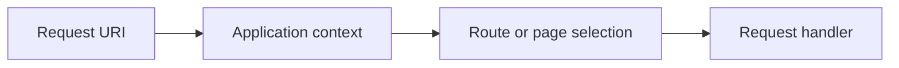
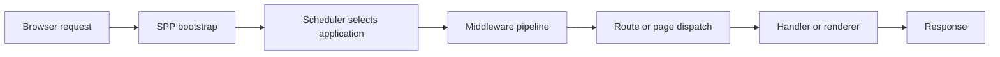
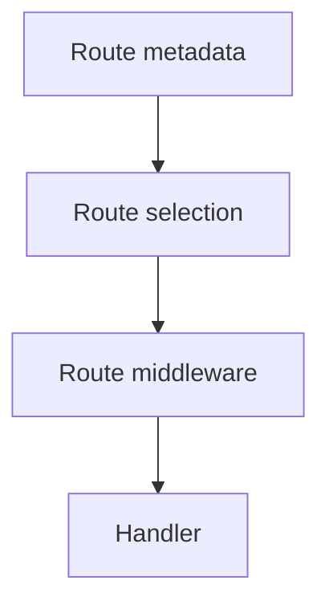
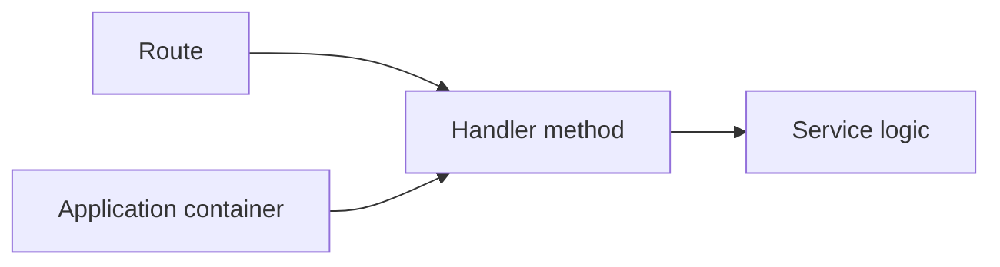
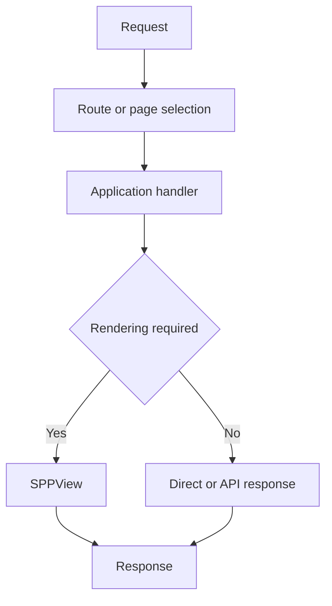
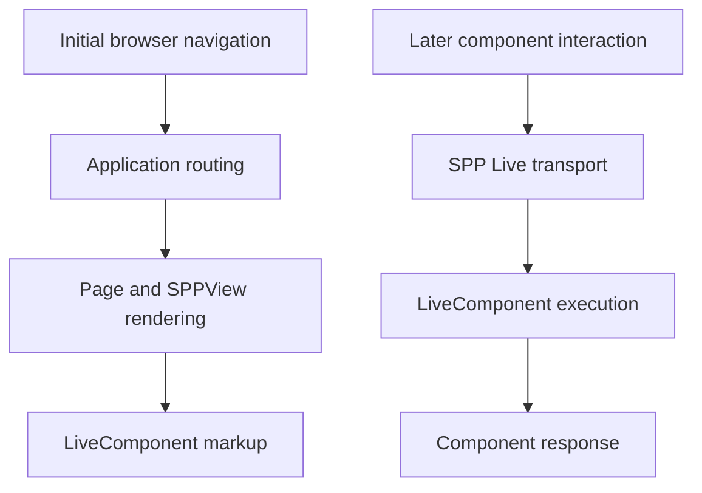
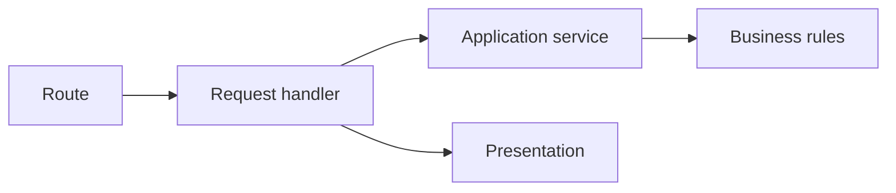

# Volume IX — Building Applications

## Chapter 15 — Routing and Request Dispatch

**Evidence:** `documentation/framework/booting-and-app-loading.md`, `documentation/framework/application-development.md`, `documentation/framework/middleware.md`, SPPView route/view-router classes and route attributes in the source tree.

If you have never used a framework, **routing** is simply the mechanism that answers this question:

> **A web request has reached the correct application. Which piece of application code should handle it?**

That sounds simple, but SPP separates the problem into several layers. Understanding those layers is essential in a multi-application framework.

---

## 15.1 First learn the difference between application selection and routing

Suppose the browser requests:

```text
/myapp/admin/users
```

Before SPP can decide which endpoint handles `/admin/users`, it needs to know which application owns `/myapp`.

So there are at least two decisions:

1. **Application selection** — choose the SPP application context.
2. **Route selection** — choose the endpoint/page/handler inside that application.

The relationship is:



This is one of the most important differences between SPP's Scheduler and ordinary routing terminology.

---

## 15.2 What is a route?

A route is a mapping between an incoming request and application behavior.

A conceptual route might say:

```text
GET /admin/users
        ↓
UsersController::index()
```

The browser does not call `UsersController::index()` directly. It calls a URL.

The routing infrastructure turns that URL into an executable destination.

---

## 15.3 Why the framework needs routing

Without a routing system, every public PHP file would need to understand its own URL and manually decide what to do.

A router centralizes that mapping.

As the application grows, you get relationships such as:

```text
/admin/users       → user management
/admin/reports     → report management
/api/students      → API handler
/dashboard         → dashboard page
```

Routing turns those URLs into application behavior in a predictable way.

---

## 15.4 SPP does not have to use one universal route file

This is an important SPP-specific documentation rule.

The repository contains different application and rendering mechanisms. Depending on the enabled modules and application architecture, request dispatch can involve:

- route attributes;
- page definitions;
- view routing;
- API routing;
- controller methods;
- service handlers; or
- LiveComponent paths.

Therefore this handbook does **not** invent one universal `routes.php` format and claim that every SPP application uses it.

The actual route mechanism must be learned from the active routing/view module and its source.

---

## 15.5 Attribute-based routes

The SPP middleware documentation shows route declarations using the SPP View attribute system.

A simple example is:

```php
use SPPMod\SPPView\Attributes\Route;

class UsersController
{
    #[Route('/admin/users')]
    public function index()
    {
        // ...
    }
}
```

The route attribute tells the framework that the method participates in route discovery.

The exact constructor/options supported by `Route` are defined by the current attribute implementation.

Do not copy a route attribute signature from Laravel or Symfony and assume it is valid in SPP.

---

## 15.6 Application URL versus route URL

Beginners often confuse these two:

| Concept | Example | Question answered |
|---|---|---|
| Application `base_url` | `/myapp` | Which application is active? |
| Route | `/admin/users` | Which endpoint inside the application handles the request? |

So the complete public path can conceptually be:

```text
/myapp + /admin/users
```

The Scheduler is concerned with the first decision. The routing layer is concerned with the second.

---

## 15.7 Where routing sits in the request pipeline

Routing happens after earlier framework stages have prepared the application/runtime.

A useful learning model is:



Middleware can reject the request before routing completes, which is why a route that “looks correct” may still never execute.

---

## 15.8 Route-level middleware

SPP's route metadata can also carry middleware.

For example, the framework documentation shows a route-specific declaration such as:

```php
#[Route('/api/data', middleware: [RateLimiterMiddleware::class])]
public function getData()
{
    // ...
}
```

The important composition is:



This lets a route declare additional request-processing requirements without making those requirements global to every URL.

---

## 15.9 Controllers are common, but they are not the whole model

A controller is simply a class containing request-facing methods.

SPP applications can use controllers, but request dispatch may also target other kinds of application behavior depending on the active architecture.

Possible destinations include:

- controller methods;
- page definitions;
- API handlers;
- service methods;
- rendering pages; and
- LiveComponent-related paths.

The framework is therefore more general than “every route must instantiate a controller”.

---

## 15.10 Routing and dependency injection work together

Routing answers:

> **Which handler should run?**

Dependency injection answers:

> **How should that handler receive its dependencies?**

For example:

```php
class HomeController
{
    public function index(SiteService $site): string
    {
        return $site->title();
    }
}
```

The route selects `HomeController::index()`.

The application container can supply the `SiteService` dependency when the method is invoked through the app's `call()` mechanism.

This is a useful architecture boundary:



The router does not need to know how the `SiteService` object is constructed.

---

## 15.11 What if no route matches?

The exact fallback/error behavior depends on the routing/page subsystem in use.

For debugging, first separate two different failures:

### Case A — Correct application, wrong route

The Scheduler selected the expected application, but that application does not expose the requested endpoint.

### Case B — Wrong application, correct route

The route exists, but the Scheduler selected a different application context.

Those are very different problems.

For Case A, investigate route/page discovery.

For Case B, investigate:

```php
\SPP\Scheduler::getContext();
```

and the application's `base_url` configuration.

---

## 15.12 Routing and SPPView

SPPView contains view location/routing/page infrastructure as well as rendering components.

But routing and rendering are still different responsibilities.

A request may route to something that returns an API response and never renders HTML.

Or it may route to a page that renders through SPPView.

A useful model is:



This distinction becomes especially useful when an application contains both browser pages and APIs.

---

## 15.13 Routing and LiveComponent

A LiveComponent can participate in a page without being the same thing as the page's route.

### Initial navigation

The browser may request a normal application URL, which goes through ordinary application routing/page rendering.

### Later interaction

The browser can then send a live action through SPP Live to update the component.

So there are two related flows:



The later live request is not necessarily the same route dispatch that produced the original page.

---

## 15.14 API routing

The SPP middleware documentation identifies API routing infrastructure such as `SPPAPI` and `AutoApiRouter` as possible destinations after middleware processing.

That means one SPP application can support multiple request styles:

```text
Browser HTML requests
API requests
LiveComponent interactions
```

The framework can route each into its appropriate subsystem without requiring separate framework installations.

---

## 15.15 Enterprise route ownership

Large applications become easier to maintain when routes have a clear owner.

A useful ownership model is:

| Concern | Owner |
|---|---|
| Application URL prefix | Application configuration |
| Feature route | Module/application feature |
| Authentication | Middleware/auth subsystem |
| Resource authorization | Application/domain policy |
| Business behavior | Service/domain layer |
| HTML rendering | SPPView |
| Server-reactive interaction | LiveComponent + SPP Live |
| Browser-local reactivity | SPPUX |

This avoids the common anti-pattern where a giant central route file contains business decisions for the entire application.

---

## 15.16 A route should not become a business workflow

A route should identify the entry point.

A controller/handler should coordinate request-specific work.

A service should contain reusable business behavior.

A view/component should present the result.

For example:



This separation makes the same business service reusable from a web page, API, scheduled task, or other application entry point.

---

## 15.17 Debugging route problems systematically

When a URL fails, use this order.

### Step 1 — Confirm the application context

```php
\SPP\Scheduler::getContext();
```

### Step 2 — Check middleware

Could global or route-level middleware be rejecting the request before the handler?

### Step 3 — Check route/page discovery

Does the selected application actually define this endpoint?

### Step 4 — Check handler resolution

Does the handler exist, and can the application container resolve its dependencies?

### Step 5 — Check rendering

If the handler executes but HTML is wrong, move your investigation to SPPView.

### Step 6 — Check Live/UX transport separately

If the initial page works but later component interaction fails, investigate SPP Live or SPPUX rather than continuing to debug the original route.

---

## 15.18 Coming from other frameworks

### Laravel

The mapping to `routes → controller → middleware → Blade` is useful, but SPP adds an explicit Scheduler/application-context stage before ordinary route handling.

### Symfony

Think of SPP routing as a routing/dispatch concern layered inside an application context, with SPP's own route attributes and view integration.

### Django

Think URL pattern → view, but distinguish application-context selection from URL endpoint selection.

### React/Vue

Client-side routing and SPP server routing are different problems. SPPUX can manage browser-side UI behavior, but PHP routing remains a server-side application concern.

---

## 15.19 Common beginner mistakes

### Mistake 1 — Confusing `base_url` with route path

`base_url` helps select the application. A route selects an endpoint inside that application.

### Mistake 2 — Assuming middleware runs after routing

Global middleware can prevent the request from ever reaching the route destination.

### Mistake 3 — Assuming every endpoint must be a controller

SPP supports broader request/dispatch patterns.

### Mistake 4 — Putting business rules into route definitions

Keep business logic in application/domain services.

### Mistake 5 — Debugging Live interactions as normal routing failures

Initial navigation and later LiveComponent interactions can use different runtime paths.

---

## 15.20 Kernel Hacker: multiple selectors

The most useful expert mental model is that SPP request handling contains **multiple selectors**.

1. Scheduler selects the application context.
2. Middleware determines whether request processing may continue.
3. Route/page/API infrastructure selects the request destination.
4. The destination resolves services and executes application behavior.
5. The result enters the appropriate presentation/response subsystem.

This explains why the phrase “the router handles the request” is too vague for SPP architecture documentation.

### Source map

- `spp/core/class.scheduler.php`
- `spp/core/class.middlewarekernel.php`
- `spp/core/class.pipeline.php`
- `documentation/framework/booting-and-app-loading.md`
- `documentation/framework/application-development.md`
- `documentation/framework/middleware.md`
- SPPView route and view-router classes/attributes in `spp/modules/spp/sppview/`
