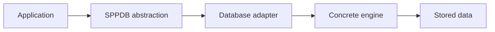
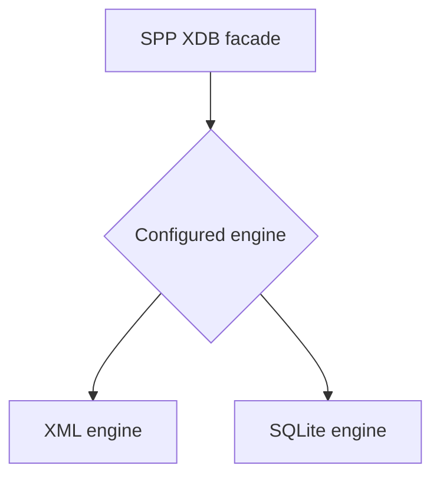
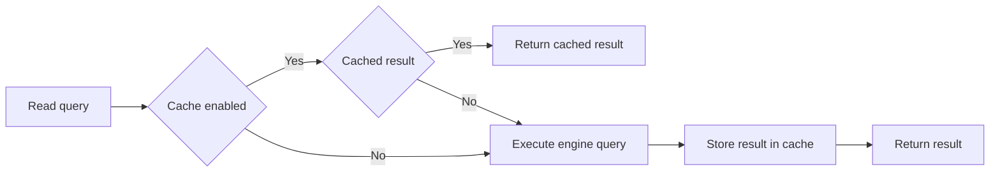
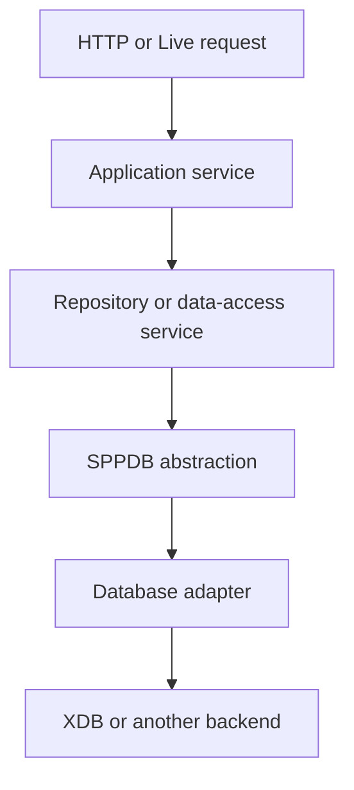

# Volume X — Data and Storage

## Chapter 16 — Database, SPPDB, and SPP XDB

**Evidence:** `spp/modules/spp/sppdb/`, `spp/modules/spp/sppxdb/`, `spp/modules/spp/sppstorage/`, `documentation/framework/sppxdb.md`, `documentation/framework/sppinterdb.md`, and the corresponding tests.

This chapter is written for a reader who knows PHP but has never worked with a framework database abstraction.

A web application eventually needs to remember things: users, orders, documents, settings, audit records, or other domain data. A database is the system that stores that information so the application can read it later.

The important SPP lesson is that **database access is another framework boundary**. Application code does not have to know every detail of every storage engine.

---

## 16.1 Why a framework has a database layer

Without an abstraction, application code might do this everywhere:

```php
$pdo = new PDO($dsn, $user, $password);
$statement = $pdo->prepare('SELECT * FROM users WHERE id = ?');
$statement->execute([$id]);
```

That works, but now the application owns connection setup, driver selection, error handling, query conventions, and replacement of one storage engine with another.

A framework database layer tries to centralize those decisions.

SPP has at least two relevant levels:

| Layer | Purpose |
|---|---|
| SPPDB | Common database abstraction/adapter layer |
| SPP XDB | SPP's XML/SQLite-backed database subsystem |

The distinction is important: **SPPDB is an abstraction layer; XDB is one concrete database family behind it.**

---

## 16.2 The SPPDB idea

Think of SPPDB as a common vocabulary for database operations.

An application can ask for operations such as:

- query;
- execute;
- insert;
- update;
- delete;
- inspect table existence; and
- inspect schema.

The exact backend can then be provided by a specific adapter.

For XDB, the repository contains `spp/modules/spp/sppdb/class.xdbadapter.php` implementing the `DBAdapter` contract.

That adapter delegates SQL operations to `SPP_XDB`.



This is the core idea behind a database abstraction: **application code depends on a stable interface while storage details stay below it**.

---

## 16.3 What is SPP XDB?

SPP XDB is a concrete database subsystem included in the repository.

The main facade is:

```text
SPPMod\SPPXDB\SPP_XDB
```

The source shows that `SPP_XDB` is a facade/proxy in front of at least two engine implementations:

- `XMLEngine`;
- `SQLiteEngine`.

The facade chooses the engine from SPP configuration and then forwards database operations to that engine.



This is a particularly useful example for learning framework architecture: a high-level API does not have to expose the details of the storage engine it eventually calls.

---

## 16.4 Selecting the XDB engine

The `SPP_XDB` constructor checks the framework configuration for `sys:db.engine` and defaults to XML when no other value is selected.

If the configured engine is `sqlite`, the facade creates `SQLiteEngine`; otherwise it creates `XMLEngine`.

The configuration-driven decision therefore happens at runtime:

```text
Application configuration
        ↓
SPP_XDB constructor
        ↓
XML or SQLite engine
```

The exact configuration keys and deployment conventions should be kept synchronized with the current SPP configuration subsystem.

---

## 16.5 Reading and writing through the adapter

The XDB adapter implements generic database operations by translating them into SQL and delegating to `SPP_XDB`.

For example, the adapter's `insert()` method builds an SQL `INSERT` statement with placeholders and passes the values separately.

That matters because the adapter is not simply storing PHP arrays. It presents a database-style API on top of the XDB engine.

The adapter also provides schema inspection through `DESCRIBE` and table discovery through `SHOW TABLES`.

---

## 16.6 Querying

The XDB facade forwards unknown methods to the selected engine through `__call()`.

This means calls such as:

```php
$xdb->querySQL($sql, $params);
```

are delegated to the concrete engine.

The facade also recognizes read-style SQL such as `SELECT`, `SHOW`, and `DESCRIBE` for query caching when caching is enabled.

That caching behavior is framework infrastructure, not something every application has to implement itself.

---

## 16.7 Query caching

`SPP_XDB` can cache read queries through the framework cache subsystem.

Conceptually:



The implementation creates a cache key from the SQL and serialized parameters. Cached entries are associated with a table tag when the engine exposes a table name.

Mutation operations such as insert, update, and delete invalidate the corresponding table tag.

This is a concrete example of two SPP subsystems composing: **database access uses the framework cache layer without embedding the cache implementation inside application code**.

---

## 16.8 Query logging

`SPP_XDB` contains query logging controls:

```php
SPP_XDB::enableQueryLog();
$log = SPP_XDB::getQueryLog();
```

The facade records timing information for selected database operations when logging is enabled.

This is useful while debugging slow database interactions.

---

## 16.9 XML storage is still a real database engine

The presence of an XML engine does not mean that SPP is simply reading arbitrary XML files as configuration documents.

The `XMLEngine` has database-oriented responsibilities and traits for areas including:

- CRUD;
- schema handling;
- indexing;
- views;
- query processing;
- transactions;
- validation;
- access control;
- locking;
- encryption; and
- other engine features.

The engine is therefore a substantial storage subsystem in its own right.

---

## 16.10 Important source-first correction

The repository contains older documentation that makes very strong claims about XDB features such as blockchain audit chains, autonomous indexing, materialized views, and complete distributed consensus behavior.

The canonical handbook will **not automatically repeat such claims** merely because they occur in documentation.

For each advanced capability, the source and tests must establish the actual runtime behavior.

For example, the current `XMLEngine` source visibly includes a Raft-related trait, transaction state, journal state, encryption state, permissions, segmentation, foreign-key structures, and auditing fields. That is evidence that these concerns exist in the implementation, but it is not by itself proof of every operational guarantee that a marketing-style feature list might imply.

The handbook therefore distinguishes:

- **implemented code paths**;
- **documented features awaiting deeper source verification**; and
- **enterprise guidance that is recommended but not an SPP feature**.

This rule is especially important for database documentation because overclaiming ACID, consensus, durability, or security guarantees can lead to dangerous deployment decisions.

---

## 16.11 XDB and transactions

The XDB engine includes transaction-related implementation code and state.

The SPPDB `XDBAdapter` currently exposes the transaction methods required by its adapter contract, but those methods are simple in the inspected adapter:

```php
beginTransaction()
commit()
rollBack()
inTransaction()
```

The adapter currently returns `true` for begin/commit/rollback and `false` for `inTransaction()`.

That means the handbook must not claim that the adapter provides ordinary PDO-style transaction state merely because the method names exist.

This is an excellent example of why **API presence is not equivalent to fully demonstrated semantics**.

---

## 16.12 Storage, database, and application architecture

A clean enterprise application keeps database concerns below its domain/application services.



The exact repository pattern is an application architecture decision. SPP provides the underlying facilities; it does not require every project to use one particular domain-repository structure.

---

## 16.13 When should you use XDB?

XDB is a reasonable candidate when an application specifically benefits from the storage model provided by the SPP XDB subsystem or when project requirements already depend on SPP's XML/SQLite database facilities.

It should not be selected merely because it is a framework feature.

Before production adoption, evaluate:

- expected data volume;
- concurrency;
- transaction semantics required by the domain;
- backup/restore behavior;
- operational tooling;
- indexing requirements;
- security controls; and
- failure/recovery behavior.

Those are engineering decisions, not framework marketing claims.

---

## 16.14 Database debugging for beginners

When a database operation fails, debug in layers.

### Step 1 — Is the application configured for the expected backend?

Check the database engine/configuration first.

### Step 2 — Did SPPDB select the expected adapter?

The abstraction and adapter layers are distinct from the concrete engine.

### Step 3 — Did the engine receive the expected SQL and parameters?

Enable query logging where appropriate.

### Step 4 — Does the table/schema exist?

Use the engine's schema inspection mechanisms.

### Step 5 — Did caching return stale data?

Inspect cache behavior and mutation invalidation when relevant.

### Step 6 — Is the problem actually in application logic?

A successful query does not prove that the domain logic interpreted the result correctly.

---

## 16.15 Coming from other ecosystems

### Laravel / Symfony

Think of SPPDB as conceptually similar to a database abstraction layer, while SPP XDB is a concrete storage engine family beneath it.

### Django

Think in terms of the ORM/database backend boundary, but do not assume SPP's XDB layer is a drop-in ORM equivalent.

### Java / Spring

The distinction between an interface/adapter layer and a concrete database implementation should feel familiar: the application depends on the abstraction while the runtime selects a concrete provider.

---

## Kernel Hacker note

The most important internal design feature in the current code is the **double delegation boundary**:

1. `SPPDB` can delegate to a backend adapter such as `XDBAdapter`.
2. `SPP_XDB` can then delegate to an engine such as `XMLEngine` or `SQLiteEngine`.

That gives SPP two points where storage concerns can be isolated or substituted.

The XDB facade additionally centralizes query caching, query timing, and cache invalidation so those cross-cutting concerns do not have to be duplicated inside each application-facing data access call.

### Source map

- `spp/modules/spp/sppdb/class.sppdb.php`
- `spp/modules/spp/sppdb/class.xdbadapter.php`
- `spp/modules/spp/sppxdb/class.sppxdb.php`
- `spp/modules/spp/sppxdb/Engines/XMLEngine.php`
- `spp/modules/spp/sppxdb/Engines/SQLiteEngine.php`
- `spp/modules/spp/sppxdb/class.querybuilder.php`
- `spp/modules/spp/sppxdb/class.xdbfactory.php`
- `spp/modules/spp/sppxdb/class.xdbmigrator.php`
