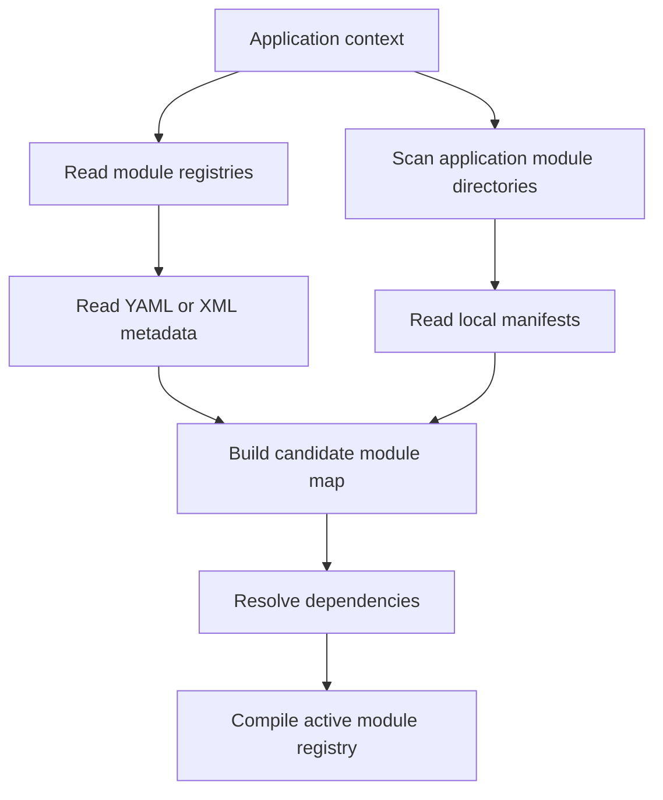

# Volume X — Modules and Extensibility

## Chapter 16 — Building an SPP Module from Zero

**Evidence:** `spp/core/class.module.php`, `spp/core/class.modulecompiler.php`, `spp/core/class.moduleinstaller.php`, `spp/etc/modules.yml`, `spp/etc/modules.xml`, application `modsconf`, first-party `module.yml` files.

If you know Composer, a useful first approximation is:

> **An SPP module is a framework-recognized feature unit, not merely a PHP package.**

A module can describe itself, declare dependencies, contribute files and configuration, register services and events, and participate in the application runtime.

This chapter starts from zero and then goes into the compiler internals.

---

## 16.1 Module versus application

An **application** answers:

> "Which business system is running?"

A **module** answers:

> "Which reusable feature is available inside that application?"

For example, an application might be a school portal while modules provide authentication, views, logging, entities, APIs, or reporting.

This separation matters because one module can be reused by several applications.

---

## 16.2 Module manifest

A module normally has a `module.yml` manifest.

The manifest describes the module to SPP.

A real first-party module manifest can contain fields such as:

```yaml
name: sppview
version: 1.0.0
includes:
  - class.viewcompiler.php
deps:
  - spp
config_variables:
  theme:
    type: string
    label: Theme
```

The exact fields vary by module. The important point is that the manifest is **runtime metadata**. It is not simply a README written in YAML.

---

## 16.3 A manifest has two different jobs

A manifest commonly describes both:

1. **what the module is**, and
2. **what the module needs**.

For example:

| Manifest information | Why SPP needs it |
|---|---|
| Name | Runtime identity |
| Version | Module metadata/version management |
| Dependencies | Load ordering and validation |
| Includes | Files contributed by the module |
| Config variables | Configuration model |
| Module metadata | Registry/management tools |

Do not confuse the manifest with the application's activation registry.

---

## 16.4 Activation is an application decision

A module can exist on disk without being active for every application.

SPP reads activation registries and application-specific module directories when building the active module map.

The source supports both YAML and XML registry formats.

That means these are different questions:

- **Does the module exist?** → module files + manifest.
- **Should this application load it?** → activation configuration/discovery rules.

---

## 16.5 How discovery works

At a high level, the module compiler gathers candidates from:

- framework/global module registries;
- application-specific registry files; and
- application module directories.

Then it normalizes the metadata into an active module map.



This is the mental model to keep while reading the compiler source.

---

## 16.6 Application-local modules

For a self-contained application, the application-development documentation supports a local module directory such as:

```text
src/myapp/modules/
```

A simple layout is:

```text
src/myapp/modules/reporting/
  module.yml
  module.php
  config.yml
  src/
  events/
  resources/
```

The actual files a module needs depend on what it contributes. Do not create directories simply because another framework uses them.

---

## 16.7 Reusable framework modules

SPP also contains framework modules under paths such as:

```text
spp/modules/spp/
```

These are shared framework features rather than application-specific business code.

A practical rule is:

- if the feature is reusable across applications, consider a module;
- if the feature belongs to one application, consider an app-local module;
- if the logic is a small reusable object rather than a feature package, consider a service.

---

## 16.8 Dependencies

A module can declare dependencies through manifest metadata such as `deps` or `dependencies`.

Suppose:

```text
Reporting
   -> Charts
       -> View
           -> Core
```

The compiler must not load Reporting before the modules it depends on.

This is why dependency resolution is part of module compilation rather than left to random file inclusion order.

---

## 16.9 Topological ordering

The current `ModuleCompiler::topologicalSort()` performs a depth-first traversal with visited and temporary sets.

Conceptually:


This is a dependency-order diagram, not a fixed list of modules in every SPP installation.

---

## 16.10 Missing dependencies

If a module declares a dependency that is not present in the discovered module map, the compiler raises `MissingDependencyException`.

This is much safer than silently loading the module and discovering a missing class later during an unrelated request.

---

## 16.11 Circular dependencies

A circular graph might look like:

```text
A -> B
B -> C
C -> A
```

The compiler uses a temporary visitation set to detect this situation and raises a circular-dependency exception.

A module graph should therefore be designed as a directed acyclic dependency graph.

---

## 16.12 Compiled module registry

Dependency resolution and manifest parsing are not repeated unnecessarily on every runtime path.

The compiler writes an application-specific PHP cache whose name follows the form:

```text
var/cache/modules_<appContext>.php
```

The normalized cache contains module metadata such as:

- internal name;
- module path;
- type;
- version;
- dependencies;
- included files;
- services extracted from configuration; and
- resolved configuration values.

The compiler also records information about the manifests used to produce the cache.

---

## 16.13 Why the compiled registry matters

Without compilation, startup would repeatedly need to:

1. discover module directories;
2. read manifests;
3. parse registry files;
4. normalize module metadata; and
5. resolve the dependency graph.

The compiled registry moves that work into a cache-building phase.

That is one reason SPP can treat the module system as a runtime composition mechanism without making every request act like a package manager.

---

## 16.14 Module configuration

A module can declare configuration variables in its manifest.

The module compiler resolves those definitions together with application/module configuration.

This means the manifest's configuration metadata participates in runtime behavior.

For an enterprise developer, that separation is useful:

**Module author** defines what can be configured.

**Application administrator** supplies the values.

---

## 16.15 Enabling a module

The exact activation mechanism depends on the application/module configuration in use, but the conceptual workflow is:

1. module exists and has a valid manifest;
2. application discovery/registry finds the module;
3. module status/configuration allows it to be active;
4. dependency resolution succeeds;
5. compiler writes/refreshes the normalized module registry;
6. runtime loads the module contributions.

This sequence is more important than memorizing one registry filename.

---

## 16.16 Module installation versus loading

`ModuleInstaller` is a separate subsystem.

That distinction matters:

| Operation | Meaning |
|---|---|
| Install | Put a module into the application/framework environment |
| Discover | Find a module and its metadata |
| Activate | Decide that the application should use it |
| Compile | Normalize/resolve module metadata |
| Load | Bring the module's runtime contributions into execution |

Do not use “installed”, “active”, and “loaded” as interchangeable terms.

---

## 16.17 When should you build a module?

Build an SPP module when the feature has enough identity to deserve its own lifecycle.

Good candidates include:

- authentication;
- reporting;
- reusable admin UI;
- domain-specific feature packs;
- integration adapters;
- reusable form/entity bundles.

For a 50-line helper, a module may be unnecessary overhead.

---

## 16.18 Beginner module exercise

Create a tiny module called `hello` inside an application:

```text
src/myapp/modules/hello/
  module.yml
```

Start with metadata rather than code. The first lesson is to make the module **discoverable** before making it complicated.

Then add one small contribution at a time and observe how the module compiler incorporates it.

For each step, verify:

- the module appears in the expected registry output;
- dependencies resolve;
- the compiled cache changes when the manifest changes; and
- the application can load the contributed behavior.

---

## 16.19 Do not bypass the module system

Avoid writing application startup code such as:

```php
require_once 'some-module/class.feature.php';
```

when that feature is meant to be a real SPP module.

Doing so bypasses module identity, dependency management, configuration, and compiled registry behavior.

---

## 16.20 Module development checklist

Before calling a module complete, verify:

- the manifest has a unique module identity;
- dependencies are declared rather than assumed;
- application-specific configuration is separated from module metadata;
- the module can be discovered by the intended application;
- dependency cycles are absent;
- missing dependencies fail clearly;
- the compiled registry is regenerated when required; and
- runtime contributions are placed in the module rather than scattered through the application bootstrap.

---

## Kernel Hacker note

The module compiler is effectively a build step embedded in the framework runtime. Its most important output is not the manifest itself but the **normalized, dependency-ordered module registry** used by the application runtime.

That makes the module layer a bridge between declarative configuration and executable framework state.

### Source map

- `spp/core/class.module.php`
- `spp/core/class.modulecompiler.php`
- `spp/core/class.moduleinstaller.php`
- `spp/etc/modules.yml`
- `spp/etc/modules.xml`
- `documentation/framework/application-development.md`
