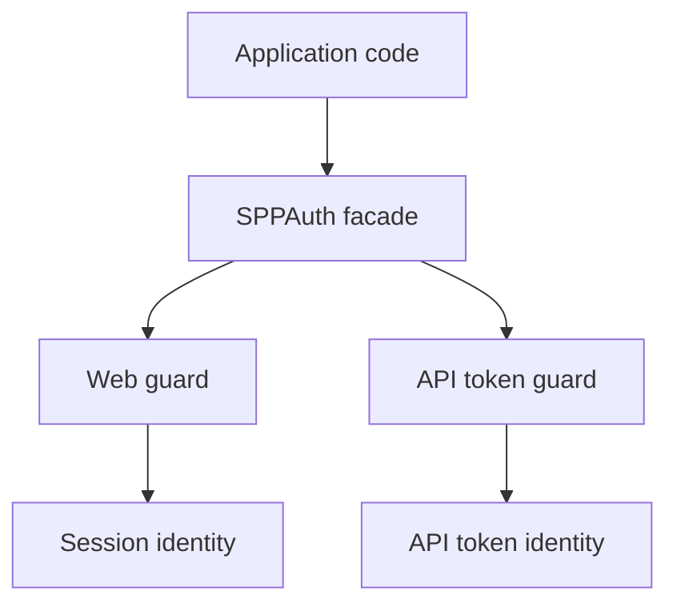
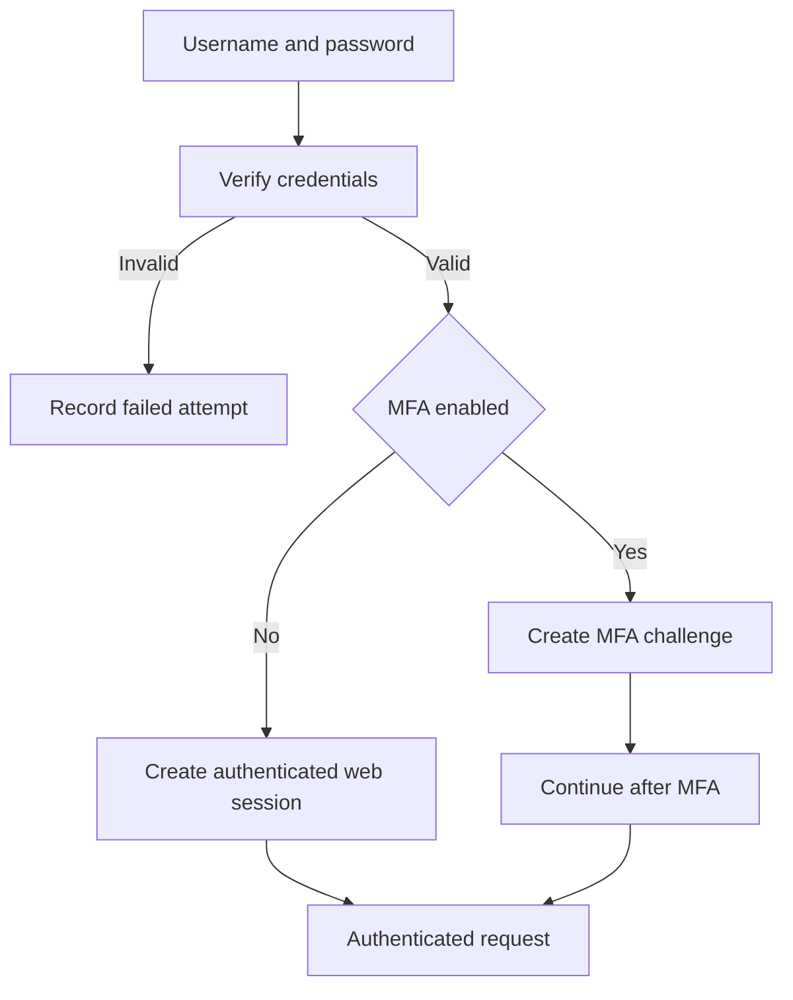
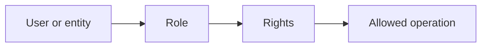
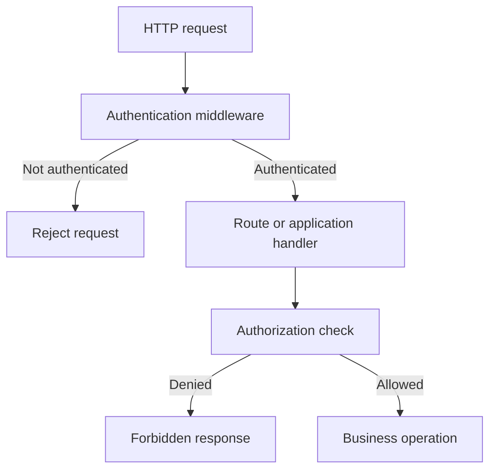

# Volume XI — Identity and Access

## Chapter 17 — Authentication and Authorization in SPP

**Evidence:** `spp/modules/spp/sppauth/module.yml`, `class.sppauth.php`, `class.webguard.php`, `class.tokenguard.php`, `class.sppright.php`, `class.spprole.php`, authentication configuration, and related SPPAuth tests/documentation.

This chapter starts from a simple distinction:

> **Authentication answers “Who are you?” Authorization answers “What are you allowed to do?”**

They are related, but they are not the same problem.

---

## 17.1 Why frameworks provide authentication infrastructure

In plain PHP, an application could inspect `$_SESSION`, read a cookie, compare a password, and decide whether a page should be shown.

That becomes dangerous when every page implements its own version.

A framework can centralize:

- user identity;
- session handling;
- authentication guards;
- permission checks;
- role management;
- audit integration; and
- request middleware.

SPP's `sppauth` module is the framework feature that provides native authentication facilities.

The module manifest identifies `sppauth` as a core authentication module and declares dependencies on `sppdb` and `dbconfig`.

---

## 17.2 The SPPAuth mental model

SPPAuth uses an authentication facade plus named guards.

The current source defines a default `web` guard and an `api` guard.



The important beginner lesson is that the facade provides a stable application-facing API while the guard determines **how identity is obtained and checked**.

---

## 17.3 Authentication: logging in

The legacy-compatible `SPPAuth::login()` method verifies a username and password through `SPPUser::verifyUserPassword()`.

The implementation also integrates additional controls:

- login-attempt rate limiting;
- audit logging;
- optional MFA challenge handling; and
- session-based web authentication.

This means login is more than a password comparison.

A simplified conceptual flow is:



The exact challenge/session behavior is implemented in `SPPAuth` and `WebGuard`.

---

## 17.4 WebGuard

`WebGuard` is session-based.

It stores the authenticated user identifier in an SPP session variable and reconstructs the `SPPUser` object when required.

The guard also performs additional checks in `check()`, including:

- MFA-pending state;
- an IP/user-agent fingerprint check;
- periodic session revocation checks through the `loginrec` table; and
- session/device activity updates.

Those are concrete implementation features visible in the source.

A security-sensitive lesson follows:

> Authentication state is not just a boolean. The guard may perform additional checks before considering the request authenticated.

---

## 17.5 Remember-me authentication

`WebGuard::user()` also contains a remember-me path. When the normal session identity is absent, it can inspect the `spp_remember_me` cookie, hash its token, and look up a valid record in the `remember_tokens` table.

This allows the guard to reconstruct an authenticated user without treating the browser cookie itself as the user object.

The database record is an important part of the trust decision.

---

## 17.6 API authentication

`SPPAuth` maps the `api` guard to `TokenGuard`.

The API authentication path is therefore conceptually separate from the browser/session path.

This allows an application to distinguish:

| Context | Guard | Typical identity mechanism |
|---|---|---|
| Browser/web | `web` | Session/user identity |
| API | `api` | Token-based identity |

The handbook does not equate the guards merely because both are exposed through `SPPAuth`.

---

## 17.7 Authorization: permissions and rights

Once the framework knows who the user is, the next question is whether that user may perform an operation.

SPP exposes permission/right checks through `SPPAuth::can()` and the role/right subsystem.

`SPPRight` represents system rights and resolves right IDs from the `rights` table.

A right is best thought of as an application-level capability such as:

```text
students.read
students.edit
reports.export
admin.users.manage
```

The exact naming convention is application/module-defined.

---

## 17.8 Roles

`SPPRole` manages roles and the rights assigned to them.

The source uses a `roleright` relationship table to connect roles and rights.

It also supports polymorphic role assignment through an `entity_roles` table, allowing a role to be associated with an arbitrary entity class and ID.



The important architectural distinction is:

**roles group permissions; permissions describe capabilities.**

---

## 17.9 Where group-based permissions fit

`WebGuard` resolves permissions from multiple sources, including:

- mandatory anonymous/authenticated groups;
- legacy user rights;
- Registry-provided rights;
- groups assigned to the current user; and
- role-derived permissions.

The resulting permission list is de-duplicated.

This means that SPP authorization is not limited to one static role table.

---

## 17.10 Permission caching

`WebGuard::can()` caches resolved permissions in session data.

For authenticated users, the implementation can compare the cached permission timestamp with a database `rights_updated_at` value before deciding whether the cache is still valid.

This is an example of a framework optimization that also changes the debugging model: if permissions appear stale, investigate both the authorization data and the permission cache invalidation path.

---

## 17.11 Attribute-based policy context

The current `WebGuard::can()` implementation can evaluate an additional context through `PolicyRegistry::evaluate()` when a context is supplied.

That is important because a permission alone may not always be enough.

For example:

```text
Permission: reports.view

Context:
    department = science
    report.owner = current_user
```

A policy layer can make the final decision depend on the context as well.

This is the point where permission checking begins to resemble **attribute-based authorization**, but the handbook will only document the concrete policy semantics that the inspected `PolicyRegistry` implementation establishes.

---

## 17.12 Authentication and middleware

Authentication and middleware fit together naturally.

Middleware can stop an unauthenticated request before it reaches the business layer.



This gives two different decision points:

- **authentication** establishes identity;
- **authorization** decides whether the identified subject may perform the action.

---

## 17.13 MFA and authentication state

`SPPAuth::login()` and `WebGuard` contain explicit handling for multi-factor authentication state.

A login can therefore reach an intermediate state in which credentials were accepted but the user is not yet treated as fully authenticated.

This is why security code should call the guard's authentication methods rather than assuming that the presence of one session variable proves full authentication.

---

## 17.14 Session fingerprinting

`WebGuard` stores a SHA-256 fingerprint derived from the request IP address and user-agent string.

On later authentication checks, the guard compares the current fingerprint with the stored value.

If they differ, the guard logs the condition and logs the user out.

This is an implemented anti-hijacking measure, but it also has an operational trade-off: legitimate users whose network characteristics change unexpectedly may be forced to re-authenticate.

That trade-off belongs in deployment and support documentation.

---

## 17.15 Session revocation and device tracking

The guard periodically checks the `loginrec` table using the current PHP session ID.

If the database no longer contains the session record, the current authentication session is treated as revoked.

The same table is updated with access information for active-device tracking.

This creates an explicit relationship between:

```text
Browser session
      ↓
WebGuard
      ↓
SPP session state
      ↓
loginrec database record
```

The system can therefore revoke sessions outside the browser session itself.

---

## 17.16 Logout

Logout should be performed through the guard/facade rather than by manually deleting one session variable.

The guard owns the authentication state and associated integration points.

This is another general framework principle:

> Use the subsystem that owns a piece of state to change that state.

---

## 17.17 Security mistakes beginners make

### Mistake 1 — Checking a session variable directly everywhere

This bypasses the guard's additional checks.

### Mistake 2 — Treating authentication as authorization

Being logged in does not automatically mean the user can perform every operation.

### Mistake 3 — Trusting a client-provided permission

Permissions must be resolved and checked on the server.

### Mistake 4 — Assuming a role name is itself authorization

Roles are a way of organizing rights. The final authorization decision concerns the requested capability and, where applicable, its context.

### Mistake 5 — Putting security checks only in the UI

Hiding a button is not authorization. The server-side operation must enforce the rule.

---

## 17.18 Coming from other frameworks

### Laravel

The guard concept is familiar: authentication is accessed through a guard and authorization through permissions/policies. SPP additionally exposes its own rights/role/entity model.

### Symfony

Think in terms of security authenticators, voters, and firewall concepts, but do not assume identical APIs. SPP's concrete guard and rights classes define the behavior.

### Spring Security

The separation between authentication and authorization is directly familiar. The SPP implementation is PHP-native and integrated with SPPDB, Registry, groups, roles, and middleware.

### Django

Session authentication and permission concepts map naturally, but SPP's `SPPAuth` facade/guard model is framework-specific.

---

## 17.19 Enterprise security architecture

A production system should keep the boundaries explicit:

| Concern | SPP layer |
|---|---|
| Credential verification | SPPAuth / user subsystem |
| Session identity | WebGuard / SPP session |
| API identity | TokenGuard |
| Permission definitions | SPPRight |
| Role grouping | SPPRole |
| Request rejection | Middleware |
| Business authorization | Application/domain policy |
| Audit trail | Audit subsystem and security logging |

The framework provides building blocks; application/domain policy still decides what a business operation means.

---

## Kernel Hacker note

The current SPPAuth implementation is best understood as a **facade + guard + rights/role data model**.

The guard is where important runtime checks occur. The facade offers application-facing compatibility methods while delegating to the selected guard.

That means a security bug can arise even if `SPPAuth::check()` is correct but a developer bypasses it by directly inspecting a session variable or user object.

### Source map

- `spp/modules/spp/sppauth/module.yml`
- `spp/modules/spp/sppauth/class.sppauth.php`
- `spp/modules/spp/sppauth/class.webguard.php`
- `spp/modules/spp/sppauth/class.tokenguard.php`
- `spp/modules/spp/sppauth/class.sppright.php`
- `spp/modules/spp/sppauth/class.spprole.php`
- `spp/modules/spp/sppauth/class.policyregistry.php`
