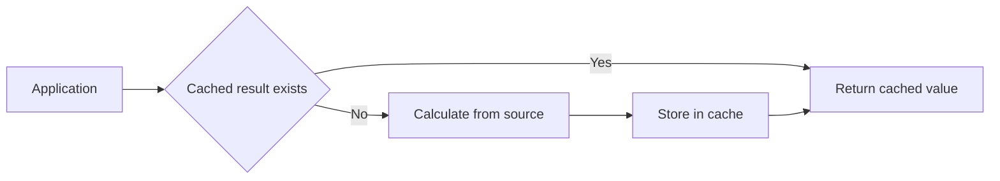
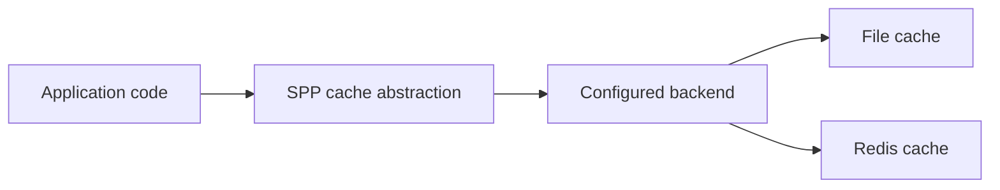
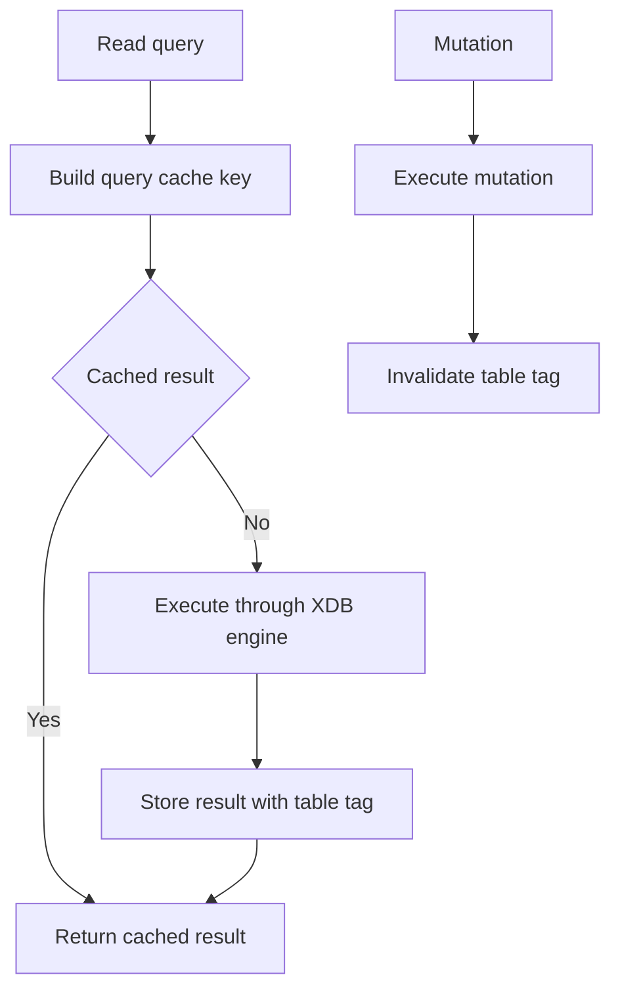
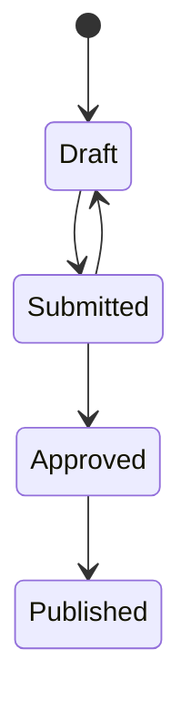
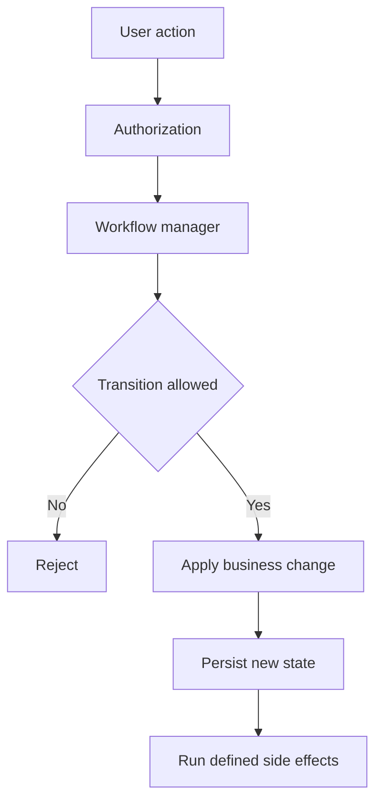
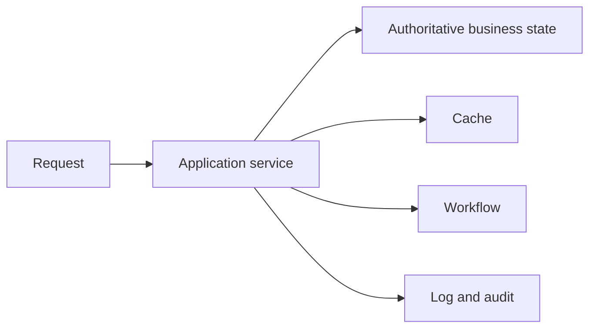

# Volume XII — Application Operations

## Chapter 18 — Cache, Logging, Workflow, and Cross-Cutting Operations

**Evidence:** `spp/modules/spp/sppcache/`, `spp/modules/spp/sppworkflow/`, `spp/core/` logging/debug facilities, related commands, `spp/modules/spp/sppxdb/class.sppxdb.php`.

A production application does more than answer HTTP requests. It must also remember useful temporary results, record what happened, move business processes through controlled states, and expose enough diagnostic information to understand failures.

This chapter assumes you have never used a framework before. We will first explain each idea in ordinary programming terms, then show how SPP implements the corresponding boundary, and finally look at the source-level details.

---

## 18.1 What is a cache?

Suppose a page asks the database for the same expensive report every time it is opened. The database may spend 800 ms calculating the answer even though the answer has not changed.

A **cache** stores the already-computed result for a period of time so the next request can reuse it.

The simplest mental model is:



The most important rule is:

> **A cache is an optimization, not the authoritative business record.**

If the cache disappears, the application should be able to reconstruct the answer from its real source of truth.

---

## 18.2 Why cache invalidation is difficult

Imagine that a user changes their profile.

```text
Database          Cache
---------         ---------
New email         Old email
```

The database is correct, but the application may still return the stale cached value.

A complete cache strategy therefore needs two things:

1. a way to store and expire values; and
2. a way to invalidate values when the underlying data changes.

SPP exposes cache facilities and the XDB facade provides a concrete example of both behaviors.

---

## 18.3 SPP cache backends

The repository contains cache interfaces and concrete facilities including file and Redis-backed implementations, as well as the `SPPCacheManager` module.

The application normally works through the cache abstraction:



The important architectural point is that business code should not need to know which backend stores the value unless the application has an explicit backend-specific requirement.

---

## 18.4 Cache keys, values, lifetime, and tags

A cached entry can be understood through four ideas:

| Concept | Beginner meaning |
|---|---|
| Key | The name used to find the cached value |
| Value | The result being cached |
| Lifetime | How long the result may be reused |
| Tag | A group name that lets related entries be invalidated together |

Tags become important when many keys depend on the same underlying data.

For example, ten cached queries may all depend on the `users` table. Invalidating a `users` tag can remove all ten related results without requiring application code to remember every key individually.

---

## 18.5 XDB as a concrete cache example

`SPP_XDB` contains explicit read-query cache behavior.

For read queries such as `SELECT`, `SHOW`, and `DESCRIBE`, the facade can construct a cache key from the SQL and parameters. Cached results are associated with a table tag where the adapter can determine the table name.

After mutations such as insert, update, or delete, the facade invalidates the corresponding table tag.

So the implemented flow is approximately:



This is a useful example because it shows cache policy living at the facade boundary rather than being an abstract promise that every storage engine must implement in exactly the same way.

---

## 18.6 Logging: why print statements are not enough

A beginner often debugs with:

```php
echo 'Reached here';
```

That is fine for a tiny experiment. It is a poor production diagnostic method because it changes output and disappears with the request lifecycle.

A **log** is a diagnostic record written to a separate channel so it can be reviewed later.

Good logs help answer:

- what happened;
- when it happened;
- which request or operation was involved;
- whether it succeeded; and
- enough context to diagnose a failure.

SPP contains framework debug/logging facilities and module-level logging, including request and audit-related logging in security/runtime code.

---

## 18.7 Logging is not auditing

The two terms are often confused.

A log is usually written to help operators and developers understand runtime behavior.

An **audit record** is written to provide a durable record of a business/security-significant action.

For example:

```text
INFO log:
    cache miss for dashboard query

AUDIT record:
    administrator changed role assignments for user 123
```

Both are important, but they serve different purposes. Do not treat an ordinary debug log as a substitute for a required audit record.

---

## 18.8 Do not put secrets in logs

Production logging must avoid exposing sensitive information such as:

- passwords;
- bearer tokens;
- session cookies;
- authentication secrets;
- private encryption keys; and
- unnecessarily detailed personal data.

This is particularly important because debug logging may be enabled in development but accidentally carried into a production deployment.

---

## 18.9 What is a workflow?

A workflow describes **which business state may come next**.

A simple example is:



This is different from merely storing a `status` string.

A useful workflow can define:

- legal transitions;
- who may trigger them;
- side effects;
- events generated by transitions; and
- behavior when a transition is rejected.

The repository contains the `sppworkflow` module and workflow manager classes, so workflow is a real framework subsystem rather than only an architectural suggestion.

---

## 18.10 Workflow versus ordinary application code

Suppose an application has:

```text
Draft → Submitted → Approved → Published
```

If every controller directly writes any status it wants, invalid states can appear.

A workflow-oriented design puts the transition decision in a dedicated boundary:



The exact transition configuration belongs to the current workflow implementation; the diagram explains the responsibility boundary rather than asserting a universal syntax.

---

## 18.11 Cache, logging, and workflow solve different problems

| Subsystem | Main question |
|---|---|
| Cache | Can expensive work be avoided next time? |
| Logging | What happened and how can I diagnose it? |
| Workflow | Which business state transition is legal now? |

These systems can cooperate, but they should not be collapsed into one generic "utility" layer.

---

## 18.12 A small example: document publishing

Imagine an application where an editor publishes a document.

A healthy flow could be:

1. the document is loaded;
2. the workflow checks whether `Draft → Submitted` is legal;
3. authorization checks whether the editor may submit it;
4. the service persists the new state;
5. relevant caches are invalidated;
6. an audit record is written; and
7. an ordinary application log records useful diagnostics.

The architecture matters because each step has a different responsibility.

---

## 18.13 Common beginner mistakes

### Treating the cache as permanent storage

A cache can expire, disappear, or be invalidated.

### Logging every variable

Noise makes important failures harder to find and can create security problems.

### Hiding business rules in logging code

Logging should normally observe the transaction, not own the transaction.

### Letting arbitrary code write workflow states

As the number of legal transitions grows, centralize the transition rules instead of allowing unrelated controllers to mutate status fields freely.

---

## 18.14 Enterprise operation model

In a production SPP application, these facilities commonly support the application around its business services:



The diagram is deliberately small. It shows that these are supporting boundaries around application behavior rather than one combined mechanism.

---

## 18.15 Coming from other frameworks

### Laravel

Cache, logging, and workflow are usually separate framework features or packages. The same separation is useful in SPP.

### Symfony

Think in terms of independent cache, logging, and application-service abstractions rather than one shared "framework utility" object.

### Django

The key transferable idea is the same: cache is an optimization, logging is observability, and workflow/business-state orchestration is application behavior.

---

## Kernel Hacker note

The interesting implementation boundary in `SPP_XDB` is the facade. The facade can inspect query type, construct a key, ask the configured engine to execute the operation, save read results with a table tag, and invalidate related entries after mutations.

That is a good example of a framework architecture where cross-cutting policy is added at an abstraction boundary instead of duplicated inside each storage backend.

### Source map

- `spp/modules/spp/sppcache/`
- `spp/modules/spp/sppworkflow/`
- `spp/modules/spp/sppxdb/class.sppxdb.php`
- `spp/core/` logging/debug facilities
- related cache/workflow/audit commands and tests
