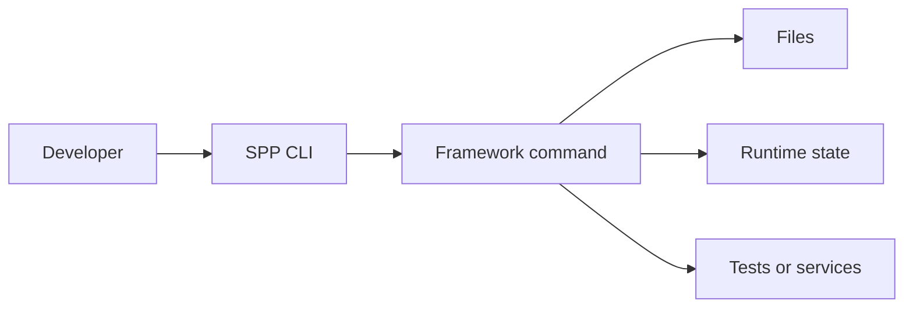
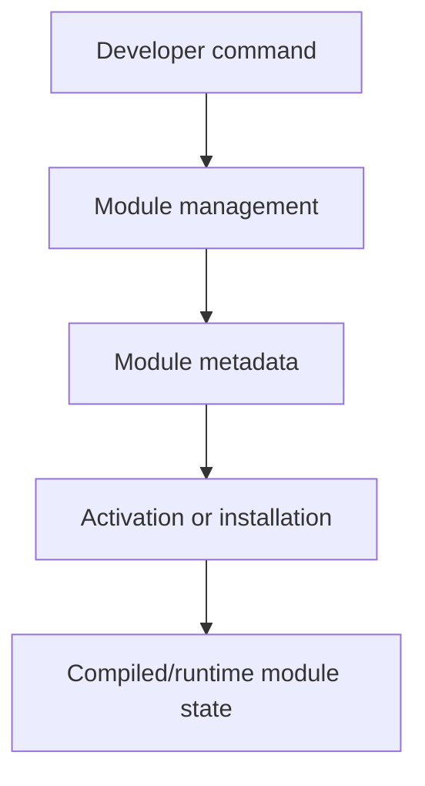
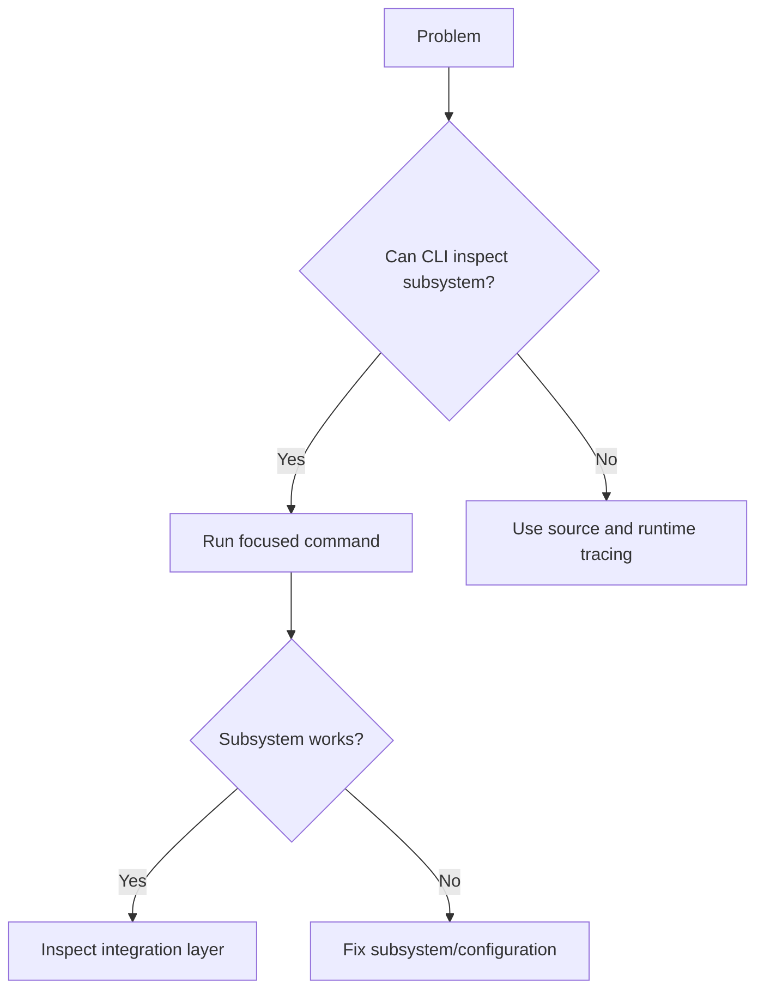

# Volume XIII — Developer Tooling

## Chapter 19 — The SPP CLI and Development Workflow

**Evidence:** `docs/spp-cli-manual.md`, `spp/commands/`, command stubs, and the command implementations referenced by the repository.

A framework becomes much easier to work with when you stop treating its command-line tools as magic commands and understand what they are doing for you.

SPP has a large CLI surface. It includes commands for application creation, modules, middleware, events, views, LiveComponents, SPPUX components, database work, testing, documentation, cache management, deployment, and polyglot services.

This chapter teaches how to think about that CLI rather than simply memorizing hundreds of commands.

---

## 19.1 What is a CLI?

CLI means **Command-Line Interface**.

Instead of opening a browser and clicking a button, you type a command into a terminal.

For example:

```bash
php spp.php make:app myapp
```

A CLI command is just another interface to the framework. It can create files, inspect runtime state, compile metadata, run tests, or start services.

The important relationship is:



---

## 19.2 Why use generators?

Suppose an SPP application needs a middleware class.

You could manually create the file and remember its namespace, directory, and framework conventions.

A generator can create the starting structure for you.

The repository provides generators such as:

```text
make:app
make:controller
make:service
make:middleware
make:event
make:eventhand
make:module
make:entity
make:form
make:live-component
make:ux-component
make:view
make:blade
make:command
```

The exact command list is maintained in `docs/spp-cli-manual.md` and the corresponding command implementations.

---

## 19.3 Generators do not replace understanding

A beginner mistake is:

> “The generator created the files, therefore I know what the files do.”

That is backwards.

The generator should be thought of as a **scaffolding tool**.

It creates a conventional starting point. The application developer still needs to understand:

- where the generated file lives;
- which namespace it uses;
- what SPP discovers automatically;
- what configuration is required; and
- which lifecycle invokes it.

That is why the handbook explains the underlying architecture before relying heavily on generators.

---

## 19.4 Application creation

The repository includes `make:app` and a `MakeAppCommand` implementation.

The first-application tutorial uses the manually understandable application structure before treating the generator as a convenience.

That gives two valid approaches:

| Approach | Best for |
|---|---|
| Manual structure | Learning and understanding the architecture |
| `make:app` | Quickly starting a real project |

A good developer should be able to do both.

---

## 19.5 Module commands

The CLI includes module operations such as:

```text
module:list
module:enable
module:disable
module:install
module:uninstall
module:update
module:setting:list
module:setting:update
```

These commands operate on the framework's module architecture described in Chapter 5.

The useful mental model is:



The command is therefore another entry point into the module lifecycle.

---

## 19.6 Event commands

The repository includes commands such as:

```text
event:fire
event:dispatch
event:list-listeners
```

These are useful when debugging or exercising the event system without requiring a full browser request.

A practical technique is to use the CLI to isolate whether the event layer works before debugging the much larger HTTP stack.

---

## 19.7 Middleware commands

The CLI includes:

```text
make:middleware
middleware:list
```

This reflects two distinct jobs:

1. generate a new middleware implementation;
2. inspect the middleware currently known to the runtime.

That distinction is useful when debugging because a source file existing on disk does not necessarily prove that the framework loaded it into the active middleware stack.

---

## 19.8 Live and reactive development

The CLI also contains development commands for live and UI features, including:

```text
make:live-component
make:ux-component
make:stream
live:status
live:trigger
frontend:debug
```

These commands belong to the LiveComponent/SPP Live/SPPUX development surface.

The architectural principle remains the same: the command creates or manipulates resources; the runtime still owns execution.

---

## 19.9 Database and storage commands

The documented CLI includes commands for database and storage administration, such as:

```text
db:sync
db:verify
migrate
migrate:make
xdb-related administration commands
storage:clean
storage:link
storage:sync
```

The exact syntax and options belong to the current CLI implementation. The handbook should link to the command-specific reference rather than duplicating every flag in every architecture chapter.

---

## 19.10 Testing commands

SPP's CLI includes a substantial testing surface, including:

```text
test
test:run
test:module
test:routes
test:dry-run
test:blueprint
test:monkey
test:module
```

The important beginner concept is that a test command is simply another executable entry point into application behavior.

It allows the same runtime components to be exercised without a browser.

---

## 19.11 Deployment commands

The command manual exposes deployment-related commands such as:

```text
deploy:init
deploy:build
deploy:plan
deploy:run
deploy:rollback
deploy:backups
deploy:history
deploy:maintenance
deploy:env
```

A production deployment should not be built around ad-hoc shell commands when the repository already provides controlled deployment operations.

However, the existence of a command does not by itself prove that a command is safe for every production environment. Each deployment command should be reviewed against its current implementation and the deployment topology.

---

## 19.12 Documentation commands

SPP also exposes commands for building or inspecting documentation:

```text
docs:api
docs:build
docs:man
docs:openapi
docs:phpdoc
```

This illustrates a useful framework property: the framework is documenting and inspecting itself through the same command infrastructure used for application development.

---

## 19.13 Environment and configuration commands

The CLI includes environment/configuration operations such as:

```text
env:get
env:set
env:list
env:status
env:mode
config:export
config:import
config:sync
```

Keep an important production rule in mind:

> Do not place secrets into source-controlled configuration merely because a CLI command makes configuration easy to edit.

Use the repository's deployment/environment facilities and your deployment secret-management policy appropriately.

---

## 19.14 A useful CLI debugging workflow

When an SPP feature fails, do not immediately begin changing source code.

First ask whether the CLI can isolate the subsystem.

For example:



This approach reduces the debugging search space.

---

## 19.15 Coming from other frameworks

### Laravel / Symfony

The SPP CLI plays a role similar to Artisan or Symfony Console commands, but the command surface is tightly integrated with SPP's particular module, application, rendering, live, and polyglot subsystems.

### Django

Think of management commands: the framework exposes developer and administration operations through the terminal.

### Spring Boot

Think of the CLI as development/operations tooling around the application runtime rather than a substitute for the runtime itself.

---

## 19.16 Why the CLI belongs in the architecture handbook

It may seem strange to document commands in an architecture book, but commands are important because they exercise and modify the same runtime architecture described throughout this handbook.

For example:

```text
make:module
    ↓
module manifest/files
    ↓
module discovery
    ↓
compiled module registry
    ↓
runtime activation
```

That is architecture, not merely command syntax.

---

## Kernel Hacker note

The SPP CLI is effectively another set of framework entry points. Some commands construct application/runtime state directly, some modify configuration or source files, and others launch long-running services.

That means a production-safe CLI design should be reviewed with the same source-first discipline as HTTP entry points: identify the command class, determine what runtime it initializes, trace side effects, and understand whether it operates synchronously or launches persistent workers.

### Source map

- `docs/spp-cli-manual.md`
- `spp/commands/`
- `spp/commands/stubs/`
- `spp/commands/MakeAppCommand.php`
- command-specific implementations for module/live/polyglot/database/deployment/testing operations
