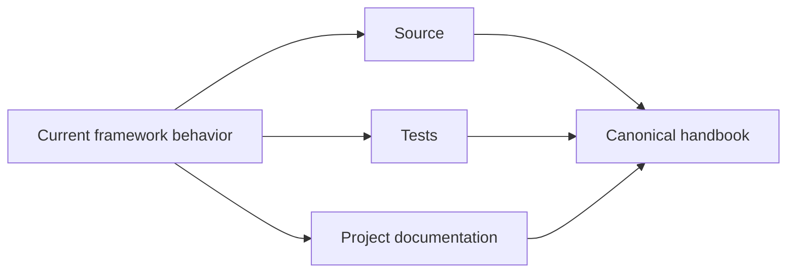
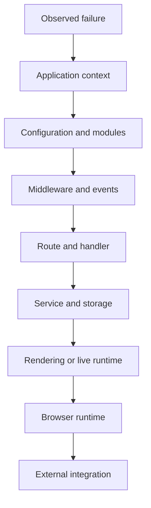

# Volume XIV — Quality and Diagnostics

## Chapter 20 — Testing, Debugging, and Source-Driven Diagnosis

**Evidence:** `spp/tests/`, module tests, `docs/spp-cli-manual.md`, debugging utilities under `spp/core/`, and subsystem implementations.

A framework gives an application many useful layers. That also means a failure may come from several places.

The solution is not to memorize the entire framework.

The solution is to learn how to reduce a problem to the smallest subsystem that can explain it.

---

## 20.1 What is a test?

A test is a repeatable program that checks expected behavior.

For a simple function:

```php
assert(2 + 2 === 4);
```

A useful application test is closer to:

```text
Given a logged-in user
When the user creates a valid task
Then the task is persisted
And the expected event is triggered
```

SPP contains framework and module tests. Those tests are also valuable documentation because they record behaviors the project actively checks.

---

## 20.2 Source versus tests versus documentation

Use three kinds of evidence differently:

| Evidence | What it tells you |
|---|---|
| Source | What the current implementation does |
| Tests | What behavior is actively asserted |
| Documentation | How the project explains or intends the feature to be used |

When they disagree, executable source and tests deserve priority for claims about current behavior.



---

## 20.3 Do not debug the whole framework

Suppose the browser returns `403 Forbidden`.

Possible causes include:

- authentication;
- authorization;
- global middleware;
- route middleware;
- application logic;
- an event listener; or
- an external integration.

The first task is to identify the earliest layer capable of producing that symptom.

---

## 20.4 The SPP debugging ladder

Use the runtime boundaries as a diagnostic ladder:



If the wrong application is selected, debugging the template is premature.

If the PHP service is correct but the browser DOM is wrong, debugging the database is probably premature.

---

## 20.5 Wrong application context

If `/reports` shows output from the wrong application, start with:

```php
\SPP\Scheduler::getContext();
```

Then inspect:

- application `base_url` configuration;
- application discovery;
- context detection; and
- context-enforcement/route-resolution events.

Only after the correct application is selected should route debugging begin.

---

## 20.6 Service resolution failures

If the container cannot construct a service, ask:

1. Does the class exist?
2. Is it instantiable?
3. Are constructor dependencies typed and resolvable?
4. Is an explicit binding required?
5. Are you resolving through the intended application/container?

Chapter 3 traces the actual SPP resolution path, including reflection and recursive typed-dependency resolution.

---

## 20.7 Middleware short-circuiting

A middleware can return a response instead of calling `$next()`.

Therefore, if a controller never logs anything, the controller may be innocent.

A temporary diagnostic wrapper can be useful:

```php
error_log('before middleware');
$response = $next($request);
error_log('after middleware');
return $response;
```

If the first message appears and the second does not, the nested pipeline did not return normally.

---

## 20.8 Event listener failures

Use this checklist:

| Question | Layer |
|---|---|
| Is the event defined? | Event definition/configuration |
| Was `SPPEvent::boot()` completed? | Event runtime |
| Was the listener discovered? | YAML/attribute discovery |
| Was it registered? | Listener registry |
| Was propagation stopped? | `EventParams` |
| Did listener execution throw? | Listener body |

This narrows the search much faster than repeatedly changing listener code.

---

## 20.9 View failures

A missing or broken view can fail at several distinct stages:

```text
Application path
    ↓
View location
    ↓
View compilation
    ↓
Template execution
    ↓
Final response
```

SPPView treats location, compilation, and rendering as related but distinct responsibilities.

That distinction also matters for LiveComponent, whose render result can pass through SPPView compilation/execution paths.

---

## 20.10 LiveComponent initial render versus later interaction

A useful diagnostic clue is:

> The component renders initially, but clicking a button later fails.

The initial render has already demonstrated that the PHP component and render path can execute.

Focus next on:

1. browser request generation;
2. SPP Live transport;
3. state hydration/signature validation;
4. action execution; and
5. update response handling.

This is why LiveComponent and SPP Live are separate handbook chapters.

---

## 20.11 SPPUX failures

If the server-side state is correct but the browser shows the wrong UI, move into the SPPUX layers:

- signals/computed state;
- scheduler/batching;
- event delegation;
- template creation; and
- DOM reconciliation.

A client-side reconciliation problem should not automatically send you back to the PHP controller.

---

## 20.12 Database/query diagnosis

When query logging is available, use it during controlled performance investigation.

For example, `SPP_XDB` exposes:

```php
SPP_XDB::enableQueryLog();
$log = SPP_XDB::getQueryLog();
```

The useful question is not “Is the database slow?” but:

> Which query executed, how long did it take, and how often did it run?

Measured evidence is far more useful than guessing.

---

## 20.13 Cache debugging

When output is stale, distinguish:

```text
Wrong source data
```

from:

```text
Correct source data + stale cached result
```

Check:

1. whether caching is enabled;
2. which key is used;
3. lifetime/expiration;
4. relevant invalidation tags; and
5. whether a mutation invalidated the affected entries.

Do not rewrite business logic to compensate for an unexamined caching problem.

---

## 20.14 Test at the smallest useful layer

A healthy test strategy uses different scopes for different questions:

| Test | What it should prove |
|---|---|
| Unit | One class or rule behaves correctly |
| Service/integration | Application logic and dependencies cooperate |
| Route | Request dispatch reaches the expected destination |
| Live/UI | Rendering and interaction work |
| End-to-end | A complete user journey succeeds |
|

Not every feature needs every test type. The goal is diagnostic precision: a failing test should tell you which boundary failed.

---

## 20.15 Deterministic test data

A test should not depend on uncontrolled production state.

Prefer controlled fixtures and explicit setup so that the same input gives the same expected result.

This matters particularly for:

- roles and permissions;
- workflows;
- database records;
- module configuration; and
- component state.

---

## 20.16 Debug mode and production safety

Debug behavior can expose useful diagnostic information during development.

Before enabling broad debug output in production, review whether it can reveal:

- passwords;
- authentication tokens;
- cookies/session state;
- internal service information; or
- personal data.

The repository contains debug logging inside runtime/security components, so logging configuration must be treated as an operational concern, not merely a developer convenience.

---

## 20.17 The one-layer-at-a-time rule

When debugging a difficult application, use this sequence:

```text
Confirm context
→ confirm configuration
→ confirm modules
→ confirm middleware/events
→ confirm route
→ confirm handler
→ confirm service
→ confirm storage
→ confirm rendering/live runtime
→ confirm browser integration
```

Change one layer at a time. Otherwise, when the problem disappears you may not know which change solved it.

---

## 20.18 Coming from other frameworks

### Laravel / Symfony

The diagnostic strategy is similar: find the first framework layer that can explain the symptom, then move downward only after it is known-good.

### Django

Think in terms of application selection, middleware, URL dispatch, view/service, data access, template, and browser behavior.

### React / Vue

SPP adds a crucial server/client distinction: LiveComponent runs server-side PHP, while SPPUX runs in the browser. A browser symptom does not automatically imply a PHP bug.

---

## Kernel Hacker note

SPP debugging becomes tractable when the runtime is treated as a set of boundaries rather than one framework object.

Scheduler, App, Registry, Module, SPPEvent, MiddlewareKernel, SPPView, LiveComponent, SPP Live, SPPUX, database adapters, and integration bridges each have a different responsibility.

When the symptom is assigned to the correct boundary, source search becomes dramatically smaller.

### Source map

- `spp/tests/`
- `spp/core/`
- `spp/modules/spp/`
- `docs/spp-cli-manual.md`
- subsystem-specific tests and diagnostics
