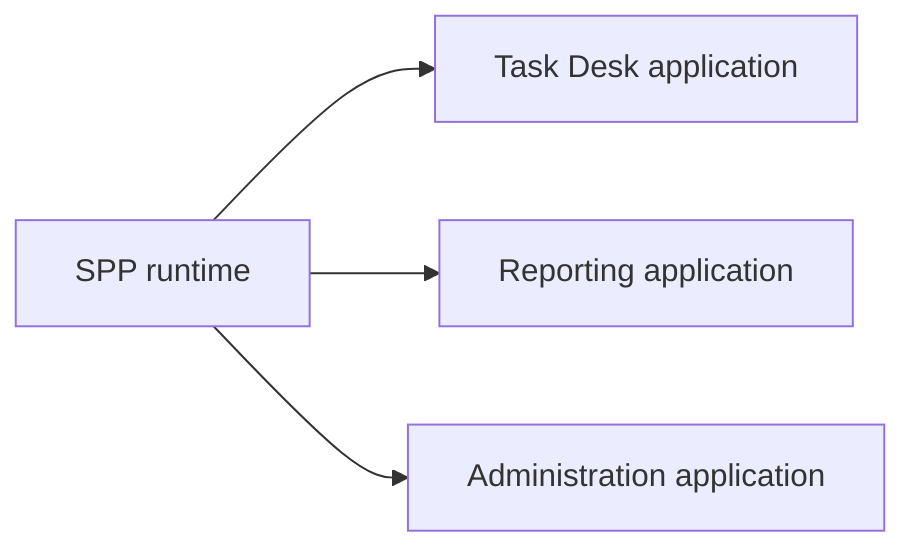
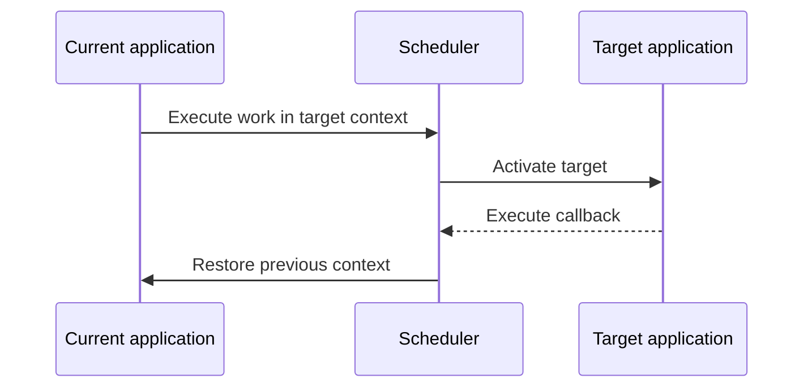
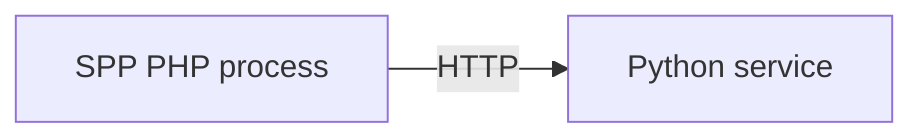
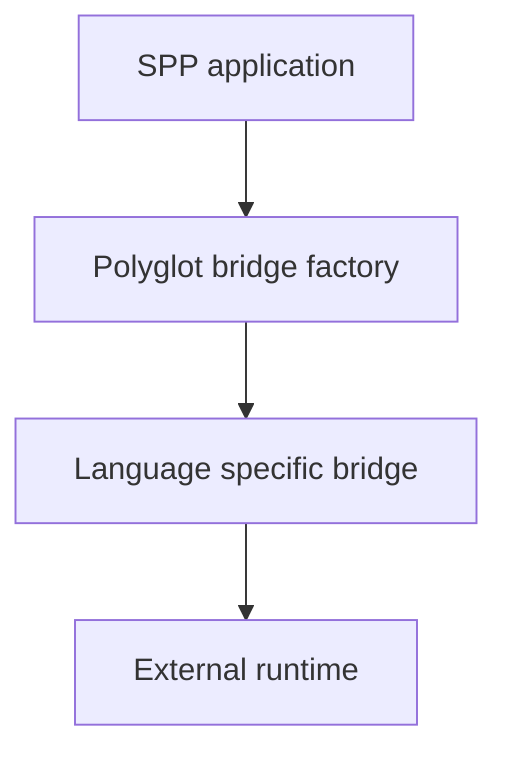
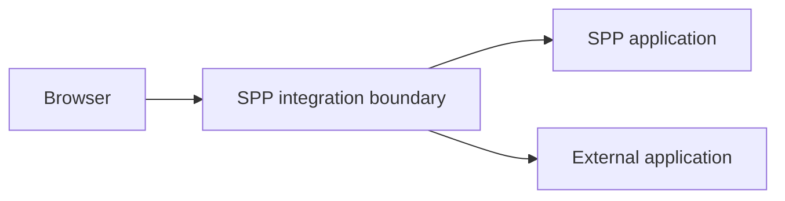
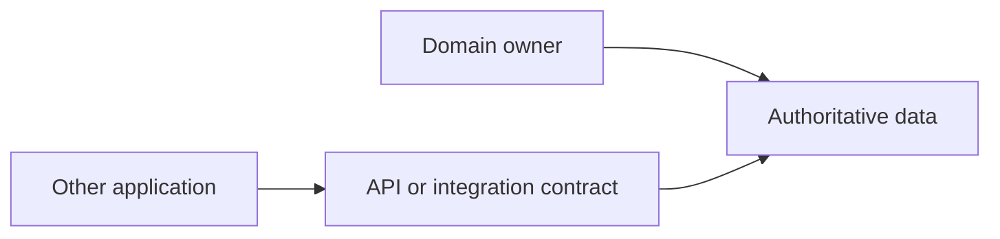
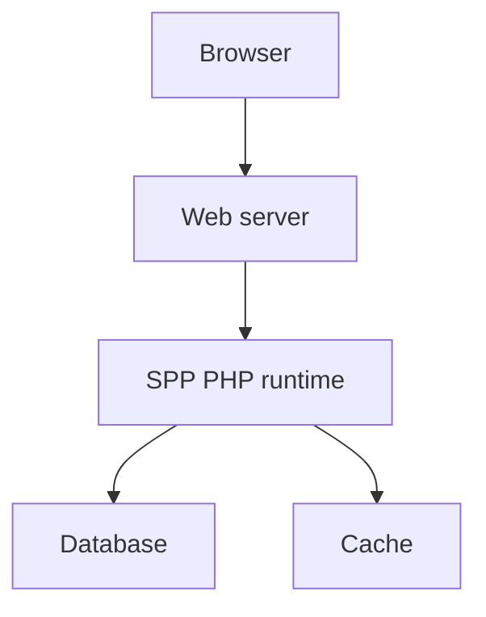
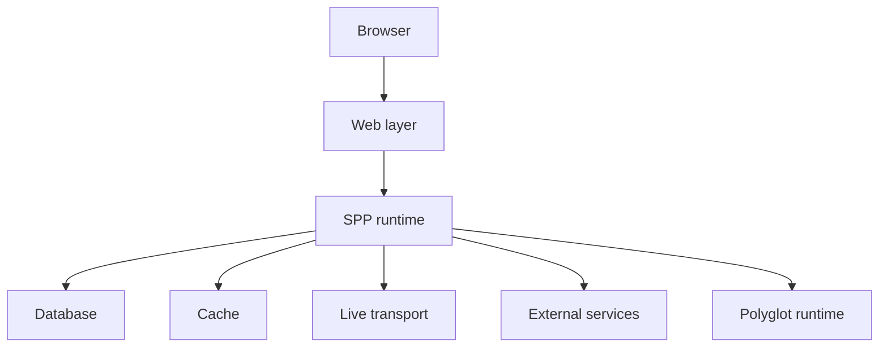

# Volume XV — Enterprise Architecture

## Chapter 21 — Multi-Application, Polyglot, IPC, and Deployment Architecture

**Evidence:** Scheduler/application source, Polyglot bridge classes, external-application integration material, SPP Live/Drishyam runtime, and deployment-related tooling in the repository.

Enterprise architecture is not a synonym for “add more servers”. It means deciding where responsibilities live, which boundaries are real, and what happens when a dependency is unavailable.

This chapter assumes the reader already understands the basic SPP application model from the previous chapters.

---

## 21.1 When one application is enough

Start with one application when one team can own the domain, one configuration boundary is sufficient, and separate deployment or failure isolation is not yet justified.

SPP does not require every feature to become a separate application or service.

A modular application is often the simplest place to begin.

---

## 21.2 When multiple SPP applications become useful

A larger system may contain applications such as:



The Scheduler can register multiple `App` objects and maintain one active application context.

This gives an **in-process application boundary**.

It does not provide operating-system process isolation.

That distinction must remain explicit:

| Boundary | What it provides |
|---|---|
| SPP application context | Application/runtime separation inside the SPP runtime |
| OS process | Separate memory/process failure boundary |
| Network service | Independent runtime reached through a protocol |

---

## 21.3 Why split applications?

Good reasons include:

- different domain ownership;
- substantially different module sets;
- separate URL spaces and application configuration;
- independent operational lifecycle; or
- coexistence with a legacy or externally owned application.

Bad reasons include:

- “microservices are fashionable”;
- two directories happen to exist; or
- one class has become large.

Use modules and normal application boundaries before introducing additional network/process complexity.

---

## 21.4 In-process context switching

`Scheduler::withContext()` is useful when one SPP runtime needs to execute code using another registered application's context and then return to the previous context.

Conceptually:



The expert rule is simple:

> Context switching is not the same thing as process isolation.

Do not use it as a substitute for a real process/network boundary when fault or security isolation is required.

---

## 21.5 What is IPC?

**Inter-process communication (IPC)** simply means one process communicating with another.

IPC is a category, not one specific protocol.

A deployment could use:

- HTTP;
- WebSocket;
- a local socket;
- a queue;
- Redis-backed coordination; or
- a language-specific bridge.

Therefore the architecture should say **which protocol is used**, not merely “IPC”.

For example:



is far more precise than:

```text
SPP → IPC → Python
```

---

## 21.6 Polyglot architecture

SPP contains a polyglot bridge abstraction and language-specific bridge classes. The purpose is to give PHP application code a common integration boundary while the actual external runtime may differ.



The repository contains bridge/runtime assets for several languages. The exact protocol, serialization, worker model, and failure behavior must be taken from each concrete bridge implementation.

Do not infer those details merely from the bridge class name.

---

## 21.7 External non-SPP applications

An external application does not have to be converted into an SPP module.

This matters when integrating an existing platform such as a legacy CMS or another independently maintained system.

The boundary can look like:



The external application remains the owner of its own runtime and business rules.

An adapter can provide SPP-specific routing, service, or protocol integration without pretending the external system is native SPP code.

---

## 21.8 Choosing the right boundary

| Situation | Prefer first |
|---|---|
| Reusable SPP feature | Module |
| Separate SPP domain/application | Application context |
| Different language | Polyglot/service boundary |
| Legacy external platform | Integration adapter |
| Interactive server-side PHP UI | LiveComponent + SPP Live |
| Browser-local state | SPPUX |

This is architectural guidance, not a claim that SPP automatically creates every listed integration.

---

## 21.9 Cross-boundary contracts

Every external boundary needs an explicit contract.

| Contract | Question |
|---|---|
| Input schema | What is allowed to cross the boundary? |
| Output schema | What comes back? |
| Authentication | Who may call it? |
| Authorization | What may the caller do? |
| Timeout | How long may the caller wait? |
| Retry | Which failures are safe to repeat? |
| Idempotency | Can the same operation safely execute twice? |
| Error representation | How are failures communicated? |
| Observability | How can one request be traced across the boundary? |

These contracts belong to the integration implementation, not to the word “polyglot” itself.

---

## 21.10 Data ownership

A common enterprise anti-pattern is allowing multiple applications to write the same domain tables without agreeing on ownership.

Prefer one clear owner:



The consuming application uses the owning domain's contract rather than bypassing business rules through direct database writes.

This is recommended architecture, not a hard SPP rule.

---

## 21.11 Deployment topology

A simple deployment can look like:



A larger deployment can add live transport and external runtimes:



These are topology examples, not a mandatory SPP deployment diagram.

---

## 21.12 Failure isolation

Every added boundary introduces new failure modes.

For example:

```text
Browser → SPP → external service
```

Now the external service can be slow, unavailable, or return invalid data.

For each dependency, decide what happens when it fails:

- immediate failure;
- cached/degraded response;
- queued retry;
- fallback implementation; or
- maintenance response.

A reliable enterprise design makes that decision intentionally.

---

## 21.13 Security boundaries

Cross-process and cross-runtime communication should be treated as a trust boundary even when all components run inside the same company network.

The receiving side should validate according to the actual transport, including where appropriate:

- authentication;
- authorization;
- input/schema validation;
- replay protection;
- rate limiting; and
- audit/observability.

The security chapter explains the distinction between framework mechanisms and general enterprise security guidance.

---

## 21.14 Live architecture in an enterprise system

LiveComponent and SPPUX solve different problems.


A deployment can use normal server-rendered pages for most of the application and use reactive runtimes only where interaction benefits from them.

That is usually simpler than making every page live.

---

## 21.15 Observability across boundaries

A distributed operation should be diagnosable from the originating request to the final dependency.

A practical enterprise design uses a correlation/request identifier and propagates it when the actual protocol permits this.

The handbook does **not** claim a universal built-in SPP correlation protocol unless the source proves one. Where no framework-specific mechanism is established, treat this as deployment guidance.

---

## 21.16 Coming from other architectures

### Monolith

Start with one SPP application and introduce modules for feature boundaries.

### Modular monolith

This maps naturally to SPP modules plus application context boundaries where required.

### Microservices

SPP does not require every feature to become a network service. Introduce network/process boundaries only when ownership, scaling, language, or fault isolation justifies them.

### Service-oriented architecture

Use explicit protocol contracts and adapters at service boundaries. Polyglot support is an implementation tool, not an architecture by itself.

---

## Kernel Hacker note

The most useful SPP architectural distinction is between **composition boundaries** and **failure boundaries**.

A module is primarily a composition mechanism.

An application context is a runtime/application boundary.

A separate process provides stronger failure and resource isolation.

A protocol boundary provides explicit interoperability.

A browser runtime is a different execution environment entirely.

Good architecture chooses the smallest boundary that provides the property actually required.

### Source map

- `spp/core/class.scheduler.php`
- `spp/core/Polyglot/`
- `spp/services/`
- `spp/modules/contrib/`
- `spp/modules/spp/spplive/`
- external application integration documentation
- deployment-related commands/configuration
