# Volume XVI — Complete Hands-On Tutorial

## Chapter 22 — From Plain PHP to SPP, LiveComponent, and SPPUX

**Purpose:** This is the canonical hands-on learning path for a reader who knows basic PHP but has never worked with a web framework.

The tutorial deliberately builds the same small business application several times. The goal is not to make the code artificially complicated. The goal is to let you see exactly **which problem each framework layer solves**.

The application used throughout the tutorial is a small **Task Desk**:

- users can sign in;
- users can see tasks;
- users can create/update tasks;
- task changes are validated and audited;
- an interactive task list can be upgraded to LiveComponent;
- selected client-side behavior can then be upgraded to SPPUX;
- an external service can be added without rewriting the core domain.

---

## 22.1 Before we begin: what are we actually building?

A web application receives input, performs work, and produces a result.

For a browser application, that often means:

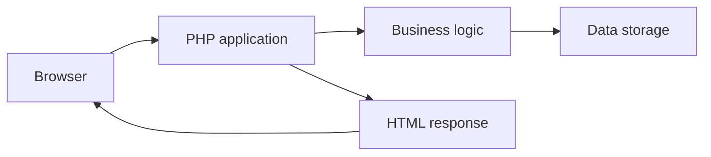

A framework provides reusable machinery around this loop.

SPP adds another important capability: the same application can later gain server-side live interaction and client-side reactive behavior without replacing the entire application architecture.

---

## 22.2 Stage 0 — Plain PHP

Before using SPP, build the smallest possible version.

### Directory

```text
plain-task-desk/
    public/
        index.php
    data/
        tasks.json
```

### Data

```json
[]
```

### PHP page

```php
<?php

$tasksFile = __DIR__ . '/../data/tasks.json';
$tasks = json_decode(file_get_contents($tasksFile), true) ?: [];

if ($_SERVER['REQUEST_METHOD'] === 'POST') {
    $title = trim($_POST['title'] ?? '');

    if ($title !== '') {
        $tasks[] = [
            'id' => count($tasks) + 1,
            'title' => $title,
            'done' => false,
        ];

        file_put_contents(
            $tasksFile,
            json_encode($tasks, JSON_PRETTY_PRINT)
        );
    }
}
?>

<!doctype html>
<html lang="en">
<head>
    <meta charset="utf-8">
    <title>Task Desk</title>
</head>
<body>
    <h1>Task Desk</h1>

    <form method="post">
        <input name="title" required>
        <button type="submit">Add task</button>
    </form>

    <ul>
        <?php foreach ($tasks as $task): ?>
            <li><?= htmlspecialchars($task['title'], ENT_QUOTES, 'UTF-8') ?></li>
        <?php endforeach; ?>
    </ul>
</body>
</html>
```

This application works. That is important.

The problem is not that plain PHP is “bad”. The problem is that as requirements grow, you have to design and maintain more infrastructure yourself.

---

## 22.3 What becomes difficult in plain PHP?

The first version has almost none of the concerns that appear in a production application.

Soon you need:

```text
Configuration
Authentication
Authorization
Validation
Routing
Services
Database abstraction
Modules/features
Events
Middleware
Logging
Caching
Testing
Background work
Live interaction
Client-side state
External integrations
```

A framework exists largely because developers repeatedly solve these problems.

SPP provides framework infrastructure for many of them.

---

## 22.4 Stage 1 — Convert the application into SPP

Create the application using the self-contained SPP layout described in the application-development guide.

```text
src/taskdesk/
    etc/
        app.yml
    init.php
    resources/
        views/
    serv/
    services/
    tests/
    var/
```

### `app.yml`

```yaml
base_url: /taskdesk
table_prefix: taskdesk_
shared_group: core
etc_path: etc
src_path: src/taskdesk
modules_path: modules
var_path: var
app_init: init.php
```

### `init.php`

```php
<?php

// Keep this file lightweight.
// Register only application bootstrap behavior here.
```

The Scheduler can now identify the application from its configured context and application definition.

---

## 22.5 What changed?

The browser has not changed.

The business problem has not changed.

The difference is that the application now participates in the SPP runtime.

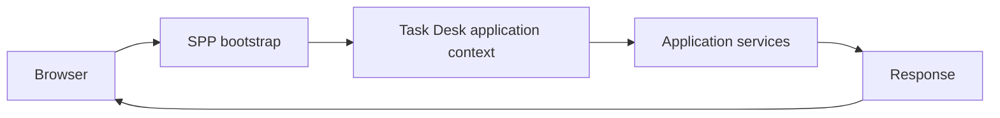

The framework now owns the infrastructure around the application instead of the application having to reinvent it.

---

## 22.6 Stage 2 — Extract business logic into a service

Create:

```text
src/taskdesk/services/TaskService.php
```

```php
<?php

namespace App\Taskdesk\Services;

class TaskService
{
    public function create(string $title): array
    {
        return [
            'title' => trim($title),
            'done' => false,
        ];
    }
}
```

This is intentionally small.

The architectural lesson is more important than the amount of code:

```text
Request-facing code
        ↓
TaskService
        ↓
Business rules
```

The request layer should coordinate the request. The service should own business behavior.

---

## 22.7 Stage 3 — Resolve the service through SPP

The application container can resolve services.

```php
$service = \SPP\App::getApp()->make(
    \App\Taskdesk\Services\TaskService::class
);
```

This is dependency injection in practical terms.

You can now change the construction of `TaskService` without putting the construction logic into every caller.

---

## 22.8 Stage 4 — Create a request-facing handler

Create:

```text
src/taskdesk/serv/TaskController.php
```

```php
<?php

namespace App\Taskdesk\Serv;

use App\Taskdesk\Services\TaskService;

class TaskController
{
    public function index(TaskService $service): string
    {
        $task = $service->create('First SPP task');

        return '<h1>' . htmlspecialchars(
            $task['title'],
            ENT_QUOTES,
            'UTF-8'
        ) . '</h1>';
    }
}
```

Call it through the application runtime when your application routing path invokes the method:

```php
$app = \SPP\App::getApp();

$html = $app->call([
    \App\Taskdesk\Serv\TaskController::class,
    'index',
]);
```

---

## 22.9 Stage 5 — Add a view

Move presentation into:

```text
src/taskdesk/resources/views/tasks.blade.php
```

```blade
<!doctype html>
<html lang="en">
<head>
    <meta charset="utf-8">
    <title>Task Desk</title>
</head>
<body>
    <h1>Task Desk</h1>

    @foreach ($tasks as $task)
        <article>{{ $task['title'] }}</article>
    @endforeach
</body>
</html>
```

At this point you can see the purpose of the SPPView layer:

```text
Application data
      ↓
SPPView / rendering layer
      ↓
HTML
```

Chapter 6 explains why SPPView is broader than “Blade syntax”.

---

## 22.10 Stage 6 — Add persistence

Replace the temporary JSON store with a database-backed implementation.

The exact database engine can vary. The SPPDB layer gives application code a higher-level database contract, while XDB is one concrete backend family.

A good architecture is:

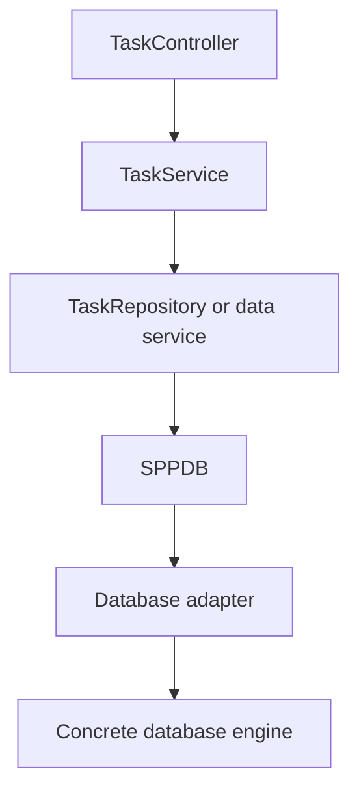

Do not let every controller build SQL strings directly.

---

## 22.11 Stage 7 — Add validation

A task title should not be empty.

Validation belongs near the boundary where invalid data enters the system, but important business invariants should also be protected by the business layer.

That gives two levels:

```text
Request validation
        ↓
Business invariant validation
        ↓
Persistence
```

The SPPView form/validator subsystem can participate in user-input validation; services remain responsible for business rules that must hold regardless of the UI.

---

## 22.12 Stage 8 — Add authentication

Now the application needs a logged-in user.

Use SPPAuth rather than manually inventing session checks in every controller.

Conceptually:

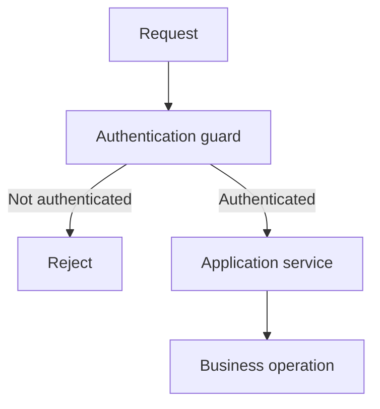

The application can then use authorization checks such as `SPPAuth::can()` where the business operation requires permission.

---

## 22.13 Stage 9 — Add middleware

A cross-cutting request rule can now be placed into middleware.

For example, a feature might require login before it reaches its route.

The middleware runs outside the business service:

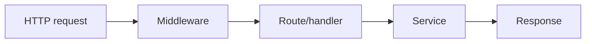

This is preferable to repeating the same request-level check in every handler.

---

## 22.14 Stage 10 — Add events

Suppose every successful task creation must trigger an audit action.

Do not necessarily put audit logic directly inside every controller.

Instead, define an event boundary where the application architecture makes sense.

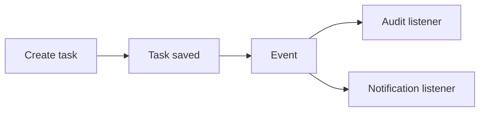

SPPEvent supports more than a simple notification mechanism, including priorities and propagation control.

---

## 22.15 Stage 11 — Package a real feature as a module

Once the Task Desk contains enough reusable behavior, package a feature into an SPP module.

For example:

```text
modules/taskreporting/
    module.yml
    module.php
    events/
    resources/
    services/
```

The manifest describes the module, dependencies, included resources, and configuration metadata.

The module compiler discovers active modules, resolves their dependencies, and builds normalized runtime metadata.

This is the point where you stop thinking of a module as “just another folder”. It is a framework-recognized feature unit.

---

## 22.16 Stage 12 — Upgrade one region to LiveComponent

Now choose a part of Task Desk that genuinely benefits from live interaction.

A good candidate is:

> a filterable task list with inline completion.

Do not convert the entire site.

Create a LiveComponent that owns the interactive state.

The architecture becomes:

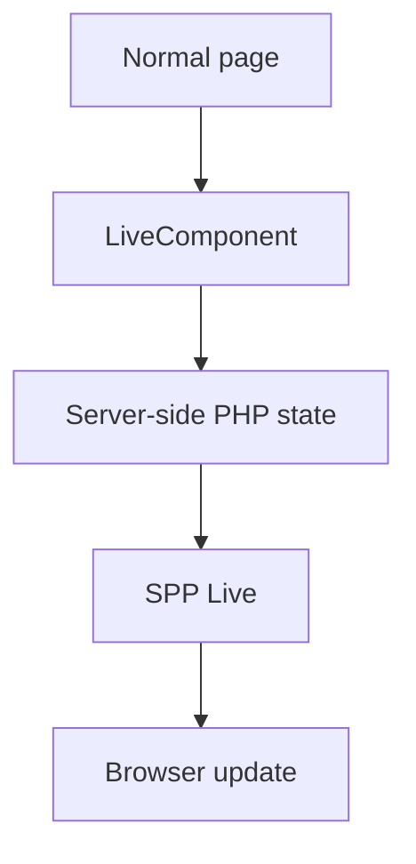

The normal application remains a normal SPP application. LiveComponent is an additional capability for the interactive region.

---

## 22.17 Understand the LiveComponent lifecycle

On first rendering, the component is created, booted, mounted, its public state is snapshotted/dehydrated, state is signed, and the component output is rendered.

On later interaction, the transport reconstructs the component state and invokes the appropriate action path.

The exact state rules are described in Chapter 7.

The key beginner lesson is:

> A LiveComponent is still PHP code running on the server. The browser does not execute the PHP component itself.

---

## 22.18 Stage 13 — Choose a live transport

The component model is deliberately separated from transport.

SPP Live contains multiple engines/handlers, including AJAX fallback, SQLite, Redis, WebSocket, and SSE-related support in the repository.

You should choose a transport based on operational needs, not because one transport sounds more “advanced”.

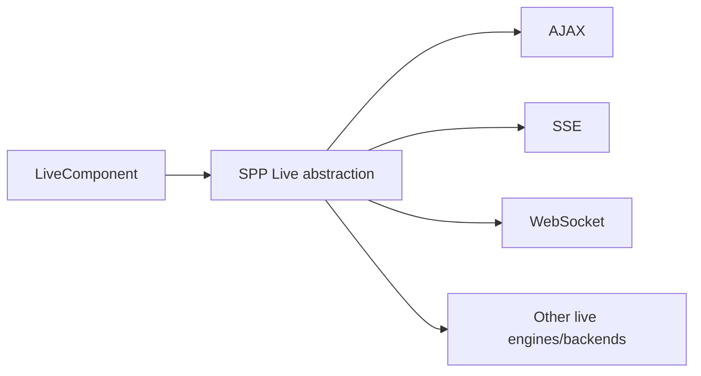

---

## 22.19 Stage 14 — Add SPPUX for client-local reactivity

Now suppose the Task Desk needs a client-only interaction, such as:

- local filter state;
- keyboard interaction;
- instant UI expansion/collapse;
- client-side derived display state.

That is a good candidate for SPPUX.

SPPUX is JavaScript running in the browser.

The distinction is:

```text
LiveComponent
    server-side PHP state

SPPUX
    browser-side JavaScript state
```

Do not put everything into SPPUX just because reactive UI is available.

---

## 22.20 Stage 15 — Understand the SPPUX runtime

The current runtime includes:

- `Signal`;
- `Computed`;
- effects;
- batching;
- asynchronous scheduling;
- tagged-template rendering;
- event delegation;
- keyed reconciliation;
- error boundaries; and
- a bridge into the broader SPP environment.

A simplified update path is:

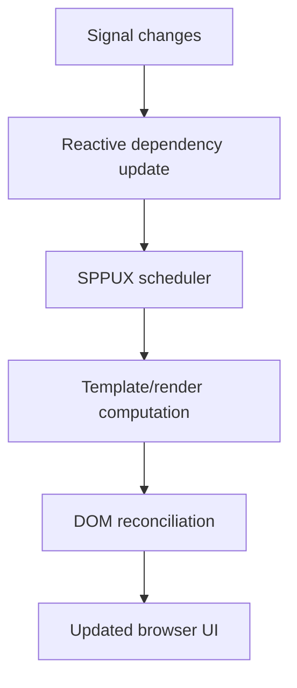

The exact dependency graph and reconciliation behavior are defined by the JavaScript source and should be studied in the Nerd SPPUX chapter.

---

## 22.21 Stage 16 — Add an external service

Suppose Task Desk calls a Python service to classify task descriptions.

Do not turn the Python service into a PHP class just to make the architecture look uniform.

Use an explicit integration boundary.

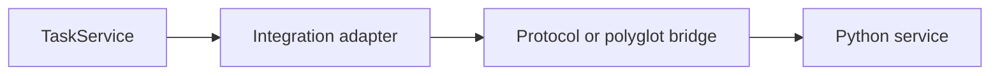

The adapter should define a stable application-facing contract.

---

## 22.22 Stage 17 — Add multiple SPP applications

Suppose the system later separates:

```text
/taskdesk
/reporting
/admin
```

into separate SPP applications.

The Scheduler can host registered `App` objects and select the active context.

The new topology is:

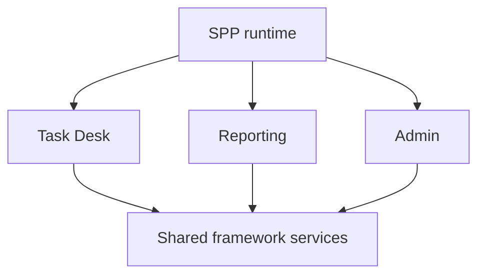

Remember: same runtime does not mean same application context.

---

## 22.23 Stage 18 — Decide where enterprise boundaries belong

At this point the application contains many capabilities.

Do not respond by making everything a separate microservice.

Choose boundaries deliberately:

| Requirement | Boundary to consider |
|---|---|
| Reusable SPP feature | Module |
| Separate domain/application | App context |
| Different language | Polyglot/external service |
| Browser reactivity | SPPUX |
| Server-side live interaction | LiveComponent + SPP Live |
| Legacy system | Integration adapter |

---

## 22.24 Stage 19 — Test the application at each boundary

Do not wait until the whole architecture is complete.

Test after each stage:

```text
Plain PHP behavior
    ↓
SPP application behavior
    ↓
Service/container behavior
    ↓
Database behavior
    ↓
Authentication/authorization
    ↓
Events/middleware
    ↓
LiveComponent
    ↓
SPP Live transport
    ↓
SPPUX
    ↓
External integration
```

This makes failures much easier to localize.

---

## 22.25 What should remain plain PHP?

Not every class needs framework magic.

Keep simple domain objects and deterministic algorithms simple.

Use SPP where you need framework capabilities such as:

- application contexts;
- dependency injection;
- modules;
- events;
- middleware;
- rendering;
- authentication;
- database abstractions;
- live components; or
- client/runtime integration.

A framework should reduce complexity, not make simple code complicated.

---

## 22.26 Complete architecture after the tutorial

By the end, the Task Desk may look like this:

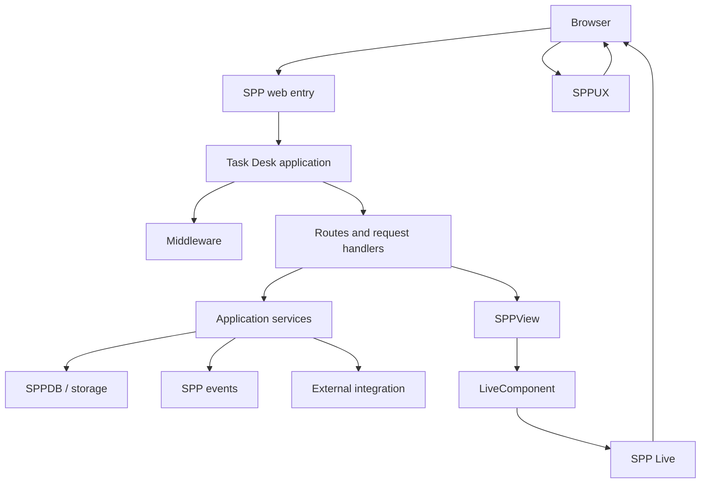

Do not interpret this diagram as one mandatory architecture. It is the result of progressively adding capabilities where the application actually needs them.

---

## 22.27 The most important lesson

You did not need a framework to write the first PHP program.

You needed a framework when the application began acquiring repeated infrastructure problems.

SPP's job is to provide reusable runtime architecture around those problems while allowing the application to remain organized into understandable boundaries.

The most useful SPP question is therefore not:

> “What feature can I use?”

It is:

> **“What problem does this framework feature solve, and is this application actually experiencing that problem?”**

---

## Kernel Hacker track

After completing the tutorial, go back through the source maps for each layer:

1. `spp/core/class.scheduler.php`
2. `spp/core/class.app.php`
3. `spp/core/class.registry.php`
4. `spp/core/class.container.php`
5. `spp/core/class.sppevent.php`
6. `spp/core/class.middlewarekernel.php`
7. `spp/core/class.pipeline.php`
8. `spp/core/class.modulecompiler.php`
9. `spp/modules/spp/sppview/class.viewcompiler.php`
10. `spp/modules/spp/sppview/class.livecomponent.php`
11. `spp/modules/spp/spplive/`
12. `spp/modules/spp/drishyam/js/core/`
13. `spp/core/Polyglot/`
14. database adapters and XDB engines

At that point the architecture should no longer look like a collection of unrelated framework features. Each subsystem should make sense as a response to a concrete application problem.
