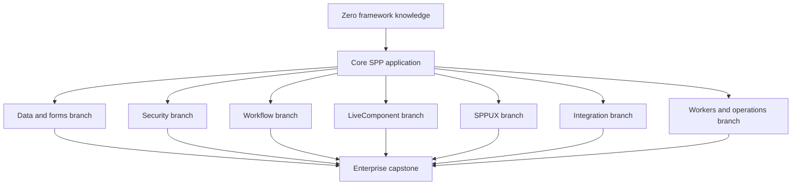

# Volume XVII — The Complete SPP Tutorial Curriculum

## Chapter 24 — How to Learn SPP by Building Real Applications

The handbook now has enough architectural coverage to support a much stronger tutorial program.

A single application is **not** the best way to teach every SPP capability.

A single application is excellent for teaching the common runtime path:

```text
PHP
  ↓
SPP application
  ↓
context and bootstrap
  ↓
services and container
  ↓
routing and middleware
  ↓
events and modules
  ↓
views
```

But some SPP capabilities have fundamentally different goals:

- database/entity work is different from browser reactivity;
- workflow orchestration is different from authentication;
- polyglot integration is different from SPPUX;
- background workers are different from HTTP request handling;
- enterprise multi-application deployment is different from teaching the first page.

Trying to put all of them into one tutorial makes the tutorial harder to follow, not better.

The recommended solution is therefore a **core tutorial plus branches**.

---

## 24.1 The core principle

Every tutorial branch begins from a concept the reader already understands from the previous branch.

The curriculum is therefore progressive rather than a collection of unrelated sample projects.



The **Enterprise Capstone** combines the capabilities after they have each been learned separately.

---

## 24.2 Tutorial 0 — PHP before frameworks

**Audience:** Someone who knows basic PHP syntax but has never used a framework.

**Goal:** Understand why framework infrastructure exists.

Build a tiny application without SPP.

It should have:

- one public entry point;
- one form;
- one data file;
- manual validation;
- manual object creation;
- manual HTML rendering; and
- a second page.

The reader should intentionally experience the repetition.

### Lessons

The tutorial introduces the words only after the problem appears:

- application;
- request;
- response;
- routing;
- service;
- configuration;
- middleware;
- event;
- module;
- template.

### Completion test

The learner can explain, without using framework terminology:

> “A framework is software that provides reusable infrastructure around my application.”

---

## 24.3 Tutorial 1 — First SPP application

**Project:** `Task Desk`

This is the main linear tutorial.

Build:

- application definition;
- Scheduler/application context;
- application initialization;
- configuration;
- a service;
- request-facing code;
- routing;
- middleware;
- events;
- a view;
- one application-local module;
- basic tests.

The learner should not use every advanced feature yet.

### Branch point

At the end of Tutorial 1 the learner has a clean SPP mental model and can choose the next branch without confusion.

---

## 24.4 Tutorial 2 — Data, entities, forms, and validation

**Project:** `Student Registry`

This branch concentrates on application data instead of runtime architecture.

### Build

A student-management application with:

- entity/model objects;
- database access through SPPDB;
- XDB as one storage option;
- schema/migration concepts where supported;
- query building;
- create/read/update/delete operations;
- forms;
- validation;
- error display;
- pagination/search;
- asset inclusion for the UI.

### Deep-dive topics

The tutorial explains the difference between:

```text
HTTP input
    ↓
Form/input validation
    ↓
Business validation
    ↓
Data persistence
```

It also explains why validation at the UI boundary is not enough to protect business invariants.

### Advanced branch

Introduce:

- cache-backed queries;
- schema inspection;
- data adapters;
- storage-specific behavior.

### Completion test

The learner can create a real CRUD feature without putting SQL, validation, and HTML into one controller.

---

## 24.5 Tutorial 3 — Authentication, authorization, and administration

**Project:** `School Administration Portal`

This branch teaches security as an architecture, not as a login form.

### Build

- user authentication;
- web guard;
- API guard concepts;
- login/logout;
- session handling;
- roles;
- rights/permissions;
- group-based permission inheritance;
- middleware protection;
- resource-level authorization;
- audit logging;
- administrator screens.

### Important teaching sequence

The learner first builds:

```text
Login
  ↓
Authenticated user
```

Then:

```text
Authenticated user
  ↓
Permission
  ↓
Allowed operation
```

Then:

```text
Permission
  +
Resource/context
  ↓
Authorization decision
```

This prevents the common beginner mistake of treating “logged in” as equivalent to “authorized”.

### Security lab

Intentionally attempt:

- unauthorized URL access;
- direct form submission without UI permission;
- modified IDs;
- invalid tokens;
- session revocation scenarios.

The learner then sees why security must live at the server boundary.

---

## 24.6 Tutorial 4 — Events and modular architecture

**Project:** `School Operations Platform`

This branch teaches how a larger feature stops being a collection of directly coupled classes.

### Build

Start with one large feature and gradually split it into modules.

Then introduce events for:

- record creation;
- approval notifications;
- audit actions;
- reporting updates;
- module-to-module integration.

### Event exercises

The learner should implement and observe:

1. normal listeners;
2. listener priority;
3. before/main/after stages;
4. payload mutation through event parameters;
5. propagation stopping;
6. default handlers;
7. override handlers where the implementation supports them.

### Module exercises

Then split the project into modules with dependencies and intentionally create:

- a missing dependency;
- a circular dependency;
- an inactive module;
- a module configuration error.

The goal is to make the module compiler and event architecture visible through real debugging.

---

## 24.7 Tutorial 5 — Workflow and human approval

**Project:** `Purchase Approval System`

SPP's workflow subsystem deserves its own branch because workflow is not just a database status field.

The repository contains workflow orchestration code, an approval chain, wizard support, timeout processing, and workflow-specific commands/tutorial material. fileciteturn183file0L1-L5 fileciteturn183file6L31-L35 fileciteturn183file7L36-L40

### Build

```text
Draft
  ↓
Submitted
  ↓
Manager approval
  ↓
Finance approval
  ↓
Approved
  ↓
Purchased
```

### Exercises

- approval chains;
- role-based approvers;
- wizard-style progression;
- rejected transitions;
- timeouts;
- retry/reprocessing;
- audit trail;
- event hooks around transitions.

### Why this branch matters

It teaches the difference between:

```text
CRUD state
```

and:

```text
business process state
```

It also gives the learner a realistic enterprise use case for events, security, database persistence, and user interfaces at the same time.

---

## 24.8 Tutorial 6 — SPPView, BladeOne, ViewTags, and forms

**Project:** `Content and Portal Builder`

This branch is dedicated to the presentation stack.

### Build progressively

1. plain PHP output;
2. Blade-compatible template;
3. extended BladeOne behavior;
4. SPPView locator/renderer;
5. ViewTags;
6. reusable PHP components;
7. forms and validation;
8. themes/assets;
9. Drishyam integration.

### Teaching rule

Do not start by saying “here is a Blade directive”.

First explain:

> The browser needs HTML, but application code should not become a giant collection of string concatenations.

Then show how the SPP presentation stack solves that problem.

---

## 24.9 Tutorial 7 — LiveComponent

**Project:** `Live Support Desk`

This branch teaches server-side reactive UI from first principles.

### Build

Start with an ordinary server-rendered ticket list.

Then add:

- interactive filtering;
- search;
- inline status changes;
- pagination state;
- validation;
- component actions;
- event dispatch;
- computed values;
- lazy rendering;
- isolated rendering;
- streaming;
- downloads.

### Explicit state lesson

The learner must understand the difference between:

```text
Initial PHP request
```

and:

```text
Later component interaction
```

The tutorial then traces the lifecycle and state transfer instead of treating “reactivity” as magic.

---

## 24.10 Tutorial 8 — SPP Live transports

**Project:** Reuse the Support Desk from Tutorial 7.

Do not build a second business application merely to learn transport.

Instead, keep the same LiveComponent and change the runtime transport.

### Labs

- AJAX fallback;
- SSE;
- WebSocket;
- Redis-backed live infrastructure;
- SQLite-backed live infrastructure;
- uploads and downloads where implemented.

### Experiment

Run the same component with different transport choices and record:

| Concern | What changes? |
|---|---|
| Component PHP code | Should remain mostly stable |
| Browser transport | Changes |
| Operational dependencies | Changes |
| Failure modes | Changes |
| Scaling considerations | Changes |

This makes the component/transport separation tangible.

---

## 24.11 Tutorial 9 — SPPUX

**Project:** `Analytics Dashboard`

This branch begins with a normal server-rendered dashboard.

Then introduce one browser-local interaction at a time.

### Labs

1. signal;
2. computed state;
3. effect;
4. batching;
5. scheduler;
6. tagged-template rendering;
7. event delegation;
8. keyed reconciliation;
9. error boundaries;
10. bridge/live integration.

### Architecture exercise

For every piece of state, decide:

> Should this state live on the server, in the browser, or on both sides with an explicit synchronization boundary?

That decision is the central lesson of SPPUX.

---

## 24.12 Tutorial 10 — Polyglot integration

**Project:** `Intelligent Document Portal`

The main SPP application receives a document and asks another runtime to perform a specialized operation.

Possible branches include the language/runtime integrations represented in the repository.

### Build

- PHP application service;
- integration adapter;
- polyglot bridge;
- serialization contract;
- timeout handling;
- error mapping;
- worker mode where applicable;
- asynchronous execution where applicable;
- observability.

### Language branches

The same domain operation can then be implemented through selected language-specific bridges.

The learner should see that:

```text
Business API
```

stays stable while:

```text
Bridge implementation
```

changes.

---

## 24.13 Tutorial 11 — External application integration

**Project:** `Legacy Modernization Lab`

Use a small independent legacy application rather than rewriting everything in SPP.

### Labs

- route coexistence;
- adapter service;
- API integration;
- webhook ingress;
- shared authentication considerations;
- migration strategy;
- gradual feature replacement.

### Architectural lesson

The goal is to teach:

> You can integrate a legacy system without pretending it is an SPP module.

---

## 24.14 Tutorial 12 — Background work, queues, scheduled tasks, and long-running operations

**Project:** `Report Processing Center`

This branch handles work that should not block an HTTP request.

### Build

A report-generation feature that:

1. accepts a request;
2. creates a job;
3. queues background work;
4. processes it through a worker;
5. records progress;
6. exposes status to the browser;
7. allows retry/failure handling.

### Teach the distinction

```text
HTTP request
    ≠
long-running job
```

Then connect:

```text
Queue
  ↓
Worker
  ↓
Workflow/status
  ↓
LiveComponent or SPPUX dashboard
```

This creates a realistic bridge between backend operations and live UI.

---

## 24.15 Tutorial 13 — Caching, audit, diagnostics, and operations

**Project:** Harden one of the earlier applications rather than starting from scratch.

### Labs

- query caching;
- tag invalidation;
- cache debugging;
- request logging;
- audit logging;
- health/diagnostic commands;
- performance profiling;
- failure diagnosis.

### Exercise

Inject an intentionally stale cache, slow query, failing external service, and rejected workflow transition.

The learner then uses the debugging ladder to identify the correct framework boundary.

---

## 24.16 Tutorial 14 — Enterprise multi-application architecture

**Project:** Turn the tutorial suite into a small enterprise platform.

Create separate SPP applications for:

```text
/admin
/operations
/reporting
```

Use the Scheduler to manage application contexts.

Then introduce:

- application ownership;
- shared framework services;
- module ownership;
- internal integration boundaries;
- external services;
- failure isolation;
- deployment topology.

### Enterprise exercise

For each capability decide:

```text
Module?
Application context?
External process?
External application?
Browser runtime?
```

The learner is now making architectural decisions rather than merely using framework APIs.

---

## 24.17 Tutorial 15 — Enterprise capstone

**Project:** `Satya Enterprise Operations Platform`

The final capstone combines the previous branches.

### Required capabilities

- multiple SPP applications;
- modules;
- configuration;
- Registry/container;
- routing;
- middleware;
- authentication;
- authorization;
- forms;
- validation;
- database/SPPDB;
- XDB where appropriate;
- events;
- workflow;
- audit/logging;
- cache;
- background jobs;
- LiveComponent;
- at least two SPP Live transport scenarios;
- SPPUX client-reactive area;
- one polyglot integration;
- one external application integration;
- testing;
- diagnostics;
- production deployment design.

### The capstone rule

Do not introduce a feature simply to check a box.

Every feature must solve a real requirement in the fictional enterprise platform.

For example:

- workflow because approvals exist;
- LiveComponent because operators need interactive worklists;
- SPPUX because dashboards need client-local interaction;
- polyglot because a specialized service has a different runtime;
- multiple applications because ownership and operational boundaries require them.

---

## 24.18 What every tutorial chapter should contain

Every branch will use the same teaching template.

### Part A — Before SPP

What would a plain PHP developer have to build manually?

### Part B — The concept

Explain the framework term in ordinary language.

### Part C — Minimal SPP example

Use the smallest real SPP example that demonstrates the concept.

### Part D — Build a feature

Add the concept to the current tutorial project.

### Part E — Break it deliberately

Create a controlled failure and debug it.

### Part F — Inspect the source

Trace the relevant SPP class/implementation.

### Part G — Compare with other frameworks

Explain the conceptual mapping without pretending the APIs are identical.

### Part H — Enterprise version

Show what changes when the feature is used at larger scale.

### Part I — When not to use it

Explicitly explain when ordinary PHP or a simpler SPP facility is better.

---

## 24.19 “Use every feature” does not mean “put every feature everywhere”

The learner should finish the course able to make decisions such as:

> This is a normal server-rendered page; I do not need LiveComponent.

> This is local browser state; I do not need a server round trip.

> This is a reusable SPP feature; I should make a module.

> This is a different business domain; I should consider an application boundary.

> This is a specialized external runtime; I should use an integration/bridge boundary.

> This process is long-running; it should not block the HTTP request.

That judgment is more valuable than memorizing framework APIs.

---

## 24.20 Completion matrix

The final tutorial program should explicitly map SPP capabilities to learning projects:

| SPP capability | Tutorial |
|---|---|
| Framework basics | 0, 1 |
| App/context/Scheduler | 1, 14 |
| Registry/container | 1, 2 |
| Routing | 1, 2, 3 |
| Middleware | 1, 3, 14 |
| Events | 4, 5 |
| Modules | 4, 14 |
| SPPView | 2, 6 |
| BladeOne/Drishyam | 6 |
| Forms/validation | 2, 3 |
| Database/SPPDB/XDB | 2, 13, 15 |
| Authentication/authorization | 3, 15 |
| Workflow | 5, 12, 15 |
| Cache/logging/audit | 5, 13, 15 |
| LiveComponent | 7, 8, 15 |
| SPP Live | 8, 15 |
| SPPUX | 9, 15 |
| Polyglot | 10, 15 |
| External applications | 11, 15 |
| Workers/queues/scheduling | 12, 15 |
| Testing/debugging | Every branch, especially 13 and 15 |
| Enterprise deployment | 14, 15 |

The purpose of this matrix is to prevent important framework capabilities from becoming “reference-only” features that the learner has read about but never used.

---

## 24.21 Final learning outcome

A reader who completes the full curriculum should be able to do four things:

1. **Build** an SPP application without relying blindly on generators.
2. **Explain** how the application moves through the SPP runtime.
3. **Choose** the appropriate SPP feature for a given problem.
4. **Design** a multi-application, reactive, integrated enterprise system without turning every feature into an unnecessary abstraction.

That is the level of understanding this handbook is intended to produce.
