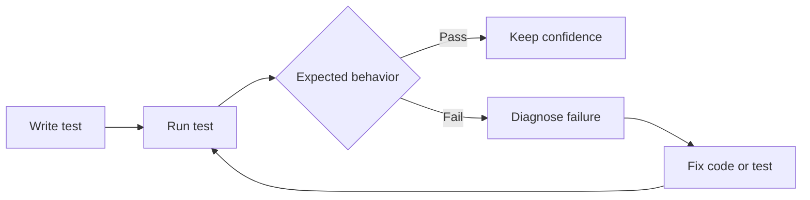
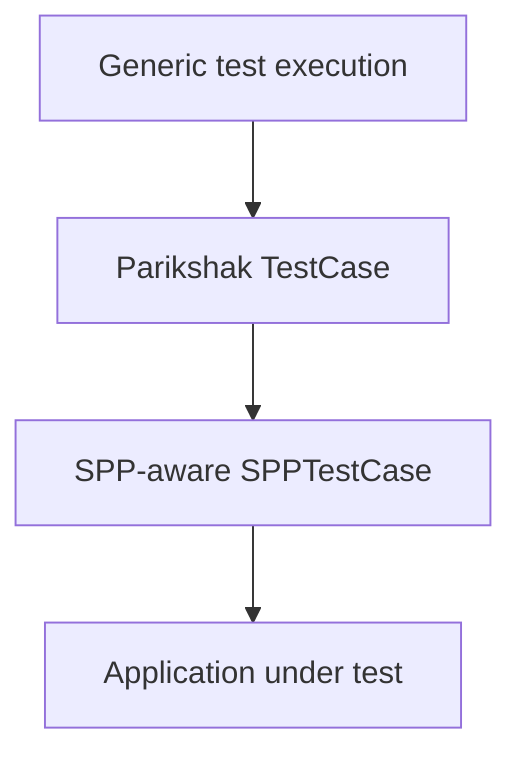
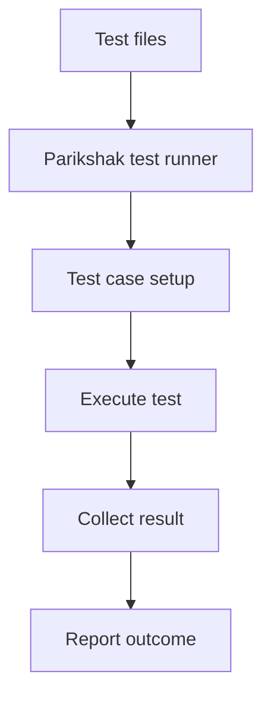
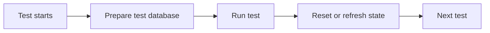
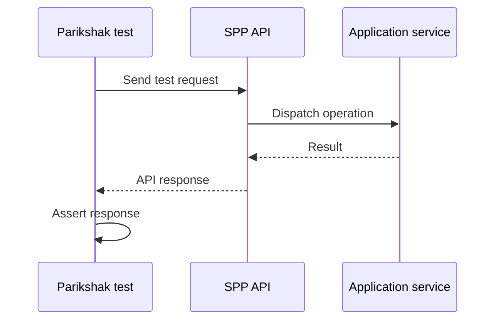
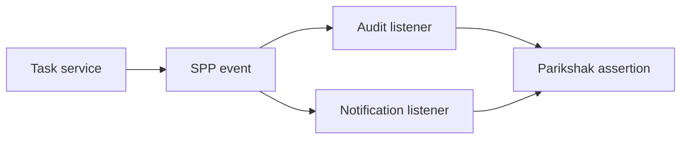
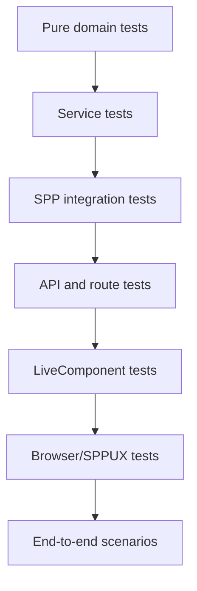

# Volume XVII — Parikshak

## Chapter 26 — Parikshak: SPP's Testing Framework

**Evidence:** `spp/modules/spp/parikshak/`, `documentation/framework/modules/parikshak.md`, Parikshak source classes, event namespace, Faker support, database refresh support, API interaction support, test runner, and related tests/documentation.

## 26.1 Why this chapter exists

A framework is not really understood until you can test applications built with it.

For SPP, that means learning **Parikshak**, not merely learning generic PHP testing vocabulary.

Parikshak is a first-class SPP module with its own testing abstractions and infrastructure. The repository contains a `TestCase`, `SPPTestCase`, `SPPTestRunner`, `SPPFactory`, `RefreshDatabase`, API interaction support, Faker support, and Parikshak event classes.

The important teaching rule is:

> Do not postpone Parikshak until the end of the handbook. Use it throughout the application tutorials.

---

## 26.2 What is a test?

A test is a small repeatable program that checks whether software behaves as expected.

For example, if a calculator should return four when given two plus two, a test asks the program to perform the operation and checks the result.

Application tests do the same thing at a larger scale.

A test may ask:

- Can an unauthenticated user access this page?
- Does middleware reject the request?
- Does an event listener run?
- Does a workflow reject an illegal transition?
- Does a service save the correct data?
- Does an API return the expected response?
- Does a LiveComponent action update its state correctly?

The framework does not remove the need to think about these questions. It gives you infrastructure for asking them repeatedly and reliably.

---

## 26.3 Why Parikshak instead of testing everything manually?

Manual testing is useful when first learning a feature, but it does not scale.

Imagine a Task Desk application with fifty behaviors. A developer who changes authentication code may need to manually verify dozens of pages.

A test suite can perform those checks automatically.

The basic cycle is:



Parikshak provides SPP-specific infrastructure around this cycle.

---

## 26.4 Parikshak is part of SPP architecture

Parikshak is not merely an external script that happens to run PHP.

The repository gives it a module boundary and SPP-specific classes.

Important source elements include:

| Component | Purpose in the Parikshak architecture |
|---|---|
| `TestCase` | Base testing infrastructure |
| `SPPTestCase` | SPP-aware test base |
| `SPPTestRunner` | Test execution/runtime orchestration |
| `SPPFactory` | Test/application object creation support |
| `RefreshDatabase` | Database state reset/isolation support |
| API interaction support | Exercise API-facing behavior |
| Faker support | Generate controlled test data |
| Parikshak events | Extend or observe test lifecycle where implemented |

The exact responsibilities should always be traced to the current source class rather than inferred from the name alone.

---

## 26.5 Your first Parikshak test

The first tutorial should intentionally be tiny.

Start with a test for a plain PHP service you already understand from the first SPP tutorial.

Conceptually:

```php
<?php

class TaskServiceTest extends \SPPMod\Parikshak\SPPTestCase
{
    public function test_create_task_sets_title(): void
    {
        $service = new TaskService();

        $task = $service->create('Learn SPP');

        $this->assertSame('Learn SPP', $task['title']);
    }
}
```

The exact namespace, method names, and runner invocation must follow the currently implemented Parikshak classes and repository test conventions.

The learning objective is simple:

> A test is code that calls your code and checks an expected result.

---

## 26.6 TestCase versus SPPTestCase

When a framework provides both a general test base and an SPP-aware test base, the developer needs to understand the boundary.

Do not assume that `SPPTestCase` is just a different class name.

The handbook should trace exactly which SPP services, bootstrap behavior, application context, assertions, helpers, or lifecycle setup it adds beyond the lower-level `TestCase`.

A useful conceptual model is:



The source of the base classes is the authority for what each layer actually initializes.

---

## 26.7 The test runner

`SPPTestRunner` is part of the Parikshak runtime.

For a beginner, the important idea is that the runner is responsible for turning a collection of test definitions into a reproducible execution process.

At a high level:



The exact discovery and reporting rules belong to the current runner implementation.

---

## 26.8 Assertions

An assertion expresses what the test expects.

Typical ideas include:

```text
value is equal
value is true
value is false
value is null
exception was raised
collection contains expected item
response has expected property
```

The handbook should document the actual assertion surface exposed by Parikshak rather than assuming complete PHPUnit compatibility.

This distinction matters because developers coming from PHPUnit or Laravel may otherwise import APIs that are not actually available.

---

## 26.9 Test the framework boundaries, not only pure functions

A mature SPP test suite must test framework boundaries because much of SPP's value is in those boundaries.

Important examples include:

- Scheduler/application context selection;
- Registry lookup;
- container resolution;
- middleware execution;
- route dispatch;
- event dispatch;
- module discovery;
- SPPView rendering;
- database access;
- authentication/authorization;
- LiveComponent behavior; and
- API/integration behavior.

This is why Parikshak belongs throughout the handbook rather than only in a final testing chapter.

---

## 26.10 Middleware testing lab

The mandatory middleware tutorial should create a middleware that records execution order.

The test should prove:

1. middleware runs before the handler;
2. the handler runs when middleware calls the next layer;
3. middleware can short-circuit the request; and
4. post-processing can happen after `$next` returns.

The test should deliberately break one of these conditions and show how the failure points to the pipeline.

That makes middleware testing part of learning middleware itself.

---

## 26.11 Event testing lab

The event lab should test:

- listener registration;
- listener priority;
- payload mutation;
- propagation stopping;
- before/main/after stages where applicable; and
- overrides for events that support overriding.

The important lesson is that an event system is not understood merely because you successfully fired an event once.

You understand it when you can **prove its ordering and control flow with tests**.

---

## 26.12 Database testing and RefreshDatabase

Database tests need deterministic state.

Without isolation, one test can leave records behind that change the result of the next test.

The Parikshak module contains a `RefreshDatabase` facility. The source should be traced to determine exactly how it prepares, resets, or refreshes the database for a test.

Conceptually:



The handbook must teach the exact behavior rather than assuming a transaction rollback model.

---

## 26.13 Faker and realistic test data

Hard-coding one student record is useful for a first test.

Larger test suites need varied data.

Parikshak contains Faker support. That allows tests to generate controlled synthetic values rather than relying on real production data.

Good test data generation should remain deterministic enough for debugging while varied enough to expose edge cases.

---

## 26.14 API testing

The repository contains an `InteractsWithApi` support class.

This is important because API behavior is not best tested only by calling internal service methods.

An API-oriented test should exercise the actual request/response boundary implemented by SPP.

Conceptually:



The exact helper syntax belongs to the current Parikshak implementation.

---

## 26.15 Authentication and authorization tests

Security must be tested as behavior, not just configuration.

For example, the suite should cover:

| Scenario | Expected result |
|---|---|
| Anonymous user | Rejected where authentication is required |
| Authenticated user | Request may continue |
| Authenticated but unauthorized user | Forbidden/rejected |
| Authorized user | Business operation proceeds |
| Stale/revoked permission | Correct current decision |

The tests should exercise the actual SPPAuth guard and authorization path rather than bypassing it with mock variables in every test.

---

## 26.16 LiveComponent testing

LiveComponent introduces additional state and lifecycle behavior.

Tests should cover:

- initial state;
- action execution;
- validation;
- computed values where implemented;
- dispatch behavior;
- state hydration/dehydration;
- authorization-sensitive actions; and
- failure behavior.

The goal is not to test every internal PHP instruction. It is to prove the component contract.

---

## 26.17 SPP Live testing

Live transport tests must distinguish two things:

1. component correctness; and
2. transport correctness.

For example, if a component action works directly but the browser cannot update the component, the problem may be in SPP Live rather than LiveComponent itself.

This separation mirrors the architecture documented in Chapters 7 and 8.

---

## 26.18 Testing SPPUX

SPPUX runs in the browser runtime, so its test strategy is different from PHP-side Parikshak tests.

The handbook should document the repository's actual SPPUX testing facilities separately and explain where the boundary lies between:

```text
PHP-side tests

and

browser-runtime tests
```

Do not claim that Parikshak alone can test every SPPUX behavior unless the repository provides that bridge.

---

## 26.19 Testing events generated by other subsystems

One of the most powerful uses of a framework test system is verifying subsystem composition.

For example:



This checks that two separate framework mechanisms cooperate correctly.

---

## 26.20 Testing modules

A module test should verify more than one class.

It should be possible to test:

- module discovery;
- dependency availability;
- initialization;
- module-provided events;
- module-provided routes/resources; and
- interaction with application services.

That becomes especially important when modules are intended for reuse across multiple applications.

---

## 26.21 Testing workflows

The workflow branch should use Parikshak to test a process such as:

```text
Draft
  ↓
Submitted
  ↓
Approved
  ↓
Published
```

Tests should cover both valid transitions and rejected transitions.

When the workflow implementation contains approval chains, wizard behavior, or timeout processing, those become separate test scenarios rather than one enormous end-to-end test.

The repository contains dedicated workflow orchestration code and commands, so this branch should be treated as a substantial testing domain rather than a one-line example.

---

## 26.22 Test-driven development versus test-after-development

Parikshak supports either workflow.

### Test-first

Write the expected behavior before the implementation.

### Test-after

Implement the feature, then encode the discovered contract in tests.

For beginners, the most important habit is not ideological purity.

It is:

> Every important framework behavior you learn should eventually have a repeatable test.

---

## 26.23 Deliberately breaking tests

The best testing tutorial should include controlled failures.

Examples:

- change an assertion;
- remove a middleware call to `$next`;
- lower a listener priority;
- change a permission;
- skip database refresh;
- corrupt a route;
- break a component action.

Then run Parikshak and diagnose the failure.

This teaches more than showing ten successful test runs.

---

## 26.24 Coming from PHPUnit

Parikshak should be explained in terms of familiar PHP testing concepts where those concepts overlap, but the handbook must not silently assume complete PHPUnit API compatibility.

The reader should learn:

```text
What is PHPUnit-style testing?
        ↓
What does Parikshak reuse conceptually?
        ↓
What does Parikshak add for SPP?
        ↓
Which APIs are actually available?
```

The exact answer comes from the Parikshak source classes.

---

## 26.25 Coming from Laravel testing

A Laravel/Livewire developer may expect familiar application test helpers and database-refresh conventions.

The conceptual mapping is useful, but SPP users should use Parikshak's actual helpers and lifecycle rather than assuming Laravel test APIs are portable.

---

## 26.26 Enterprise testing architecture

A mature SPP application should have several test layers:



Parikshak should form the core of the PHP/SPP side of this strategy, while browser-side tools should cover browser-only behavior where required.

---

## Kernel Hacker note

The Parikshak source is itself a framework subsystem and should be analyzed using the same architectural questions applied to the rest of SPP:

1. How does it bootstrap the application?
2. How are tests discovered?
3. How is an application context selected?
4. How are test dependencies constructed?
5. How does database isolation work?
6. How are API requests synthesized?
7. How are events emitted during test execution?
8. How are failures represented?
9. Which parts are reusable outside SPP applications?
10. How does the runner integrate with the CLI?

Only after those questions are answered should the handbook make claims about Parikshak's exact execution semantics.

### Source map

- `spp/modules/spp/parikshak/src/TestCase.php`
- `spp/modules/spp/parikshak/src/SPPTestCase.php`
- `spp/modules/spp/parikshak/src/SPPTestRunner.php`
- `spp/modules/spp/parikshak/src/SPPFactory.php`
- `spp/modules/spp/parikshak/src/RefreshDatabase.php`
- Parikshak API interaction support
- Parikshak Faker support
- `documentation/framework/modules/parikshak.md`
- Parikshak events namespace and module documentation
