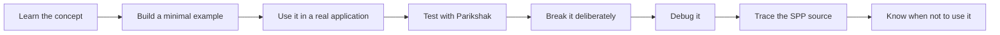
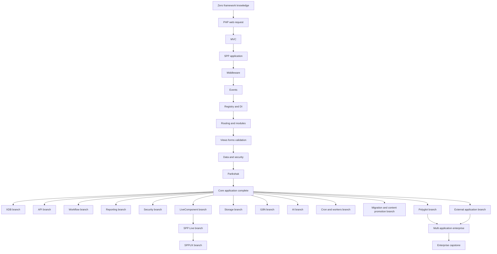

# Chapter 29 — Feature Coverage Roadmap

## Purpose

This chapter turns the repository-wide feature scan into the **execution plan for the SPP handbook and tutorial program**.

The handbook is not considered complete merely because a subsystem has a reference chapter. A major SPP capability is considered **taught** only when the learner can:

1. explain the problem in ordinary programming language;
2. build a minimal working example;
3. use the capability inside a realistic application;
4. test the behavior with Parikshak where applicable;
5. deliberately break it and diagnose the failure;
6. trace the implementation in SPP source; and
7. understand when the capability should not be used.

The canonical tutorial pattern is therefore:

---

## 29.1 Coverage states

A feature can have one of five states:

| State | Meaning |
|---|---|
| Core | Must be learned in the main zero-level tutorial. |
| Lab | Must have a dedicated hands-on laboratory. |
| Branch | Important enough to deserve a complete specialized tutorial. |
| Reference | Requires API/source reference but not a full beginner branch. |
| Contributed | Relevant module/integration, but not part of the universal framework path. |

A feature can occupy more than one state. For example, XDB is a Core dependency for data work, a Branch because of its size, and a Reference surface because of its many APIs.

---

## 29.2 Mandatory core path

These capabilities belong in the main beginner-to-advanced path because they explain how SPP itself works.

| Capability | Tutorial treatment | Parikshak checkpoint | Source deep dive |
|---|---|---|---|
| What a framework is | Core tutorial | No | Boot/runtime |
| PHP request/response | Core tutorial | Optional | Entry points |
| MVC architecture | Core tutorial | Yes | Controller/view/data boundaries |
| App/Scheduler/context | Core | Yes | `App`, `Scheduler` |
| Autoloading / PSR-4 | Core | Yes | Autoloader/class loading |
| Configuration | Core | Yes | Config/settings loaders |
| Registry | Core | Yes | `Registry` |
| Dependency injection | Core | Yes | Container resolution |
| Routing | Core | Yes | Route dispatch |
| Middleware/Pipeline | Core + mandatory lab | Yes | `MiddlewareKernel`, `Pipeline` |
| Events | Core + mandatory lab | Yes | `SPPEvent`, handlers/listeners |
| Modules | Core + mandatory lab | Yes | Module/compiler/manifest |
| SPPView | Core | Yes | View controller/render pipeline |
| BladeOne integration | Core | Yes | Drishyam/SPPBlade |
| ViewTags | Lab | Yes | `ViewTag` |
| Forms/validation | Core + lab | Yes | View validator/form layer |
| SPPDB concepts | Core | Yes | Adapter layer |
| Authentication | Core | Yes | SPPAuth/guards |
| Authorization | Core | Yes | Rights/roles/policy |
| Testing with Parikshak | Core | Yes | Test runner/cases/factory |
| Logging/debugging | Core | Yes | logger/debug facilities |

---

## 29.3 Mandatory framework labs

Every major framework mechanism gets a focused lab. The learner does not merely read a chapter.

### Lab A — Middleware Pipeline

Build a request pipeline from scratch.

Exercises:

- first middleware;
- multiple middleware layers;
- before/after behavior;
- short-circuiting;
- request/response changes;
- authentication middleware;
- CSRF middleware;
- throttling middleware;
- security headers;
- debugging middleware order.

Parikshak tests must cover normal flow, short circuit, order, failure, and security rejection.

### Lab B — Events

Build a task-created event system.

Exercises:

- event definition;
- payload parameters;
- listener registration;
- listener priority;
- before/main/after execution;
- propagation stopping;
- payload mutation;
- default handler;
- override behavior where supported.

The learner then removes one listener and diagnoses why behavior changed.

### Lab C — Modules

Package a reporting feature as a module.

Exercises:

- manifest;
- activation;
- dependencies;
- dependency ordering;
- missing dependency;
- circular dependency;
- module settings;
- compiled module metadata.

### Lab D — Registry and Container

Create and resolve services.

Exercises:

- registry values;
- shared values;
- service binding;
- singleton binding;
- constructor injection;
- automatic class resolution;
- failure diagnosis.

### Lab E — Routing and MVC

Build the same application first without a framework and then inside SPP.

Exercises:

- route matching;
- controller dispatch;
- model/data access;
- view rendering;
- route parameters;
- route model binding where supported;
- 404/405 failure paths.

### Lab F — Views, Forms, and Validation

Build a real CRUD form.

Exercises:

- SPPView;
- BladeOne-compatible templates;
- ViewTags;
- form generation;
- validation;
- error display;
- safe output;
- generated JavaScript where applicable.

---

## 29.4 Data and persistence branch

### Branch X — SPPDB + SPP XDB

This is a full branch, not a single chapter.

Modules/labs:

1. database fundamentals;
2. SPPDB abstraction;
3. XDB facade;
4. XML engine;
5. SQLite engine;
6. SQL and parameters;
7. query builder;
8. entities and entity queries;
9. pagination;
10. schema management;
11. migrations;
12. seeders;
13. indexes;
14. views;
15. validation;
16. ACL;
17. locking;
18. transactions;
19. encryption;
20. observers;
21. query caching;
22. XDB shell/CLI;
23. failure/recovery;
24. advanced/distributed implementation features, documented only to the level established by executable source/tests.

Each advanced operational guarantee must be source-verified before being presented as a production promise.

---

## 29.5 Security branch

### Branch S — Web Security

Separate this from identity/authentication.

Labs:

- CSRF;
- sanitization;
- rate limiting;
- throttle middleware;
- security headers;
- request validation;
- secure output;
- trust boundaries;
- API/JWT security.

### Branch I — Identity and Authorization

Labs:

- web authentication;
- API authentication;
- sessions;
- remember-me behavior;
- MFA state;
- roles;
- rights;
- policy context;
- session revocation;
- permission cache behavior.

---

## 29.6 API branch

### Branch A — SPPAPI

A complete API tutorial should cover:

- API resources;
- API responses;
- request/response contracts;
- pagination;
- route model binding;
- AJAX/live actions where implemented;
- middleware;
- JWT authentication;
- API authorization;
- API documentation generation;
- validation/error responses;
- Parikshak API testing.

The learner should build a public read API and an authenticated management API from the same domain model.

---

## 29.7 Reactive UI branch

### Branch L — LiveComponent

Exercises:

- server-side component mental model;
- first render;
- public state;
- hydration/dehydration;
- state integrity/signing;
- lifecycle hooks;
- computed properties;
- actions;
- validation;
- event dispatch;
- lazy rendering;
- isolated rendering;
- streaming;
- downloads.

### Branch T — SPP Live

Exercises:

- transport abstraction;
- AJAX fallback;
- SSE;
- WebSocket;
- Redis-backed live operation;
- SQLite-backed live operation;
- uploads;
- failure/reconnect behavior where supported;
- transport diagnostics.

### Branch U — SPPUX

Exercises:

- signals;
- computed state;
- effects;
- batching;
- scheduler;
- tagged-template rendering;
- event delegation;
- keyed reconciliation;
- error boundaries;
- bridge integration;
- client/server responsibility boundaries.

The tutorial should repeatedly demonstrate **the same feature implemented with plain HTML, LiveComponent, and SPPUX**, so the learner learns when to move work between server and browser.

---

## 29.8 Workflow and long-running business processes

### Branch W — Workflow

Use a realistic approval application.

Exercises:

- workflow states;
- transitions;
- authorization of transitions;
- approval chains;
- wizard flows;
- timeouts;
- workflow events;
- persistence;
- retries/failures where implemented;
- operational inspection.

Parikshak must cover legal and illegal transition paths.

---

## 29.9 Operations branch

### Branch O — Cache, Logging, Audit, Reporting, Observability

This branch should remain separate from ordinary request handling.

Exercises:

- cache abstraction;
- backend choice;
- invalidation;
- query cache;
- application logs;
- audit records;
- revision history;
- delta/diff behavior;
- report generation;
- report viewer/API;
- scheduled reports;
- OpenTelemetry/exporter integration where supported.

The learner must distinguish **debug logging**, **audit**, **revision history**, and **observability telemetry**.

---

## 29.10 Scheduled and background execution branch

### Branch C — Cron, workers, and asynchronous work

Exercises:

- scheduled tasks;
- cron listing;
- cron execution;
- flush/administration;
- scheduled report generation;
- worker process concepts;
- asynchronous jobs where implemented;
- failure and retry behavior;
- operational debugging.

Do not describe every asynchronous mechanism as a queue unless the concrete implementation actually provides a queue abstraction.

---

## 29.11 Storage branch

### Branch F — SPP Storage

Exercises:

- Storage abstraction;
- Disk interface;
- LocalDisk;
- file lifecycle;
- naming/path conventions;
- uploads and downloads;
- storage security;
- storage integration with content transfer.

The branch must distinguish **database persistence** from **file/object storage**.

---

## 29.12 Migration, transfer, and content promotion branch

### Branch M — Offline → Live publishing

This is deliberately separate from schema migrations.

Exercises:

- prepare content offline;
- validate content;
- create transfer artifacts;
- revision/diff inspection;
- transfer to staging;
- compatibility validation;
- production promotion;
- zero-downtime compatibility analysis;
- verification;
- rollback/recovery.

Where the concrete implementation supports an exact transport or package format, the tutorial will use it. Otherwise the architecture will be described without inventing a universal transfer protocol.

---

## 29.13 Internationalization branch

### Branch I18N — SPPLang

Exercises:

- language selection;
- translated content;
- `ContentTranslator`;
- `TranslatableEntity`;
- localized validation/messages;
- localized views;
- localized APIs;
- offline content promotion with translations.

---

## 29.14 AI branch

### Branch AI — SPPAI

This is a specialized but significant branch.

Exercises:

- AI facade;
- driver interface;
- provider configuration;
- provider-specific drivers;
- prompt/request abstraction;
- response handling;
- failure handling;
- cost/time considerations;
- testing AI integrations without turning tests into external-provider calls;
- self-healing exception-handling architecture where source verifies the behavior;
- application security and prompt/data boundaries.

Provider names should be documented as concrete drivers, not as a claim that every driver has identical capabilities.

---

## 29.15 Reporting branch

### Branch R — SPPReport

Exercises:

- report definition;
- report API;
- data selection;
- pagination;
- report viewer;
- scheduled reports;
- report caching;
- report authorization;
- export/delivery where implemented;
- observability for report jobs.

---

## 29.16 Polyglot and external application branch

### Branch P — Polyglot integration

Exercises:

- bridge abstraction;
- bridge factory;
- language/runtime adapters;
- serialization boundaries;
- synchronous invocation;
- asynchronous invocation where implemented;
- worker/daemon integration;
- failure and timeout behavior;
- security boundaries.

### Branch E — External non-SPP application

Use a legacy or contributed integration to demonstrate:

- path delegation;
- external routing;
- adapter/service integration;
- API integration;
- authentication boundary;
- data synchronization;
- monitoring and failure isolation.

---

## 29.17 Multi-application enterprise branch

### Branch MA — Multiple SPP applications in one architecture

Exercises:

- registering multiple `App` objects;
- application contexts;
- context switching;
- shared infrastructure;
- application boundaries;
- integration between applications;
- security isolation;
- deployment topology;
- failure isolation.

This branch must explicitly distinguish:

- module;
- application context;
- operating-system process;
- external application;
- external language runtime.

---

## 29.18 Documentation and developer-tooling branch

### Branch D — Build the framework's tooling surface

Exercises:

- CLI fundamentals;
- generators;
- module commands;
- event commands;
- middleware commands;
- view/form generators;
- LiveComponent/SPPUX commands;
- database/migration commands;
- documentation generation;
- API documentation;
- environment/configuration tooling;
- deployment commands.

A command should be taught by showing what source/runtime subsystem it actually drives.

---

## 29.19 Complete SPP tutorial architecture

The final training program is therefore not one enormous tutorial. It is a directed curriculum:

The learner should be able to stop after the core path and still have a usable SPP foundation. Completing the branches produces the full framework competency.

---

## 29.20 Completion criteria

The SPP handbook should not be declared “complete” until each **Core**, **Lab**, and **Branch** item has:

- a beginner explanation;
- an exact source map;
- at least one working example;
- a test strategy;
- a deliberate failure/debugging exercise;
- an advanced internals section;
- comparison notes for other major frameworks where meaningful;
- and clear boundaries describing when the feature should not be used.

For implemented source claims, executable source and tests remain the final authority.

### Source roots used for this inventory

- `spp/core/`
- `spp/modules/spp/`
- `spp/modules/contrib/`
- `spp/commands/`
- `spp/tests/`
- `docs/`
- `documentation/`

This roadmap is intentionally a **coverage contract** for the handbook: new chapters should be added against this matrix rather than accumulating as disconnected documentation.
