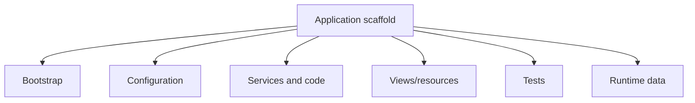

# Chapter 30 — Scaffold, Generator, and Code-Generation Coverage

## Why this chapter exists

A framework is not only its runtime classes. It also teaches developers how to create applications and framework-recognized artifacts.

SPP's repository contains generators/scaffolds for applications, modules, services, commands, forms, views, Blade/SPPView templates, models/entities, events, seeders, partials, streams, polyglot integrations, and language-specific targets such as Go and Java.

The handbook therefore treats the scaffold system as a first-class part of the developer experience.

## 30.1 Core generator families

The current repository exposes documentation/scaffolding for families including:

| Generator family | What the learner should build |
|---|---|
| Application | Create a complete SPP application and inspect every generated file |
| Module | Create a framework-recognized module and activate it |
| Service | Generate a service and integrate it through the container |
| Command | Create a custom CLI command |
| Event | Generate an event and attach handlers/listeners |
| Model/entity | Generate a persistence-facing domain artifact |
| Seeder | Create deterministic development/test data |
| Form | Generate a form and validation boundary |
| View/Blade/SPPView | Generate presentation artifacts |
| Partial | Build reusable view fragments |
| Stream | Build a streaming/live-oriented artifact |
| Polyglot | Generate/integrate another runtime |
| Java/Go and other runtimes | Generate a language-specific integration artifact |
| Scaffold | Understand the higher-level project scaffolding mechanism |

## 30.2 The scaffold learning rule

The tutorial should not ask the beginner to blindly run a generator.

For every important generator:

1. build the artifact manually once;
2. run the generator;
3. compare generated output with the manual version;
4. explain every generated file;
5. modify the generated artifact;
6. run the corresponding Parikshak tests;
7. deliberately break the generated conventions;
8. diagnose what SPP discovery/lifecycle expected; and
9. inspect the generator implementation.

This turns a generator from magic into a learning tool.

## 30.3 Application generator laboratory

The application generator should be the first generator lab.

The learner creates an application, then opens every generated directory/file and maps it to:



The exact generated structure must always be taken from the current scaffold implementation.

## 30.4 Feature generator laboratories

Each high-value generator becomes a small experiment.

### Service generator

Generate a service, inject a dependency, test it with Parikshak, then trace how the application/container resolves it.

### Event generator

Generate an event, add listeners, test priority/propagation behavior, and trace the generated code against `SPPEvent`/handler internals.

### Model/entity generator

Generate an entity/model, connect it to SPPDB/XDB, add test data through a seeder, and verify persistence behavior.

### Form generator

Generate a form, add validation, render it through SPPView, and test invalid/valid submissions.

### View/Blade/SPPView generator

Generate a view, render it through the actual presentation stack, then inspect compilation and ViewTag handling.

### Command generator

Generate a CLI command that calls an application service. Test the service independently and the command as an integration entry point.

### Module generator

Generate a module, define its manifest, add a dependency, activate it, and inspect the compiled registry.

## 30.5 Stream and live scaffolding

The presence of `make:stream` means streaming should be taught as more than a transport reference.

The learner should understand the relationship among:

```text
component/action
    ↓
streaming capability
    ↓
SPP Live transport
    ↓
browser update
```

The exact generated artifact and runtime lifecycle must be source-verified before being treated as normative.

## 30.6 Polyglot scaffolding

The polyglot generator is important because it makes multi-runtime architecture part of the normal developer workflow.

The learner should generate one target runtime, inspect the generated bridge/service files, run a minimal request across the boundary, test failure behavior, and compare the generated implementation with the common polyglot bridge abstractions.

## 30.7 Scaffold comparison lab

The final generator lab compares:

```text
manual implementation
        vs
SPP generated implementation
        vs
SPP runtime discovery
```

The learner should be able to answer:

- Which files are conventional?
- Which files are actually discovered automatically?
- Which values come from configuration?
- Which parts are merely starter code?
- What happens if the generated convention is changed?
- Which conventions are framework contracts and which are scaffolding preferences?

## Kernel Hacker note

Scaffolding is part of framework architecture because it encodes the framework's expected project structure and conventions.

A generator can therefore reveal hidden contracts that are not obvious from individual runtime classes. The implementation should be inspected alongside the generated files so the handbook can distinguish:

- hard runtime requirements;
- discovery conventions;
- generated defaults; and
- optional developer preferences.

## Source map

- `spp/commands/`
- `spp/commands/stubs/`
- `docs/commands/`
- `docs/tutorials/`
- `documentation/framework/application-development.md`
