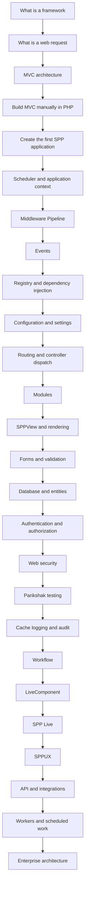

# Chapter 31 — Core Tutorial Index

This is the **mandatory beginner path** for learning SPP from zero framework knowledge.

The reader may know PHP but must not be expected to know MVC, middleware, dependency injection, events, routing, modules, rendering, reactive UI, or enterprise architecture beforehand.

The rule for this path is simple:

> **Every concept is introduced because the application has a problem, then implemented with SPP, tested with Parikshak, deliberately broken, debugged, and finally traced into the source.**

## 31.1 The complete beginner sequence

## 31.2 Core tutorial chapters

| Step | Tutorial | Status | Purpose |
|---|---|---|---|
| 1 | `32-frameworks-and-mvc.md` | Mandatory | Teach framework and MVC concepts from zero. |
| 2 | `33-first-spp-application.md` | Mandatory | Build the smallest working SPP application. |
| 3 | `34-middleware-pipeline-lab.md` | Mandatory | Learn the first major framework runtime mechanism. |
| 4 | `35-events-lab.md` | Mandatory | Learn decoupled reactions and event propagation. |
| 5 | `36-registry-and-di-lab.md` | Mandatory | Understand service construction and dependency injection. |
| 6 | `37-configuration-and-settings-lab.md` | Mandatory | Separate file configuration, runtime settings, and persisted settings. |
| 7 | `38-routing-and-dispatch-lab.md` | Mandatory | Connect URL → route → controller → service → response. |
| 8 | `39-modules-lab.md` | Mandatory | Build, activate, depend on, and compile a module. |
| 9 | `40-sppview-and-forms-lab.md` | Mandatory | Render HTML with SPPView/extended BladeOne and build a validated form. |
| 10 | `41-database-and-entity-lab.md` | Mandatory | Persist application data and connect entities/services/views. |
| 11 | `42-authentication-and-authorization-lab.md` | Mandatory | Protect a real application and explain identity vs permission. |
| 12 | `43-web-security-lab.md` | Mandatory | Exercise CSRF, sanitization, throttling, rate limiting, and security headers. |
| 13 | `44-parikshak-lab.md` | Mandatory | Test the application and all preceding layers. |
| 14 | `45-cache-logging-audit-lab.md` | Mandatory | Add operational visibility and safe caching. |
| 15 | `46-workflow-lab.md` | Mandatory for Builder track | Build approvals and legal state transitions. |
| 16 | `47-livecomponent-lab.md` | Builder branch | Upgrade selected UI regions to server-side reactivity. |
| 17 | `48-spp-live-transport-lab.md` | Builder branch | Compare and exercise live transport engines. |
| 18 | `49-sppux-lab.md` | Builder branch | Build browser-local reactive UI with SPPUX. |
| 19 | `50-api-platform-lab.md` | Builder branch | Build an authenticated API with resources, pagination, binding, and documentation. |
| 20 | `51-storage-i18n-reporting-lab.md` | Builder branch | Add files, localized content, and reports/observability. |
| 21 | `52-ai-lab.md` | Advanced branch | Use the SPPAI facade and provider drivers safely. |
| 22 | `53-migration-transfer-content-promotion-lab.md` | Architect branch | Prepare offline content and promote it to a live system safely. |
| 23 | `54-polyglot-external-application-lab.md` | Architect branch | Integrate other runtimes and non-SPP applications. |
| 24 | `55-multi-application-and-cron-lab.md` | Architect branch | Compose application contexts and scheduled/background work. |
| 25 | `56-enterprise-capstone.md` | Architect + Kernel Hacker | Combine the major SPP subsystems in one production-oriented system. |

## 31.3 The learning contract for every tutorial

Every branch follows the same chapter structure.

### Part A — Start from zero

Explain the problem without framework terminology first.

### Part B — Plain PHP baseline

Where useful, build the smallest working version without SPP.

### Part C — SPP implementation

Use only APIs and conventions verified in the current repository.

### Part D — Observe

Run the application and inspect the result, logs, generated files, or runtime state.

### Part E — Test with Parikshak

Create a focused test before moving on.

### Part F — Break it deliberately

Remove a registration, change a configuration key, break a dependency, send invalid input, or otherwise create a controlled failure.

### Part G — Diagnose

Use SPP's CLI, logs, debugger/source tracing, and Parikshak failure output to identify the cause.

### Part H — Kernel Hacker

Trace the exact source path that implements the feature.

### Part I — When not to use it

Explain the complexity cost and a simpler alternative.

## 31.4 Why middleware is first

Middleware is the first deep framework mechanism because it is concrete and easy to observe.

The learner already has a request. Middleware introduces the idea that a framework can place controlled execution layers around the request before and after application code.

SPP's implementation includes `MiddlewareInterface`, `Pipeline`, and `MiddlewareKernel`, with global and route-level middleware mechanisms. The repository tutorial documents YAML registration, PHP attributes, and middleware CLI commands.

This chapter therefore becomes the learner's first source-level runtime deep dive.

## 31.5 Why events come second

Events then provide a deliberate contrast:

> Middleware controls **request execution**; events allow **other parts of the application to react to something that happened**.

This distinction is foundational to understanding why SPP contains both mechanisms.

## 31.6 Parikshak is continuous, not a final chapter

Parikshak is used throughout the core path.

For example:

- middleware is tested for pass-through and short-circuiting;
- events are tested for listener ordering and propagation;
- modules are tested for activation/dependencies;
- forms are tested for valid/invalid input;
- database changes are tested with the appropriate database-reset facilities;
- authentication is tested with authenticated and unauthenticated requests;
- workflow is tested for legal and illegal transitions;
- LiveComponent behavior is tested at its supported boundary;
- APIs are tested independently from browser rendering.

The dedicated Parikshak chapter then explains the framework itself.

## 31.7 Branch selection

A beginner should complete Chapters 32–45 before taking branches.

The **Builder** path then continues through reactive UI and API features.

The **Architect** path continues through migration/content promotion, polyglot/external applications, multiple application contexts, Cron/workers, and enterprise deployment.

The **Kernel Hacker** path revisits every branch and follows the source instead of only the public API.

## 31.8 Evidence rule

Tutorial examples become normative only after their exact behavior has been checked against current repository source, tests, configuration, or repository documentation.

When a repository feature is only partially understood, the tutorial must say so rather than inventing a convenient abstraction.
