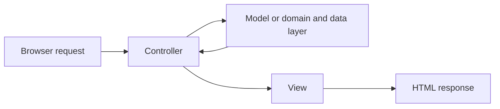
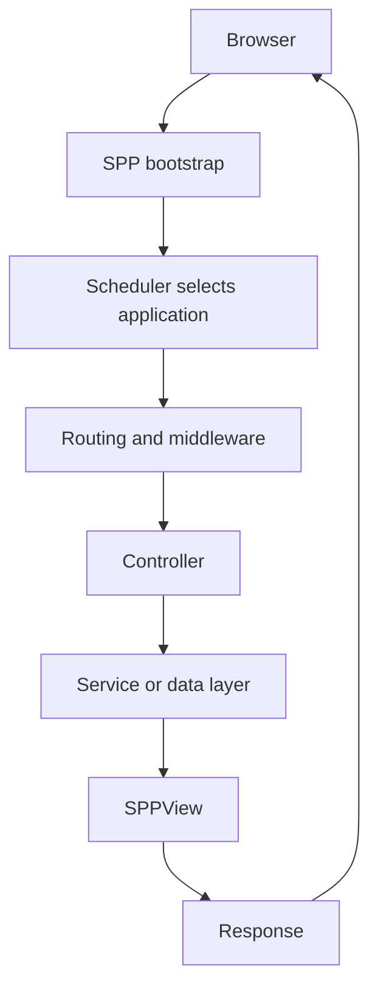

# Tutorial Core 01 — From Plain PHP to Frameworks and MVC

**Audience:** a reader who knows basic PHP but has never used a framework.

**Goal:** finish this chapter understanding why frameworks exist, what MVC means, what SPP adds around MVC, and why later chapters introduce middleware, events, Registry, modules, views, LiveComponent, SPP Live, and SPPUX.

## 31.1 Start without a framework

A PHP program can read input, do some work, and produce output without any framework.

That is a useful starting point because it makes every framework feature visible later.

Our first example is deliberately small.

```php
<?php

$title = trim($_GET['title'] ?? 'World');

$html = '<h1>Hello ' . htmlspecialchars($title, ENT_QUOTES, 'UTF-8') . '</h1>';

echo $html;
```

Nothing here requires SPP.

## 31.2 What becomes difficult as the application grows?

A real application soon needs to answer many questions:

- Which URL should execute which code?
- Where should input validation happen?
- How does one object obtain another object it depends on?
- How do multiple applications coexist?
- Which code runs before every request?
- How can another part of the system react when something happens?
- Where are reusable features packaged?
- How is HTML generated?
- How do tests create a clean database state?
- How does a live component preserve server-side state across requests?

A framework is reusable infrastructure for solving these recurring problems consistently.

## 31.3 What is MVC?

MVC means **Model–View–Controller**.

It is a way of separating responsibilities.



The terms mean:

**Model:** the application's data/domain side. In a real application this may include entities, repositories, data-access services, and business services rather than one giant `Model` class.

**View:** presentation. In SPP this is handled by the SPPView stack and its rendering facilities.

**Controller:** request-facing coordination. A controller should normally translate a request into application work and a response rather than become the entire business layer.

## 31.4 MVC is not the whole SPP architecture

This is a critical distinction.

SPP provides MVC-compatible application structures, but SPP is larger than MVC.

Around MVC, SPP adds runtime and infrastructure concepts such as:

| Responsibility | SPP mechanism |
|---|---|
| Application selection | Scheduler and application context |
| Request pre/post processing | Middleware Pipeline |
| Decoupled reactions | Events and EventHandler |
| Object resolution | Registry and Container |
| Feature packaging | Modules |
| Configuration | SPPConfig and settings layers |
| Rendering | SPPView and extended BladeOne/Drishyam |
| Data | SPPDB and SPP XDB |
| Security | SPPAuth plus the security subsystem |
| Server reactivity | LiveComponent |
| Live transport | SPP Live |
| Browser reactivity | SPPUX |
| Testing | Parikshak |

Think of MVC as one application-organization pattern inside a larger framework architecture.

## 31.5 Build the MVC idea manually

Create three simple pieces.

### Controller

```php
<?php

class TaskController
{
    public function index(): array
    {
        return [
            'title' => 'Task Desk',
            'tasks' => [
                ['title' => 'Learn MVC'],
                ['title' => 'Learn SPP'],
            ],
        ];
    }
}
```

### Model/data object

```php
<?php

class TaskRepository
{
    public function all(): array
    {
        return [
            ['title' => 'Learn MVC'],
            ['title' => 'Learn SPP'],
        ];
    }
}
```

### View

```php
<h1><?= htmlspecialchars($title, ENT_QUOTES, 'UTF-8') ?></h1>

<ul>
<?php foreach ($tasks as $task): ?>
    <li><?= htmlspecialchars($task['title'], ENT_QUOTES, 'UTF-8') ?></li>
<?php endforeach; ?>
</ul>
```

Even this tiny application already needs a decision about how the controller obtains the repository and how the view receives its data.

Those decisions become framework responsibilities as the system grows.

## 31.6 The same application inside SPP

The SPP version introduces the runtime around the application.



The business problem did not change. The reusable infrastructure did.

## 31.7 Why middleware comes next

Once a reader understands one request, the next useful framework concept is middleware.

Middleware is code that can run around request handling.

For example:

- authenticate the user;
- add security headers;
- reject an invalid request;
- measure timing;
- add a response header;
- short-circuit the request.

The next tutorial chapter therefore starts with the SPP Middleware Pipeline before introducing many other subsystems.

## 31.8 Why events come after middleware

Middleware and events solve different problems.

**Middleware:** controls the path of a request through a pipeline.

**Events:** lets other parts of the application react to something that happened.

That distinction will become much easier once you have written both by hand.

## 31.9 Coming from another framework

### Laravel

MVC, middleware, service container, events, views, Livewire, and Artisan are familiar reference points. SPP has its own implementations and lifecycle rules.

### Symfony

Think in terms of controllers, middleware-like HTTP processing, dependency injection, event subscribers, Twig-style rendering, and bundles. SPP's modules and runtime differ.

### Django

The MVT terminology is different, but the separation between request handling, application logic, and presentation serves the same teaching purpose.

### Spring Boot

The separation between controllers, services, repositories, dependency injection, interceptors/filters, and events maps well conceptually. SPP remains PHP-native and framework-specific.

## 31.10 Lab

Build a plain PHP Task Desk with:

1. one request page;
2. one controller-like class;
3. one data service;
4. one view;
5. one form;
6. one validation rule.

Then write down every piece of infrastructure you had to create manually.

That list becomes the reason for the next SPP chapters.

## 31.11 Parikshak checkpoint

At this stage, the first tests should prove plain application behavior before framework infrastructure is introduced.

The later migration should preserve these tests where the behavior remains the same.

## 31.12 Kernel Hacker note

The purpose of this chapter is not to teach a framework-specific controller superclass. It is to establish the architectural boundaries that the later runtime components implement.

When the reader reaches the Kernel Hacker sections, the important question is no longer “what is MVC?” but:

> **Which SPP runtime mechanism connects the HTTP request, application context, request pipeline, application services, and renderer, and where are those boundaries implemented?**
