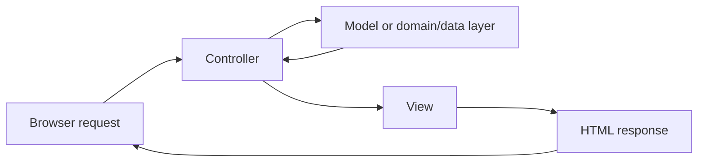
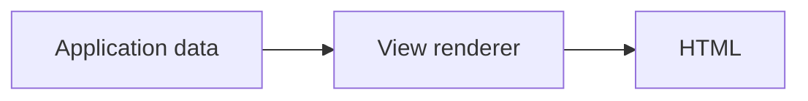

# Chapter 32 — From Plain PHP to Frameworks and MVC

This is the real beginning of the SPP tutorial.

The reader is assumed to know basic PHP syntax, but **not to know what a software framework is**.

We will therefore begin before SPP.

---

## 32.1 Start with one simple question

Suppose you want to build a website that lets people manage tasks.

A browser sends a request:

```text
GET /tasks
```

Your program needs to:

1. receive the request;
2. decide what `/tasks` means;
3. read some task data;
4. apply business rules;
5. create HTML;
6. send the result back.

At first, you can do all of that in one PHP file.

That is a perfectly valid program.

The problem appears when the program grows.

---

## 32.2 The first plain-PHP version

Create a file:

```text
public/tasks.php
```

```php
<?php

$tasks = [
    ['title' => 'Read the handbook', 'done' => false],
    ['title' => 'Build the first page', 'done' => true],
];
?>

<!doctype html>
<html lang="en">
<head>
    <meta charset="utf-8">
    <title>Task Desk</title>
</head>
<body>
    <h1>Tasks</h1>

    <ul>
        <?php foreach ($tasks as $task): ?>
            <li>
                <?= htmlspecialchars($task['title'], ENT_QUOTES, 'UTF-8') ?>
            </li>
        <?php endforeach; ?>
    </ul>
</body>
</html>
```

This works.

There is no framework.

There is not even a formal architecture yet.

That is important because SPP should first be understood as a solution to real programming problems, not as a collection of mysterious framework terminology.

---

## 32.3 Why large applications become difficult

Imagine adding:

```text
twelve pages
three forms
a login system
permissions
an API
tasks stored in a database
an administrator area
scheduled reports
an audit trail
an external service
live search
browser-side interaction
```

Soon one file is doing too many unrelated jobs.

For example, the same PHP file might contain:

```text
HTTP request handling
URL selection
authentication
validation
SQL queries
business rules
HTML generation
logging
error handling
```

Changing one concern can accidentally affect another.

A framework does not magically remove complexity.

A framework gives you **reusable structure and infrastructure** so that you do not have to reinvent the same structural mechanisms for every application.

---

## 32.4 What is a framework?

A library gives your program tools that **your code calls**.

A framework usually gives your program a larger runtime structure in which **the framework also calls your code**.

That distinction is often described as **inversion of control**.

In ordinary PHP:

```text
Your program
    ↓
calls a library
```

In a framework application:

```text
Framework runtime
    ↓
finds your application
    ↓
invokes your code at defined extension points
```

That is why framework concepts such as routing, middleware, events, dependency injection, modules, and lifecycle methods exist.

They define places where your application joins a larger runtime.

---

## 32.5 What MVC means

MVC stands for:

- **Model**
- **View**
- **Controller**

MVC is a way to separate responsibilities.



This picture is conceptual.

It does **not** mean every application must literally contain exactly three classes.

The useful idea is that different responsibilities should not be mixed unnecessarily.

---

## 32.6 What is a Controller?

A controller is code that handles an application interaction at the request boundary.

For example:

```php
class TaskController
{
    public function index()
    {
        // obtain the data needed for the page
        // return the response
    }
}
```

The controller should normally coordinate the request rather than contain every business rule in the system.

---

## 32.7 What is the Model?

The word “model” is used differently across ecosystems.

A beginner-friendly definition is:

> The model/domain/data side contains the application's meaningful data and rules.

Depending on the design, this can involve:

- entities;
- repositories/data services;
- domain services;
- database abstractions; and
- business rules.

This is why we should not teach beginners that **Model = one database table class**.

In SPP, the data/domain architecture is broader than that.

---

## 32.8 What is a View?

A view turns application data into a user-facing representation.

For an ordinary browser page that representation is usually HTML.

Conceptually:



In SPP this role is handled through the SPPView presentation architecture, including its BladeOne-compatible rendering layer and related features.

That will be taught later rather than hidden behind the phrase “just use a template”.

---

## 32.9 Build MVC manually before using SPP

Create a tiny plain-PHP structure:

```text
plain-taskdesk/
    public/
        index.php
    src/
        TaskController.php
        TaskService.php
    views/
        tasks.php
```

The controller coordinates:

```php
<?php

class TaskController
{
    public function index(TaskService $service): void
    {
        $tasks = $service->all();

        require __DIR__ . '/../views/tasks.php';
    }
}
```

The service contains application behavior:

```php
<?php

class TaskService
{
    public function all(): array
    {
        return [
            ['title' => 'Read the handbook', 'done' => false],
            ['title' => 'Build the first page', 'done' => true],
        ];
    }
}
```

The view contains presentation:

```php
<ul>
    <?php foreach ($tasks as $task): ?>
        <li>
            <?= htmlspecialchars($task['title'], ENT_QUOTES, 'UTF-8') ?>
        </li>
    <?php endforeach; ?>
</ul>
```

Now the separation is visible.

---

## 32.10 What the framework will later take over

The manual program still has to solve many infrastructure problems:

```text
How is the application bootstrapped?
How is the correct application selected?
How is the URL mapped to the controller?
How are services constructed?
How is configuration loaded?
How are cross-cutting checks applied?
How do unrelated parts react to events?
How are features packaged?
How are pages rendered consistently?
How are tests and fixtures managed?
```

SPP provides framework mechanisms for these problems.

We will add them one at a time.

---

## 32.11 MVC is not the whole SPP architecture

This distinction is essential.

SPP contains MVC-like application organization, but the framework architecture extends beyond MVC.

For example:

| Concern | SPP mechanism |
|---|---|
| Application selection | Scheduler / application context |
| Request interception | Middleware Pipeline |
| URL dispatch | Routing/request dispatch |
| Service construction | Registry / Container |
| Cross-component reactions | Events |
| Feature packaging | Modules |
| HTML rendering | SPPView / extended BladeOne / Drishyam |
| Server-side reactive UI | LiveComponent |
| Live transport | SPP Live |
| Browser-side reactive UI | SPPUX |
| Testing | Parikshak |
| External runtimes | Polyglot bridges |
| Independent applications | Integration architecture |
| Scheduled work | Cron/Scheduler infrastructure |

So:

> **MVC explains one important application-organization pattern; it does not explain the whole SPP runtime.**

---

## 32.12 MVC compared with common frameworks

The comparison is conceptual, not an API compatibility claim.

| Ecosystem | Familiar MVC-related concept |
|---|---|
| Laravel | Controllers, models/Eloquent, Blade |
| Symfony | Controllers, Doctrine/domain layer, Twig |
| Django | Views, models, templates |
| ASP.NET Core | Controllers, services/models, Razor/views |
| Spring | Controllers, services/entities, templates |
| SPP | Controllers/application services, SPPDB/domain/data layer, SPPView |

The key difference is that SPP surrounds the application organization with its own runtime facilities for modules, events, middleware, live components, SPPUX, polyglot integration, and multi-application contexts.

---

## 32.13 First exercise

Before reading the next chapter, answer these questions in your own words:

1. Why can one PHP file work for a small site?
2. Why does that file become difficult to maintain as the site grows?
3. What problem does MVC try to solve?
4. Why is a controller not the same thing as the entire application's business logic?
5. Why is SPP larger than MVC?
6. What does it mean that a framework can call your code?

If those answers make sense, the next chapter can introduce the SPP runtime without turning the framework into a black box.

---

## 32.14 Kernel Hacker note

At the kernel level, SPP is not merely an MVC dispatcher. The runtime includes application boot/loading, Scheduler context selection, registries and containers, middleware orchestration, event infrastructure, module discovery/compilation, rendering infrastructure, and specialized modules.

The rest of this tutorial deliberately reveals these mechanisms in layers so that the reader can correlate each internal mechanism with the problem it solves.

## Next

**Chapter 33 — Your First SPP Application**

We now take the tiny plain-PHP Task Desk and place it inside the SPP runtime.
