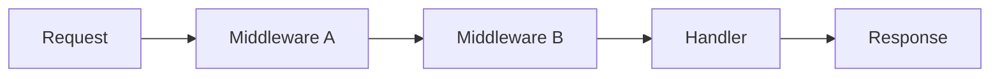
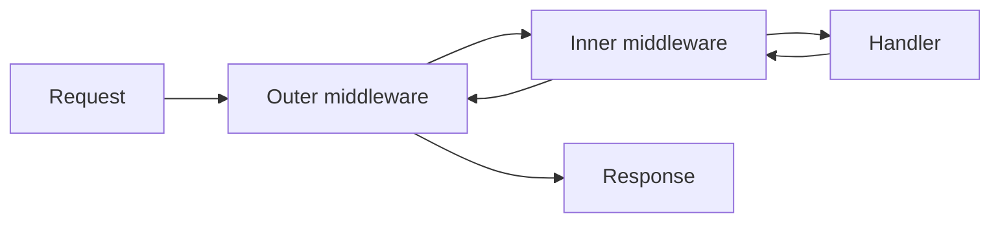
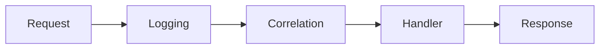
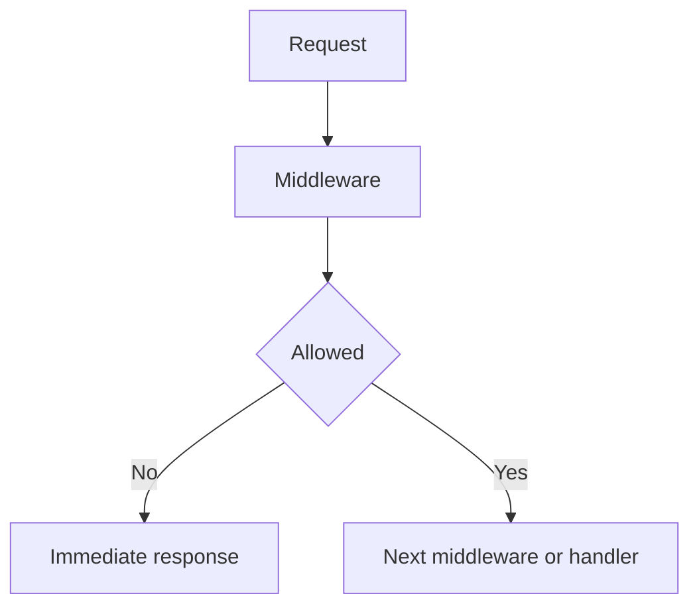
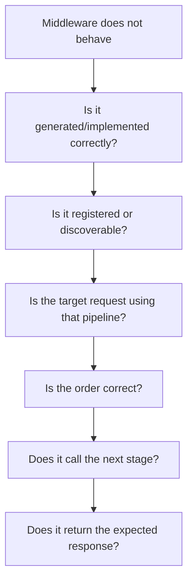

# Tutorial Core 02 — The Middleware Pipeline

**This is the first deep framework lab.**

You already know what a request is and what MVC is. Now we will add a mechanism that lets SPP execute reusable code before, around, and after request handling.

## 32.1 What problem does middleware solve?

Imagine ten pages that all need the same rule:

> Only authenticated users may enter these pages.

A beginner might write this into all ten controllers.

That works, but it duplicates infrastructure and makes future changes dangerous.

Middleware moves that request-wide rule into one reusable boundary.



The request passes through the chain before the final handler runs.

## 32.2 Middleware in ordinary PHP

Before learning SPP's implementation, understand the idea without framework terminology.

```php
function loggingMiddleware(callable $next): callable
{
    return function () use ($next) {
        echo "before\n";

        $response = $next();

        echo "after\n";

        return $response;
    };
}
```

The middleware receives a callable representing the next stage.

It may:

- execute code before the next stage;
- call the next stage;
- execute code after it returns; or
- refuse to call it.

## 32.3 The onion model

The easiest mental model is an onion.



The request travels inward; the response travels outward.

This matters because middleware can perform both pre-processing and post-processing.

## 32.4 Your first SPP middleware

Create an ordinary middleware class using the SPP conventions established by the current repository and generator.

The exact generated method signature should be obtained from the current `make:middleware` scaffold rather than invented by this tutorial.

Use the generator first:

```bash
php spp.php make:middleware RequestLogMiddleware
```

Then open the generated class.

The goal is to identify three things:

1. how the current request/response objects are represented;
2. how SPP represents the next pipeline stage; and
3. what the framework expects middleware to return.

Do not memorize the scaffold. Read it.

## 32.5 First exercise: prove that middleware runs

Add one harmless diagnostic action such as a request attribute or log entry.

Then request a page through the middleware.

Your first expected observation should be:

```text
request
  ↓
middleware
  ↓
handler
  ↓
response
```

Do not add authentication, caching, security, or business logic yet.

The first lab has one purpose: prove the control flow.

## 32.6 Add a second middleware

Create a second middleware that performs another independent operation.

For example:

- attach a correlation identifier;
- measure elapsed time; or
- add a response header.

Now the pipeline becomes:



Change the registration order and observe the difference.

The order is part of the architecture.

## 32.7 Short-circuiting

Middleware does not have to call the next stage.

This is one of the most important framework concepts to understand.



Authentication, CSRF checks, rate limiting, and request-size validation are common examples.

The security decision should be implemented at the correct boundary and should not be confused with business authorization.

## 32.8 Exercise: build a maintenance middleware

Create a middleware that can reject a request when the application is in maintenance mode.

The middleware should:

1. inspect the relevant configuration/runtime state;
2. return a controlled response when maintenance mode is enabled;
3. call the next stage when maintenance mode is disabled.

Test both branches.

## 32.9 Exercise: response post-processing

Create middleware that records how long the request took.

Conceptually:

```text
start timer
    ↓
next stage
    ↓
response
    ↓
calculate duration
    ↓
record diagnostic data
```

This teaches why middleware can surround the handler instead of simply running before it.

## 32.10 Middleware is not a service container

A common beginner mistake is putting all application logic into middleware.

Middleware should usually own request-boundary concerns.

This is a useful division:

| Concern | Better location |
|---|---|
| Authentication gate | Middleware/guard |
| CSRF verification | Security middleware |
| Rate limiting | Security middleware |
| Request logging | Middleware/logging |
| Business rule | Application/domain service |
| Database operation | Data-access service/repository |
| HTML rendering | SPPView |
| Cross-feature reaction | Event listener |

The framework gives you many boundaries. Do not make one boundary responsible for everything.

## 32.11 Route-specific versus broad middleware

Not every middleware should run for every request.

A useful design question is:

> Who needs this rule?

If the answer is “every request”, a broad runtime-level placement may be appropriate.

If the answer is “only the administration area”, a route or application-specific placement is usually cleaner.

The exact registration mechanism must follow the current SPP routing/middleware implementation.

## 32.12 Security middleware already present in SPP

The repository contains dedicated security middleware for concerns including:

- CSRF;
- throttling;
- security headers.

That is important because your own middleware lab is not merely a toy pattern. It is the same architectural mechanism used by production security features.

## 32.13 Deliberately break the pipeline

This is required.

### Break 1 — Forget to call the next stage

Observe which requests stop.

### Break 2 — Return the wrong value

Observe the response/runtime failure.

### Break 3 — Put middleware in the wrong order

Create a situation where one middleware expects state that another middleware has not yet created.

### Break 4 — Make a middleware perform database/business work unnecessarily

Observe how difficult it becomes to reuse and test.

The purpose is not to create bad code permanently. The purpose is to understand the consequences of architectural mistakes.

## 32.14 Parikshak checkpoint

Every middleware tutorial should include tests for:

1. request reaches the handler when the middleware allows it;
2. request is rejected when the middleware blocks it;
3. post-processing occurs when the downstream handler succeeds;
4. post-processing behavior is understood when the downstream stage fails;
5. middleware order is deterministic.

Use the repository's Parikshak `TestCase`/`SPPTestCase` conventions rather than replacing them with generic PHPUnit examples.

## 32.15 Debugging workflow

When middleware appears not to run, inspect the problem in this order:



This is much more effective than randomly changing controller code.

## 32.16 Source deep dive

After the lab works, inspect the actual SPP pipeline implementation.

The goal is to trace:

1. where middleware definitions are stored;
2. how middleware is discovered/registered;
3. how the pipeline is constructed;
4. how the next stage is represented;
5. how the final request handler is invoked;
6. how exceptions/early responses travel outward.

The exact class names and source paths must be taken from the current repository implementation and the middleware documentation.

## 32.17 Coming from other frameworks

### Laravel

The conceptual model is close to Laravel middleware, but use SPP's actual interfaces and lifecycle rather than assuming a Laravel signature.

### Symfony

Think of HTTP middleware/event listeners, but verify the SPP pipeline contract rather than importing HttpKernel assumptions.

### ASP.NET Core

The `next`/pipeline model is a useful mental reference. SPP's actual request and response contracts remain framework-specific.

### Django

Django middleware is another useful conceptual comparison, especially for request/response interception.

## 32.18 Kernel Hacker section

A complete implementation trace should answer:

> When a browser request arrives, what exact code turns a list of middleware definitions into nested execution around the final handler?

Do not settle for a diagram.

Read the implementation and tests until you can identify:

- construction;
- ordering;
- invocation;
- short-circuit behavior;
- exception propagation;
- response unwinding.

This source trace is the first real introduction to framework internals.

## 32.19 Lab completion criteria

You have completed the Middleware Pipeline lab when you can:

- explain middleware without using framework jargon;
- write one from scratch;
- use the generator and explain the generated code;
- register two middleware and control their order;
- short-circuit a request;
- perform post-processing;
- test the behavior with Parikshak;
- deliberately break the chain and diagnose it;
- trace the execution path in SPP source.

Only then move to the Events lab.
