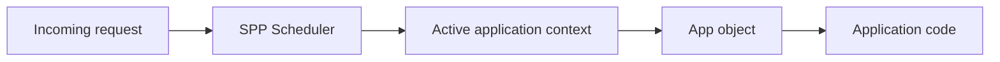

# Chapter 33 — Your First SPP Application

In the previous chapter we built a small application without a framework.

Now we will put the same idea into the **actual SPP application model**.

This chapter assumes that you have never created an SPP application before.

The repository's application-development guide defines an SPP application as a named runtime context with its own URL, source/configuration paths, optional custom App class, initialization file, middleware, modules, services, views, entities, forms, events, and runtime paths. fileciteturn235file0L2-L2

---

## 33.1 What are we building?

We will create a tiny application called `taskdesk`.

The first milestone is deliberately small:

```text
Browser
  ↓
SPP application bootstrap
  ↓
Task Desk application context
  ↓
one request handler
  ↓
HTML response
```

We are **not** adding a database, authentication, LiveComponent, or SPPUX yet.

Those belong to later chapters.

The goal here is to understand what an SPP application actually is.

---

## 33.2 The application is a runtime context

This is the first major SPP idea.

An SPP application is not merely a directory containing PHP files.

The framework treats the application as a named runtime context.

At request time, the Scheduler determines the active context and application code can obtain the active application object:

```php
$context = \SPP\Scheduler::getContext();
$app = \SPP\App::getApp();
```

This becomes very important later when one SPP runtime hosts multiple applications.

---

## 33.3 Recommended application layout

For a new application, the repository recommends a self-contained layout.

Start with:

```text
src/taskdesk/
    etc/
    events/
    modules/
    resources/
        views/
        themes/
        admin/
        js/
        css/
    serv/
    services/
    commands/
    tests/
    var/
    init.php
```

The configuration directory will contain application-specific runtime configuration such as:

```text
app.yml
middleware.yml
settings.yml
modules.yml
entities/
forms/
pages/
modsconf/
```

This layout is directly based on the repository's application-development convention. fileciteturn235file0L2-L2

---

## 33.4 Create `app.yml`

Create:

```text
src/taskdesk/etc/app.yml
```

The repository's minimal application example uses:

```yaml
base_url: /taskdesk
table_prefix: taskdesk_
shared_group: core
etc_path: etc
src_path: src/taskdesk
modules_path: modules
var_path: var
app_init: init.php
```

These values answer several basic questions:

| Setting | Meaning |
|---|---|
| `base_url` | URL prefix used to identify the application |
| `table_prefix` | Prefix used by database-related application code |
| `shared_group` | Shared runtime grouping used by the application |
| `etc_path` | Application configuration location |
| `src_path` | Application source location |
| `modules_path` | Application-local module location |
| `var_path` | Application runtime data location |
| `app_init` | Application-specific bootstrap file |

Do not memorize the keys yet. Understand the concept: **the application tells SPP where its own code, configuration, modules, and runtime data live.**

---

## 33.5 Create `init.php`

Create:

```text
src/taskdesk/init.php
```

Start with:

```php
<?php

// Task Desk application bootstrap.
```

The file is intentionally almost empty.

The SPP guide recommends keeping application initialization lightweight and putting substantial behavior into services, modules, or event handlers. fileciteturn235file0L2-L2

---

## 33.6 Create the first application service

Create:

```text
src/taskdesk/services/TaskService.php
```

```php
<?php

namespace App\Taskdesk\Services;

class TaskService
{
    public function title(): string
    {
        return 'Task Desk';
    }
}
```

This is ordinary PHP.

The important architectural point is that business/application behavior can live in a service instead of inside the bootstrap file.

---

## 33.7 Create the first request-facing class

Create:

```text
src/taskdesk/serv/HomeController.php
```

```php
<?php

namespace App\Taskdesk\Serv;

use App\Taskdesk\Services\TaskService;

class HomeController
{
    public function index(TaskService $taskService): string
    {
        return '<h1>' . htmlspecialchars(
            $taskService->title(),
            ENT_QUOTES,
            'UTF-8'
        ) . '</h1>';
    }
}
```

Notice what we did **not** do.

We did not write:

```php
$taskService = new TaskService();
```

The controller declares the dependency:

```php
TaskService $taskService
```

Later, Chapter 36 will explain how the SPP container resolves this dependency.

---

## 33.8 What is the application object?

The application object represents the current SPP application runtime context.

You can obtain it with:

```php
$app = \SPP\App::getApp();
```

The repository documents app helpers for paths, container resolution, calls, URL information, and configuration access. fileciteturn235file0L2-L2

For example:

```php
$app = \SPP\App::getApp();

echo $app->getAppSrcDir();
echo $app->getAppConfDir();
echo $app->getModDir();
echo $app->getDataDir();
echo $app->getLogDir();
echo $app->getCacheDir();
```

This is one reason we should think of the application as a runtime context instead of just a folder.

---

## 33.9 Calling the controller through SPP

The application guide documents the application `call()` helper for invoking application methods while allowing class-typed parameters to be resolved through the container.

The conceptual form is:

```php
$app = \SPP\App::getApp();

$html = $app->call([
    \App\Taskdesk\Serv\HomeController::class,
    'index',
]);
```

The important part is the architecture:

```text
Application runtime
      ↓
Container-aware method call
      ↓
HomeController::index()
      ↓
TaskService dependency
```

We will inspect the exact method-resolution internals in the Registry/DI chapter.

---

## 33.10 Why the Scheduler matters

The application object does not exist in isolation.

SPP can host multiple application contexts.

The Scheduler determines the active context from the incoming request/application configuration.

The documented access point is:

```php
$context = \SPP\Scheduler::getContext();
```

Conceptually:



Later we will create two applications and show why this context separation matters.

---

## 33.11 Automatic discovery versus explicit registration

SPP applications can be discovered dynamically from their application configuration.

For example:

```text
src/taskdesk/etc/app.yml
```

can define the application.

The repository also documents explicit registration through global settings.

That is useful when you need centralized configuration or environment-specific overrides.

The important distinction is:

```text
dynamic discovery
    ≠
explicit registration
```

Both are ways of telling SPP which applications exist.

---

## 33.12 Check your application context

Add a temporary diagnostic page/handler that outputs:

```php
<?php

$context = \SPP\Scheduler::getContext();
$app = \SPP\App::getApp();

var_dump($context);
var_dump($app->getAppSrcDir());
var_dump($app->getAppConfDir());
```

The purpose is not to keep this diagnostic code in production.

The purpose is to make the runtime visible.

You should now be able to answer:

> “Which SPP application is handling this request?”

---

## 33.13 What belongs in an SPP application?

The repository's recommended app layout gives you a useful map:

```text
etc/         configuration
services/    application business services
serv/        request-facing handlers/controllers
events/      application event handlers
modules/     app-local feature modules
resources/   views/themes/frontend resources
commands/    application CLI commands
tests/       application tests
var/         runtime data
init.php     lightweight app bootstrap
```

This is not a rule that every app must use every directory.

The point is to make ownership obvious.

---

## 33.14 Your first source inspection

At this stage, inspect these files in the repository:

```text
spp/core/class.app.php
spp/core/class.scheduler.php
documentation/framework/application-development.md
documentation/framework/booting-and-app-loading.md
```

The goal is not to read thousands of lines.

Find where these concepts are introduced:

```text
App
Scheduler
application configuration
application discovery
application paths
application initialization
```

This is your first **Kernel Hacker habit**:

> When the framework does something important, locate the source that makes it happen.

---

## 33.15 First Parikshak checkpoint

Before moving on, create a test that proves your application context is available and points at the expected application.

The exact test base/runner syntax is introduced in the Parikshak branch; use the verified Parikshak scaffold rather than inventing a parallel PHPUnit setup.

Your test should prove at least:

```text
an application context can be established
an App object can be obtained
the app source/config directories resolve correctly
```

This is the beginning of a habit we will keep throughout the tutorial:

> **Every framework mechanism that matters gets a test.**

---

## 33.16 What we have learned

You now know that an SPP application is:

1. a named runtime context;
2. described by application configuration;
3. associated with source/configuration/runtime paths;
4. selected by the Scheduler at request time;
5. represented by an App object;
6. able to contain services, handlers, views, modules, events, forms, entities, commands, tests, and application configuration.

That is the foundation for every later SPP feature.

---

## Next

**Chapter 34 — Middleware Pipeline Lab**

Now that you have a request and an application context, we add the first major framework mechanism around that request: middleware.
