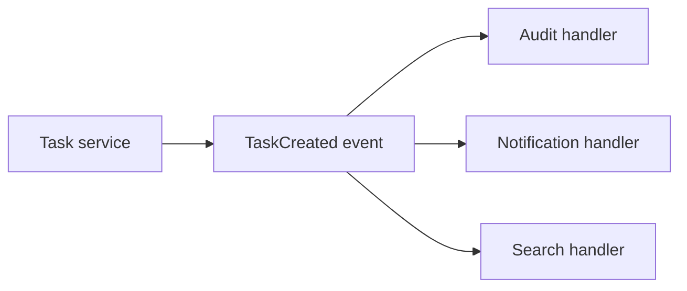
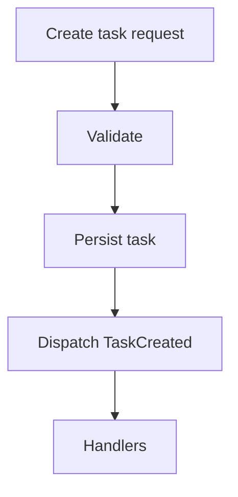
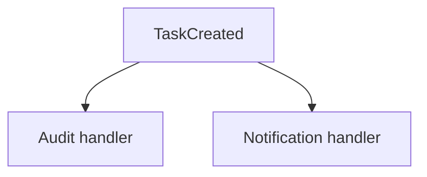
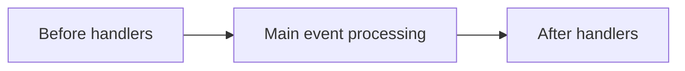
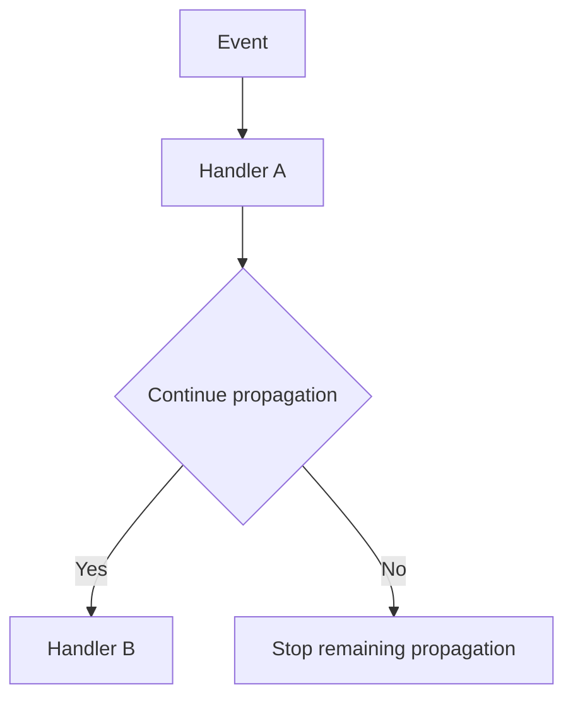

# Tutorial Core 03 — Events and Event Handling

Middleware taught us how code can surround a request.

Events solve a different problem:

> **How can one part of an application tell other parts that something happened without hard-coding every reaction into the original operation?**

This chapter is the mandatory SPP Events lab.

## 33.1 Start with ordinary PHP

Suppose a task is created.

The simplest code is:

```php
$task = $taskService->create($input);
$auditService->record($task);
$notificationService->notify($task);
```

This works, but the task service now knows every reaction that may ever happen.

Imagine later adding:

- analytics;
- email;
- search indexing;
- reporting;
- audit;
- cache invalidation.

The original method becomes tightly coupled to all of them.

## 33.2 The event idea

Instead, the task service can announce:

```text
TaskCreated
```

Other parts of the application can subscribe to that event.



The task service knows what happened.

It does not have to know every reaction.

## 33.3 Event is not the same as middleware

This distinction is worth memorizing.

| Middleware | Event |
|---|---|
| Part of request pipeline | Notification/dispatch mechanism |
| Usually ordered as a chain | Can have multiple listeners/handlers |
| Can stop downstream execution | Can control propagation according to event semantics |
| Naturally surrounds request handling | Represents something happening |
| Request-boundary concern | Cross-component reaction boundary |

Both are powerful, but they solve different coupling problems.

## 33.4 Create the event with SPP scaffolding

Use the current event generator:

```bash
php spp.php make:event TaskCreated
```

Inspect the generated class before changing it.

The goal is to identify:

1. how SPP represents event payload;
2. how the event is dispatched;
3. how handlers/listeners are represented;
4. how the framework discovers them.

## 33.5 Add event data

Give the event the information a listener legitimately needs.

For example:

```php
$event = new TaskCreated($taskId, $actorId);
```

Do not put unrelated application state into the event merely because it is convenient.

A good event contract should describe the thing that happened.

## 33.6 Dispatch the event

The application action performs its business operation first and then dispatches the event at the appropriate semantic point.

Conceptually:



The exact dispatch API must follow the current SPP event implementation.

## 33.7 Add your first handler

Generate a handler using the repository's current scaffold convention.

```bash
php spp.php make:eventhand TaskCreated
```

The first handler can perform a simple audit/logging action.

The point of the first exercise is to prove that:

```text
business operation
    ↓
event dispatch
    ↓
listener execution
```

actually occurs.

## 33.8 Add a second handler

Create a notification handler.

Now a single event has multiple reactions.



The producer does not need to call both explicitly.

This is decoupling in practice.

## 33.9 Handler priority

When multiple listeners exist, order may matter.

SPP supports listener priorities.

For example, an audit action may need to happen before another handler reads the audit-sensitive state.

The exact priority registration syntax must be taken from the current SPP event configuration/source.

Do not copy priority semantics from another framework.

## 33.10 Before, main, and after stages

The current SPP event architecture includes staged event execution concepts.

When the concrete event implementation uses before/main/after processing, the learner should test the ordering explicitly rather than assuming it.



The source trace should establish exactly which handlers belong to each stage and how priority interacts with the stage.

## 33.11 Payload mutation

Events can become more than notifications when handlers are permitted to modify event payload/state.

Example:

```text
Original event data
       ↓
Handler changes event data
       ↓
Later handler sees changed data
```

This is powerful but increases coupling.

Use mutable event state only when the event contract intentionally permits it.

## 33.12 Propagation control

SPP event processing supports propagation control.

Conceptually:



This means a handler can affect whether later handlers execute.

That should be treated as architectural behavior, not a convenience flag.

## 33.13 Override behavior

The SPP event system also supports override-style behavior.

The purpose is to let a later/customized handler path replace or alter a default behavior where the event contract permits it.

Do not use overrides merely to avoid creating a clean application service.

An override is an explicit extension mechanism.

## 33.14 Exercise: audit plus notification

Extend the Task Desk application.

When a task is created:

1. persist the task;
2. dispatch `TaskCreated`;
3. audit the action;
4. notify the relevant user.

Then add a third listener for analytics.

The original task service should not directly call all three listeners.

## 33.15 Exercise: priority

Create two handlers whose output clearly shows order.

Run the event and prove the order through observable output or test assertions.

Then swap the priorities.

The learner should experience that listener ordering is part of the runtime contract.

## 33.16 Exercise: propagation stop

Create a handler that stops further propagation under one condition.

For example:

```text
Task is marked sensitive
    ↓
Audit handler runs
    ↓
Propagation is stopped
    ↓
Non-authorized downstream handler does not run
```

The exact security policy is only an example; the point is to understand propagation control.

## 33.17 Exercise: event data mutation

Create an event with a small mutable field.

Let one handler transform the field.

Let the next handler record the transformed result.

This demonstrates that event payload mutation can create hidden coupling.

Then refactor the example into an immutable/event-data-oriented design and compare the two.

## 33.18 Deliberately break the event system

### Break 1 — Event is dispatched before persistence

Observe what listeners can see.

### Break 2 — Listener has the wrong payload expectation

Observe the failure.

### Break 3 — Priority is reversed

Observe the behavioral difference.

### Break 4 — Propagation is stopped unexpectedly

Find the missing listeners.

### Break 5 — Event handler performs business transaction logic that belongs elsewhere

Refactor it into the correct service boundary.

## 33.19 Parikshak checkpoint

Create tests proving:

1. the event is dispatched after the intended business operation;
2. the expected listener is invoked;
3. multiple listeners execute in the required order;
4. propagation stopping works;
5. payload mutation is visible only where the contract allows it;
6. an event failure is diagnosed correctly;
7. an override behaves as documented.

The exact assertion APIs should use the Parikshak implementation found in the current repository.

## 33.20 Event-driven versus synchronous service calls

Do not turn every method call into an event.

A synchronous service call is often clearer when the caller needs the result immediately.

An event is useful when:

- the producer should not know every reaction;
- multiple independent reactions exist;
- extension points are valuable;
- a domain/application occurrence deserves a named contract.

The more important the event becomes, the more carefully its contract must be designed.

## 33.21 Events and transactions

A common enterprise mistake is:

```text
save database record
↓
dispatch external side effect
↓
transaction rolls back
```

The exact SPP event/database transaction interaction must be traced for the implementation being used.

Do not assume that every event automatically participates in the same transaction boundary.

This is why the handbook treats event semantics and storage semantics separately.

## 33.22 Coming from other frameworks

### Laravel

Think events/listeners and queued listeners, but use SPP's actual `SPPEvent` and handler lifecycle.

### Symfony

The EventDispatcher mental model is useful, especially for listeners/subscribers and priorities.

### Spring

Application events are a useful comparison. SPP's event contracts, staging and propagation rules are framework-specific.

## 33.23 Source deep dive

After the lab works, trace:

1. event definition;
2. dispatch entry point;
3. listener discovery;
4. ordering/priority;
5. before/main/after stages if applicable;
6. payload mutation;
7. propagation control;
8. override handling;
9. exception behavior.

The goal is to know where the framework does each job.

## 33.24 Lab completion criteria

You have completed the Events lab when you can:

- explain event-driven decoupling in plain language;
- create an event with the SPP scaffold;
- dispatch it from application logic;
- create multiple handlers;
- control and test priority;
- explain and test propagation control;
- reason about mutable versus immutable event data;
- write Parikshak tests;
- deliberately break the event flow and diagnose it;
- trace the event dispatcher in SPP source.

Only then move to Registry and Dependency Injection.
