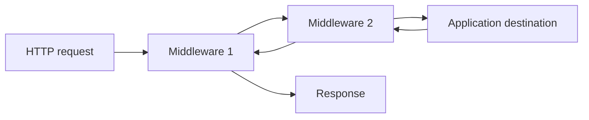
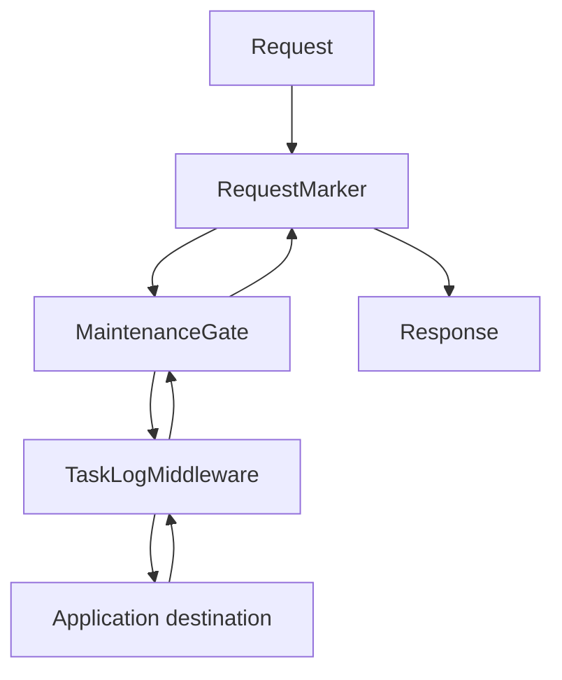
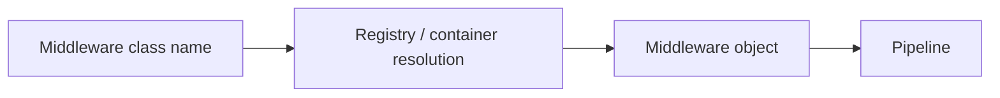

# Chapter 34 — Middleware Pipeline Lab

Middleware is the first major SPP mechanism we will learn in depth.

You already have an application and a request. Now we will place controlled execution layers around that request.

The repository's middleware tutorial establishes the actual SPP model used here: `MiddlewareInterface`, `Pipeline`, `MiddlewareKernel`, global middleware configuration, route-level PHP attributes, and the middleware CLI. fileciteturn232file0L2-L6

---

## 34.1 What problem does middleware solve?

Imagine that every request to your application should:

- check authentication;
- validate a CSRF token;
- write a request log;
- apply rate limiting; and
- add security headers.

You could put those checks into every controller.

That quickly becomes repetitive and error-prone.

Middleware gives you a reusable layer that can run **before and/or after the application code**.



That “go in, reach the destination, then come back out” shape is commonly called the **onion model**.

---

## 34.2 The middleware contract

SPP defines a middleware interface:

```php
namespace SPP\Core;

interface MiddlewareInterface
{
    public function handle($request, \Closure $next);
}
```

The two arguments are the key idea:

| Argument | Meaning |
|---|---|
| `$request` | The request/passable value being sent through the pipeline |
| `$next` | A callable representing the next layer |

A middleware can therefore:

```text
inspect the request
change/prepare state
stop processing
call the next layer
inspect the result afterward
change/post-process the result
```

---

## 34.3 Your first middleware

Create:

```text
src/taskdesk/Middleware/RequestMarker.php
```

```php
<?php

namespace App\Taskdesk\Middleware;

use SPP\Core\MiddlewareInterface;

class RequestMarker implements MiddlewareInterface
{
    public function handle($request, \Closure $next)
    {
        error_log('Task Desk request entered middleware');

        $response = $next($request);

        error_log('Task Desk request returned from destination');

        return $response;
    }
}
```

The important part is not the log statement.

It is the structure:

```php
$response = $next($request);
```

Code before `$next()` runs on the way in.

Code after `$next()` runs on the way out.

---

## 34.4 Why `$next()` matters

Consider:

```php
public function handle($request, \Closure $next)
{
    return $next($request);
}
```

This is pass-through middleware.

It does not change the request or response.

Now consider:

```php
public function handle($request, \Closure $next)
{
    if (! $this->allowed($request)) {
        return 'Blocked';
    }

    return $next($request);
}
```

This middleware can **short-circuit** the request.

The destination is never reached when the condition fails.

---

## 34.5 Build a deliberate short-circuit

Create:

```text
src/taskdesk/Middleware/MaintenanceGate.php
```

```php
<?php

namespace App\Taskdesk\Middleware;

use SPP\Core\MiddlewareInterface;

class MaintenanceGate implements MiddlewareInterface
{
    public function handle($request, \Closure $next)
    {
        if (($_GET['maintenance'] ?? '') === '1') {
            http_response_code(503);
            return 'Task Desk is temporarily unavailable';
        }

        return $next($request);
    }
}
```

Try the same page with:

```text
?maintenance=1
```

The controller should not run.

This is your first important experiment: **middleware can stop the request before the application destination executes.**

---

## 34.6 The Pipeline abstraction

SPP's `Pipeline` class builds the middleware call stack.

The repository tutorial documents the basic form:

```php
(new \SPP\Core\Pipeline())
    ->send($_REQUEST)
    ->through($middlewareList)
    ->then($destination);
```

Think of it as three questions:

```text
What value is traveling through the pipeline?
Which middleware should see it?
What code should run after the middleware stack?
```

The destination is the final application work.

---

## 34.7 Multiple middleware layers

Suppose the stack is:

```text
RequestMarker
MaintenanceGate
TaskLogMiddleware
```

Conceptually:



Each middleware receives the same passable request and its own `$next` closure.

The pipeline is therefore a nested chain rather than a simple loop.

---

## 34.8 How SPP resolves middleware

The repository tutorial documents that `Pipeline` can receive different kinds of entries.

The framework can work with:

```text
class names
middleware objects
plain callables
```

For middleware class names, SPP resolves them through the Registry/container path described by the existing implementation.

This is why middleware can participate in SPP dependency injection instead of being manually constructed everywhere.

The important architecture is:



We will connect this explicitly to the Registry/DI tutorial next.

---

## 34.9 What is `MiddlewareKernel`?

`Pipeline` is the execution mechanism.

`MiddlewareKernel` is the framework-level orchestrator that decides **which global middleware belongs in the pipeline**.

The repository middleware tutorial documents global middleware assembled from:

1. built-in/registry middleware;
2. global `spp/etc/middleware.yml` configuration;
3. application-specific middleware configuration when the active context is not the default context. fileciteturn232file0L2-L6

That is an important distinction:

> `Pipeline` executes a stack. `MiddlewareKernel` assembles/owns the framework's global stack.

---

## 34.10 Global middleware configuration

The documented global configuration path is:

```text
spp/etc/middleware.yml
```

An example from the repository documentation is conceptually:

```yaml
global:
  - SPP\Core\Middleware\CSRFMiddleware
  - SPPMod\SPPLogger\RequestLogger
```

The application can also have its own middleware configuration, for example:

```text
src/taskdesk/etc/middleware.yml
```

with:

```yaml
global:
  - App\Taskdesk\Middleware\TenantResolver
```

This is more useful than hard-coding middleware into every controller because the policy can be changed at the application boundary.

---

## 34.11 Programmatic registration

The repository tutorial also documents programmatic registration through:

```php
\SPP\Core\MiddlewareKernel::addGlobalMiddleware(
    \App\Taskdesk\Middleware\RequestMarker::class
);
```

This is useful when a module or runtime extension needs to add middleware during boot.

The exact deduplication/boot behavior is handled by the current implementation; do not duplicate the kernel's registration logic in application code.

---

## 34.12 Route-level middleware

Global middleware is appropriate when every request needs a rule.

But authentication for an admin page does not necessarily belong globally.

SPP also supports route-scoped middleware through PHP attributes.

The repository tutorial documents the `#[Middleware(...)]` attribute and middleware supplied through the `#[Route(...)]` configuration. fileciteturn232file0L2-L6

Conceptually:

```php
use SPPMod\SPPView\Attributes\Middleware;
use SPPMod\SPPView\Attributes\Route;

#[Middleware(\App\Taskdesk\Middleware\RequireLogin::class)]
class AdminController
{
    #[Route('/admin/settings')]
    public function settings()
    {
        return 'Settings';
    }
}
```

This keeps feature-specific middleware close to the feature that requires it.

---

## 34.13 Class-level versus method-level middleware

A class-level middleware attribute can affect all methods of a controller.

A method-level middleware attribute can add protection to one operation.

Think of the relationship as:

```text
Controller class
    ↓
shared middleware
    ↓
individual method
    ↓
additional middleware
```

The repository tutorial documents middleware merging from class-level attributes, method-level attributes, and the route-level middleware parameter. The exact merge behavior should be learned from the current `RouteScanner`/router implementation rather than reconstructed from convention. fileciteturn232file0L2-L6

---

## 34.14 Build a practical authentication middleware

Now create:

```text
src/taskdesk/Middleware/RequireLogin.php
```

```php
<?php

namespace App\Taskdesk\Middleware;

use SPP\Core\MiddlewareInterface;

class RequireLogin implements MiddlewareInterface
{
    public function handle($request, \Closure $next)
    {
        if (empty($_SESSION['user_id'])) {
            http_response_code(401);
            return 'Authentication required';
        }

        return $next($request);
    }
}
```

This is deliberately a simple teaching example.

The production authentication branch will use the actual SPPAuth implementation rather than a hand-written session check.

That distinction matters:

> The middleware mechanism is the lesson here. The authentication subsystem is a later lesson.

---

## 34.15 Post-processing middleware

Middleware can also modify the result after the destination has run.

For example:

```php
class FooterMiddleware implements \SPP\Core\MiddlewareInterface
{
    public function handle($request, \Closure $next)
    {
        $response = $next($request);

        if (is_string($response)) {
            $response .= '<!-- Task Desk -->';
        }

        return $response;
    }
}
```

That gives the full onion model:

```text
before
  ↓
next
  ↓
after
```

---

## 34.16 Built-in SPP security middleware

The repository identifies middleware related to:

- API authentication;
- CSRF;
- request logging;
- rate limiting;
- throttling;
- security headers.

The security module additionally contains CSRF, sanitization, rate limiting, throttling, and security-header components. These are covered separately in the Web Security tutorial.

Do not copy security middleware into your application merely to imitate the framework. Reuse the framework feature where the actual module contract supports it.

---

## 34.17 Observe the order

Create two simple middleware classes that log:

```text
A before
B before
Destination
B after
A after
```

Then inspect the log.

This is one of the most useful beginner exercises because the middleware architecture is much easier to understand when you can see the order physically.

---

## 34.18 Deliberately break it

Try each of these failures one at a time:

### Break 1 — Do not call `$next()`

Expected result: later layers and the destination do not execute.

### Break 2 — Call `$next()` twice

This can create repeated execution and should be avoided unless the source/runtime explicitly expects such behavior.

### Break 3 — Register a class that does not implement the middleware contract

Observe the failure and trace where the pipeline expects the callable/middleware shape.

### Break 4 — Put middleware in the wrong configuration file

Observe that the source file existing on disk does not mean the active `MiddlewareKernel` loaded it.

### Break 5 — Put route middleware on the wrong method

Confirm which route actually receives the middleware.

These exercises teach a more important lesson than memorizing syntax:

> **Framework configuration is runtime input, not documentation. If the runtime does not discover it, the file might as well not exist.**

---

## 34.19 Parikshak checkpoint

Create tests for at least these behaviors:

### Test A — pass-through

The destination executes when the middleware allows the request.

### Test B — short-circuit

The destination does not execute when the middleware blocks the request.

### Test C — ordering

Two middleware execute in the expected nested order.

### Test D — post-processing

The response is changed after the destination returns.

Use the actual Parikshak test base and runner from the repository rather than inventing a generic PHPUnit structure.

The detailed Parikshak API is covered in its dedicated branch.

---

## 34.20 CLI exercise

The repository middleware tutorial documents commands such as:

```bash
php spp/spp.php make:middleware MyCustomMiddleware
php spp/spp.php middleware:list
```

Use the generator, then compare the generated file with the manually created middleware.

Ask:

```text
Which part is required by the runtime?
Which part is merely generator convention?
Where did the stub come from?
What would happen if I changed the class name?
```

This begins the scaffold-analysis habit that will continue throughout the handbook.

---

## 34.21 Source trace

Now inspect:

```text
spp/core/class.middlewarekernel.php
spp/core/class.pipeline.php
documentation/framework/middleware.md
docs/tut/15_middleware.md
```

Trace these operations:

```text
MiddlewareKernel::boot()
    ↓
collect middleware
    ↓
Pipeline
    ↓
resolve middleware
    ↓
handle()
    ↓
next()
    ↓
destination
```

Do not stop at the class declaration. Follow the call chain until you can explain how a real request reaches the destination.

---

## 34.22 When should middleware not be used?

Do not turn every reusable function into middleware.

Middleware is most useful for behavior that belongs at a request boundary, such as:

```text
authentication/authorization gates
CSRF checks
rate limiting
request logging
security headers
request context setup
cross-cutting request policy
```

A calculation such as:

```php
$price = $service->calculatePrice($cart);
```

is normally not middleware.

It belongs in an application/domain/service layer.

---

## 34.23 Comparison with other frameworks

| Framework | Familiar concept |
|---|---|
| Laravel | HTTP middleware / pipeline |
| Symfony | HTTP kernel/event/listener stack and middleware-style processing |
| Django | Middleware |
| ASP.NET Core | Middleware pipeline |
| Spring | Filters/interceptors and other request-boundary mechanisms |
| SPP | `MiddlewareInterface` + `Pipeline` + `MiddlewareKernel` + route attributes |

The concepts are similar, but the exact SPP lifecycle and registration rules are framework-specific.

---

## 34.24 What you should now understand

You should now be able to explain middleware without framework jargon:

> **Middleware is reusable code placed around request processing. It can inspect a request, stop it, let it continue, and optionally process the result afterward. SPP's Pipeline executes the stack, while MiddlewareKernel assembles the global stack and route metadata can add local middleware.**

That is enough foundation for the next concept.

---

## Next

**Chapter 35 — Events Lab**

Middleware controls the execution path of a request.

Next we learn how SPP lets one part of the application react when something happens elsewhere: the event system.
