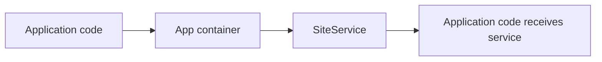
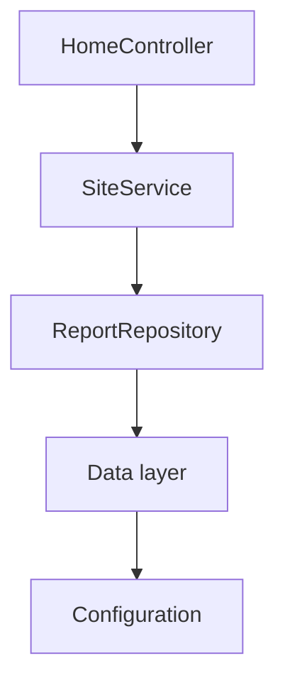

# 34. Registry and Dependency Injection Lab

This chapter assumes that you understand the basic framework idea, have built the first SPP application, and have seen middleware and events.

Now we answer a very practical question:

> **How does SPP create the objects my application needs?**

A beginner often writes this:

```php
$service = new SiteService();
```

That works. But as an application grows, objects start depending on other objects:

```php
$controller
    -> needs ReportService
        -> needs ReportRepository
            -> needs DatabaseConnection
                -> needs configuration
```

Creating that whole chain manually in every controller becomes repetitive and tightly coupled.

SPP provides application-level mechanisms for registration, resolution, and invocation so the application can construct these dependencies consistently.

---

## 34.1 Three ideas you must keep separate

SPP exposes several mechanisms that are easy to mix up when you are new to frameworks.

### Registry

The Registry is a named framework-wide registration mechanism. It is useful for values and runtime registrations that other parts of SPP need to discover.

Example from the application-development guide:

```php
use SPP\Registry;

Registry::register('__myapp=>booted', true);
```

Think:

> **Registry = named runtime information or registration.**

### Application container

The application object can register and resolve services.

The documented methods include:

```php
\SPP\App::getApp()->singleton(...);
\SPP\App::getApp()->make(...);
\SPP\App::getApp()->call(...);
```

Think:

> **Container = object construction and dependency resolution.**

### Dependency injection

Dependency injection means that a class receives the object it needs instead of creating that object itself.

Compare:

```php
class ReportController
{
    public function index(): string
    {
        $service = new ReportService();
        return $service->summary();
    }
}
```

with:

```php
class ReportController
{
    public function index(ReportService $service): string
    {
        return $service->summary();
    }
}
```

The second version says what the controller needs without saying how to build it.

---

## 34.2 Your first service

Create:

```text
src/myapp/services/SiteService.php
```

```php
<?php

namespace App\Myapp\Services;

class SiteService
{
    public function title(): string
    {
        return 'My SPP Application';
    }
}
```

Resolve it through the application object:

```php
$service = \SPP\App::getApp()->make(
    \App\Myapp\Services\SiteService::class
);

echo $service->title();
```

This is the first important mental shift:



You ask the application runtime for the dependency instead of constructing it everywhere yourself.

---

## 34.3 Why `make()` matters

Imagine ten controllers use the same service.

Without a container:

```php
new SiteService();
```

appears in many places.

With the application container:

```php
\SPP\App::getApp()->make(SiteService::class);
```

The construction decision is centralized in the application runtime.

That gives you a place to evolve the construction rules without changing every caller.

---

## 34.4 Singleton registration

The application-development guide demonstrates app-level singleton registration from a custom App class:

```php
$this->singleton(
    \App\Myapp\Services\SiteService::class
);
```

Conceptually, a singleton registration means:

> Build one shared instance for the application container rather than constructing a new instance for every request to the service resolver.

Use this intentionally.

Good candidates can include stateless application services whose lifecycle is meant to be shared by the application runtime.

Do not assume every class should be a singleton.

Avoid making request-specific mutable state global merely because the container can share it.

---

## 34.5 Custom App class example

Create:

```text
src/myapp/MyappApp.php
```

The application guide documents the custom App class pattern:

```php
<?php

namespace App\Myapp;

class MyappApp extends \SPP\App
{
    public function __construct(
        string $appname = 'myapp',
        bool $handleerror = true,
        int $init_level = 4
    ) {
        parent::__construct($appname, $handleerror, $init_level);

        $this->singleton(
            \App\Myapp\Services\SiteService::class
        );
    }
}
```

The important architectural idea is not the class itself. It is that the application can define its own construction rules while still using the framework runtime.

---

## 34.6 `call()` and method injection

The application guide also documents `App::call()` for invoking a method with dependency-aware parameters.

Example:

```php
class HomeController
{
    public function index(SiteService $service): string
    {
        return '<h1>' . htmlspecialchars(
            $service->title(),
            ENT_QUOTES,
            'UTF-8'
        ) . '</h1>';
    }
}
```

The controller can be invoked through the application object:

```php
echo \SPP\App::getApp()->call([
    HomeController::class,
    'index',
]);
```

The benefit is that the method signature declares the dependency:

```php
index(SiteService $service)
```

instead of hiding construction inside the method body.

---

## 34.7 Dependency graphs

Real applications quickly become graphs of dependencies.



Without dependency injection, the developer has to manually build this graph.

With DI, the runtime can become responsible for assembling it from the application's registrations and constructors/method signatures.

That is one of the main reasons DI exists in frameworks.

---

## 34.8 Registry is not a replacement for every service

A common beginner mistake is to put everything into a global registry:

```php
Registry::register('my_service', new SiteService());
```

and then fetch it everywhere.

That can create hidden global dependencies.

Prefer the application container for normal service construction when the application guide and current runtime support it.

Use Registry when you actually need named framework/application state or registration semantics.

The distinction makes the architecture easier to understand:

```text
Registry
  = named runtime registration/state

Container
  = object construction/resolution

Service
  = reusable application behavior
```

---

## 34.9 A practical service chain

Let's build something slightly more realistic.

### Repository

```php
<?php

namespace App\Myapp\Services;

class TaskRepository
{
    public function countOpen(): int
    {
        return 7;
    }
}
```

### Service

```php
<?php

namespace App\Myapp\Services;

class DashboardService
{
    public function __construct(
        private TaskRepository $tasks
    ) {
    }

    public function openTaskCount(): int
    {
        return $this->tasks->countOpen();
    }
}
```

### Controller

```php
<?php

namespace App\Myapp\Serv;

use App\Myapp\Services\DashboardService;

class DashboardController
{
    public function index(DashboardService $dashboard): string
    {
        return 'Open tasks: ' . $dashboard->openTaskCount();
    }
}
```

Now the controller does not construct the service, and the service does not construct its repository.

The dependency declarations are visible in the constructors and method signatures.

---

## 34.10 Debugging DI failures

When dependency resolution fails, do not immediately change random registration code.

Trace the dependency chain.

Ask:

1. What class is the application trying to construct?
2. Which constructor or method parameter is unresolved?
3. Is the class autoloadable?
4. Is the application using the expected namespace/class name?
5. Does the application container know how to construct the dependency?
6. Did a singleton or registration override the expected behavior?
7. Are you accidentally relying on global Registry state when the class expects DI?

A useful debugging technique is to temporarily reduce the graph.

For example:

```php
class DashboardService
{
    public function __construct(TaskRepository $tasks)
    {
        // Temporarily test only this dependency.
    }
}
```

Get the smallest dependency working before restoring a larger graph.

---

## 34.11 Deliberate failure exercise

Break the tutorial application intentionally.

Change:

```php
public function __construct(
    private TaskRepository $tasks
)
```

to a non-existent class:

```php
public function __construct(
    private MissingRepository $tasks
)
```

Now trigger the controller.

Your task is to identify:

- where resolution failed;
- whether the failure happened during autoloading or construction;
- which caller requested the missing dependency; and
- which registration would be needed, if registration is actually required.

Then restore the correct class.

The objective is not just to make the error disappear. The objective is to learn to read the dependency graph.

---

## 34.12 Parikshak exercise

The service layer is an ideal first place to start testing dependencies.

Write a test that proves:

```text
DashboardService receives TaskRepository
DashboardService returns the open-task count
Controller receives DashboardService
```

Keep tests small.

A test for the service should not need to boot the entire browser request stack unless the behavior you are testing genuinely requires it.

Use Parikshak's own application-aware test classes when the test needs the SPP runtime.

---

## 34.13 Comparing SPP with other frameworks

### Laravel

Laravel developers will recognize the container and constructor injection model. SPP's public application guide exposes the same broad idea through its `App` runtime while also retaining the SPP Registry mechanism.

### Symfony

Symfony users will recognize dependency injection and service registration. The SPP beginner must additionally understand that its Registry is a separate named registration mechanism.

### Spring

The mental model is similar: declare dependencies, let the framework assemble objects.

### Plain PHP

Plain PHP does not stop you from doing DI manually. Framework DI mainly gives you a central runtime for doing it consistently at application scale.

---

## 34.14 Kernel Hacker section

The most important architectural boundary is:

```text
application context
    ↓
application object
    ↓
container registrations
    ↓
service resolution
    ↓
controller/service execution
```

The application-development guide explicitly documents:

```php
\SPP\App::getApp()
\SPP\App::getApp()->singleton(...)
\SPP\App::getApp()->make(...)
\SPP\App::getApp()->call(...)
```

It also documents Registry use for named runtime state.

Do not infer undocumented container semantics—such as arbitrary interface binding, automatic lifecycle scopes, or advanced contextual bindings—unless the current source/tests demonstrate them.

### Source map

Start from:

```text
spp/core/class.app.php
spp/core/class.registry.php
spp/core/class.autoloader.php
spp/modules/*
documentation/framework/application-development.md
```

Then trace the actual construction path for the version of SPP you are using.
