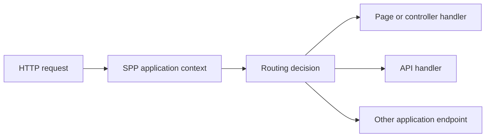
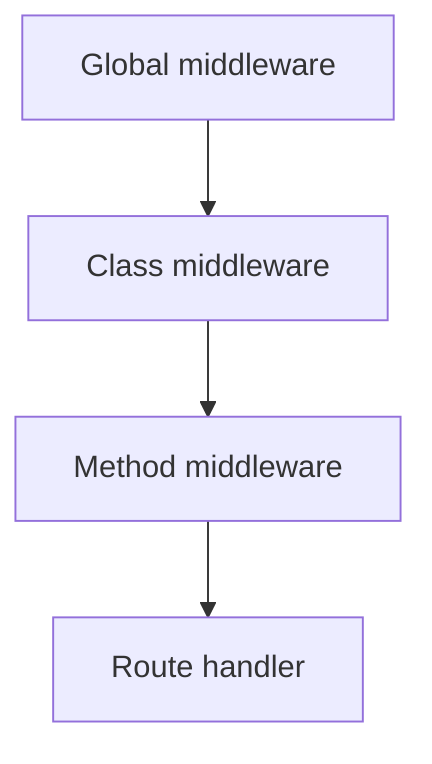
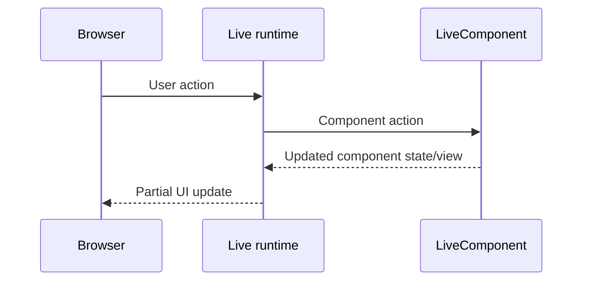
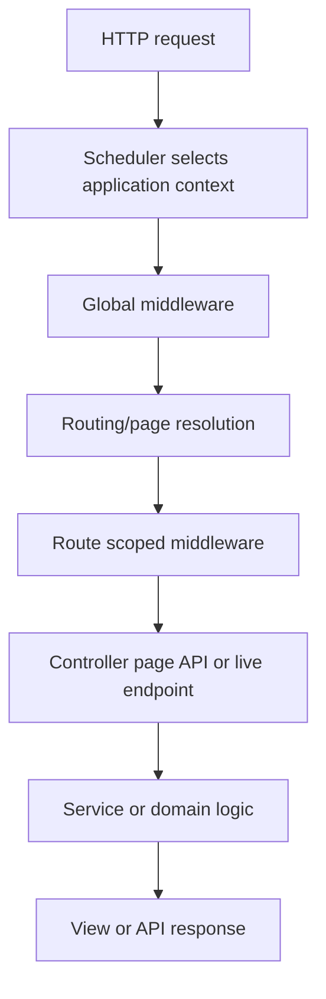

# 34 — Routing and Page Paradigms: Pages, Attributes, Controllers, and Dynamic Views

This is a **mandatory core tutorial chapter**.

It assumes that you know PHP but have never used a web framework. By the end, you will understand why routing exists, how SPP decides what code should handle a URL, why SPP has more than one routing paradigm, how `pages.yml` fits into the picture, how attribute routes work, how controller/page-oriented applications differ, and how routing connects to middleware, MVC, SPPView, AJAX augmentation, and APIs.

## 1. What routing means

A browser sends a request such as:

```text
GET /shop/products/42
```

The framework needs to answer a simple question:

> **Which application code should handle this URL?**

That decision is routing.

Without a framework, you might write a large `if/elseif` tree in PHP:

```php
if ($path === '/about') {
    require __DIR__ . '/about.php';
} elseif ($path === '/shop') {
    require __DIR__ . '/shop.php';
}
```

A routing system turns that problem into a structured registry of paths, handlers, parameters, middleware, names, and rendering behavior.



## 2. Routing is not the same thing as MVC

MVC is an application-organization pattern.

Routing answers:

> Which handler should run?

MVC answers:

> How should that handler's responsibilities be separated?

A route can therefore point to a controller, a page, a service, or another endpoint mechanism without making routing itself “MVC”.

This distinction matters in SPP because the framework supports multiple application paradigms.

## 3. The SPP routing paradigms

The repository shows several routing/page styles. They should be taught separately rather than pretending there is one universal syntax.

| Paradigm | Typical use | Where the route definition lives |
|---|---|---|
| `pages.yml` page routing | Page-oriented/configuration-driven applications | `etc/pages.yml` or app-specific equivalent |
| PHP Attribute routing | Controller-oriented modern PHP applications | `#[Route(...)]` attributes on PHP methods/classes |
| Application/page handlers | Existing SPP applications built around `serv/`, pages, or handler conventions | Application source/configuration |
| API routing | REST/API endpoints and API resources | SPPAPI/route definitions/controllers |
| Reactive/live endpoints | LiveComponent/SPP Live interactions | Component/live infrastructure rather than ordinary page routing |

These mechanisms can coexist.

The beginner mistake is to ask:

> “Which one is the SPP routing syntax?”

A better question is:

> “Which routing paradigm is appropriate for this part of my application?”

## 4. Paradigm A — `pages.yml`

`pages.yml` is an important SPP configuration-driven page mechanism and **must be understood even if you prefer attributes**.

The repository contains generated/documented `pages.yml` structures, and SPP's tutorial describes central page definitions such as:

```yaml
pages:
  - name: home
    url: /home.php
  - name: about
    url: /about.php
  - name: profile
    url: /user_profile.php
```

The important idea is that the page table is externalized from PHP code.

Instead of writing route metadata beside a controller method, you describe pages in configuration.

## 5. Why configuration-driven routing exists

Suppose a publishing site has dozens of pages and administrators need a clear inventory of them.

A centralized page configuration can be easier to inspect than searching many PHP classes.

This style is particularly useful when:

- pages are configuration-heavy;
- the application has a page-oriented structure;
- paths are part of deployment/configuration data;
- non-code tools need to inspect or generate page definitions;
- an existing SPP application already uses `pages.yml`.

It is not “old and useless”. It is a different architectural style.

## 6. Static and dynamic page parameters

The existing SPP routing tutorial documents page names and positional URL parameters.

Conceptually:

```text
profile/123/edit
```

can resolve through a page named `profile`, with the remaining path segments available as parameters.

Existing SPP code retrieves page information through:

```php
$pageData = \SPPMod\SPPView\Pages::getPage();
```

and accesses parameters from the page data structure.

The exact shape of the page configuration should be verified against the app/module version in use; do not copy a `pages.yml` structure from another framework.

## 7. Paradigm B — Attribute routing

SPP also supports PHP Attribute-based routing.

A conceptual example from the repository's routing tutorial is:

```php
use SPPMod\SPPView\Attributes\Route;
use SPPMod\SPPView\Attributes\Middleware;

#[Middleware(AuthMiddleware::class)]
class UserController
{
    #[Route('/users/{id}', method: 'GET', name: 'user.show')]
    #[Middleware(LogMiddleware::class)]
    public function show(string $id)
    {
        // Render the user view.
    }
}
```

The key idea is that the route is physically next to the code that implements it.

This is attractive for modern controller-oriented applications.

## 8. Route metadata is executable architecture

A route can contain more than a URL.

Depending on the SPP routing mechanism, route metadata can express things such as:

```text
HTTP method
path parameters
route name
middleware
handler/controller
view/page target
API behavior
```

The practical consequence is that route definitions become part of the application's architecture, not merely a list of URLs.

## 9. Class-level and method-level route middleware

The repository's routing tutorial demonstrates that middleware can be attached at class or method scope.

For example:

```php
#[Middleware(AuthMiddleware::class)]
class AdminController
{
    #[Middleware(CsrfMiddleware::class)]
    #[Route('/admin/settings', method: 'GET')]
    public function settings()
    {
        // ...
    }
}
```

The important concept is composition:



Do not assume that every route mechanism merges middleware in exactly the same way; the active router implementation is authoritative.

## 10. `pages.yml` and attribute routing are not competitors

For a mature SPP application, it is reasonable to have both.

For example:

```text
Public content pages       -> pages.yml
Administrative controllers -> attributes
REST API                    -> SPPAPI routes/resources
Live interactions           -> LiveComponent/SPP Live
```

The design question is not “which syntax is fashionable?”

It is:

> Which representation makes the ownership and lifecycle of this endpoint easiest to understand and maintain?

## 11. The page-oriented model

The page-oriented paradigm often starts from:

```text
URL
  -> page definition
  -> page/controller or view
  -> rendered document
```

This is a useful mental model for CMS-like and content-heavy applications.

## 12. The controller-oriented model

The controller-oriented model starts from:

```text
URL
  -> Route metadata
  -> controller method
  -> service/domain logic
  -> view or response
```

This fits applications where code structure is the primary organization mechanism.

## 13. The API model

API routing has different concerns from browser page routing.

An API endpoint usually cares about:

```text
resource
HTTP method
authentication
authorization
request validation
serialization
pagination
status codes
error responses
```

SPPAPI has its own resource/response/pagination and authentication infrastructure. The dedicated API tutorial branch should be used for those features rather than treating API routes as ordinary HTML page routes.

## 14. The reactive model

LiveComponent and SPP Live introduce another important distinction.

A live action is often not a new browser page route at all.

The user may remain on one URL while the client sends an action to a server-side component.



That is why a complete SPP developer must understand ordinary routing **and** reactive endpoint semantics.

## 15. How routing fits into the request lifecycle

The broader flow is:



The exact internal ordering can vary by entry point, so treat this as the conceptual model rather than an assertion that every SPP request follows exactly these steps.

## 16. Routing and SPPView

SPPView is not only a templating layer in SPP's page-oriented architecture.

The repository's routing tutorial identifies:

```php
\SPPMod\SPPView\ViewPage::showPage();
```

as a core page rendering entry point.

That means a beginner should understand the relationship:

```text
page resolution
    ↓
selected page/view
    ↓
SPPView rendering
    ↓
compiled/cached output
```

## 17. View routing versus API routing

Do not create one giant controller that decides whether to return HTML, JSON, a LiveComponent update, or a file.

Use clear endpoint boundaries.

For example:

| Concern | Better endpoint model |
|---|---|
| Human-facing HTML | Page/controller/view route |
| JSON resource | SPPAPI route/resource |
| LiveComponent interaction | Live action/component infrastructure |
| Static asset | Resource/static handling |
| Background operation | Command/worker/cron |

This makes middleware and testing much easier to reason about.

## 18. Route generation and scaffolding

The repository contains route scaffolding stubs, including a `routes.stub`, and routing-related generator documentation.

That matters because SPP provides a **code-generation workflow around routing**, not just a runtime router.

The tutorial should therefore teach:

1. create a route manually;
2. generate the route/controller structure with SPP tooling;
3. compare the generated code with the manual version;
4. modify it;
5. run the application;
6. test the route with Parikshak;
7. inspect the generator stub.

The generated code is a starting point, not a substitute for understanding routing.

## 19. Route debugging exercise

Create these three endpoints:

```text
/about
/users/42
/api/users/42
```

Then deliberately create a collision or malformed route definition.

Observe:

- which route wins;
- whether a route is discovered;
- what middleware runs;
- what handler is invoked;
- whether the result is HTML or API output.

The purpose is to make routing observable rather than magical.

## 20. Parikshak tests

Every route introduced in the tutorial should get a test.

At minimum test:

```text
valid path
invalid path
method mismatch
parameter extraction
middleware rejection
authorized access
successful controller execution
API response where applicable
```

The route tutorial should link into the dedicated Parikshak chapter rather than inventing a second testing system.

## 21. Common beginner mistake: treating the URL as the controller

A URL is an input.

The handler is an implementation.

Do not mentally model:

```text
/users/42 = UserController::show()
```

as if that were intrinsically true.

The actual architecture is:

```text
request URL
  -> router's matching rules
  -> selected endpoint metadata
  -> handler
```

This distinction becomes essential when the same business operation is exposed through HTML, API, and live interactions.

## 22. Comparison with other frameworks

| Framework | Common routing style | SPP equivalent lesson |
|---|---|---|
| Laravel | Route definitions + controller attributes/conventions depending on version | Study both configuration-driven and attribute routing in SPP |
| Symfony | Route attributes/YAML/XML/PHP configuration | SPP similarly supports multiple route representations |
| Django | URL configuration mapped to views | Similar centralized mapping concept |
| Rails | Resourceful routing DSL | SPP differs because page/configuration and PHP-attribute paradigms coexist |
| ASP.NET Core | Attribute/convention routing | Similar metadata-driven controller routing, but SPP also has page configuration paradigms |

The comparison should help a developer coming from another framework, but it should never replace the SPP-specific source and runtime behavior.

## 23. Kernel Hacker: where to look

For routing internals, start with the repository's routing documentation and the actual implementation around:

```text
spp/core/attributes/Route.php
routing engine implementation
automated route/page scanners
SPPView page infrastructure
route scaffolding stubs
pages.yml examples
```

Do not assume a class exists merely because another framework uses the same name. The source tree is authoritative.

## 24. What you should know before moving on

You should be able to explain, without looking at the handbook:

1. what routing solves;
2. why SPP has more than one routing paradigm;
3. what `pages.yml` is for;
4. what attribute routing is for;
5. how route middleware fits into routing;
6. how routing connects to MVC;
7. how page routing differs from API and live interaction routing;
8. why route definitions should be tested; and
9. how to inspect the generated/scaffolded routing structure.

Only after those questions are comfortable should the learner move deeper into modules, rendering, forms, and data.
