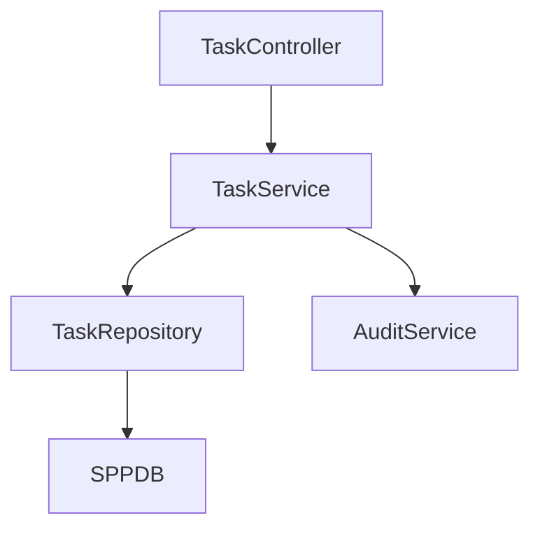
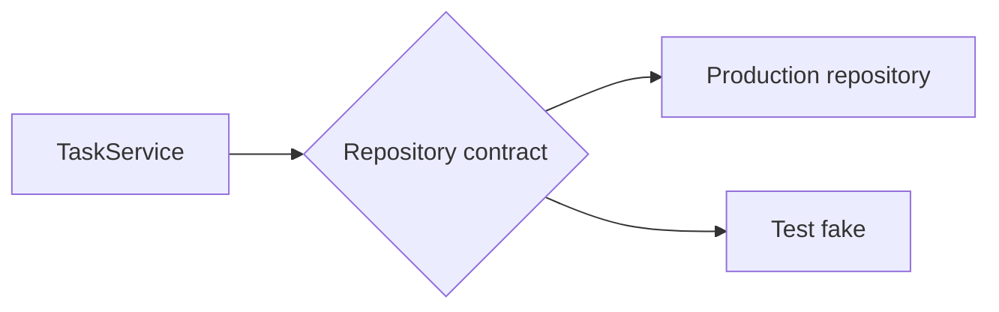
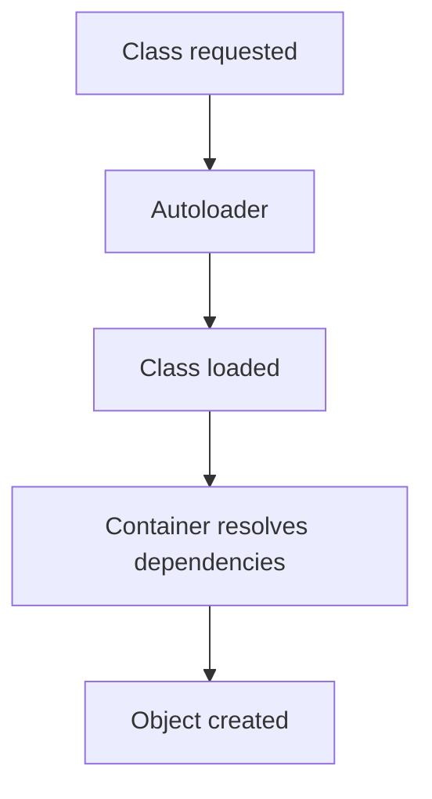

# Tutorial Core 04 — Registry, Services, and Dependency Injection

After middleware and events, the next framework problem is construction.

A small PHP application can use `new` everywhere. A large application quickly turns that into a dependency-management problem.

This chapter teaches the SPP Registry and container from zero.

## 34.1 The problem with `new` everywhere

Consider this code:

```php
class TaskController
{
    public function create(): void
    {
        $repository = new TaskRepository();
        $validator = new TaskValidator();
        $audit = new AuditService();
        $notifier = new NotificationService();

        // work...
    }
}
```

It works.

But now the controller decides:

- which concrete repository to use;
- how the validator is constructed;
- which audit service implementation is active;
- how notification configuration is loaded.

As the application grows, construction spreads everywhere.

## 34.2 Dependency injection in plain language

If class A needs class B, then B is a dependency of A.

Instead of A constructing B itself, a dependency-injection system can provide B to A.


The controller can focus on using the service rather than constructing its entire object graph.

## 34.3 Registry versus container

The words can sound interchangeable, but they solve different problems.

A **Registry** is useful for storing and retrieving named/runtime values and framework metadata.

A **Container** is concerned with resolving application objects and their dependencies.

SPP has both concepts.

Do not collapse them into one generic “global object” in your mental model.

## 34.4 Start with manual construction

Create:

```php
class TaskRepository
{
    public function all(): array
    {
        return [];
    }
}

class TaskService
{
    public function __construct(private TaskRepository $repository)
    {
    }
}
```

Manual construction looks like:

```php
$repository = new TaskRepository();
$service = new TaskService($repository);
```

Now add another dependency.

```php
class TaskService
{
    public function __construct(
        private TaskRepository $repository,
        private TaskValidator $validator,
        private AuditService $audit
    ) {
    }
}
```

Construction becomes more cumbersome.

## 34.5 Let SPP resolve the service

Use the SPP application/container APIs already established by the repository's current implementation.

The exact call should be learned from the current `App`/container source rather than from generic PHP DI examples.

The conceptual operation is:

```text
ask SPP for TaskService
    ↓
inspect TaskService dependencies
    ↓
resolve each dependency
    ↓
construct the graph
    ↓
return TaskService
```

## 34.6 Build a service graph

Add a chain:

```text
TaskController
    ↓
TaskService
    ↓
TaskRepository
    ↓
SPPDB
```

Now add audit:



This is where dependency injection starts becoming valuable.

## 34.7 Constructor injection

Constructor injection makes dependencies visible.

```php
class TaskService
{
    public function __construct(
        private TaskRepository $repository,
        private AuditService $audit
    ) {
    }
}
```

A reader can immediately understand what the service needs.

## 34.8 Why dependency injection helps testing

Suppose the repository talks to a real database.

A unit test may instead want a fake implementation.

With dependency injection, the service boundary can be tested without rebuilding every real infrastructure component.



Whether a particular SPP container supports every form of interface binding is a source-level question. The architectural principle remains the same.

## 34.9 Registry use

The Registry can hold framework/application values that need a runtime lookup.

Examples may include:

- application metadata;
- resolved runtime values;
- shared objects;
- configuration-derived values;
- extension registrations.

The exact SPP Registry contents must be traced from the current source rather than inferred from the word “registry”.

## 34.10 Do not put everything into the Registry

A Registry is not a reason to create global mutable state.

Bad pattern:

```text
Registry
 ├── currentUser
 ├── every service
 ├── every query result
 ├── every request variable
 └── miscellaneous business state
```

Prefer explicit dependencies for application behavior.

Use runtime registries where the framework architecture actually requires registration/lookup.

## 34.11 Exercise: migrate Task Desk

Start with the plain PHP Task Desk.

Refactor it so:

1. `TaskController` depends on `TaskService`;
2. `TaskService` depends on `TaskRepository`;
3. `TaskRepository` uses the framework data boundary;
4. construction is performed through the SPP application/container mechanism.

Then remove unnecessary manual `new` operations.

## 34.12 Exercise: add a fake dependency

Create a test double for the repository.

Use it to test that:

- the service calls the repository correctly;
- validation occurs before persistence;
- an audit call happens at the intended point.

This connects the DI lab directly to Parikshak.

## 34.13 Deliberately break dependency resolution

### Break 1 — Missing constructor dependency

Observe the container error.

### Break 2 — Circular dependency

Create a small cycle and observe what SPP reports.

### Break 3 — Wrong class/namespace

Observe whether the problem is autoloading or dependency resolution.

### Break 4 — Hide a required dependency in a Registry lookup

Compare the readability and testability of explicit injection.

## 34.14 Parikshak checkpoint

Test:

1. the service can be constructed by the application runtime;
2. dependencies are present;
3. test doubles can replace application dependencies where the current container contract allows it;
4. missing dependencies fail predictably;
5. the controller does not have to manually build the entire service graph.

## 34.15 Autoloading is part of the story

Dependency injection only works if PHP can load the classes.

The repository contains its own autoloading/PSR-oriented runtime pieces.

Therefore debug a “class not found” problem separately from a container-resolution problem.



This distinction will save hours of debugging later.

## 34.16 Coming from other frameworks

### Laravel

Think Service Container + service providers + dependency injection. SPP's container and Registry are different implementation contracts.

### Symfony

Think dependency injection container and autowiring, but inspect SPP's own resolution rules and configuration.

### Spring Boot

The object graph idea maps closely to IoC/DI. SPP's runtime is PHP-native.

## 34.17 Source deep dive

Trace:

1. where the SPP application exposes the container;
2. how the container receives a class name;
3. how reflection/constructor dependencies are discovered, if used;
4. how scalar/configuration dependencies are handled;
5. how already-registered/shared objects are treated;
6. how errors are reported;
7. how the Registry participates in runtime extension.

Then compare the implementation against the mental model you used in the lab.

## 34.18 Lab completion criteria

You are finished when you can:

- explain dependency injection without framework jargon;
- distinguish Registry from Container;
- migrate a service graph from manual construction to SPP resolution;
- explain autoloading versus DI failures;
- use test doubles at the service boundary;
- diagnose a container failure;
- trace the actual SPP resolution implementation.

The next core lab is configuration and application settings, because real services need controlled configuration rather than hard-coded values.
