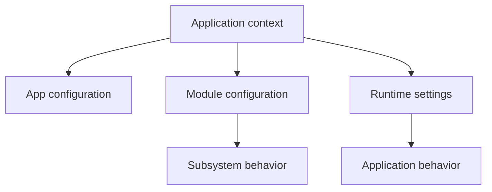

# 35. Configuration and Settings Lab

A framework has to answer a simple question:

> **Where does the application get its rules and environment-specific values from?**

In a small PHP script you might hard-code:

```php
$siteName = 'My School Portal';
$uploadDir = '/var/www/uploads';
```

That becomes dangerous as soon as the same application must run in development, testing, staging, and production.

SPP separates configuration concerns so the application can discover its runtime structure and settings without hard-coding everything into PHP.

The repository exposes dedicated configuration/settings components, including `SPPConfig`, `SPPSetting`, and `DBSettings`. Treat them as related but distinct concepts rather than one giant bag of values.

---

## 35.1 Configuration versus settings

For a beginner, use this mental model:

| Concept | Typical question |
|---|---|
| Application configuration | Where is this application and how is it structured? |
| Module/framework configuration | How should this subsystem behave? |
| Runtime setting | What value should this installation use? |
| Database-backed setting | What configurable value belongs to persisted application data? |

A practical distinction is:

```text
Configuration
    = instructions for how the application is assembled

Settings
    = values the application may read or change at runtime
```

Do not put database records into YAML merely because the YAML file is convenient.

Do not put immutable deployment structure into a database setting merely because it can be edited there.

---

## 35.2 The application configuration file

An SPP application can use an `app.yml` file to describe its identity and runtime paths.

A minimal example from the application-development guide is:

```yaml
base_url: /myapp
table_prefix: myapp_
shared_group: core
etc_path: etc
src_path: src/myapp
modules_path: modules
var_path: var
app_init: init.php
```

For a self-contained application, these paths resolve relative to the app root.

A beginner should understand these values before touching any service code.

They tell SPP:

```text
what URL belongs to this app
where source code lives
where configuration lives
where modules live
where runtime data belongs
what initialization file to load
```

---

## 35.3 Self-contained versus split configuration

SPP supports a self-contained application layout such as:

```text
src/myapp/
  etc/
    app.yml
    settings.yml
    middleware.yml
    modules.yml
  init.php
  services/
  resources/
  modules/
  var/
```

It also supports split configuration such as:

```text
etc/apps/myapp/
  app.yml
  settings.yml
  middleware.yml

src/myapp/
  init.php
  services/
  resources/
  modules/
```

The important idea is not which layout looks prettier.

The important idea is that SPP resolves an **active application context** and then resolves configuration paths from that context.

---

## 35.4 Inspecting the active application configuration directory

Once SPP has selected the active application, you can access its application object:

```php
$app = \SPP\App::getApp();

echo $app->getAppConfDir();
```

The same application-development guide documents runtime path accessors for source, modules, data, logs, cache, and temporary files.

For example:

```php
echo $app->getAppSrcDir();
echo $app->getModDir();
echo $app->getDataDir();
echo $app->getLogDir();
echo $app->getCacheDir();
echo $app->getTmpDir();
```

This is more useful than guessing filesystem paths in application code.

---

## 35.5 Settings files

A common application convention is:

```text
etc/settings.yml
```

A simple example:

```yaml
site:
  name: My School Portal
  timezone: Asia/Kolkata

ui:
  items_per_page: 25
```

The important beginner lesson is that a YAML file is only **storage for configuration data**.

The runtime component that reads it determines the meaning.

Do not assume that every YAML file in `etc/` is parsed through the same class or has the same override semantics.

---

## 35.6 Module configuration is separate

A module may have its own configuration under the app's module-configuration area.

For example:

```text
src/myapp/etc/modsconf/<module>/config.yml
```

or in a split-layout application:

```text
etc/apps/myapp/modsconf/<module>/config.yml
```

This keeps application configuration and subsystem configuration separate.

A useful mental model is:



---

## 35.7 Database-backed settings

The repository contains dedicated `DBSettings` and `SPPSetting` components.

That matters because some values are not really deployment configuration.

Suppose an administrator must change:

```text
school name
homepage banner
maximum student import size
feature toggle
```

without editing files and redeploying the application.

A persisted settings system can be more appropriate than `settings.yml`.

The tutorial rule is:

> Put deployment/runtime structure in configuration; put administrator-managed runtime values in the settings system when SPP's implementation provides that capability.

Do not claim a setting is database-backed merely because a settings class exists. Follow the concrete implementation for storage, caching, serialization, and invalidation semantics.

---

## 35.8 Configuration precedence

Configuration systems become difficult when several sources can define the same key.

For every SPP subsystem, learn the actual precedence order from its implementation.

Possible layers in the repository include:

```text
framework defaults
↓
global configuration
↓
application configuration
↓
module configuration
↓
runtime registration/override
```

Do not assume that every subsystem follows exactly this order.

This is one of the places where source-level documentation is more reliable than generic framework expectations.

---

## 35.9 Environment-specific configuration

Never commit production secrets into an example YAML file.

For a tutorial application, keep ordinary configuration values visible:

```yaml
site:
  name: SPP Task Desk
```

Treat credentials and security material separately according to the deployment mechanism used by the application.

The handbook should distinguish:

```text
configuration value
secret
runtime setting
persistent business data
```

These are not interchangeable.

---

## 35.10 Configuration and dependency injection

Configuration often becomes a dependency of a service.

For example:

```php
final class ReportService
{
    public function __construct(
        private int $pageSize
    ) {
    }
}
```

The interesting framework question is not the PHP property.

It is:

> **How does the application obtain the configured value and inject it?**

Do not write a generic answer without checking the actual SPP registration mechanism for the subsystem being used.

This is why configuration and DI are taught next to each other in the handbook.

---

## 35.11 Configuration and middleware

You have already seen the middleware tutorial use:

```text
spp/etc/middleware.yml
```

and app-specific:

```text
src/myapp/etc/middleware.yml
```

This is an excellent example of configuration controlling framework behavior without changing the middleware implementation itself.

The architectural pattern is:


---

## 35.12 Configuration and modules

A module is code plus metadata/configuration.

For example:

```text
module implementation
module manifest
module configuration
module resources
module event handlers
```

This is why configuration cannot be documented as one isolated file format.

The module loader, application loader, and individual modules may each consume different configuration sources.

---

## 35.13 Deliberate failure lab

Create:

```yaml
site:
  name: Development Site
```

Then change the application to expect:

```text
site.title
```

Run the page.

Your task is to diagnose whether the problem is:

1. wrong configuration key;
2. wrong configuration file location;
3. wrong active application context;
4. wrong configuration reader;
5. wrong fallback/precedence assumption; or
6. unrelated application logic.

This exercise is important because configuration errors often look like ordinary PHP errors several layers later.

---

## 35.14 Parikshak exercise

Write tests around configuration-dependent behavior.

For example:

```text
Given page size 25
When DashboardService paginates
Then it uses the configured size
```

Do not hard-code the configuration value in the service test if you are testing configuration integration.

Instead, decide whether the test is:

```text
unit test
integration test
application/runtime test
```

Then choose the smallest SPP test environment that actually proves the behavior.

---

## 35.15 Configuration anti-patterns

### Anti-pattern 1 — Read YAML everywhere

```php
$data = yaml_parse_file(...);
```

in dozens of classes.

This bypasses framework configuration semantics.

### Anti-pattern 2 — Global variables for application settings

```php
$GLOBALS['site_name'] = '...';
```

This hides dependencies.

### Anti-pattern 3 — Store business data in config

A list of students is not configuration.

### Anti-pattern 4 — Treat every setting as immutable

Administrator-managed settings may intentionally change at runtime.

### Anti-pattern 5 — Assume one precedence model

Different SPP subsystems may build configuration differently.

---

## 35.16 Comparing configuration with other frameworks

### Laravel

Laravel developers will recognize configuration files and environment-specific configuration, but SPP additionally has its own application-context and module configuration conventions.

### Symfony

Symfony users will recognize configuration trees and environment configuration. The SPP learner must additionally understand app-local module configuration and the separate settings/data layer.

### Django

Django's settings module provides a useful mental comparison, but SPP distributes configuration across application, module, and subsystem boundaries.

### Plain PHP

In plain PHP you can store settings in arrays, JSON, YAML, constants, or environment variables. A framework adds a standardized runtime around the configuration rather than merely inventing another file format.

---

## 35.17 Kernel Hacker section

When debugging configuration, trace the path:

```text
request
  ↓
Scheduler chooses application context
  ↓
App object resolves application directories
  ↓
subsystem locates its configuration
  ↓
configuration is parsed/compiled/registered
  ↓
runtime services consume the configuration
```

The repository exposes dedicated configuration/settings classes rather than requiring every subsystem to parse files directly.

Source map to begin with:

```text
spp/core/class.app.php
spp/core/class.scheduler.php
spp/modules/spp/dbconfig/class.sppconfig.php
spp/modules/spp/dbconfig/class.sppsetting.php
docs/phpdoc/classes/SPPMod-DBSettings-DBSettings.html
```

For any claim about precedence, caching, persistence, or invalidation, inspect the concrete class and its tests before documenting it as a framework guarantee.
