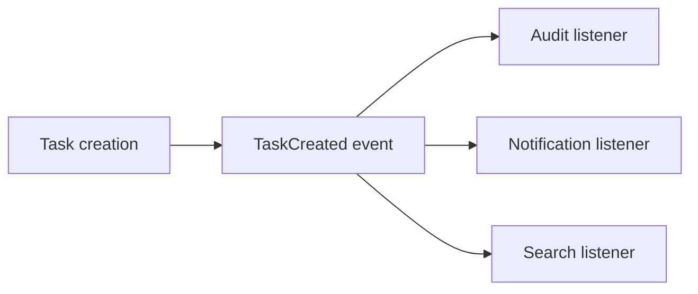
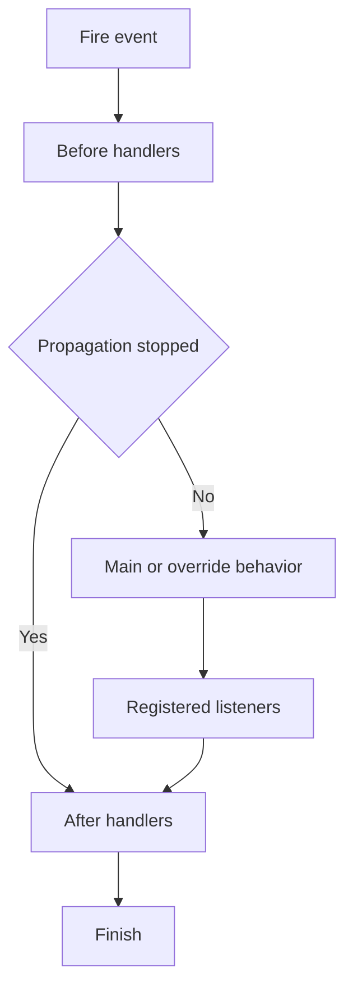
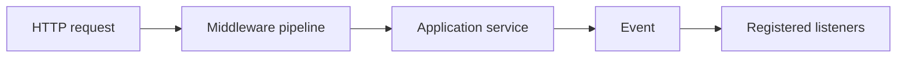

# Chapter 35 — Events Lab

Middleware taught us how code can wrap a request.

Events teach a different idea:

> **One part of an application can announce that something happened without directly knowing every piece of code that may react to it.**

The existing SPP event architecture documents `SPPEvent`, `EventHandler`, `EventParams`, the `#[On]` attribute, listener priorities, event definitions, propagation control, overrides, and before/main/after execution stages. fileciteturn239file0L2-L6

---

## 35.1 Start without a framework

Imagine that a task has just been created.

A plain PHP program might do this:

```php
$task = $taskService->create($data);

$notificationService->notify($task);
$auditService->record($task);
$searchService->index($task);
```

This works.

But the task service now knows about three other services.

Tomorrow someone asks for another reaction:

```text
send analytics event
update a dashboard
create a webhook
```

The task creation code keeps growing.

---

## 35.2 The event alternative

Instead, the task service can announce:

```text
TaskCreated
```

and other application parts can listen.



The task creator does not need to instantiate every listener.

That is the real value of events: **decoupling**.

---

## 35.3 Three different things

Do not confuse these operations:

| Concept | Meaning |
|---|---|
| Event definition | Describes the event and optional defaults/metadata |
| Listener | Code that reacts to the event |
| Event invocation | The runtime moment when the event is fired |

A listener can exist without the event currently being fired.

An event can be fired even when no optional listener is interested.

---

## 35.4 Meet the core classes

SPP's core event architecture contains:

```text
SPPEvent
EventHandler
EventParams
#[On]
```

The existing handbook source review identifies their responsibilities as follows:

- `SPPEvent` — dispatch/runtime event router;
- `EventHandler` — compatibility-oriented handler abstraction;
- `EventParams` — shared event payload/propagation state;
- `#[On]` — attribute-based listener declaration. fileciteturn239file0L2-L6

---

## 35.5 Your first event-driven feature

Our Task Desk application already creates tasks.

The new requirement is:

> Every successful task creation should produce an audit record, but the task creation service should not directly depend on the audit service.

This is an ideal first event use case.

---

## 35.6 Fire the event

The existing SPP event documentation shows the central invocation pattern:

```php
SPP\SPPEvent::fireEvent('TaskCreated', $params);
```

The exact payload object should follow the current `EventParams` contract used by the repository.

The architectural point is more important than memorizing the call:

```text
TaskService
    ↓
fire event
    ↓
SPP event runtime
    ↓
registered listeners
```

---

## 35.7 Create a listener

Create an application listener whose only job is auditing task creation.

Follow the current repository listener-discovery convention and place the listener in the application's event/listener area.

The SPP event source documents attribute-based listeners using `#[On]`:

```php
#[SPP\Attributes\On('TaskCreated', priority: 400)]
public function audit(EventParams $params): void
{
    // Record the event details.
}
```

The exact namespace/imports and method signature must match the current repository source used by your application.

Do not invent a second event API just for the tutorial.

---

## 35.8 Event priority

Listeners can have priorities.

The implementation sorts listeners by priority so higher-priority listeners run first.

For example:

| Listener | Priority |
|---|---:|
| Security validation | 900 |
| Data normalization | 700 |
| Audit | 400 |
| Analytics | 100 |

The rule is simple:

> If ordering matters, make the ordering explicit.

Do not rely on accidental class discovery order.

---

## 35.9 Exercise: three listeners

Add these listeners for `TaskCreated`:

```text
AuditListener
NotificationListener
AnalyticsListener
```

Give them different priorities.

Then record the order in which they execute.

Your application should make the result observable, for example by writing diagnostic log entries.

The exercise is complete when you can predict the execution order **before** running the request.

---

## 35.10 Event payloads are active state

SPP passes an `EventParams` object through the event pipeline.

That object carries both payload information and propagation state.

Therefore a listener can potentially:

```text
inspect data
enrich data
transform data
reject/stop propagation
```

This is more powerful than a notification-only event emitter.

The consequence is also important:

> Event handlers can affect later execution. Treat them as part of application control flow when the event contract allows mutation.

---

## 35.11 Propagation control

Suppose a high-priority security listener detects invalid state.

It can stop later listeners from executing through the event propagation mechanism.

The event runtime checks the propagation-stopped state while moving through the handler pipeline.

Exercise:

```text
Security listener — priority 900
Audit listener    — priority 400
Analytics         — priority 100
```

Make the security listener stop propagation.

Expected result:

```text
Security listener runs
Audit listener does not run
Analytics does not run
```

This gives you a concrete reason why `EventParams` carries propagation state.

---

## 35.12 Before, main, and after stages

SPP's event mechanism is more structured than a simple listener list.

The current implementation supports explicit execution stages that can be understood as:



This matters when the framework or application needs to establish behavior before the normal event handler and clean up or observe the result afterward.

---

## 35.13 Event overrides

An ordinary listener participates in an event.

An override is different.

An override can replace the normal behavior for an event that is explicitly overridable.

Think of the distinction as:

```text
listener
    = join the execution

override
    = replace an intended default
```

This is especially useful for framework extension points.

Do not use override semantics merely to force your way around another listener.

---

## 35.14 Default handlers

SPP event definitions can also describe default handlers.

That creates multiple possible execution sources:

```text
inline/default handler
registered listeners
optional override
```

This is why event definitions matter even when your immediate application only needs one listener.

---

## 35.15 Event discovery

SPP supports attribute-based discovery and configuration-driven event definitions.

The existing event architecture documents known `events.yml` locations and `#[On]` attribute scanning.

The framework therefore separates:

```text
Discovery
    ↓
Registration / compiled metadata
    ↓
Runtime dispatch
```

That is important for performance.

The framework should not have to search every PHP file every time a request fires an event.

---

## 35.16 Exercise: deliberately remove discovery

Take a working listener and make one controlled change:

```text
remove the listener from its discovery location
```

Then fire the event again.

Your task is to diagnose why the listener stopped running.

Do not immediately change the event name.

First ask:

```text
Was the class discovered?
Was the attribute discovered?
Was the event compiled/registered?
Was the application/module active?
Was an override active?
```

This is the beginning of framework-level debugging.

---

## 35.17 Events versus direct services

Use a service call when the caller needs a known collaborator and its result.

Use an event when the publisher should expose an occurrence or extension point without hard-coding all consumers.

For example:

```text
TaskService → PricingService
```

is usually a direct collaboration.

Whereas:

```text
TaskCreated → Audit + Notification + Analytics
```

is naturally event-oriented.

---

## 35.18 Events versus middleware

The difference should now be clear.



Middleware is tied to request processing boundaries.

Events are tied to explicit runtime occurrences/extension points.

One does not replace the other.

---

## 35.19 Events versus LiveComponent dispatch

SPP also has component-level event/dispatch mechanisms.

Do not assume that a LiveComponent dispatch is automatically a kernel `SPPEvent`.

Use the appropriate event boundary:

| Need | Mechanism |
|---|---|
| Kernel/application extension point | `SPPEvent` |
| Request boundary | Middleware |
| Component/UI interaction | LiveComponent dispatch/event mechanism |
| Browser-local reactive event | SPPUX/browser event system |

The boundaries are part of the architecture.

---

## 35.20 Parikshak exercise

Create tests for:

### Test A — event fires

A listener observes the expected event.

### Test B — priority

Two listeners execute in the documented priority order.

### Test C — payload mutation

A listener changes the payload and a later stage sees the change where the event contract permits it.

### Test D — propagation stop

A high-priority handler prevents later listeners from running.

### Test E — override

An overridable event uses replacement behavior instead of the default path.

The test suite should make event order and propagation visible instead of merely checking that “something happened”.

---

## 35.21 Debugging checklist

When an event does not behave as expected:

```text
1. Is the event name correct?
2. Was the event system booted?
3. Was the listener discovered or explicitly registered?
4. Is the listener priority correct?
5. Did propagation stop earlier?
6. Is an override active?
7. Is the event definition pointing at the expected default handler?
8. Is the correct application/module context active?
```

Do not debug all eight at once.

Reduce the problem to the smallest possible event and one listener.

---

## 35.22 Kernel Hacker: source trace

Inspect:

```text
spp/core/class.sppevent.php
spp/core/class.eventhandler.php
spp/core/class.eventparams.php
spp/core/attributes/On.php
spp/etc/*/events.yml
```

Trace these operations:

```text
application/module boot
    ↓
event definition discovery
    ↓
#[On] discovery
    ↓
listener registration
    ↓
priority ordering
    ↓
fireEvent()
    ↓
before stage
    ↓
override/default/inline behavior
    ↓
listeners
    ↓
propagation checks
    ↓
after stage
```

The goal is to understand the runtime, not merely the API call.

---

## 35.23 When not to use events

Do not create an event just to hide a simple function call.

Bad example:

```text
Controller
    ↓
Event
    ↓
One listener
    ↓
Service
```

when the controller already knows exactly which service it needs.

That adds indirection without useful decoupling.

Use events where the extension point is genuine.

---

## 35.24 Coming from other frameworks

### Laravel

The closest familiar concept is the event/listener system, but SPP's runtime includes event definitions, priorities, overrides, propagation, and explicit stages.

### Symfony

Think event subscribers and priorities, then add SPP's event-definition and override model.

### Node.js

SPP is much more structured than a basic `EventEmitter` because event discovery, priority, event metadata, and propagation are framework-managed concepts.

---

## 35.25 What you should now understand

You should be able to explain:

> **An SPP event is a framework-managed extension point. Code fires an event, the framework resolves registered/default/override behavior, and listeners execute according to the event's ordering and propagation rules.**

More importantly, you should know when an event is useful and when a direct service call is simpler.

## Next

**Chapter 36 — Registry and Dependency Injection Lab**

Now that middleware and events are familiar, we will learn how SPP creates and resolves the services used by those mechanisms.
