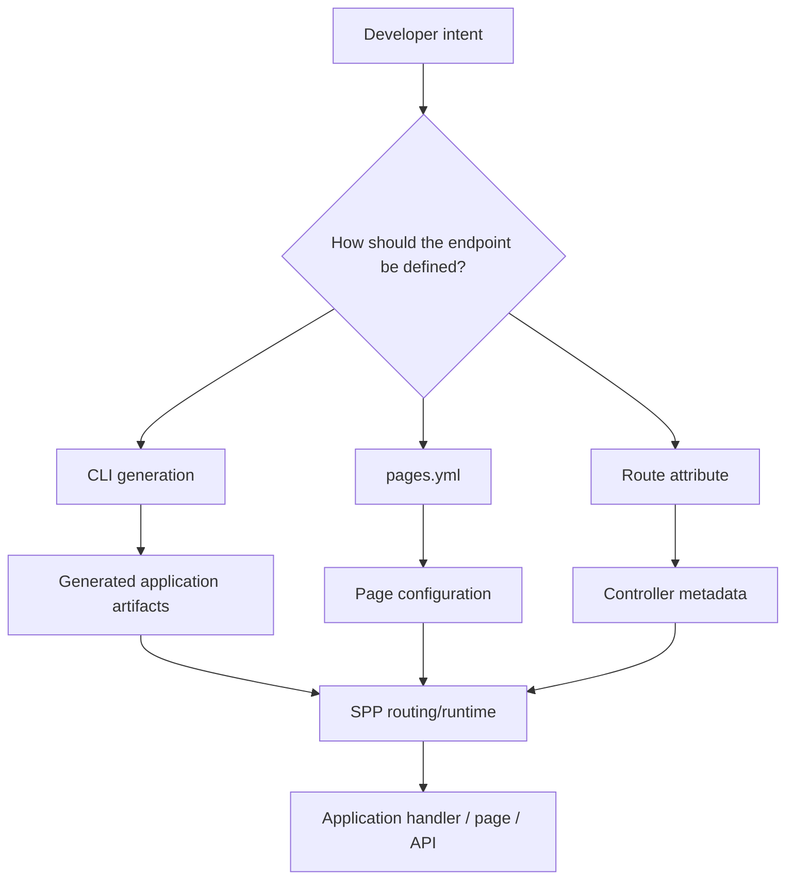
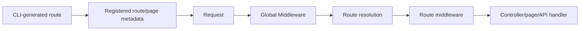

# 35. Routing from the Command Line

Routing in SPP is not only something you type by hand in PHP or YAML. The framework also provides **CLI-driven route/scaffold generation**. For a beginner, this matters because the CLI is not merely a convenience: it teaches the framework's expected application structure by generating the files and conventions that the runtime understands.

## 35.1 Three ways to create a route

In the SPP codebase, routing can be approached through several paradigms:

1. **Central page configuration** such as `pages.yml`.
2. **Attribute-based routing** using the `Route` attribute on application code.
3. **CLI/scaffold generation**, where the developer asks SPP to generate the starting structure and then edits the generated artifacts.

These approaches should not be presented as mutually exclusive. A real application can contain more than one style when different parts of the application have different needs.



## 35.2 Why use the CLI?

A framework generator can save typing, but the deeper value is **convention discovery**.

When SPP generates a route/application artifact, it tells you:

- which directory the framework expects;
- which namespace is expected;
- which file naming convention is used;
- which routing paradigm the generated code assumes;
- and which companion artifacts are normally created with it.

For someone completely new to SPP, generated code should therefore be treated as a learning aid.

## 35.3 Route scaffolding is different from runtime routing

It is important to separate these two ideas.

**Scaffolding** creates files.

**Routing runtime** decides what to execute for an incoming request.

For example:

```text
CLI command
    -> creates controller/route/page artifacts
    -> developer edits generated files
    -> SPP discovers or loads the route
    -> request arrives
    -> Scheduler selects application context
    -> Middleware runs
    -> Router resolves endpoint
    -> Controller/page/API handler runs
```

The CLI does not replace the routing engine; it creates artifacts that participate in it.

## 35.4 Route generation and `pages.yml`

SPP includes route-related command stubs and generated `pages.yml` documentation in the repository. This is significant because `pages.yml` is not an invented example for the handbook; it is part of the repository's application/page configuration surface.

A beginner should learn to inspect the generated file immediately after running a scaffold command:

```bash
# Example workflow — use the repository's current command help to confirm
# the exact route-generation command available in your checkout.
php spp/spp.php --help
```

Then locate the generated page/route configuration under the application `etc` tree.

Typical locations include:

```text
src/<app>/etc/pages.yml
```

or the corresponding split-layout application configuration tree.

Do not assume that every SPP application uses exactly one route file location. The application layout and enabled modules matter.

## 35.5 Learn the generated artifact before editing it

A reliable beginner workflow is:

1. generate one route/page;
2. open every generated file;
3. identify the entry-point artifact;
4. identify the route metadata;
5. identify the handler/controller/page;
6. run the application;
7. hit the generated URL;
8. deliberately change the route;
9. observe the effect;
10. test the route with Parikshak.

This is much more effective than memorizing a command with no understanding of what it produced.

## 35.6 Route CLI + `pages.yml` exercise

Build a small `Task Desk` page.

Goal:

```text
GET /tasks
    -> Task Desk page
```

First generate or scaffold the page using the repository's route/page generation command.

Then inspect the resulting `pages.yml` or generated page metadata.

The learner should be able to answer:

- Which application owns the page?
- Which URL is registered?
- Which page/handler receives the request?
- Which view/template is rendered?
- Which middleware runs before it?
- Where is the generated route definition stored?

## 35.7 Route CLI + attribute-routing exercise

Create the same endpoint using an attribute-oriented controller pattern.

A representative SPP route attribute has the form:

```php
use SPPMod\SPPView\Attributes\Route;

final class TaskController
{
    #[Route('/tasks', method: 'GET', name: 'tasks.index')]
    public function index()
    {
        // Return/render the task page.
    }
}
```

The exact controller directory and route scanner configuration should match the application conventions in the repository you are using.

The important lesson is that the metadata is now attached to the controller method rather than stored centrally in a page configuration file.

## 35.8 Compare the generated structures

After creating equivalent endpoints with different paradigms, compare them.

| Question | `pages.yml` style | Attribute style | CLI scaffold |
|---|---|---|---|
| Where is the route declared? | Central configuration | PHP attribute | Depends on generated target |
| Does it create source files? | Not necessarily | Usually existing controller | Yes, when scaffolded |
| Good for central page catalogs? | Yes | Less central | Depends |
| Good for controller-local metadata? | Less so | Yes | Depends on generator |
| Main purpose | Declarative page configuration | Code-local routing metadata | Developer productivity/convention | 

The CLI is therefore a **creation mechanism**, while `pages.yml` and attributes are **routing-definition mechanisms**.

## 35.9 Generated route stubs are contracts, not magic

SPP contains command stubs for route-related generation. A generated stub is simply a template whose output has to satisfy the framework's runtime expectations.

That means you can learn a lot by opening the stub itself.

For example, the repository contains route-related stubs under:

```text
spp/commands/stubs/
```

Look for files such as:

```text
routes.stub
```

The exact contents should be treated as the authoritative answer for the checkout being documented.

## 35.10 Route generation is also a debugging tool

Suppose a manually created route does not work.

One of the fastest diagnostic techniques is:

1. create an equivalent route using SPP's generator/scaffold;
2. compare the generated files with your hand-written files;
3. identify the structural difference;
4. test again.

This can reveal missing namespaces, wrong paths, wrong configuration locations, missing route metadata, or a missing application/module convention.

## 35.11 Middleware and generated routes

A route created by CLI can eventually participate in the same middleware architecture as a hand-written route.

The conceptual path is:



The CLI therefore does not bypass middleware. It creates an artifact that enters the normal runtime path.

## 35.12 Routing CLI and MVC

The beginner should now be able to see the complete chain:

```text
CLI
  -> route/controller/page scaffold
  -> route definition
  -> request
  -> middleware
  -> controller/page
  -> model/service/entity
  -> view/API response
```

This is the point at which MVC stops being a diagram in a textbook and becomes an observable execution path.

## 35.13 Testing generated routes with Parikshak

Every generated route should become a test case.

At minimum test:

- expected HTTP method;
- expected URL;
- successful dispatch;
- authentication requirement, if any;
- middleware behavior;
- invalid parameters;
- not-found behavior;
- response payload or rendered page.

The exact Parikshak API should follow the dedicated Parikshak chapter and the test classes already present in the repository.

## 35.14 Deliberate failure exercise

Generate a route and then break it deliberately.

Try one change at a time:

1. change the URL;
2. change the HTTP method;
3. move the controller to another directory;
4. change the namespace;
5. remove a module/configuration entry;
6. clear/rebuild the relevant cache if the routing subsystem is cached.

Observe which failure occurs.

Then restore the generated structure.

The purpose is to teach the learner that routing is a chain of contracts, not a single function call.

## 35.15 Kernel Hacker section

The expert learner should trace these layers independently:

```text
CLI command
  -> command implementation
  -> route/page stub
  -> generated source/config
  -> route discovery/scanning
  -> route cache/compiled metadata where applicable
  -> application context
  -> middleware pipeline
  -> router/page resolver
  -> handler invocation
```

Useful repository targets include:

```text
spp/commands/
spp/commands/stubs/
spp/core/attributes/Route.php
documentation/framework/routing-engine.md
docs/tut/05_routing_and_views.md
```

The exact implementation should be traced from the current branch rather than inferred from another framework.

## 35.16 Summary

SPP routing should be learned as a family of related mechanisms:

- centralized page configuration such as `pages.yml`;
- attribute-based route metadata;
- CLI/scaffold generation;
- request-time dispatch;
- middleware around dispatch;
- page/controller/API handlers;
- route testing through Parikshak.

The CLI is therefore part of the routing learning story, but it must not be confused with the routing runtime itself.
