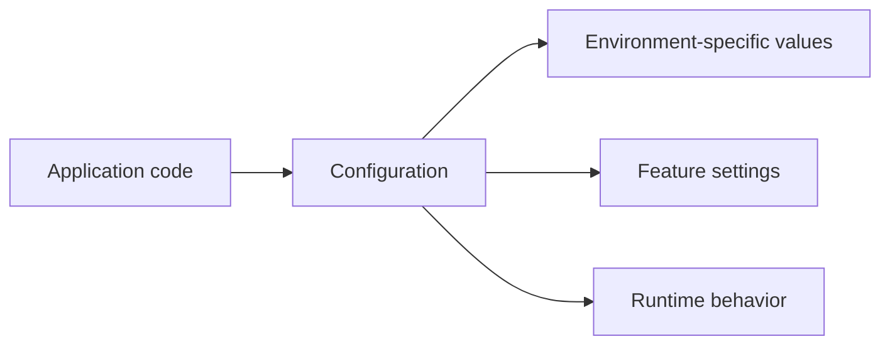
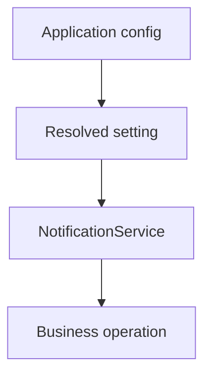

# Tutorial Core 05 — Configuration, Settings, and Environment

A framework application should not hard-code every environment-dependent value into PHP.

This chapter teaches SPP configuration from zero and separates three concepts that are easy to confuse:

- application/framework configuration;
- settings used by application features; and
- database-backed settings where implemented.

The repository contains dedicated configuration/settings components, including `SPPConfig`, `SPPSetting`, and `DBSettings`.

## 35.1 Why configuration exists

Imagine this code:

```php
$dsn = 'sqlite:/production/path/app.db';
$apiKey = 'secret-value';
$baseUrl = 'https://example.org';
```

The code now assumes one machine, one environment, and one set of secrets.

Configuration moves those changing values outside the business logic.

## 35.2 Separate code from configuration

A useful mental model is:



The exact SPP configuration layers are source-defined; do not treat every YAML file in the repository as the same kind of configuration.

## 35.3 Application configuration

Your application definition contains information such as paths, application identity, and runtime-related settings.

Use the current application-development and boot documentation to create the application rather than copying an arbitrary configuration from another project.

The first exercise is simply to identify:

1. where the application gets its identity;
2. where its source/configuration paths are defined;
3. how SPP loads those values;
4. which values are available during bootstrap.

## 35.4 Configuration versus settings

A useful practical distinction is:

| Concept | Typical purpose |
|---|---|
| Configuration | How the runtime/application is assembled |
| Setting | A configurable behavior/value for a feature |
| Database-backed setting | A runtime value stored in a persistent settings source |

The repository contains separate classes for these concepts.

Do not assume that changing a setting means changing application bootstrap configuration.

## 35.5 Exercise: environment differences

Create three conceptual environments:

```text
development
staging
production
```

Identify values that should differ:

- base URL;
- database path/connection;
- logging level;
- external API endpoint;
- debug behavior.

Then determine which SPP configuration mechanism actually owns each value.

## 35.6 Configuration is a dependency

Your service may depend on a configured value.

For example:

```php
class NotificationService
{
    public function __construct(private string $senderAddress)
    {
    }
}
```

Now the object graph is:



The important question is how the current SPP container/configuration subsystem provides that value.

Do not invent a Laravel-style `config()` call if SPP does not implement one with the same semantics.

## 35.7 Database-backed settings

A database-backed setting is useful when a value must be changed by authorized administrators without rebuilding application source.

Examples can include:

- a feature switch;
- a business-policy threshold;
- a configurable display preference.

Secrets should still be handled according to secure deployment practice and the actual storage/security implementation.

## 35.8 Exercise: feature toggle

Create a simple feature toggle for a Task Desk capability.

The application should support:

```text
feature disabled → normal behavior
feature enabled  → additional behavior
```

Implement it using the SPP setting mechanism that the source supports.

Then change the setting and observe the runtime behavior.

## 35.9 Caching settings

A persistent setting may be cached for performance.

This creates an important debugging lesson:

```text
Changed setting
    ↓
Persistent source updated
    ↓
Cached value may still be old
    ↓
Application reads old behavior
```

The correct invalidation/reload behavior must be established from the SPP setting implementation.

## 35.10 Security rules for configuration

Never treat configuration files as automatically safe places for secrets.

Separate:

- non-secret configuration;
- credentials/tokens;
- encryption keys;
- environment-specific deployment values.

The handbook documents the actual SPP mechanisms and also distinguishes general deployment guidance from framework behavior.

## 35.11 Deliberately break configuration

### Break 1 — Missing configuration value

Observe the runtime failure.

### Break 2 — Wrong type

Pass a value of the wrong expected type and inspect the resulting error.

### Break 3 — Wrong environment path

Diagnose which configuration layer was loaded.

### Break 4 — Stale setting cache

Change a persistent value and determine whether an invalidation step is required.

## 35.12 Parikshak checkpoint

Test that:

1. the expected configuration is loaded in the test environment;
2. required settings are available;
3. missing configuration fails predictably;
4. feature toggles produce the expected behavior;
5. tests do not accidentally depend on a developer's production configuration.

## 35.13 Coming from other frameworks

### Laravel

Separate `config/*.php`, environment variables, and database-backed settings conceptually; SPP's actual configuration classes define the implementation.

### Symfony

Think configuration tree/container parameters versus runtime settings.

### Django

Think `settings.py` and environment-specific configuration, but map the idea to SPP's own configuration layers.

## 35.14 Source deep dive

Trace:

1. configuration loading during bootstrap;
2. application-specific configuration resolution;
3. `SPPConfig` behavior;
4. `SPPSetting` behavior;
5. `DBSettings` behavior;
6. precedence/caching where implemented;
7. interaction with the Registry and Container.

The goal is to know which configuration layer owns a value.

## 35.15 Lab completion criteria

You are finished when you can:

- distinguish configuration from settings;
- configure one application for multiple environments;
- add a runtime feature toggle;
- identify when a value is persisted;
- diagnose stale/missing configuration;
- test configuration behavior with Parikshak;
- trace the actual SPP configuration path.

The next chapter uses this foundation to teach routing and request dispatch.
