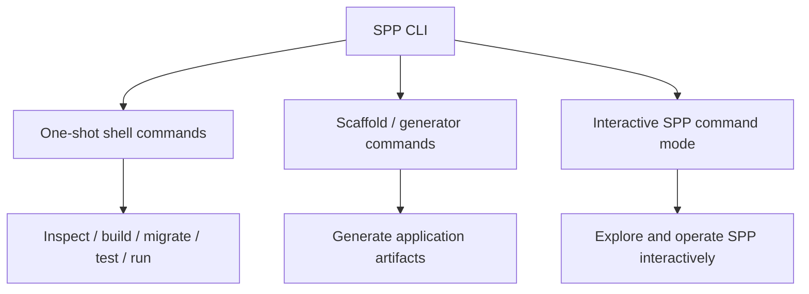
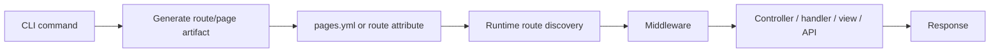

# 36 — SPP CLI: Commands, Scaffolding, and Interactive Command Mode

This chapter treats the SPP CLI as a framework subsystem in its own right.

A beginner may think a command line tool simply means running one command such as:

```bash
php spp/spp.php make:app MyApp
```

SPP is broader than that. The CLI is used for application creation, scaffolding, routing, modules, forms, entities, events, migrations, seeders, views, commands, streams, polyglot integrations, cron operations, testing, documentation, and framework administration. The repository also provides an **interactive SPP command mode** in which the developer can work with SPP through a persistent command prompt instead of starting a new process for every operation.

The tutorial therefore teaches three related CLI modes:



## 36.1 Start with ordinary shell commands

A one-shot command is the simplest model:

```bash
php spp/spp.php <command> [arguments]
```

Examples found in the repository include commands for:

- creating applications;
- creating modules;
- generating events;
- creating entities and models;
- creating forms;
- generating views, Blade files, SPPView files, and partials;
- generating services and commands;
- creating seeders;
- creating streams;
- creating polyglot integrations;
- running and listing cron jobs;
- creating and running migrations;
- debugging SPPUX;
- generating or inspecting documentation.

The handbook never assumes a command exists solely because its name sounds reasonable. Each command documented here should correspond to a repository command implementation or repository command documentation.

## 36.2 Scaffolding is part of the development model

Scaffolding is not just convenience.

When you run a generator, SPP is teaching you the framework's preferred structure by producing files, directories, names, namespaces, and metadata that the runtime knows how to discover.

Typical generator families include:

```text
make:app
make:module
make:event
make:entity
make:model
make:form
make:view
make:blade
make:sppview
make:partial
make:service
make:command
make:seeder
make:stream
make:polyglot
make:go
make:java
make:scaffold
```

The exact command aliases should be learned from the repository command documentation and `spp/commands` implementation rather than copied from another framework.

## 36.3 Learn generated artifacts, not just commands

A total beginner should never stop at:

```bash
php spp/spp.php make:event StudentCreated
```

The tutorial should immediately ask:

1. Which files were created?
2. Which namespace was selected?
3. Which interfaces/attributes/base classes were inserted?
4. Which configuration or manifest was touched?
5. What part of the runtime discovers the generated artifact?
6. What can be safely changed?
7. What should not be changed?
8. How do we test the generated artifact?

This converts scaffolding from magic into something understandable.

## 36.4 The interactive SPP command mode

SPP also provides an interactive command mode. Instead of repeatedly starting a fresh PHP process, the developer enters an SPP command prompt and works with the framework from inside that session.

Conceptually:

```text
Shell
  -> enter SPP command mode
       -> SPP initializes the command environment
       -> prompt appears
       -> developer issues SPP commands
       -> command executes
       -> prompt returns
       -> developer continues
```

The important educational point is that this is not merely a different UI for the same shell command. A persistent command mode can provide a better environment for framework exploration, command discovery, repeated operations, diagnostics, and interactive development.

## 36.5 What the interactive mode should teach

The beginner tutorial should walk through the interactive mode in a deliberate progression:

### Stage 1 — Enter the prompt

Start SPP's interactive command mode using the repository-supported entry command.

### Stage 2 — Discover available commands

Use the command-discovery/help facilities exposed by the interactive environment.

The learner should understand that command discovery is itself part of the framework tooling model.

### Stage 3 — Run a harmless inspection command

Begin with a read-only command such as listing modules, routes, cron entries, or other available framework metadata.

### Stage 4 — Run a generation command

Generate a small artifact and inspect what changed.

### Stage 5 — Run a validation/test command

Use the prompt to execute a repeatable development operation without leaving the SPP environment.

### Stage 6 — Deliberately break something

For example, change a generated class name or configuration entry, run the related framework command, observe the failure, and debug it from inside the command environment.

## 36.6 Why a persistent command mode matters

A persistent SPP command session can be especially useful for:

- framework exploration;
- repeated administration tasks;
- interactive diagnostics;
- development-time experimentation;
- inspecting generated application state;
- reducing shell/process repetition;
- teaching the framework itself rather than memorizing command strings.

For an advanced developer, the command mode also becomes a natural place to understand the distinction between:

```text
framework state
application state
command state
process state
```

Those should not automatically be treated as the same thing.

## 36.7 CLI and routing

Routing deserves explicit CLI treatment.

The routing tutorial should show:



The learner should compare:

- hand-written `pages.yml`;
- attribute-based routes;
- route-related generated artifacts;
- controller scaffolding;
- and route tests.

This makes it clear that the CLI creates artifacts, while the runtime routing system consumes them.

## 36.8 CLI and modules

The module workflow should demonstrate:

```text
make:module
  -> module skeleton
  -> manifest/configuration
  -> source code
  -> optional events/API/resources
  -> module discovery
  -> module activation
  -> compiled/runtime metadata
```

A learner should generate the module once with the CLI and create another module manually, then compare the results.

## 36.9 CLI and database work

The database branch should make CLI tooling part of everyday development:

```text
make:entity / make:model
        ↓
make:migration
        ↓
migration execution
        ↓
make:seeder
        ↓
seed data
        ↓
Parikshak tests
```

For SPP XDB, the relevant administrative shell/command tools should likewise be taught as first-class interfaces rather than hidden in an appendix.

## 36.10 CLI and Parikshak

Testing is not an external add-on to the framework workflow.

The tutorial should repeatedly demonstrate:

```text
write feature
  -> run focused Parikshak test
  -> break feature
  -> observe failing result
  -> repair feature
  -> rerun test
```

The CLI therefore becomes part of the test feedback loop.

## 36.11 CLI and Cron

SPP's scheduler/cron commands should be taught separately from ordinary request-time commands.

The learner should understand the difference between:

```text
web request
CLI command
cron invocation
interactive command session
worker/background process
```

This matters for application architecture and for debugging production behavior.

## 36.12 Command development

SPP also supports creating custom application commands.

The tutorial should build a command such as:

```text
myapp:reindex
```

Then teach:

1. command class structure;
2. arguments/options;
3. service resolution;
4. application context;
5. logging/output;
6. error handling;
7. Parikshak coverage;
8. running the command from the ordinary shell;
9. running it from the interactive SPP command mode.

This shows that the CLI is not only for framework maintainers; it is an application extension point.

## 36.13 CLI safety model

The handbook should classify commands by operational risk.

| Category | Examples | Typical risk |
|---|---|---|
| Inspect | list/show/debug | Low |
| Generate | make commands | Low to medium |
| Update metadata | compile/cache/index | Medium |
| Data change | migrate/seed/transfer | Medium to high |
| Destructive | reset/flush/delete | High |
| Production operations | deployment/promote | High |

Beginners should start with read-only commands and generators before destructive operations.

## 36.14 Kernel Hacker: CLI architecture

At the implementation level, the CLI should be studied as a command-dispatch system rather than as a bag of scripts.

The source map should include:

- the SPP CLI entry point;
- command registration/discovery;
- command base classes;
- command argument parsing;
- command stubs;
- generator/scaffold implementations;
- interactive command-mode implementation;
- command documentation generation;
- module-provided commands.

The exact interactive prompt implementation is documented conservatively here until the relevant source files are directly traced. The existence of the interactive command mode is treated as an SPP capability, while parser internals, session persistence, history handling, and completion behavior are only claimed when confirmed in executable source.

## 36.15 Coming from other ecosystems

| Ecosystem | Rough analogy |
|---|---|
| Laravel | Artisan + Tinker, but SPP's CLI is its own command architecture |
| Symfony | Console component, with SPP-specific interactive behavior |
| Rails | Rails generators + console |
| Django | `manage.py` management commands + shell |
| npm/Node | project scripts + interactive Node REPL, but not the same framework model |
| Spring Boot | command-line runners / application admin tools |

The comparison is only conceptual. SPP's command and interactive-mode behavior must be learned from SPP itself.

## 36.16 Final exercise

Build a small application entirely through the SPP developer workflow:

```text
create app
  ↓
enter interactive SPP mode
  ↓
inspect commands
  ↓
generate service
  ↓
generate entity/model
  ↓
generate migration
  ↓
generate seeder
  ↓
generate event
  ↓
generate route/page
  ↓
generate form/view
  ↓
run tests
  ↓
inspect runtime state
```

Then repeat the same exercise using only ordinary shell invocations and compare the experience.

The goal is not to memorize commands. The goal is to understand **how the SPP CLI becomes a developer interface to the framework itself**.
