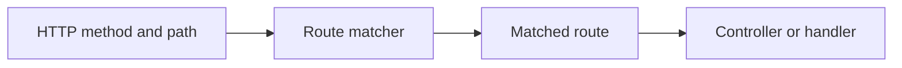
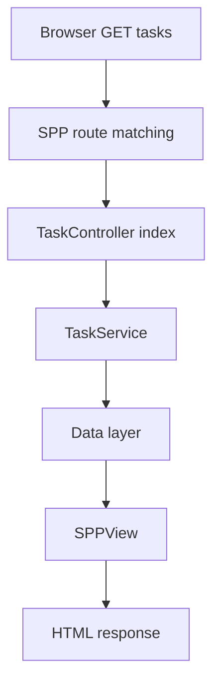
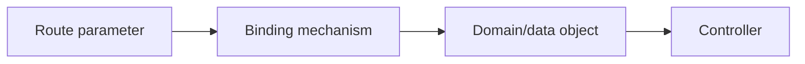
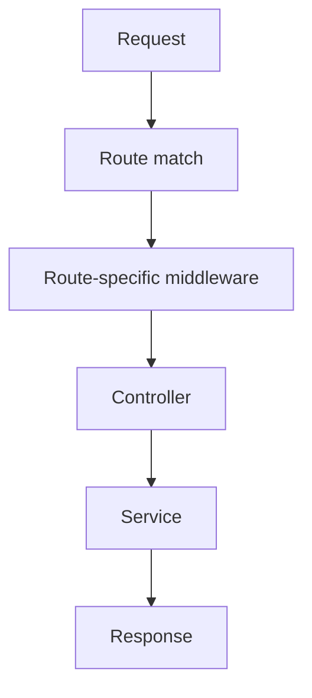
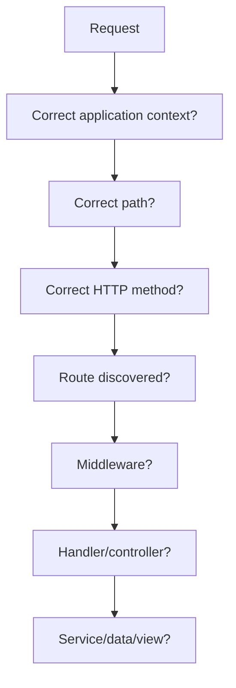

# Tutorial Core 06 — Routing and MVC Request Dispatch

Routing answers a simple question:

> **Given this incoming request, what application code should run?**

The answer becomes more interesting when the application supports pages, APIs, multiple HTTP methods, middleware, model binding, and multiple application contexts.

## 36.1 Start with a plain PHP router

A minimal router can be written like this:

```php
$path = parse_url($_SERVER['REQUEST_URI'], PHP_URL_PATH);

if ($path === '/tasks') {
    // run task page
} elseif ($path === '/tasks/create') {
    // run create page
}
```

This works for a tiny application.

As routes multiply, the application needs a reusable routing system.

## 36.2 What is a route?

A route connects an incoming request pattern to application behavior.

Conceptually:



The route may also carry metadata such as middleware, names, constraints, or parameter information depending on the current SPP implementation.

## 36.3 Route the Task Desk home page

Create the simplest page route using the repository's current SPP routing conventions.

The goal is not to memorize syntax immediately.

First identify:

1. where routes are declared;
2. how the application loads them;
3. how the HTTP method is represented;
4. how a target handler is selected.

Then create one route for `/tasks`.

## 36.4 MVC becomes concrete here

The route now connects the browser to the controller.



This is the point where MVC stops being a diagram and becomes executable behavior.

## 36.5 Route parameters

A task-details route might conceptually look like:

```text
/tasks/42
```

The route contains an identifier.

Your controller needs a trustworthy representation of that identifier.

Do not confuse:

- syntactic route matching;
- conversion of the parameter into a domain object; and
- authorization to access that object.

These are separate concerns.

## 36.6 Route model binding

The repository contains SPP API/runtime support for route model binding.

That means the framework can participate in the transformation from route parameters to application objects where the implementation supports it.



The exact binding lookup rules must be verified from `SPPRouteModelBinding` and the related routing/API source.

## 36.7 HTTP methods

A route should normally declare the methods it supports.

For example:

```text
GET    /tasks       → list
POST   /tasks       → create
GET    /tasks/42    → details
PATCH  /tasks/42    → update
DELETE /tasks/42    → delete
```

Do not treat every URL as a generic “page”.

The method is part of the request contract.

## 36.8 Route middleware

Once you understand middleware and routing separately, combine them.



This gives a powerful boundary for things such as administration-only endpoints or API authentication.

## 36.9 API routes are not ordinary page routes

SPP contains an API subsystem with its own concepts for API responses/resources, authentication middleware, documentation, pagination, and model binding.

Therefore the handbook treats API architecture as a later dedicated branch rather than claiming that “an API is just an HTML route returning JSON”.

## 36.10 Exercise: Task Desk CRUD routes

Create routes for:

1. task list;
2. task details;
3. task creation form;
4. task creation submission;
5. task update;
6. task deletion.

Keep the controller methods small.

Move business behavior into services.

## 36.11 Exercise: route authorization

Create an administration-only route.

The path itself should remain public to the router.

Authorization should be enforced by the appropriate security/middleware/business boundary.

This helps demonstrate why a route name is not a security decision.

## 36.12 Exercise: invalid route

Request an unknown path.

Observe how SPP handles the unmatched route.

Then inspect the source path that generates the final error/response.

## 36.13 Exercise: parameter failure

Request a route containing an invalid identifier.

Trace which layer should reject it:

- route constraint;
- binder/converter;
- application service;
- authorization; or
- data lookup.

Do not move every failure into the controller.

## 36.14 Parikshak checkpoint

Test:

1. known route resolves correctly;
2. wrong HTTP method is rejected;
3. route parameters are passed correctly;
4. route model binding behaves as documented;
5. route-specific middleware executes;
6. unauthorized route access is blocked;
7. unknown routes produce the expected response.

The SPP Parikshak API/HTTP interaction facilities should be used where the repository supports them.

## 36.15 Debugging routing

When a route does not work, inspect:



The Scheduler/application context should be checked before assuming the router itself is broken in a multi-application environment.

## 36.16 Coming from other frameworks

### Laravel

Think named routes, controller actions, route parameters, route middleware, and model binding.

### Symfony

Think route collection, route matching, controller resolution, attributes/configuration, and argument resolution.

### Django

Think URLconf mapping to view callables.

### Spring

Think request mapping and controller methods.

The concepts translate; the APIs do not.

## 36.17 Source deep dive

Trace:

1. request enters the active application;
2. route definitions are loaded;
3. matcher selects a route;
4. middleware context is constructed;
5. handler/controller is resolved;
6. arguments/parameters are resolved;
7. controller calls application services;
8. response is returned.

Also identify where API routing diverges from normal page handling.

## 36.18 Lab completion criteria

You are finished when you can:

- explain routing without framework jargon;
- create page routes;
- use parameters;
- connect routes to MVC controllers;
- combine routing with middleware;
- explain model binding conceptually;
- write Parikshak route/API tests;
- debug an unmatched/misrouted request;
- trace the real routing path in SPP source.

The next core chapter will package functionality into modules.
