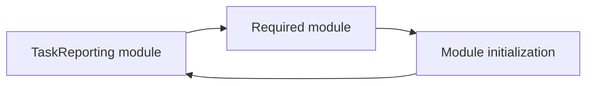
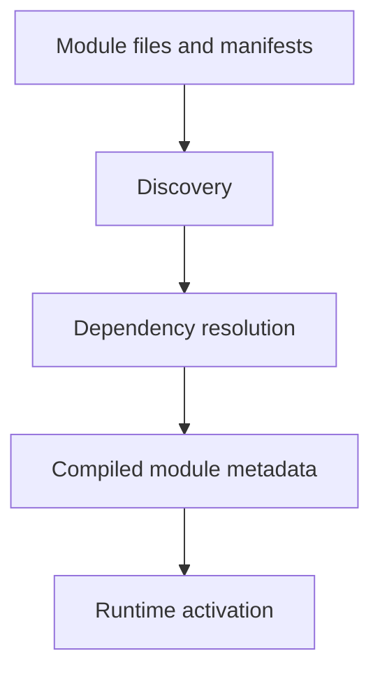

# Tutorial Core 07 — Modules, Manifests, Dependencies, and Activation

A folder becomes a framework module only when the framework recognizes it as a module.

This chapter teaches that distinction through a real feature.

## 37.1 Why package a feature?

Suppose Task Desk grows to include reporting.

You now have:

```text
controllers
services
views
commands
events
configuration
tests
```

Putting everything into one giant application directory eventually makes ownership unclear.

A module gives a cohesive feature a framework-recognized boundary.

## 37.2 A module is more than a folder

A module normally needs metadata describing things such as:

- identity;
- version or metadata where supported;
- dependencies;
- resources;
- configuration;
- activation information.

The exact manifest keys belong to the current SPP module system.

## 37.3 Generate a module

Use the repository scaffold:

```bash
php spp.php make:module TaskReporting
```

Open every generated file.

Do not continue until you can answer:

1. Which file tells SPP this is a module?
2. Which file contains initialization behavior?
3. Where are module resources stored?
4. How does the module depend on another module?

## 37.4 Build a small reporting module

Create a `TaskReporting` module that exposes one simple report.

The feature should contain:

```text
module manifest
controller/handler
service
view
configuration
optional event listener
tests
```

This is intentionally similar to MVC because a module is a feature boundary around normal application architecture.

## 37.5 Module versus application

These are different boundaries.

| Application | Module |
|---|---|
| Runtime/application context | Feature/package boundary |
| Can own its own application configuration/context | Runs inside an application/runtime |
| Scheduler can select application | Module discovery/activation selects module |
| Larger operational boundary | Reusable feature boundary |

An SPP deployment can contain multiple applications and many modules.

## 37.6 Declare a dependency

Suppose `TaskReporting` requires another module.

Declare that dependency in the manifest using the current repository format.

Do not merely assume that because PHP can autoload the other class, the dependency is a valid SPP module dependency.

The module compiler has its own responsibility.

## 37.7 Dependency ordering

If module A depends on module B, the runtime must ensure B is available before A at the relevant lifecycle stage.

Conceptually:



The exact dependency-resolution and ordering algorithm is defined by the SPP module compiler/source.

## 37.8 Activation

A module can exist in the repository without necessarily being active in every application.

That distinction is important:

```text
module exists
    ≠
module discovered
    ≠
module enabled
    ≠
module initialized
```

The learner should observe each state explicitly.

## 37.9 Compile the module registry

SPP compiles/normalizes module metadata for runtime use.

This gives startup/runtime code a prepared view of the active module set.



Do not confuse this with PHP class autoloading.

Class loading answers:

> “Where is this PHP class?”

Module compilation answers a different question:

> “What framework features/modules are active and how do they relate?”

## 37.10 Exercise: disable the reporting module

Disable the module using the current SPP module command/management mechanism.

Request the reporting feature.

Observe the failure or absence of the feature.

Then re-enable it and verify recovery.

## 37.11 Exercise: create a dependency

Create a second module that depends on `TaskReporting`.

Disable `TaskReporting`.

Observe what happens to the dependent module.

This teaches why dependency metadata is more than documentation.

## 37.12 Module configuration

Give `TaskReporting` one configurable value.

For example:

```text
report page size
```

Connect the configuration to the module using the supported module/configuration mechanism.

This demonstrates how modules and configuration interact.

## 37.13 Module events

Add an event listener in the module.

Now one feature owns both:

```text
module metadata
module code
module configuration
module event handlers
module tests
```

This is the point where the module boundary starts to become useful as an architectural ownership boundary.

## 37.14 Module CLI/scaffolding

The repository contains module-oriented commands for creating, enabling, disabling, installing, uninstalling, updating, and inspecting module state.

Use the CLI to exercise the module lifecycle instead of changing manifests manually for every experiment.

## 37.15 Deliberately break a module

### Break 1 — Invalid manifest

Observe discovery/compiler behavior.

### Break 2 — Missing dependency

Observe dependency resolution failure.

### Break 3 — Disabled dependency

Observe runtime activation behavior.

### Break 4 — Resource path is wrong

Trace the failure from module activation to resource loading.

### Break 5 — PHP class exists but module is disabled

Observe that autoloadability and module activation are different concepts.

## 37.16 Parikshak checkpoint

Test:

1. module code loads when enabled;
2. module feature is unavailable when disabled;
3. dependencies are enforced;
4. module services can be resolved;
5. module events are dispatched as expected;
6. module configuration is available;
7. activation changes do not leave stale compiled metadata where the current runtime requires recompilation.

## 37.17 Coming from other frameworks

### Laravel

Think packages/modules and service providers, but SPP's manifest/compiler model is its own mechanism.

### Symfony

Think bundles, but SPP modules use SPP-specific manifest and dependency compilation.

### Django

Think reusable apps, but an SPP module is explicitly integrated into the framework's module metadata/activation lifecycle.

## 37.18 Source deep dive

Trace:

1. module manifest loading;
2. discovery;
3. dependency graph construction;
4. dependency ordering;
5. enable/disable state;
6. compilation/caching;
7. runtime loading;
8. module initialization.

The key source targets include the SPP Module runtime/compiler classes and the module-management commands.

## 37.19 Lab completion criteria

You are finished when you can:

- explain module versus folder;
- scaffold a module;
- create a manifest;
- declare a dependency;
- activate/deactivate it;
- attach configuration and events;
- test it with Parikshak;
- diagnose compiler/activation failures;
- trace the module lifecycle in source.

The next core branch is presentation: SPPView, extended BladeOne, ViewTags, forms, and validation.
