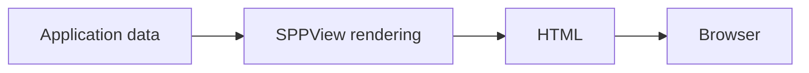
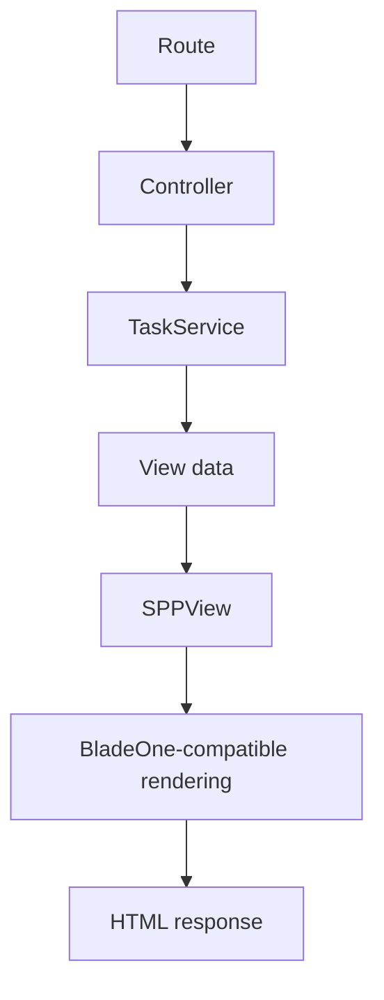
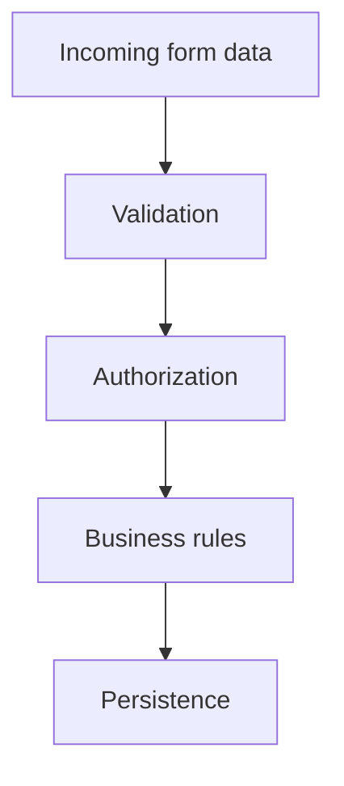

# Tutorial Core 08 — SPPView, Extended BladeOne, ViewTags, Forms, and Validation

Until now the application could decide what to do, but we have not deeply learned how SPP turns application state into user-facing HTML.

This chapter teaches the presentation boundary from first principles.

## 38.1 What is a view?

A view is the presentation representation of application data.

For example, a controller/service may produce:

```php
[
    'title' => 'Task Desk',
    'tasks' => [
        ['title' => 'Learn SPP'],
        ['title' => 'Build an application'],
    ],
]
```

The view turns that data into HTML.



## 38.2 Why not echo HTML from the controller?

This is tempting:

```php
echo '<h1>' . $title . '</h1>';
```

It becomes difficult to maintain when HTML grows.

Keeping presentation separate gives:

```text
Controller/service
        ↓
data
        ↓
View
        ↓
HTML
```

## 38.3 Extended BladeOne

SPP includes an extended BladeOne layer.

The beginner should learn two separate facts:

1. Blade-style syntax can be used as a template language.
2. SPP adds framework-specific rendering capabilities around that template engine.

Do not assume that every Laravel Blade feature exists in exactly the same way.

## 38.4 Create the first view

Use the repository scaffold when appropriate:

```bash
php spp.php make:blade TaskDesk
```

or the SPPView-specific scaffold when the feature requires it.

Inspect the generated file and its destination.

Then create:

```blade
<h1>{{ $title }}</h1>

<ul>
@foreach ($tasks as $task)
    <li>{{ $task['title'] }}</li>
@endforeach
</ul>
```

The exact escaping/raw-output behavior must come from the current SPP renderer implementation.

## 38.5 Rendering from the application

Connect the controller/service data to the view.

The conceptual path is:



## 38.6 ViewTags

SPPView contains a ViewTag subsystem.

A ViewTag can provide reusable presentation behavior beyond ordinary template text.

This is important because it allows the framework to provide structured rendering features without making every template author implement the same low-level HTML behavior.

Use the current `ViewTag` source and examples to build one small custom tag before using any larger built-in tags.

## 38.7 Exercise: reusable TaskStatus tag

Create a reusable presentation element for task status.

For example:

```text
Pending
In progress
Done
```

The exact ViewTag API must follow the current repository implementation.

The goal is to learn:

- tag registration;
- input/attributes;
- render path;
- escaping/data handling;
- reuse across views.

## 38.8 JavaScript generation

SPPView also contains a JavaScript-generation facility.

Do not assume this is equivalent to a modern frontend bundler.

Trace the current `JSGenerator` implementation and determine what it actually produces and how it is integrated into the page/runtime.

## 38.9 Forms are more than HTML

A form is a boundary where user-controlled input enters the application.

A framework form subsystem may help with:

- field definitions;
- defaults;
- validation;
- error display;
- rendering;
- submission handling.

The security rule remains:

> **Server-side validation is authoritative.**

## 38.10 Generate a form

Use the current scaffold:

```bash
php spp.php make:form TaskForm
```

Open the generated class.

Identify:

1. how fields are declared;
2. how validation rules are expressed;
3. how input is bound;
4. how errors are exposed;
5. how the form is rendered.

## 38.11 Exercise: create a task form

The Task Desk form should contain:

```text
Title
Description
Priority
Due date
```

Add at least:

- required title;
- maximum title length;
- valid priority values.

Then submit invalid data and display the errors in the view.

## 38.12 Validation versus authorization

Do not confuse:

**Validation:** Is the title structurally acceptable?

**Authorization:** May this user create this task?

**Business invariant:** Is this task allowed to move into this state?



Different rules belong to different layers.

## 38.13 Exercise: server-side validation

Try to bypass your HTML `required` attribute manually.

Submit an empty title directly.

The server must reject it.

This is the first security lesson in the presentation branch.

## 38.14 Exercise: malicious display data

Store a task title containing HTML-like content.

Render it in the normal escaped path.

Then inspect the renderer/source to understand what changes when raw markup is explicitly allowed.

The goal is not to memorize one output syntax. The goal is to understand the trust boundary.

## 38.15 Form CRUD scaffolding

The repository contains form/CRUD scaffolding as well as entity/model generation.

Use the CRUD scaffold once you understand the manual form.

Compare:

```text
Manual application
    ↓
learn concepts

Generated CRUD
    ↓
accelerate repetitive work
```

Scaffolding should accelerate understanding, not replace it.

## 38.16 Deliberately break the view

### Break 1 — Missing variable

Observe the renderer behavior.

### Break 2 — Invalid template syntax

Identify whether failure happens at compile or render time.

### Break 3 — Incorrect ViewTag attribute

Trace the tag path.

### Break 4 — Skip server-side validation

Observe why browser-only validation is insufficient.

### Break 5 — Render untrusted data as raw markup

Understand the security consequence.

## 38.17 Parikshak checkpoint

Test:

1. a valid form renders;
2. valid data is accepted;
3. invalid data produces predictable validation errors;
4. bypassing browser validation does not bypass server validation;
5. escaped output behaves as intended;
6. ViewTag behavior is testable at the appropriate boundary.

## 38.18 Coming from other frameworks

### Laravel Blade

SPP's extended BladeOne is the closest mental reference, but inspect SPP's extensions rather than assuming Laravel directives and lifecycle behavior.

### Symfony Twig

Think templates + reusable view helpers/components, but SPP's ViewTag architecture is its own feature.

### Django templates

The same separation between presentation and business logic is useful.

## 38.19 Source deep dive

Trace:

1. controller/view invocation;
2. SPPView resolution;
3. template lookup;
4. BladeOne-compatible compilation/execution;
5. ViewTag discovery/invocation;
6. form rendering and validation;
7. response generation;
8. JS generation where used.

Source targets include SPPView rendering classes, `class.viewtag.php`, validator/form components, the extended BladeOne implementation, and the JS generator.

## 38.20 Lab completion criteria

You are finished when you can:

- explain the view boundary;
- render application data through SPPView;
- use extended BladeOne correctly;
- create/use a ViewTag;
- build a server-validated form;
- distinguish validation from authorization/business rules;
- use CRUD scaffolding responsibly;
- test presentation behavior with Parikshak where appropriate;
- trace the rendering path in source.

The next core lab will connect the presentation layer to SPPDB/XDB and real persistent entities.
