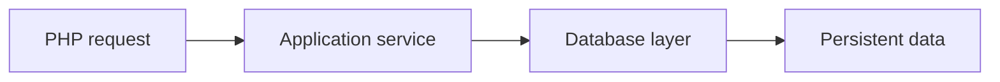
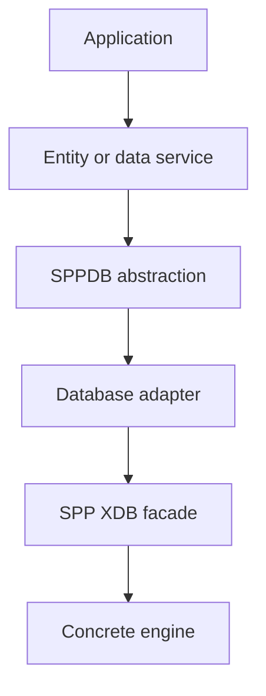
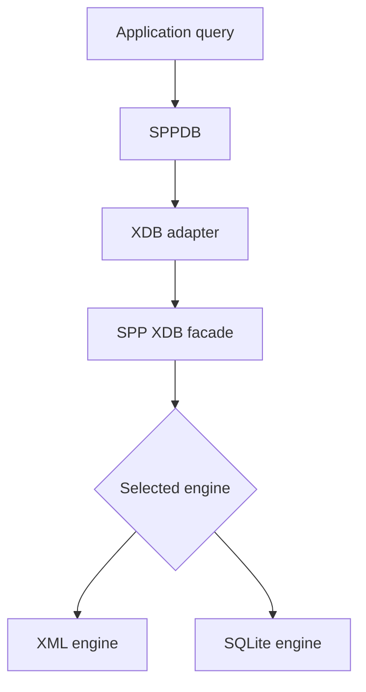
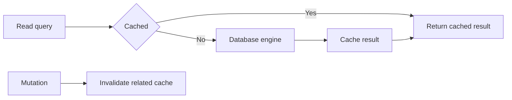

# Tutorial Branch — SPPDB and SPP XDB, Part 1: Data from Zero

This branch is for readers who have never used a framework database layer.

It starts with persistence and gradually descends into SPP XDB internals.

## 39.1 Why persistence exists

Variables disappear when the PHP process ends.

```php
$tasks = [];
```

A database lets the application remember information after the request finishes.



## 39.2 The SPP database layers

SPP contains more than one database abstraction level.

Conceptually:



The purpose of the layers is separation of application/data concerns from concrete storage mechanics.

## 39.3 Start with an entity

Use the current entity scaffold:

```bash
php spp.php make:entity Task
```

Inspect what the generator creates before modifying it.

The repository contains entity classes and entity query facilities, so the tutorial will explicitly teach those layers rather than pretending every application must issue raw SQL.

## 39.4 Create the Task data model

The Task entity should contain enough fields to support later tutorials:

```text
id
user_id
title
description
priority
status
due_at
created_at
updated_at
```

The exact SPP entity declaration syntax must follow the current scaffold/source.

## 39.5 Query the entity

The repository contains `SPPEntityQuery`-related functionality.

Start with:

```text
find by identifier
find all
filter by status
order by created date
paginate
```

Then compare those operations with direct SQL.

The goal is to understand why the framework provides a higher-level data access boundary.

## 39.6 Query builder

The XDB subsystem contains a query builder.

The learner should create the same Task query twice:

```text
version A → framework/entity/query abstraction
version B → query builder or SQL boundary
```

Then inspect how each path ultimately reaches the storage engine.

## 39.7 The XDB facade

The repository contains `SPP_XDB` and the XDB factory.

The facade hides the selected concrete engine.



The tutorial should prove this by changing the configured engine and observing which implementation runs.

## 39.8 XML versus SQLite

Do not start by arguing which is “better”.

First learn the abstraction boundary.

Perform the same logical operations against each engine where the current implementation supports them:

- create data;
- read data;
- update data;
- delete data;
- inspect schema.

Then inspect the differences in storage and operational semantics.

## 39.9 Query logging

The XDB facade contains query logging controls.

Use them while debugging a query.

The learner should be able to answer:

- which SQL executed;
- which parameters were used;
- how long execution took;
- whether a cache path was involved.

Do not log secrets in production diagnostics.

## 39.10 Query cache

SPP XDB can compose with the framework cache for suitable read queries.

The learning exercise is:

1. execute a read query;
2. observe the cache miss;
3. execute it again;
4. inspect the cache hit;
5. mutate the underlying data;
6. observe invalidation where the current implementation provides it.



## 39.11 Pagination

The repository contains pagination facilities in the XDB/API area.

Build a paginated Task list.

The learner should understand:

- total count;
- page number;
- page size;
- offset/cursor behavior where implemented;
- generated links or metadata.

Do not assume a generic paginator algorithm matches SPP's exact implementation.

## 39.12 Migrations

A migration changes the database structure or data in a controlled, repeatable way.

Create the initial Task migration using the current scaffold:

```bash
php spp.php migrate:make CreateTasks
```

Then run it using the repository's current migration command.

This introduces a crucial distinction:

> **A migration is not the same thing as publishing offline website content.**

Schema/data migration is one part of the wider migration/transfer architecture covered later.

## 39.13 Seeders

Use the current seeder scaffold:

```bash
php spp.php make:seeder TaskSeeder
```

Create predictable development/test data.

This branch will later connect the seeder to Parikshak database refresh/isolation.

## 39.14 Deliberately break persistence

### Break 1 — Missing table

Observe schema/runtime behavior.

### Break 2 — Wrong field name

Trace the failure from entity/query layer downwards.

### Break 3 — Invalid query parameter

Observe validation/driver behavior.

### Break 4 — Stale cache

Diagnose whether the source or cache is wrong.

### Break 5 — Migration out of order

Observe dependency/state problems.

## 39.15 Parikshak checkpoint

Build tests for:

- entity creation;
- query filtering;
- persistence round-trip;
- pagination;
- migration setup;
- predictable seed data;
- cache invalidation behavior where appropriate.

Use Parikshak's database refresh/isolation facility where supported by the repository implementation.

## 39.16 Kernel Hacker section

Trace the data path for one `Task::query()`-style operation from the public API through:

```text
entity/query abstraction
→ SPPDB
→ adapter
→ SPP_XDB
→ selected engine
→ storage
```

Then trace a mutation and cache invalidation in the reverse direction.

## 39.17 Completion criteria

You are ready for Part 2 when you can:

- create and query an entity;
- explain SPPDB versus XDB;
- switch or identify an XDB engine;
- run migrations and seeders;
- paginate data;
- inspect query logging;
- explain cache behavior;
- test the persistence layer with Parikshak;
- trace the complete database execution path in source.

Part 2 will cover advanced XDB capabilities such as indexing, views, validation, ACL, locking, transactions, encryption, observers, the XDB shell, and the advanced/distributed implementation surface.
