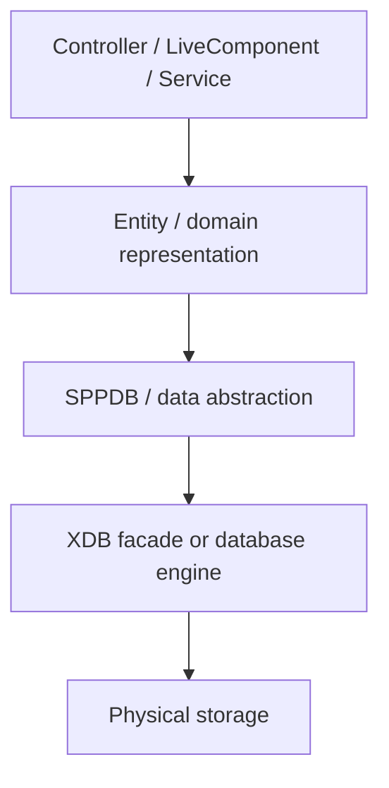
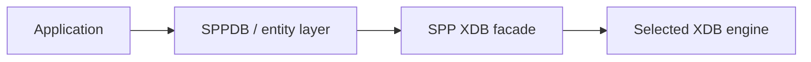
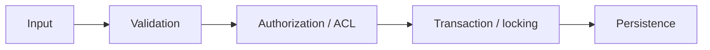
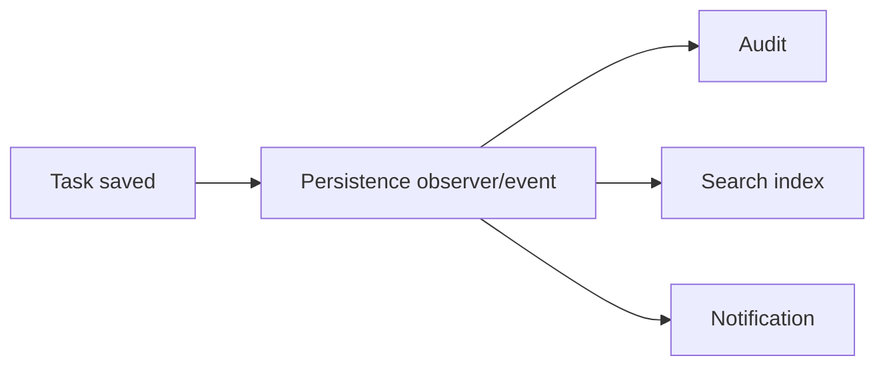
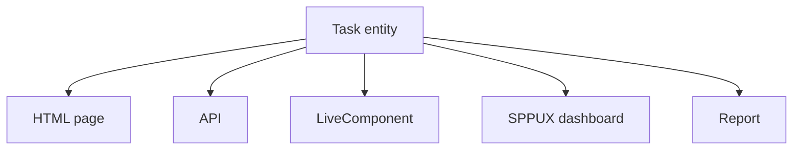

# 40. Data and Persistence: Entities, SPPDB, and SPP XDB

A web application becomes interesting when it has data that survives the request.

A beginner may start with:

```php
$tasks = [
    ['title' => 'Buy milk'],
    ['title' => 'Prepare report'],
];
```

But that array disappears when the PHP request ends.

Persistence means the application can store information and retrieve it later.

SPP has more than one layer for this problem. The handbook therefore teaches them separately instead of calling everything "the database".

## 40.1 The persistence stack

Think in layers:



The important lesson is:

> **Your controller should not need to know how bytes are stored on disk.**

## 40.2 Why have an abstraction?

Suppose application code embeds SQL or storage-specific code everywhere. Changing storage then becomes expensive.

An abstraction gives a cleaner boundary:

```text
application code
      ↓
SPPDB / entity APIs
      ↓
storage implementation
```

The application depends on a framework data contract instead of every low-level storage detail.

# Part I — Entities

## 40.3 What is an entity?

An entity represents something meaningful to the application.

Examples:

```text
Task
User
Organisation
Report
Approval
Document
```

A beginner should think:

> An entity is an application concept that has data and identity.

It is not necessarily identical to a physical database row, although it may map to one.

## 40.4 The SPP entity layer

The repository contains an SPP database-entity abstraction and entity-query infrastructure. This gives the application a place to express:

- entity identity;
- fields;
- relationships;
- persistence queries;
- validation/metadata;
- application semantics.

This layer is especially important for the main Task Desk tutorial.

## 40.5 Build a Task entity

Start conceptually with:

```text
Task
----
id
created_by
title
description
status
priority
created_at
updated_at
```

Then decide which fields are:

```text
required
optional
indexed
validated
editable
computed
```

That distinction becomes important later for forms, APIs, LiveComponent, and SPPUX.

# Part II — SPPDB

## 40.6 What SPPDB is solving

SPPDB is the framework's database/data-access abstraction layer. It sits between application logic and concrete storage implementation.

A beginner mental model:


This lets application code concentrate on data operations without hard-coding every storage detail into every service.

## 40.7 Querying data

The repository provides entity-query and query-builder infrastructure.

The exact query API should be taken from the current SPP source, but conceptually a query does this:

```text
choose source
   ↓
select fields
   ↓
filter
   ↓
sort
   ↓
paginate
   ↓
execute
   ↓
map result
```

Do not put query-building logic into templates.

## 40.8 Query builder versus hand-written SQL

A query builder is useful when conditions are dynamic, queries are reused, framework-level composition is valuable, or storage details should remain behind an abstraction.

Hand-written SQL can still be appropriate when the repository/database contract explicitly supports it and the query genuinely benefits from SQL's expressiveness.

The handbook should teach both rather than claiming one is universally superior.

# Part III — XDB

## 40.9 What is SPP XDB?

The repository contains a substantial XDB subsystem in `spp/modules/spp/sppxdb`.

It includes a facade/factory model and supporting components for querying, pagination, migrations, indexing, validation, locking, ACL, observers, and administration.

A beginner should first learn:

> **XDB is a storage/data subsystem behind a framework-level abstraction, not simply a class you call from every controller.**

## 40.10 The XDB facade

Conceptually:



This separation becomes valuable when learning engines and advanced storage features.

## 40.11 Engines

The repository exposes XDB engine namespaces and engine-related classes.

The handbook should teach the engines independently:

```text
engine-neutral application code
          ↓
       XDB facade
          ↓
selected engine
```

The exact engine capabilities must be taken from the current implementation rather than inferred from class names alone.

# Part IV — CRUD

## 40.12 Create

A create operation generally follows:


Never let arbitrary HTTP input go directly to persistence.

The safe application path is:

```text
request
→ validation
→ authorization
→ business rules
→ persistence
```

## 40.13 Read

For the Task Desk list:

```text
request
→ route
→ controller/service
→ query
→ result set
→ pagination
→ view/API/live response
```

The same underlying data can feed several frontends.

## 40.14 Update

An update should identify:

```text
which entity
who is editing it
what fields may change
whether the transition is valid
whether the user is authorized
```

That is why persistence is tied to security and workflow later in the handbook.

## 40.15 Delete

Deletion requires explicit policy.

Questions include:

- Is deletion allowed?
- Is the record soft-deleted or physically removed?
- Do dependent objects exist?
- Must an audit record be created?
- Should an event be fired?

The database operation is only one part of application behavior.

# Part V — Migrations and seeders

## 40.16 Schema changes need history

If the application changes from:

```text
task.title
```

to:

```text
task.title
 task.priority
```

existing installations need a reproducible way to acquire the new structure.

That is what migrations solve.

SPP has dedicated migration infrastructure under the SPPDB/XDB layers and CLI commands for migration generation/execution.

## 40.17 Seed data

Seeders create known initial data, such as:

```text
admin user
initial roles
default settings
demo tasks
reference data
```

The repository provides seeder scaffolding, so the tutorial teaches both manual seed logic and generated seeders.

# Part VI — Transactions, locking, ACL, and validation

These are advanced persistence concerns.

### Transactions

A transaction groups operations so the application can reason about their combined success/failure.

### Locking

Locking coordinates concurrent access to shared data.

### ACL

ACL determines whether an operation is permitted on data.

### Validation

Validation protects the data contract before persistence.

They are distinct concepts:



The repository contains dedicated XDB classes for ACL, locking, and validation. Their precise guarantees should be learned from implementation/tests rather than assumed from the class names.

# Part VII — Pagination and indexing

## 40.18 Pagination

A list of 10,000 tasks should not normally produce 10,000 rows of HTML in one response.

Pagination turns all results into a manageable page:

```text
all results
    ↓
page 1 of N
```

The XDB subsystem contains a paginator component.

A well-structured application can reuse the same pagination concept across:

```text
HTML pages
APIs
LiveComponent
SPPUX dashboards
reports
```

## 40.19 Indexing

Indexes exist to make particular access patterns faster.

The right question is not:

> "Should everything be indexed?"

It is:

> "Which queries must be efficient, and what index supports those queries?"

The XDB subsystem contains indexing support; the exact index model should be learned from the current engine implementation.

# Part VIII — Observers and events

Persistence can participate in events/observers.

For example:



This is a powerful architectural pattern, but do not use it for every simple update. Explicit service calls are often easier to understand when the dependency is mandatory.

# Part IX — XDB administration

The repository contains an XDB shell and XDB-specific command infrastructure.

The administrator/architect branch should teach:

```text
inspect schema
inspect data
run supported queries/operations
run migrations
seed data
inspect indexes
investigate locks
inspect failures
```

Exact commands must be copied from the repository's current command documentation rather than invented.

# Part X — Test data and Parikshak

Persistence must be tested continuously.

A good data test covers:

```text
create
read
update
delete
validation failure
authorization failure
transaction failure
migration behavior
seed behavior
pagination
```

Use Parikshak's database-refresh facilities where appropriate so tests do not contaminate one another.

# Part XI — Practical Task Desk project

Extend the application with:

```text
Task entity
Task migration
Task seeder
Task CRUD service
Task list page
Task detail page
Task form
Task API
Task LiveComponent later
Task SPPUX dashboard later
```

Then prove the same entity can support different interaction styles:



This is the central persistence lesson of SPP:

> **The data model should not be rebuilt separately for every presentation mechanism.**

# Part XII — Coming from other frameworks

### Laravel Eloquent

Think of SPP's entity/data abstractions as solving some of the same application concerns, but do not assume SPP's APIs or semantics match Eloquent.

### Doctrine

Doctrine users will recognize entities, query abstractions, and persistence boundaries. SPP's entity/XDB architecture has its own lifecycle and storage abstractions.

### Django ORM

The model-centric approach is familiar. Keep the distinction between application entity metadata and physical storage in mind.

### Raw PDO/SQL

The largest conceptual change is architectural: persistence becomes a subsystem rather than a collection of SQL strings spread throughout controllers.

# Kernel Hacker section

Read the persistence implementation from high level to low level:

```text
SPPDB entity abstraction
        ↓
SPPDB query/relationship layer
        ↓
XDB facade/factory
        ↓
engine implementation
        ↓
physical storage
```

Useful repository landmarks include:

```text
spp/modules/class.sppdbentity.php
spp/modules/spp/sppdb/
spp/modules/spp/sppxdb/
spp/modules/spp/sppxdb/class.xdbfactory.php
spp/modules/spp/sppxdb/class.migrationmanager.php
spp/modules/spp/sppxdb/class.paginator.php
```

When documenting advanced features such as locking, ACL, encryption, transactions, or distributed behavior, verify the implementation/tests before turning an available class into a claimed platform guarantee.

## Practical assignment

Build the complete Task Desk persistence layer twice:

1. first through the ordinary SPPDB/entity abstraction;
2. then inspect how the operation reaches XDB.

Run the same operation through:

```text
HTML form
API request
Parikshak test
LiveComponent action
```

Your goal is to see one persistence architecture serving four different application surfaces.
