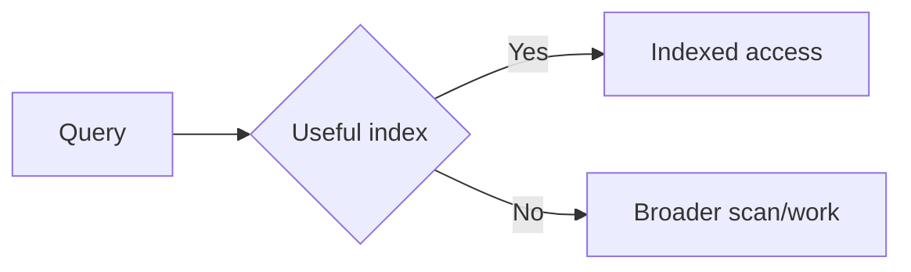

# Tutorial Branch — SPP XDB, Part 2: Advanced Database Architecture

Part 1 taught persistence and the SPPDB/XDB execution path.

Part 2 treats XDB as a serious subsystem and explores the advanced facilities visible in the repository.

## 40.1 Indexing

An index is an additional data structure that can make repeated lookups faster.

The tutorial exercise is to create a large Task dataset and compare a filtered query before and after an appropriate index where the engine supports it.



Do not promise a particular performance improvement without measurement.

## 40.2 Views

XDB contains view-related implementation.

A database view can expose a reusable query as a logical data source.

Exercise: create a reporting-oriented view and compare querying the view with repeating the query manually.

Then trace how the XDB engine represents and executes the view.

## 40.3 Validation

XDB contains validation-related implementation.

The tutorial should distinguish:

- form validation;
- service/business validation;
- database/storage validation.

The same rule may appear at more than one boundary when protecting a critical invariant, but each layer has a different responsibility.

## 40.4 ACL

The XDB subsystem contains ACL-related implementation.

This is different from application authentication.

Authentication asks:

> Who is the user?

Application authorization asks:

> May this user perform this operation?

A storage ACL may additionally ask:

> Is this data operation allowed at the storage boundary?

The tutorial must build a concrete example and inspect the implementation before describing the precise enforcement semantics.

## 40.5 Locking

The repository contains XDB locking implementation.

Build a concurrency exercise where two operations attempt to modify the same logical record.

Observe:

- how a lock is requested;
- how contention is represented;
- what happens on failure;
- when the lock is released.

Do not assume database-engine semantics that are not established by the current source.

## 40.6 Transactions

The source contains transaction-related implementation.

The lab should explicitly distinguish:

```text
transaction API exists
```

from:

```text
full transactional guarantees established for every backend/path
```

Run a controlled transaction experiment and inspect the actual adapter/engine behavior.

## 40.7 Encryption

The XDB implementation contains encryption-related functionality.

The tutorial should teach:

- what data is protected;
- where keys/configuration come from;
- when encryption is applied;
- how failures are handled;
- what remains in plaintext.

Security claims must be tied to source/tests.

## 40.8 Observers

The XDB subsystem contains observer-related implementation.

Build an observer that records a data mutation.

Then compare observer behavior with SPP events.

This is a valuable architectural lesson:

> **Not every callback mechanism is an application-wide event system.**

The source should establish the precise boundary of XDB observers.

## 40.9 XDB shell

The repository contains an XDB shell.

Use it to:

- inspect data;
- inspect schema;
- run administrative operations supported by the current shell;
- troubleshoot a failing application independently of the web layer.

The CLI is an important debugging boundary because it lets the developer isolate storage behavior from routing, middleware, and rendering.

## 40.10 Query builder deep dive

Take one Task report query and construct it with the XDB query-builder API.

Then inspect:

1. internal expression construction;
2. parameter binding;
3. final SQL generation;
4. execution path;
5. returned representation.

The tutorial should not assume the builder is a full ORM.

## 40.11 Paginator deep dive

Trace the paginator implementation to understand:

- how count is obtained;
- how pages are calculated;
- how limits/offsets are represented;
- whether any cursor-style path exists;
- how metadata reaches SPPAPI or SPPView.

## 40.12 Migration manager

The repository contains migration managers at multiple layers.

Trace the relationship between:

```text
migration definition
→ migration manager
→ database adapter/engine
→ recorded migration state
```

Then compare ordinary schema migration with the separate live-content transfer/promotion architecture in Chapter 27.

## 40.13 Distributed and Raft-related implementation

The repository contains Raft-related XDB implementation artifacts.

This area receives a **research-grade treatment**.

The tutorial should inspect:

- node identity;
- log/state representation;
- leader/follower behavior where implemented;
- replication messages;
- commit semantics;
- failure handling;
- persistence;
- cluster configuration.

Only behavior demonstrated by the source/tests is presented as a current guarantee.

A class named `Raft` is not sufficient evidence of a production-ready distributed database guarantee.

## 40.14 Failure exercise

Construct a controlled environment and interrupt an operation at several stages:

```text
before write
while write is active
after write but before invalidation
after cache invalidation
```

Observe what the current implementation actually leaves behind.

This is the beginning of serious reliability engineering.

## 40.15 Parikshak checkpoint

Advanced XDB tests should cover:

- indexes and query behavior;
- view behavior;
- validation;
- ACL decisions;
- lock contention;
- transaction behavior as actually supported;
- encryption paths;
- observer invocation;
- migration state;
- administrative operations where a test boundary exists.

## 40.16 Coming from other frameworks

### Laravel

The conceptual references are migrations, database query builder, Eloquent, cache, transactions, and policies. XDB is not a Laravel clone.

### Symfony/Doctrine

Entity/repository/query abstractions are useful comparisons, but XDB's engine/facade architecture is distinct.

### Django

Think ORM/backend abstraction, then deliberately descend to SPP XDB when you need to understand the actual storage engine.

## 40.17 Kernel Hacker completion

You are finished when you can trace one operation through the full stack and answer:

> Which code is responsible for the application contract, which for the adapter, which for the XDB facade, and which for the concrete engine?

You should also be able to identify where caching, validation, locking, encryption, observation, and migration policy are introduced.
